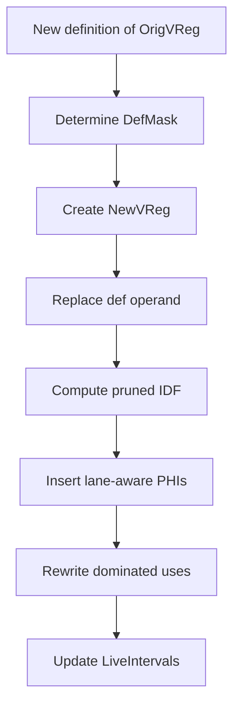
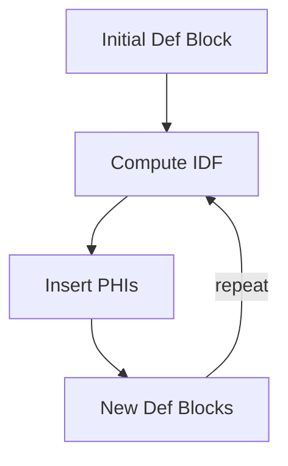

# MachineLaneSSAUpdater  
*Lane-aware SSA repair for Machine IR*

---

## 1. Motivation

LLVM Machine IR is **not strictly SSA** once we start doing:
- early spilling
- reload insertion
- subregister (lane) manipulation
- partial register redefinitions

In particular, on **AMDGPU**, a single virtual register may represent:
- multiple lanes (`LaneBitmask`)
- independently spilled / reloaded subregisters
- definitions that dominate only *some* uses

The existing **MachineSSAUpdater**:
- is **not lane-aware**
- treats registers as indivisible values
- cannot correctly reason about partial defs and subranges

### Goal

Provide a **general, reusable, lane-aware SSA repair utility** for Machine IR that:
- preserves SSA invariants
- works with subregisters and lane masks
- integrates with `LiveIntervals`
- supports early spilling, reloads, and PHI repair

---

## 2. High-Level Responsibilities

`MachineLaneSSAUpdater` is responsible for:

1. Detecting SSA violations caused by new definitions
2. Creating new SSA names (full-register or lane-specific)
3. Computing dominance reachability with lane awareness
4. Placing PHIs only where needed
5. Rewriting uses with exact / subset / superset semantics
6. Updating `LiveIntervals` precisely
7. Remaining target-agnostic (TRI-driven)

---

## 3. Core Abstraction

The updater operates on **(VReg, LaneBitmask)** pairs rather than plain registers.

Conceptually:

```
SSA value ≡ (Register, LaneBitmask)
```

This matches:
- Machine operand subregisters
- LiveInterval subranges
- AMDGPU partial VGPR usage

---

## 4. Primary API

### repairSSAForNewDef

```
Register repairSSAForNewDef(MachineInstr &NewDefMI,
                            Register OrigVReg);
```

**Contract**
- `NewDefMI` defines `OrigVReg` (violates SSA)
- Definition may be full or subregister

**Returns**
- A new virtual register representing the repaired SSA value

**Responsibilities**
1. Identify the defining operand
2. Derive lane mask from subregister index
3. Create a new virtual register
4. Rewrite the definition operand
5. Perform lane-aware SSA repair

---

## 5. SSA Repair Pipeline



---

## 6. Reachability & Dominance

For a given definition `(DefMI, DefMask)` and a use, the updater must determine
whether the definition reaches the use **for the relevant lanes**.

### Fast Paths
- Same block: instruction order
- Non-PHI: `MDT->dominates(DefBB, UseBB)`
- PHI operand: check incoming predecessor dominance

### Slow Path
If dominance alone is insufficient, compute a **pruned Iterated Dominance Frontier**
(IDF), restricted to blocks where the relevant lanes are live-in.

---

## 7. Pruned IDF Computation

**Key idea**

Only consider blocks where:
```
OrigVReg is live-in AND
Live lanes intersect DefMask
```

This avoids inserting PHIs for dead lanes.

### Cache Key

```
(VReg, LaneMask, DefBlock)
```

The cache must be cleared if the CFG is modified.

---

## 8. PHI Insertion (Lane-Aware)

PHIs are inserted iteratively until a fixpoint is reached.



Properties:
- PHIs are inserted only for affected lanes
- Each PHI produces a new virtual register
- Incoming values are computed per predecessor

---

## 9. Use Rewriting Semantics

Three cases are handled:

| Case | Description | Action |
|----|----|----|
| Exact | Use mask == def mask | Direct rewrite |
| Subset | Use ⊂ Def | Direct rewrite |
| Superset | Use ⊃ Def | Build REG_SEQUENCE |

Superset uses require reconstructing the full value from:
- the new SSA value for modified lanes
- the old value for untouched lanes

---

## 10. LiveIntervals Integration

Requirements:
- No stale SlotIndexes
- Precise lane tracking
- No accidental full-register extension

Strategy:
1. Index new instructions immediately
2. Extend main live range only where required
3. Extend only the affected subranges

---

## 11. Undef Edge Policy

Some CFG edges may lack a reaching definition.

Policy:
- Materialize implicit defs (default)
- Or leave undef for debugging / experimentation

---

## 12. Verification

Optional validation on exit:
- `MF.verify()`
- `LIS.verify()`

Highly recommended during SSA-spiller development.

---

## 13. Why This Is Not MachineSSAUpdater

| Aspect | MachineSSAUpdater | MachineLaneSSAUpdater |
|-----|-----|-----|
| Subregisters | ❌ | ✅ |
| Lane masks | ❌ | ✅ |
| LiveIntervals | ❌ | ✅ |
| Spilling support | ❌ | ✅ |
| PHI pruning | ❌ | ✅ |

This is a lower-level, stronger primitive intended for advanced backend work.

---

## 14. Intended Usage

- SSA-based spilling
- Subregister reload repair
- Early VGPR pressure control
- Post-CFG-expansion SSA restoration
- Research and prototyping

---

## 15. Non-Goals

- Physical register assignment
- Coalescing
- Copy propagation
- Scheduling

---

## 16. Open Questions

- Interaction with MachinePostDominatorTree
- Better heuristics for superset reconstruction
- Incremental IDF invalidation
- Debug / visualization hooks
