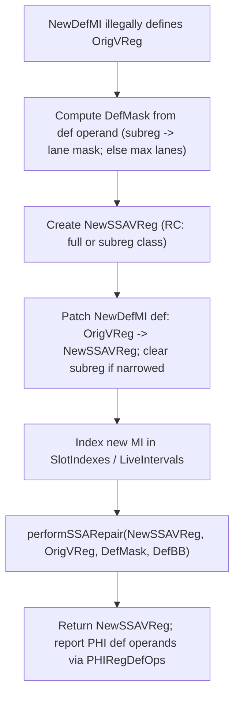
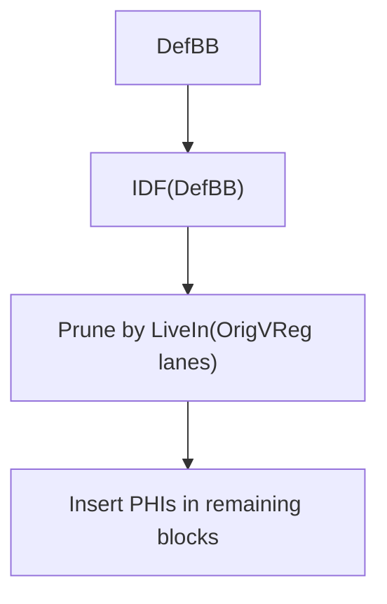

# MachineLaneSSAUpdater — Design

> Obsidian note for the **lane-aware SSA repair utility** used on Machine IR.  
> Primary client today: **AMDGPU SSA Spiller** (`AMDGPUSSARegisterSpiller`).

## Source mapping

- Commit: `45385c6f5f00`
- Header: [MachineLaneSSAUpdater.h](https://github.com/alex-t/llvm-project/blob/45385c6f5f008cde206d5828a00a17d6bb7f7783/llvm/include/llvm/CodeGen/MachineLaneSSAUpdater.h)
- Impl: [MachineLaneSSAUpdater.cpp](https://github.com/alex-t/llvm-project/blob/45385c6f5f008cde206d5828a00a17d6bb7f7783/llvm/lib/CodeGen/MachineLaneSSAUpdater.cpp)

## Problem statement

Many MachineIR transformations must **insert a new definition** of an existing virtual register, which violates SSA:
- Reload inserted before a use (`loadRegFromStackSlot` writes into the original vreg).
- Other transforms that want to “overwrite” a vreg temporarily.

We need to:
1. Replace that illegal redefinition with a *fresh* vreg (new SSA name).
2. Preserve lane/subregister semantics.
3. Insert PHIs where multiple paths merge.
4. Rewrite reachable/dominated uses to the correct SSA name(s).
5. Keep LiveIntervals consistent.

## High-level API

### `repairSSAForNewDef`

Code: [repairSSAForNewDef](https://github.com/alex-t/llvm-project/blob/45385c6f5f008cde206d5828a00a17d6bb7f7783/llvm/lib/CodeGen/MachineLaneSSAUpdater.cpp#L53-L119)

```cpp
Register repairSSAForNewDef(MachineInstr &NewDefMI,
                            Register OrigVReg,
                            SmallVectorImpl<MachineOperand*> &PHIRegDefOps);
```

**Contract:** `NewDefMI` must contain a *def* operand that currently defines `OrigVReg` (illegal SSA). The updater will:
- Create a new vreg for the definition,
- patch `NewDefMI` to define that vreg instead,
- insert lane-aware PHIs as needed,
- rewrite uses,
- and return the new SSA vreg.

`PHIRegDefOps` is filled with **def operands** of PHI result registers created during repair.  
This is used by the SSA spiller as a temporary workaround for “static NUA limitation” (see below).

### `isUseReachableFromDef`

Code: [isUseReachableFromDef](https://github.com/alex-t/llvm-project/blob/45385c6f5f008cde206d5828a00a17d6bb7f7783/llvm/lib/CodeGen/MachineLaneSSAUpdater.cpp#L769-L879)

Two overloads:
- `(MachineInstr *DefMI, MachineInstr *UseMI, Register OrigVReg, LaneBitmask DefMask)`
- `(MachineOperand &DefOp, MachineOperand &UseOp, Register OrigVReg)`

This is the helper used by the SSA spiller to classify non-dominated uses as "reachable" via pruned IDF.

## Core algorithm (repairSSAForNewDef)



### Key lane-awareness points

- **DefMask derivation**
  - If the defining operand has a `SubRegIdx`, we use `TRI.getSubRegIndexLaneMask(SubRegIdx)`.
  - Otherwise we use `MRI.getMaxLaneMaskForVReg(OrigVReg)`.

- **Register class selection for new SSA vreg**
  - For a subreg-def, the updater creates a new vreg in the **subregister RC** (`TRI.getSubRegisterClass(OrigRC, SubRegIdx)`).
  - For full defs, it uses `MRI.getRegClass(OrigVReg)`.

This matches the current implementation in `MachineLaneSSAUpdater.cpp` (see `repairSSAForNewDef`).

## PHI placement and reachability

### Pruned Iterated Dominance Frontier (IDF)

PHI placement uses **iterated dominance frontier**, but prunes blocks using liveness:
- Compute IDF for the definition block(s).
- Intersect with blocks where `OrigVReg` lanes (per `DefMask`) are live-in.

This is also what backs `isUseReachableFromDef`:
- If the def dominates the use, reachable immediately.
- Otherwise compute pruned IDF and check whether the PHI predecessor block is in IDF or dominated by some IDF block.



### IDF caching
`getPrunedIDF` caches IDF results keyed by:
- `(OrigVReg, LaneMask, DefBlockNum)`

This avoids recomputing IDF repeatedly (important for repeated reachability tests in the spiller).

## Use rewriting

The updater rewrites **dominated uses** of `OrigVReg` to:
- the new SSA vreg for the new definition, and
- each PHI-result SSA vreg produced during repair.

When a use requires a **superset lane mask**, the updater may synthesize a `REG_SEQUENCE` (only when needed).

## LiveIntervals handling

- The new definition MI is inserted into LIS maps immediately.
- After repair, the updater renumbers values for the new intervals.
- It **recomputes** the original vreg interval after repair to account for new PHI operands.

### Important: no shrinkToUses on OrigVReg
Current implementation intentionally avoids `shrinkToUses()` on `OrigVReg` after recomputation because
`shrinkToUses` does not correctly model PHI operand liveness (PHI uses are live at the end of predecessor blocks).
Recomputation via `createAndComputeVirtRegInterval` already yields correct minimal liveness in this context.

## Integration with AMDGPU SSA Spiller

The spiller emits reloads that temporarily define `OrigVReg`, then calls:

```cpp
SmallVector<MachineOperand*> PHIRegDefOps;
Register NewVReg = SSAUpdater->repairSSAForNewDef(*ReloadMI, OrigVReg, PHIRegDefOps);
```

The spiller records `PHIRegDefOps` into a set (`ReloadedRegs`) to avoid selecting those newly-created vregs
as spill candidates under the **static NUA limitation**.

## Static NUA limitation (why PHIRegDefOps exists)

NUA runs before spilling, so vregs created during spilling (reload vregs + PHI results) have no next-use entries,
and can be treated as “dead”, causing immediate re-spills and no RP decrease.

Temporary workaround:
- Track all vregs created by reload SSA repair (including PHI results).
- Filter them out from the Active set when selecting spill candidates.

See: `Static NUA limitation.md`.

## Critical: LiveInterval must be killed before SSA repair

### Problem: [SSA Repairing Disorder](../08-Worklog/issues/SSA%20Spiller/SSA%20Repairing%20Disorder.md)

When multiple dominated uses exist in a diamond CFG, SSAUpdater may incorrectly merge 
`{reload, original_spilled_value}` because it sees the original value as "available" 
via LiveIntervals even though it was logically spilled.

### Solution (implemented in SSA Spiller)

**Before** calling `repairSSAForNewDef`, the spiller must:
1. Kill the original LiveInterval from the spill point onward
2. Cut the interval in all blocks dominated by the spill block

This ensures SSAUpdater cannot see the original value as available, and will only 
merge reloaded values in PHIs.

See: [Design Change: Prevent SSA Repair Disorder](Decisions.md#design-change-prevent-ssa-repair-disorder-by-killing-spilled-liveintervals-in-dominated-region)

---

## Open questions / TODOs

- Decide long-term NUA strategy:
  - sentinel "unknown distance" value, and/or
  - on-demand NUA recomputation for new vregs.
- Add post-repair verification hooks (`MF.verify()` / `LIS.verify()`) behind a debug flag if seen useful.
