# Next Use Analysis Test Pattern Classification

This document classifies all CFG patterns tested by the AMDGPU Next Use Analysis (NUA), organized by control flow complexity and loop structure.

## Overview

**Next Use Analysis** computes the distance (in instructions) from each program point to the next use of each virtual register. This information is critical for register spilling decisions.

### Key Concepts

1. **Finite Distances**: Direct instruction count to next use (0 to ~10^12)
2. **LoopTag Distances**: Applied to uses outside the current loop context (`LoopTag + offset`, where `LoopTag = 2^40`). This makes registers with distant uses (outside the loop) more attractive for spilling when register pressure is high inside the loop.
3. **DeadTag Distances**: No reachable next use (`DeadTag + offset`, where `DeadTag = 2^60`)
4. **Subregister Tracking**: Per-lane distance tracking using `LaneBitmask`

### Three-Tier Ranking System

```
Tier 1: Finite distances (0 to LoopTag-1)     → Immediate priority
Tier 2: Loop-exit distances (LoopTag to DeadTag-1) → Medium priority  
Tier 3: Dead registers (DeadTag+)             → Lowest priority (spill candidates)
```

---

## Pattern Classification Hierarchy

```
1. Linear Control Flow
   ├── 1.1 Simple Linear (basic block sequence)
   └── 1.2 Linear with Branches (diamond CFG, no loops)

2. Single Loop Patterns
   ├── 2.1 Simple Loop (3 blocks)
   ├── 2.2 Loop with Internal CFG
   ├── 2.3 Loop with Multiple Exits
   └── 2.4 Loop with Multiple Latches

3. Nested Loop Patterns
   ├── 3.1 Double-Nested Loops
   ├── 3.2 Triple-Nested Loops
   └── 3.3 Nested Loops with Side Exits

4. Sequential Loop Patterns
   ├── 4.1 Two Sequential Loops
   └── 4.2 Three Sequential Loops in Outer Loop

5. Complex Control Flow
   ├── 5.1 Diamond with Multiple Joins (11+ blocks)
   └── 5.2 Complex Nested Structure (14+ blocks)
```

---

## 1. Linear Control Flow

### Pattern 1.1: Acyclic CFG with PHI Merge Points

**Test File:** `acyclic-phi-merge-distances.mir`

**Description:** Acyclic CFG with two merge points (bb.1 and bb.4). Tests distance calculation through multiple paths and PHI node handling.

**CFG Diagram:**

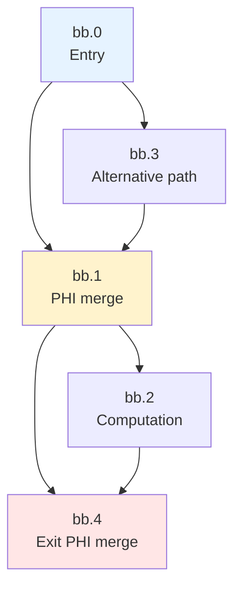

**Key Validation Points:**
- bb.1 is first merge point: PHI merges values from bb.0 and bb.3
- bb.4 is second merge point: PHI merges values from bb.1 and bb.2
- Distances propagate correctly through multiple paths
- Minimum distance taken at merge points

**Test Priority:** ✅ **HIGH** (baseline case)

---

### Pattern 1.2: Complex Control Flow (11 Blocks)

**Test File:** `complex-control-flow-11blocks.mir`

**Description:** Acyclic CFG with multiple join points and nested conditionals. No loops.

**CFG Diagram:**

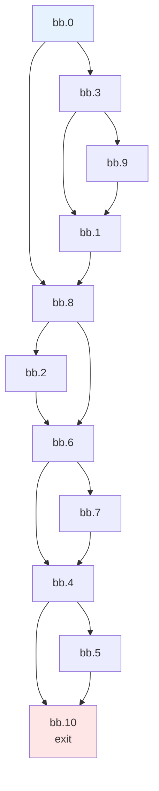

**Key Validation Points:**
- Multiple merge points (bb.1, bb.4, bb.6, bb.8)
- Distance computed as minimum across all paths
- No LoopTag - purely acyclic

**Test Priority:** 🟡 **MEDIUM** (complex acyclic CFG)

---

### Pattern 1.3: Complex Control Flow (15 Blocks)

**Test File:** `complex-control-flow-15blocks.mir`

**Description:** Deep nested acyclic CFG (bb.0-bb.14). Tests distance propagation through many merge points.

**CFG Diagram:**

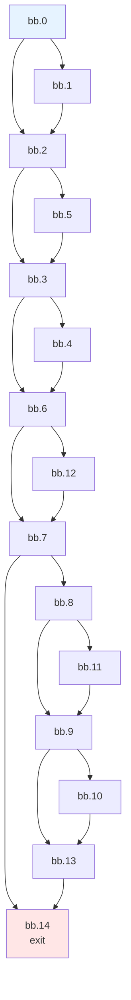

**Key Validation Points:**
- Deep nesting of conditional blocks
- Multiple merge points at various levels
- No LoopTag - purely acyclic

**Test Priority:** 🟡 **MEDIUM** (stress test for acyclic CFG)

---

## 2. Single Loop Patterns

### Pattern 2.1: Simple Loop (3 Blocks)

**Test File:** `simple-loop-3blocks.mir`

**Description:** Minimal loop structure: preheader → header → latch → exit.

**CFG Diagram:**

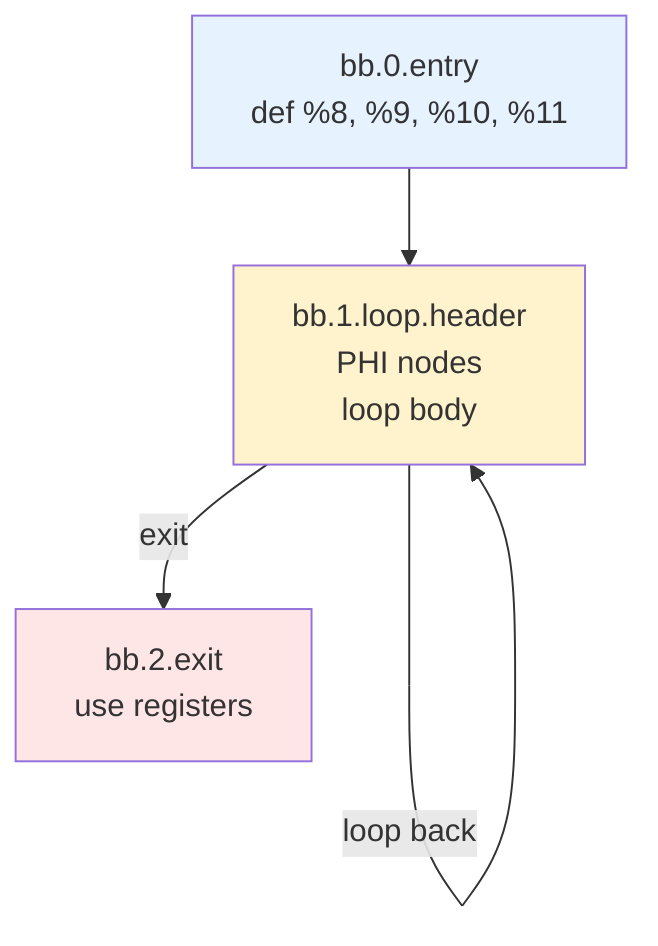

**Key Validation Points:**
- **LoopTag applied** on loop-exiting edges during backward analysis
- When querying next-use distances from inside a loop, registers whose next use is *outside* the loop receive a `LoopTag` penalty, making them more attractive spill candidates
- PHI nodes at loop header merge initial and back-edge values

**Expected Distance Patterns:**
```
Query from inside loop:
  Use inside loop:   %x[ finite_distance ]      → keep in register
  Use outside loop:  %x[ LoopTag + distance ]   → good spill candidate
```

**Test Priority:** ✅ **HIGH** (fundamental loop case)

---

### Pattern 2.2: Complex Single Loop (Internal CFG)

**Test File:** `complex-single-loop.mir`

**Description:** Single loop with internal conditional branches (Flow blocks).

**CFG Diagram:**

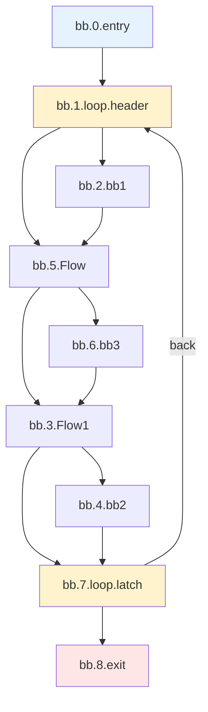

**Key Validation Points:**
- Internal branches don't affect LoopTag
- Distance calculation through multiple internal paths
- Correct minimum distance at join points within loop

**Test Priority:** 🟡 **MEDIUM** (loop with internal complexity)

---

### Pattern 2.3: Complex Single Loop (Variant A)

**Test File:** `complex-single-loop-a.mir`

**Description:** Loop with multiple internal conditional paths and multiple back edges.

**CFG Diagram:**

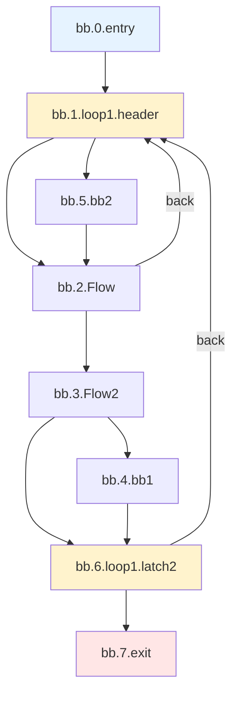

**Key Validation Points:**
- Single loop with 2 latches (bb.2, bb.6) and 2 back-edges to single header (bb.1)
- LoopTag NOT applied on internal latch edges (bb.2→bb.1) - iteration count is independent of which back-edge is taken
- LoopTag applied ONLY on true loop exit (bb.6→bb.7)

**Test Priority:** 🟡 **MEDIUM** (multi-latch loop)

---

### Pattern 2.4: Complex Single Loop (Variant B)

**Test File:** `acyclic-cfg-with-self-loop.mir`

**Description:** Complex acyclic CFG with simple self-loop (bb.3) on "then" path, no loop on "else" path.

**CFG Diagram:**

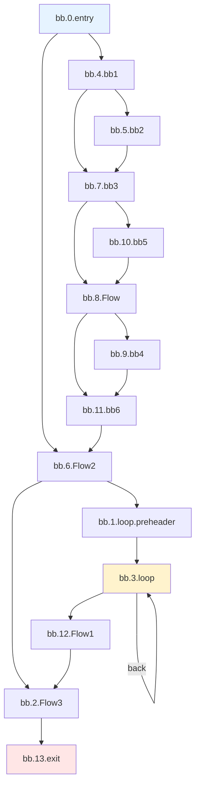

**Key Validation Points:**
- Self-loop (bb.3→bb.3) with LoopTag on exit edge
- Complex acyclic CFG with merge points surrounding the loop
- Tests distance propagation through branching without nested loops

**Test Priority:** 🟡 **MEDIUM** (acyclic with self-loop)

---

### Pattern 2.5: Two Sequential Loops

**Test File:** `two-sequential-loops.mir`

**Description:** Two sequential loops: first has internal Flow structure, second is self-loop. Tests independent LoopTag contexts.

**CFG Diagram:**

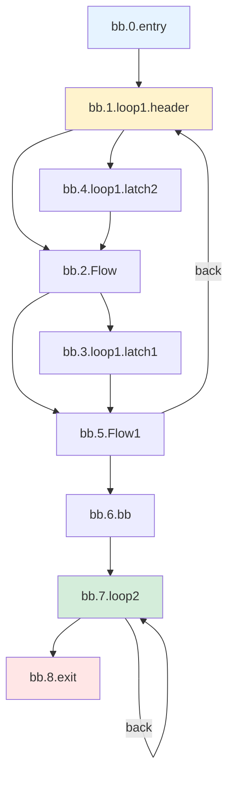

**Key Validation Points:**
- Independent LoopTag contexts for each loop
- First loop has internal conditional structure (Flow blocks)
- Distance computation transitions correctly between loop boundaries

**Test Priority:** 🟡 **MEDIUM** (sequential loop independence)

---

## 3. Nested Loop Patterns

### Pattern 3.1: Double-Nested Loops (Inner CFG)

**Test File:** `inner_cfg_in_2_nested_loops.mir`

**Description:** Two-level nested loops with internal conditional CFG in inner loop.

**CFG Diagram:**

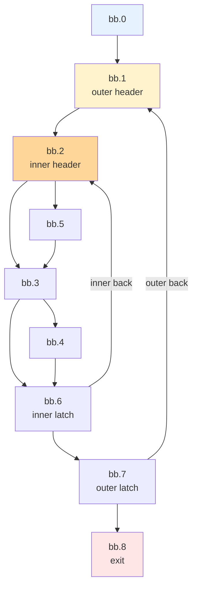

**Key Validation Points:**
- **Double LoopTag** for uses crossing both loop boundaries
- Inner loop uses: `LoopTag + D` from outer loop perspective
- Outer loop uses: `LoopTag + D` from exit perspective

**Test Priority:** ✅ **HIGH** (fundamental nested loop case)

---

### Pattern 3.2: Triple-Nested Loops

**Test File:** `triple-nested-loops.mir`

**Description:** Three-level nested loops testing LoopTag accumulation.

**CFG Diagram:**

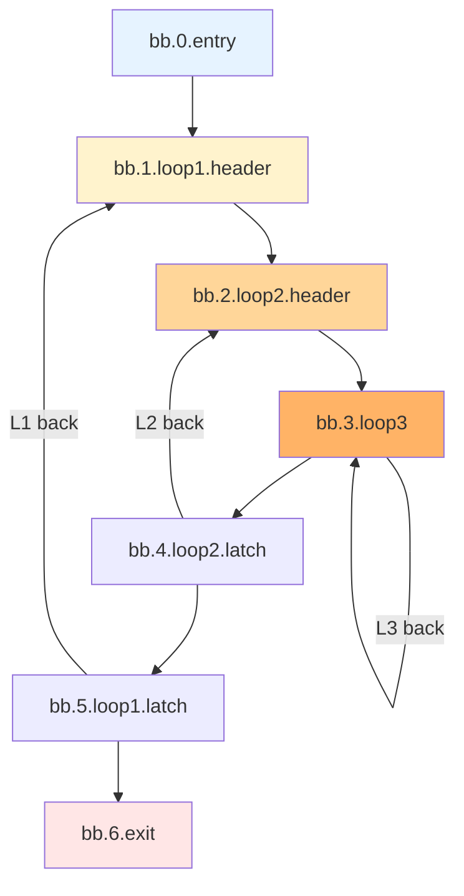

**Key Validation Points:**
- **Triple LoopTag accumulation** for innermost uses viewed from exit
- Each loop boundary adds one LoopTag
- Correct distance calculation at each nesting level

**Expected Distance Patterns:**
```
From exit perspective:
  Inner loop use:  LoopTag*3 + D
  Middle loop use: LoopTag*2 + D  
  Outer loop use:  LoopTag*1 + D
```

**Test Priority:** ✅ **HIGH** (validates LoopTag accumulation)

---

### Pattern 3.3: Nested Loops with Side Exits (Variant A)

**Test File:** `nested-loops-with-side-exits-a.mir`

**Description:** Nested loops where inner loop can exit directly to outer loop exit.

**CFG Diagram:**

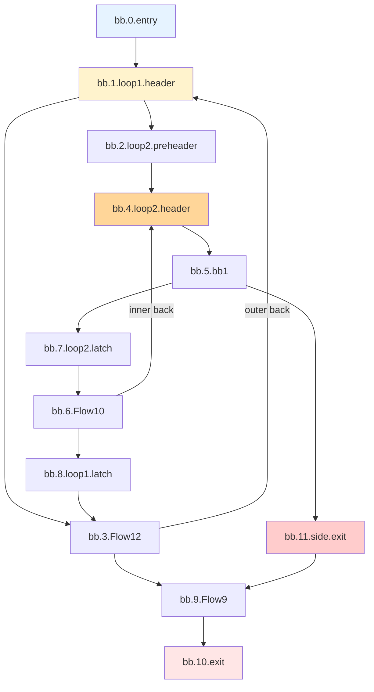

**Key Validation Points:**
- Side exit from inner loop bypasses outer loop
- Different LoopTag levels for different exit paths
- Minimum distance across all exit paths

**Test Priority:** 🟡 **MEDIUM** (side exit complexity)

---

### Pattern 3.4: Double Nested Loops with Complex Inner CFG

**Test File:** `double-nested-loops-complex-cfg.mir`

**Description:** Two-level nested loops with complex internal CFG. Outer loop: bb.1 header, bb.3→bb.1 back-edge. Inner loop: bb.4 header, bb.37→bb.4 back-edge. No side exits.

**CFG Diagram:**

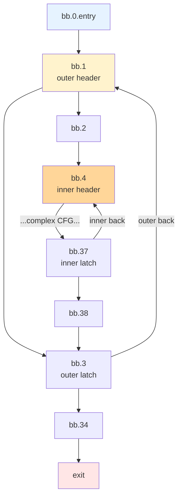

**Key Validation Points:**
- Double LoopTag for uses crossing both loop boundaries
- Complex internal CFG within inner loop (many Flow blocks)
- Correct distance propagation through nested structure

**Test Priority:** 🔵 **LOW** (stress test, many blocks)

---

## 4. Sequential Loop Patterns

### Pattern 4.1: Two Sequential Loops

**Test File:** `sequence_2_loops.mir`

**Description:** Two independent loops in sequence.

**CFG Diagram:**

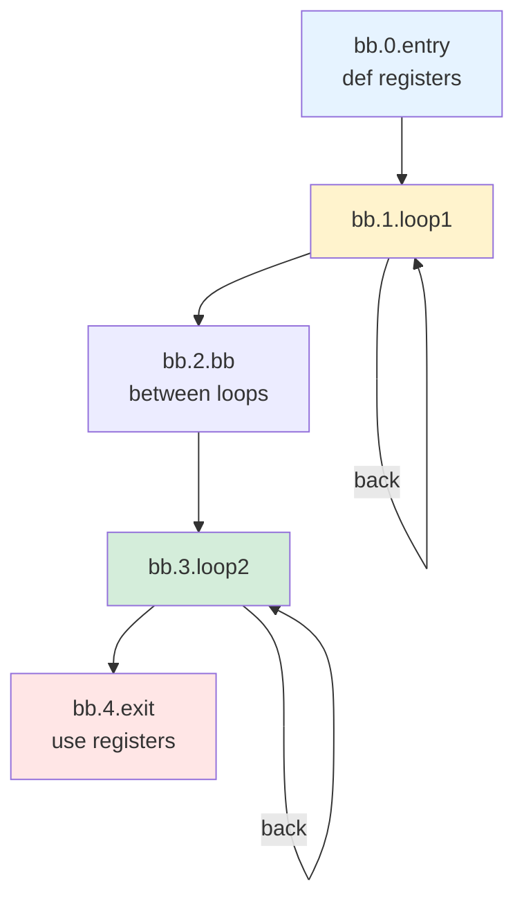

**Key Validation Points:**
- Each loop has independent LoopTag context
- Register defined before loop1, used after loop2: crosses both
- Correct LoopTag when "exiting" analysis enters each loop

**Expected Distance Patterns:**
```
From bb.4 (exit):
  Use in loop2: LoopTag + D
  Use in loop1: LoopTag + D (from loop2's perspective it's outside)
```

**Test Priority:** 🟡 **MEDIUM** (sequential loop independence)

---

### Pattern 4.2: Complex Acyclic CFG with 4 Self-Loops

**Test File:** `complex-acyclic-cfg-with-4-self-loops.mir`

**Description:** Outer self-loop (bb.1) followed by acyclic CFG containing three sequential inner self-loops. Inner loops are NOT nested inside outer loop.

**CFG Diagram:**

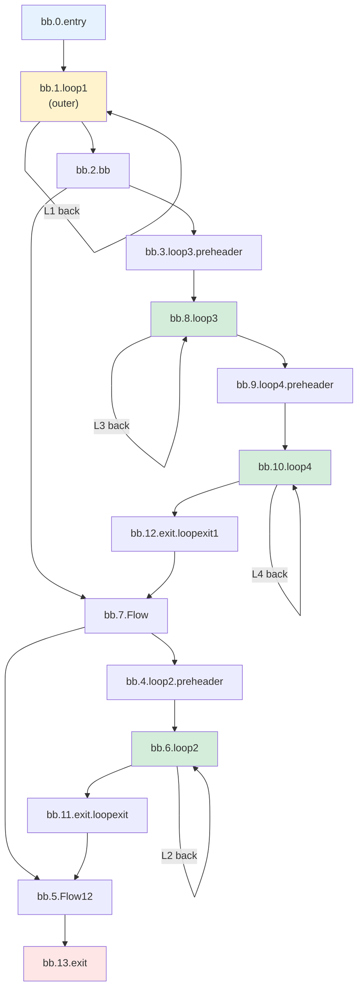

**Key Validation Points:**
- Four independent self-loops (bb.1, bb.6, bb.8, bb.10)
- Inner loops are NOT nested inside outer loop - separate LoopTag contexts
- Complex acyclic CFG structure between loops

**Test Priority:** 🟡 **MEDIUM** (multiple independent self-loops)

---

## 5. Complex Nested Structures

### Pattern 5.1: Loop with 4 Nesting Levels

**Test File:** `loop_nested_in_3_outer_loops_complex_cfg.mir`

**Description:** Four-level nesting with internal CFG at innermost level.

**CFG Diagram:**

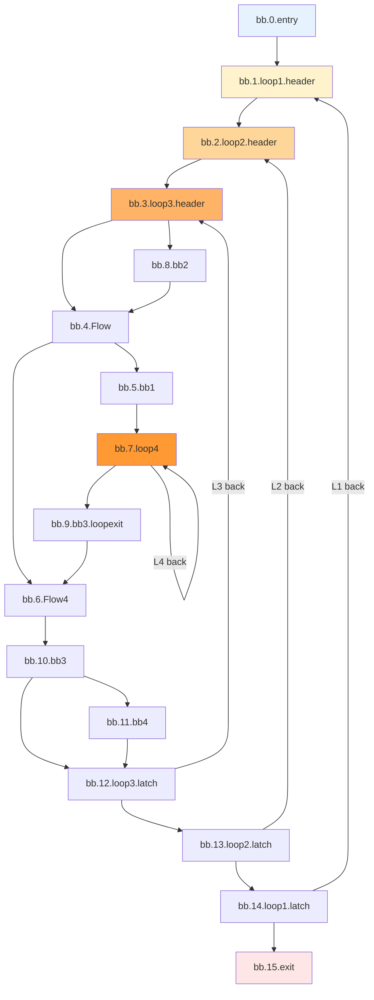

**Key Validation Points:**
- Four levels of LoopTag accumulation
- Internal CFG (Flow blocks) at loop3 level
- Self-loop (loop4) at deepest level

**Test Priority:** 🟡 **MEDIUM** (deep nesting stress test)

---

### Pattern 5.2: If-Else with Nested Loops

**Test File:** `if_else_with_loops_nested_in_2_outer_loops.mir`

**Description:** Conditional branches selecting between different nested loop structures.

**CFG Diagram:**

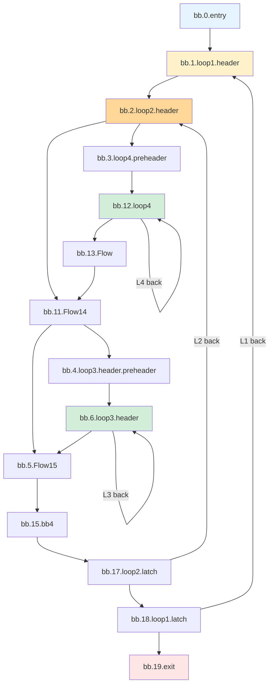

**Key Validation Points:**
- Conditional selection between loop3 and loop4 paths
- Both inner loops nested in loop1+loop2
- Correct LoopTag regardless of which inner loop executes

**Test Priority:** 🔵 **LOW** (complex conditional + loops)

---

## 6. Three-Tier Ranking Validation

### Pattern 6.1: Three-Tier Distance Ranking

**Test File:** `three-tier-ranking-nested-loops.mir`

**Description:** Specifically validates the three-tier ranking system.

**Key Concepts Tested:**

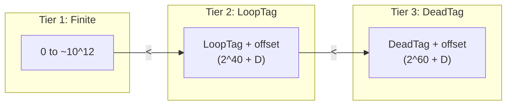

**Validation Points:**
- Finite distances sort correctly (smaller = closer)
- LoopTag distances sort correctly (smaller offset = closer)
- DeadTag distances are always "furthest"
- Mixed comparisons work: `finite < LoopTag < DeadTag`

**Test Priority:** ✅ **HIGH** (validates core ranking algorithm)

---

## Summary: Test Case Priority Matrix

| **Pattern ID** | **Test File** | **Priority** | **Complexity** | **Key Feature** |
|----------------|---------------|--------------|----------------|-----------------|
| 1.1 | acyclic-phi-merge-distances | ✅ HIGH | Low | Basic distance calculation |
| 1.2 | complex-control-flow-11blocks | 🟡 MEDIUM | Medium | Multi-path join |
| 1.3 | complex-control-flow-15blocks | 🟡 MEDIUM | Medium | Deep branching |
| 2.1 | simple-loop-3blocks | ✅ HIGH | Low | Basic LoopTag |
| 2.2 | complex-single-loop | 🟡 MEDIUM | Medium | Internal CFG |
| 2.3 | complex-single-loop-a | 🟡 MEDIUM | Medium | Multi-latch |
| 2.4 | acyclic-cfg-with-self-loop | 🟡 MEDIUM | Medium | Acyclic + self-loop |
| 2.5 | two-sequential-loops | 🟡 MEDIUM | Medium | Sequential loop independence |
| 3.1 | inner_cfg_in_2_nested_loops | ✅ HIGH | High | Double LoopTag |
| 3.2 | triple-nested-loops | ✅ HIGH | High | Triple LoopTag |
| 3.3 | nested-loops-with-side-exits-a | 🟡 MEDIUM | High | Side exits |
| 3.4 | double-nested-loops-complex-cfg | 🔵 LOW | Very High | Double nested + complex CFG |
| 4.1 | sequence_2_loops | 🟡 MEDIUM | Medium | Sequential independence |
| 4.2 | complex-acyclic-cfg-with-4-self-loops | 🟡 MEDIUM | High | 4 independent self-loops |
| 5.1 | loop_nested_in_3_outer_loops_complex_cfg | 🟡 MEDIUM | Very High | 4-level nesting |
| 5.2 | if_else_with_loops_nested_in_2_outer_loops | 🔵 LOW | Very High | Conditional + nested |
| 6.1 | three-tier-ranking-nested-loops | ✅ HIGH | Medium | Ranking validation |

---

## Running the Tests

### Unit Tests (Recommended)

```bash
cd build/Debug
./unittests/Target/AMDGPU/AMDGPUTests --gtest_filter="*AllMirFiles*"
```

### Individual File via llc

```bash
./bin/llc -mtriple=amdgcn -mcpu=gfx1200 \
  -run-pass=amdgpu-next-use \
  -debug-only=amdgpu-next-use \
  path/to/test.mir -o /dev/null 2>&1 | grep -E "(Vreg:|Instr:|Block End)"
```

### Regenerate CHECK Patterns

```bash
python3 scripts/regenerate_nua_checks.py
```

---

## Key Implementation Details

### Distance Storage Convention

- **Negative stored values**: Finite distances (larger = closer)
- **Non-negative stored values**: LoopTag/DeadTag distances (smaller = closer)
- **`isCloserOrEqual(A, B)`**: Handles mixed-sign comparisons correctly

### Loop Boundary Detection

```cpp
// Loop-exiting edge adds LoopTag
if (LoopExits.contains(MBB->getNumber())) {
  EdgeWeight = LoopTag;
}

// Loop-entering edge (analysis direction) subtracts LoopTag
if (LI->getLoopDepth(MBB) < LI->getLoopDepth(Succ)) {
  // Transform distances for loop entry
}
```

### Subregister Handling

- Each `VRegMaskPair` tracks `(Register, LaneBitmask)`
- Overlap queries find minimum distance among overlapping masks
- Full register use covers all subregister queries

---

## Future Enhancements

1. **Subregister-specific tests**: Add tests with explicit sub0/sub1 tracking
2. **DeadTag validation**: Add tests where registers become truly dead
3. **PHI operand filtering**: Validate PHI operands only live on their incoming edge
4. **Performance benchmarks**: Track analysis time for large CFGs

---

*Document created: 2024-12-05*  
*Last updated: 2025-12-11*  
*Based on: llvm/test/CodeGen/AMDGPU/NextUseAnalysis/*.mir*

