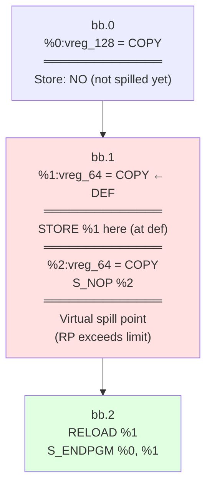
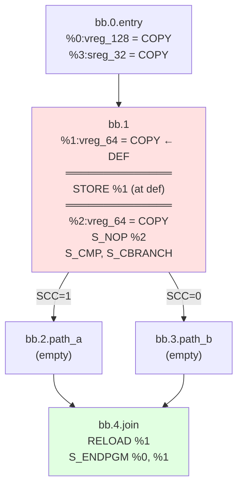
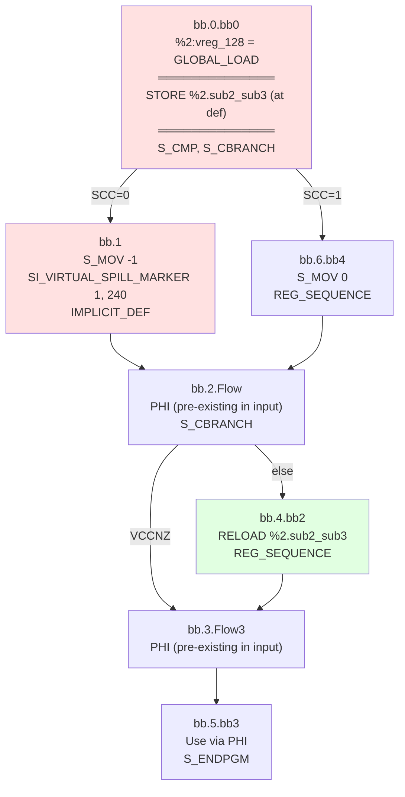
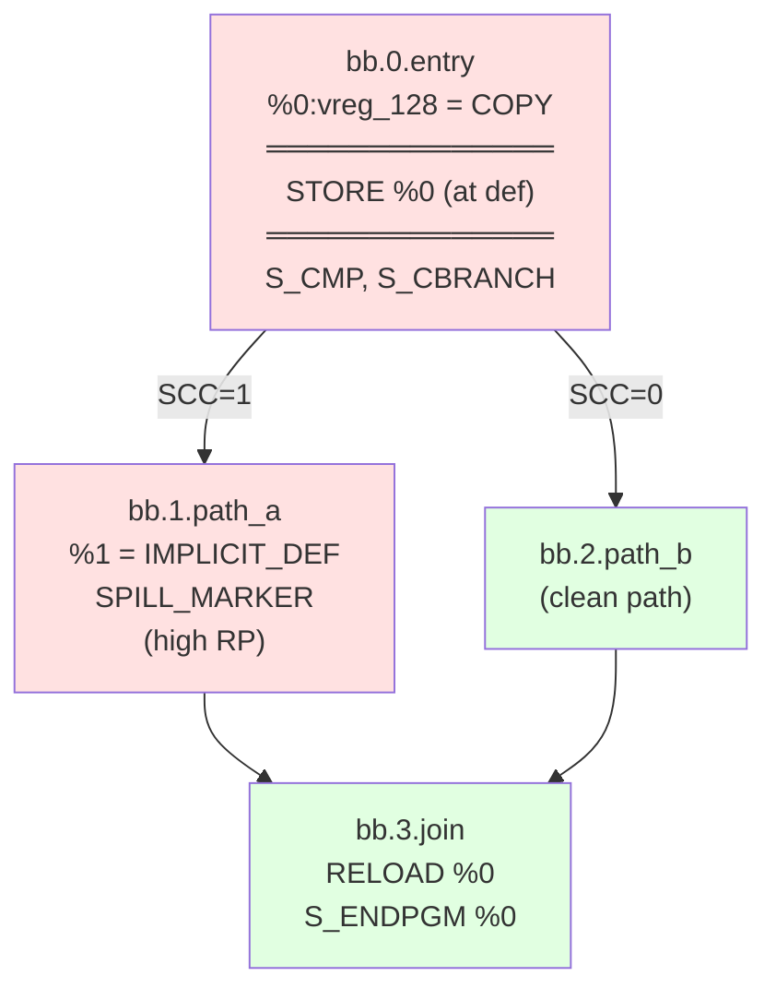
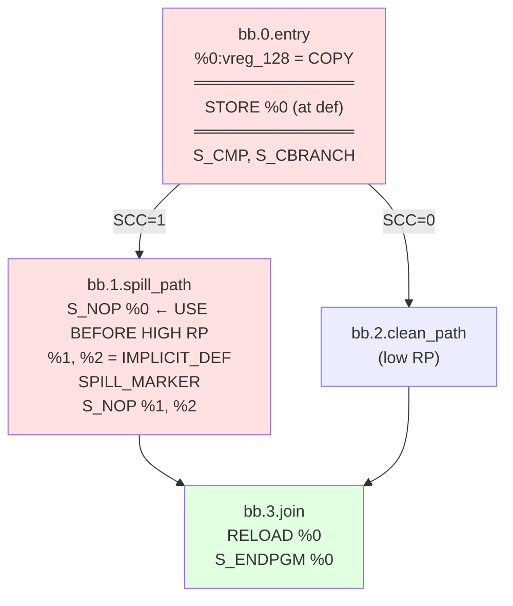
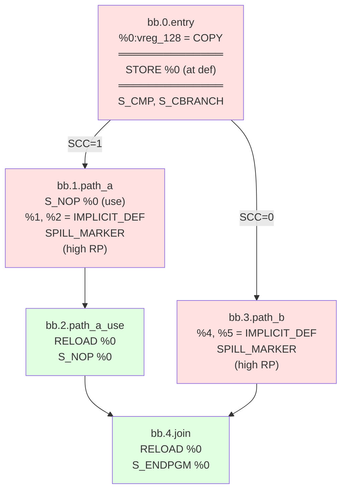
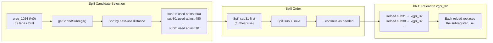
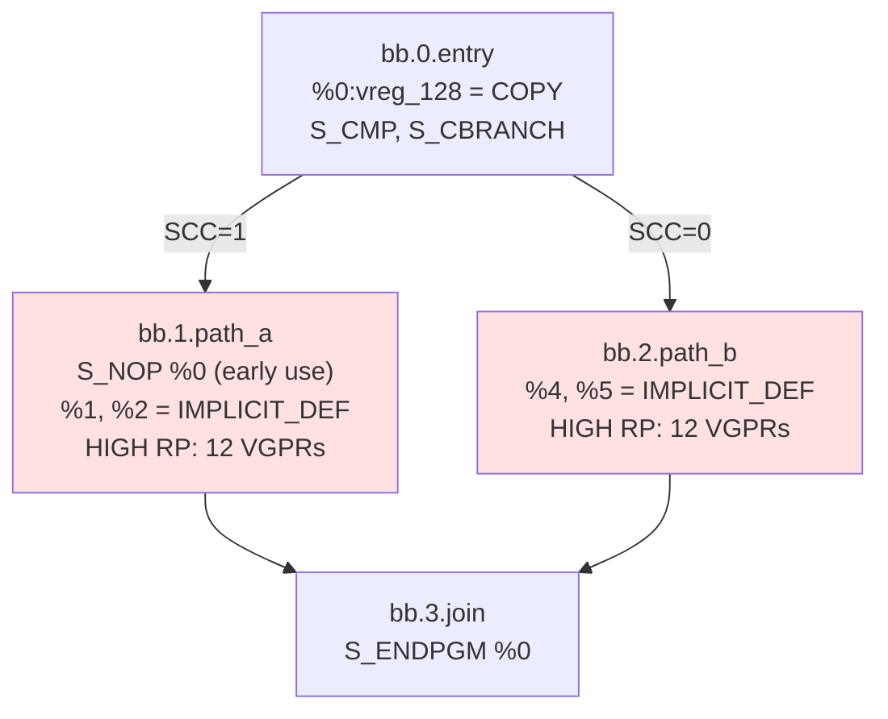

# SSA Spiller Test Documentation (New Design)

## Current Spiller Design (2025-11-19)

### Core Strategy: Store at Definition

**Key Innovation:** Store register immediately after its definition (when EXEC is full), NOT at the high-pressure point.

**Flow:**
```
1. spillAtDefinition(VMP)         → Store right after def (EXEC full)
2. Compute KillIdx                → Virtual spill point (where RP drops)
3. emitReloadsAndRepairSSA()      → Place reloads, repair SSA
4. shrinkToUses()                 → Trim LiveInterval after all repairs
```

### Virtual Spill Marker Pseudo-Instruction

**Compiler Option:** `--amdgpu-ssa-spill-markers=1`

**Instruction:** `SI_VIRTUAL_SPILL_MARKER <vreg_index>, <lane_mask>`

**Purpose:** A test-only pseudo-instruction that marks the **virtual spill point** - the location where register pressure is relieved (register logically becomes dead). This may differ from the **physical store location** (store-at-definition).

**Arguments:**
- `vreg_index`: Virtual register index being spilled
- `lane_mask`: Lane mask of spilled subregister (e.g., 255 = 0xFF = all lanes of vreg_64, 240 = 0xF0 = sub2_sub3)

**Omission Rule:** The marker is **omitted** when the virtual spill point immediately follows the physical store of the same VMP (i.e., store-at-definition and virtual spill point are at the same position).

```cpp
// From AMDGPUSSARegisterSpiller.cpp lines 683-696:
if (!PrevMI || !isSpillInstr(PrevMI) || !usesSpilledVMP(PrevMI, VMP)) {
  // Insert marker - virtual spill point differs from store location
  BuildMI(..., SI_VIRTUAL_SPILL_MARKER).addImm(VReg).addImm(Mask);
} else {
  // Skip marker - virtual spill point matches store location
  LLVM_DEBUG(dbgs() << "Skipping virtual spill marker (adjacent real spill of same VMP)\n");
}
```

**Summary:**

| Test File | Marker Present | Reason |
|-----------|----------------|--------|
| `spill-linear-dominated.mir` | ❌ Omitted | Virtual spill point matches store |
| `spill-dominated-branches.mir` | ❌ Omitted | Virtual spill point matches store |
| `spill-vreg-subregister.mir` | ✅ `SI_VIRTUAL_SPILL_MARKER 1, 240` | Spill point in bb.1, store in bb.0 |
| `spill-multi-predecessor-join.mir` | ✅ `SI_VIRTUAL_SPILL_MARKER 0, 255` | Spill point in bb.1, store in bb.0 |
| `spill-use-before-spill.mir` | ✅ `SI_VIRTUAL_SPILL_MARKER 0, 255` | Spill point in bb.1, store in bb.0 |
| `spill-multi-path-independent.mir` | ✅ `SI_VIRTUAL_SPILL_MARKER 0, 255` | Spill points in bb.1/bb.3, store in bb.0 |

### Current Use Handling

| Use Type | Current Behavior |
|----------|-----------------|
| **Dominated** | Emit reload at group head, rewrite uses |
| **Reachable** | Emit reload at use, MachineLaneSSAUpdater inserts PHIs |

---

## Test Files Overview

| Test File | What It Tests |
|-----------|--------------|
| `spill-linear-dominated.mir` | Basic dominated use case |
| `spill-dominated-branches.mir` | Dominated use through diamond CFG |
| `spill-vreg-subregister.mir` | Subregister spilling with value PHIs |
| `spill-multi-predecessor-join.mir` | Reachable use at multi-pred join |
| `spill-use-before-spill.mir` | Use before high-RP (no hoist) |
| `spill-multi-path-independent.mir` | Independent spills on multiple paths |
| `spill-vreg-many-lanes.mir` | Large vreg_1024 stress test |
| `spill-balanced-use-before.mir` | **XFAIL** - Balanced spilling not implemented |

---

## Test 1: spill-linear-dominated.mir

### Pattern: Dominated Use (Linear CFG)

### CFG Diagram



### Analysis

| Aspect | Value |
|--------|-------|
| **Spilled Register** | `%1:vreg_64` |
| **Store Location** | bb.1: Right after `%1 = COPY` (store-at-definition) |
| **Virtual Spill Point** | bb.1: Right after `%1 = COPY`, same as store (before `%2` def) |
| **Reload Location** | bb.2: Before use |
| **Use Type** | Dominated (spill dominates use) |
| **PHI Nodes** | None |
| **Spill Marker** | Omitted (virtual spill point matches store position) |

### CHECK Expectations
```
bb.1:
  %1 = COPY $vgpr4_vgpr5
  SI_SPILL_V64_SAVE %1, %stack.0  ← Store at definition
  %2 = COPY ...
  S_NOP %2

bb.2:
  SI_SPILL_V64_RESTORE %stack.0  ← Reload before use
  S_ENDPGM %0, %1
```

---

## Test 2: spill-dominated-branches.mir

### Pattern: Dominated Use (Diamond CFG)

### CFG Diagram



### Analysis

| Aspect | Value |
|--------|-------|
| **Spilled Register** | `%1:vreg_64` |
| **Store Location** | bb.1: Right after `%1 = COPY` |
| **Virtual Spill Point** | bb.1: Right after `%1 = COPY`, same as store (before `%2` def) |
| **Reload Location** | bb.4.join: Before use |
| **Use Type** | Dominated (bb.1 dominates bb.4 through both paths) |
| **PHI Nodes** | None (single value on all paths) |
| **Spill Marker** | Omitted (virtual spill point matches store position) |

---

## Test 3: spill-vreg-subregister.mir

### Pattern: Subregister Spilling (Complex Pre-existing CFG)

### CFG Diagram



### Analysis

| Aspect | Value |
|--------|-------|
| **Spilled Register** | `%2.sub2_sub3:vreg_64` (subregister of vreg_128) |
| **Store Location** | bb.0: Right after `GLOBAL_LOAD` (store-at-definition) |
| **Virtual Spill Point** | bb.1: `SI_VIRTUAL_SPILL_MARKER 1, 240` |
| **Reload Location** | bb.4.bb2: `SI_SPILL_V64_RESTORE` before REG_SEQUENCE |
| **Use Type** | Dominated by bb.4 |
| **PHI Nodes** | Pre-existing in INPUT MIR |
| **Subregister** | Only `sub2_sub3` lanes (mask 0xF0 = 240) spilled/reloaded |
| **Spill Marker** | `SI_VIRTUAL_SPILL_MARKER 1, 240` |

### Key Points
- **Subregister precision**: Only `sub2_sub3` (2 lanes of 4) are spilled
- **Store at definition**: `SI_SPILL_V64_SAVE` right after `GLOBAL_LOAD` in bb.0
- **Simple reload**: `SI_SPILL_V64_RESTORE` in bb.4
- **Pre-existing PHIs**: The PHIs in the output are from the INPUT MIR

---

## Test 4: spill-multi-predecessor-join.mir

### Pattern: Reachable Use at Multi-Predecessor Join

### CFG Diagram



### Analysis

| Aspect | Value |
|--------|-------|
| **Spilled Register** | `%0:vreg_128` |
| **Store Location** | bb.0: Right after `COPY` (store-at-definition) |
| **Virtual Spill Point** | bb.1: After `%1` def (path_a only) |
| **Reload Location** | bb.3.join: Before use |
| **Use Type** | Reachable (path_b is clean) |
| **PHI Nodes** | None |
| **Spill Marker** | `SI_VIRTUAL_SPILL_MARKER 0, 255` (vreg 0, mask 0xFF) |

---

## Test 5: spill-use-before-spill.mir

### Pattern: Use Before High-RP (Cannot Hoist to NCD)

### CFG Diagram



### Analysis

| Aspect | Value |
|--------|-------|
| **Key Feature** | Early use of `%0` in bb.1 BEFORE high RP |
| **Store Location** | bb.0: At definition (before branch) |
| **Virtual Spill Point** | bb.1: After `%1`, `%2` defs |
| **Reload Location** | bb.3.join |
| **Spill Marker** | `SI_VIRTUAL_SPILL_MARKER 0, 255` (vreg 0, mask 0xFF) |

---

## Test 6: spill-multi-path-independent.mir

### Pattern: Independent Spills on Multiple Paths

### CFG Diagram



### Analysis

| Aspect | Value |
|--------|-------|
| **Spilled Register** | `%0:vreg_128` |
| **Store Location** | bb.0: At definition |
| **Path A Spill Point** | bb.1: After `%1`, `%2` defs |
| **Path B Spill Point** | bb.3: After `%4`, `%5` defs |
| **Reloads** | bb.2 (path_a_use) and bb.4 (join) |
| **Spill Markers** | `SI_VIRTUAL_SPILL_MARKER 0, 255` in bb.1 and bb.3 |

### Note
Both paths independently exceed RP limit.

---

## Test 7: spill-vreg-many-lanes.mir

### Pattern: Subregister Selection by Use Distance (vreg_1024)

### Concept Diagram



### Analysis

| Aspect | Value |
|--------|-------|
| **Register Class** | `vreg_1024` (32 VGPRs, 32 lanes) |
| **Selection Strategy** | `getSortedSubregs()` - sort lanes by next-use distance |
| **Spill Order** | Furthest-used subregister first (Belady's algorithm per-lane) |
| **Reload Target** | `vgpr_32` - each lane reloaded independently |
| **Purpose** | Stress test for lane-aware spilling with large registers |

---

## Test 8: spill-balanced-use-before.mir

### Pattern: Balanced Spilling (XFAIL)

### CFG Diagram



**Status:** XFAIL - Balanced spilling pending cost model implementation.

**Expected Behavior (when implemented):**
- Both paths have high RP (12 VGPRs > limit)
- Cost model detects both paths benefit from spilling
- Spill inserted on BOTH paths (hoisting to NCD impossible due to early use in bb.1)
- Single reload at join

---

## Pattern Classification (New Design)

### Case 1: Dominated Uses

**Definition:** Spill point dominates use point.

**Handling:**
1. Store at definition
2. Virtual spill point at high-RP location
3. Reload at dominated group head
4. Rewrite all uses in group

**Tests:** `spill-linear-dominated.mir`, `spill-dominated-branches.mir`

### Case 2: Reachable Uses

**Definition:** Use reachable from spill point but not dominated.

**Handling:**
1. Store at definition
2. Virtual spill point on one path
3. Reload at use (all paths currently)
4. MachineLaneSSAUpdater inserts value PHIs

**Tests:** `spill-multi-predecessor-join.mir`, `spill-use-before-spill.mir`, `spill-vreg-subregister.mir`

### Case 3: Subregister Spilling

**Handling:**
1. VRegMaskPair tracks lane mask
2. Only spill/reload affected lanes
3. MachineLaneSSAUpdater handles lane merging
4. REG_SEQUENCE reconstructs full register

**Tests:** `spill-vreg-subregister.mir`, `spill-vreg-many-lanes.mir`

---

## Future Work

| Feature | Description |
|---------|-------------|
| **Split-before-use** | Conditional reload based on cost model |
| **Balanced spilling** | Spill on both paths when both have high RP |
| **Loop-aware spilling** | Optimize spill/reload placement around loops |

---

**Last Updated:** 2025-12-12
**Design Version:** Store-at-Definition (2025-11-19)
**Split-before-use:** Commented out pending cost model
