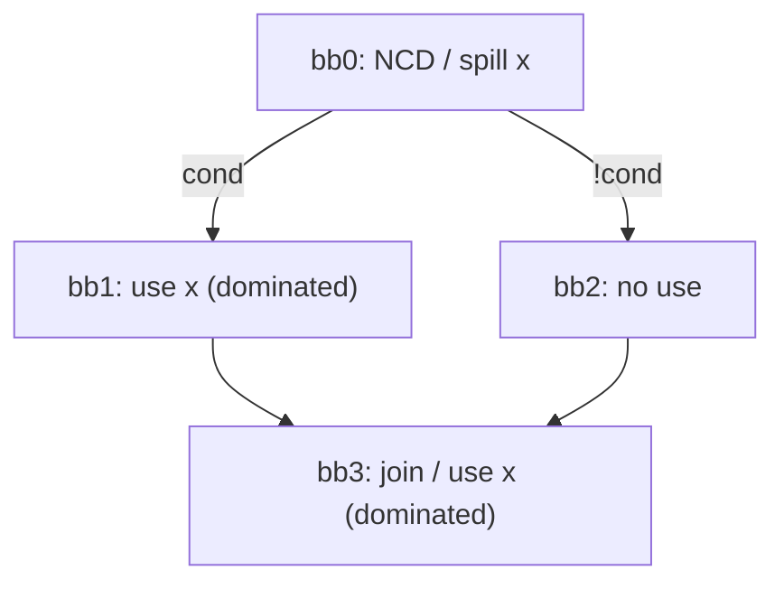
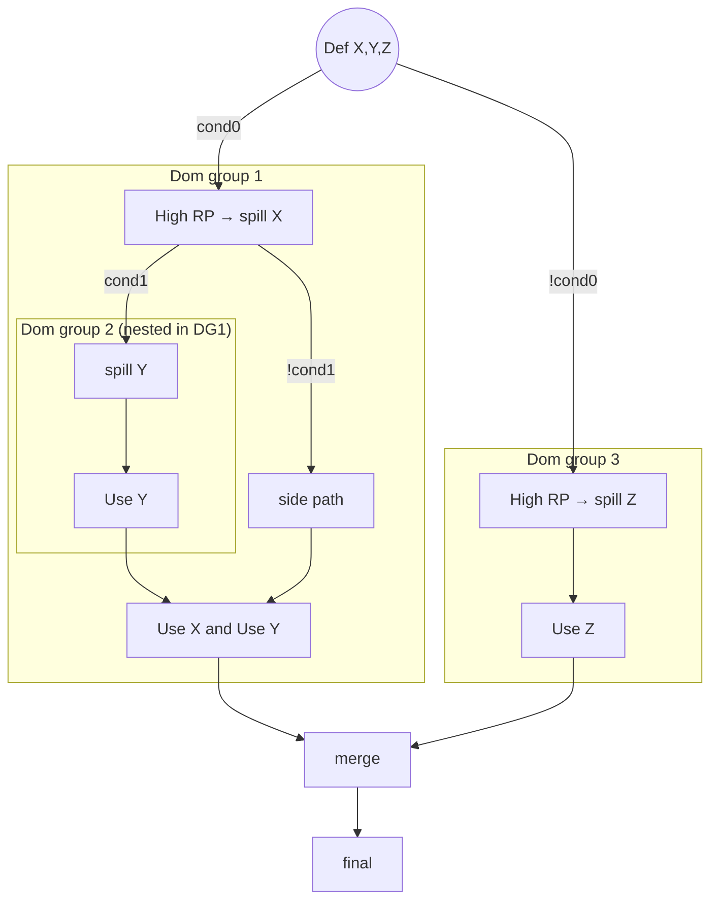

# SSA Spiller Test: Dominated Uses in Diamond CFG (Dom-Group Pitfall)

## Goal

Create a MIR test that exercises **dominated-use group building** and demonstrates why a spill placed in the **nearest common dominator (NCD)** can still lead to **incorrect SSA repair** if dominated uses are processed in the “wrong” order (DFS / RPO artifact), causing `MachineLaneSSAUpdater` to synthesize an illegal PHI that merges `{reloaded_value, original_spilled_value}`.

We want the test to model the following situation:

- `x` is spilled in the dominator block.
- There are **multiple uses of `x` dominated by that spill**:
  - one use inside one branch of a diamond
  - another use in the join block
- If the dominated use in the branch is processed first and SSA repair is performed immediately, SSAUpdater may create a PHI in the join that merges:
  - `y` (reloaded on the processed path) and
  - `x` (original value on the other path)
- But `x` **is already spilled in the dominator**, so that merge is invalid.

## CFG (intended)

