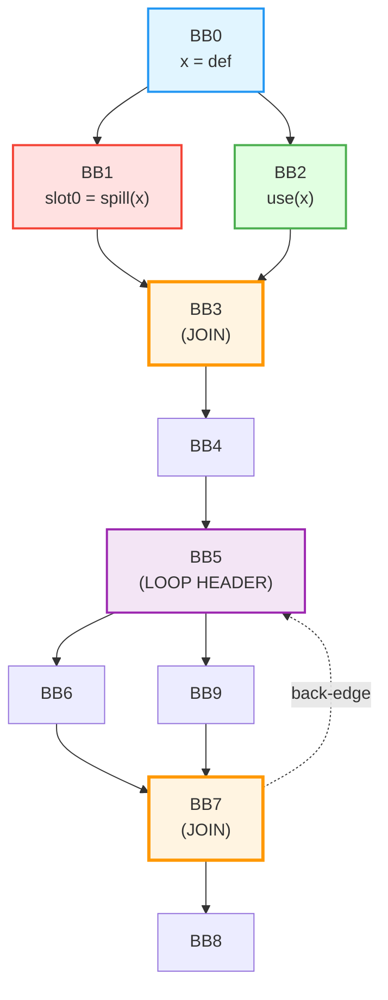

# CFG from Your JSON - Converted to Mermaid

**CFG Analysis:**
- **BB0**: Entry, defines x
- **BB1**: Spill path (spills x to slot0)
- **BB2**: Clean path (uses x directly)
- **BB3**: **JOIN** - paths merge here
- **BB5**: Loop header
- **BB7**: **JOIN** - BB6 and BB9 merge
- **BB7 → BB5**: Back-edge (loop)

This is a perfect example for spill analysis:
- BB0 → BB1 (spill) and BB0 → BB2 (clean) diverge
- They join at BB3
- BB3 → BB5 → ... → BB7 → BB5 forms a loop

