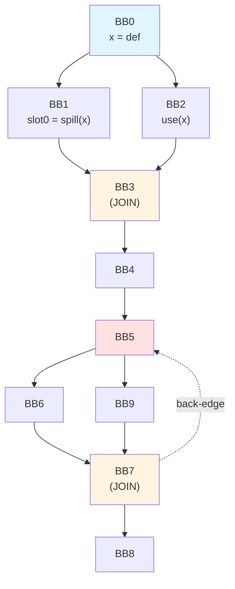
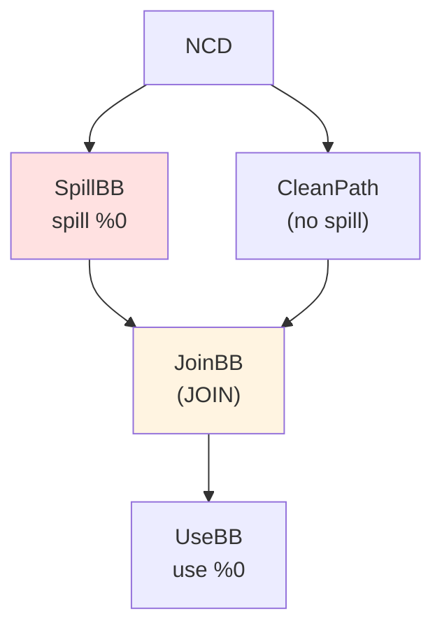
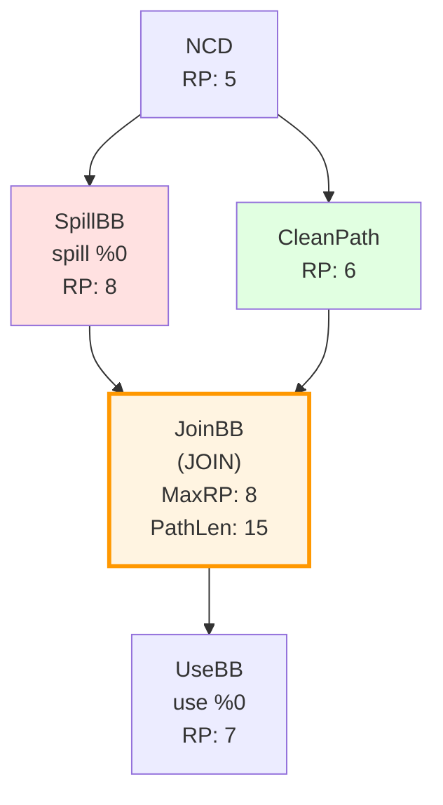

# CFG Exchange Format - Methodology

## Analysis of Provided JSON

Yes, I can understand the CFG from the JSON! Here's what I see:

**CFG Structure:**
```
BB0 (x = def)
  ├─→ BB1 (spill x to slot0)
  │     └─→ BB3
  └─→ BB2 (use x)
        └─→ BB3 (JOIN - paths merge here)
              └─→ BB4 → BB5
                      ├─→ BB6 → BB7 → BB8
                      ├─→ BB9 → BB7 (JOIN)
                      └─→ BB5 (back-edge, LOOP)
```

**Key Observations:**
- BB0 defines x, then branches to BB1 (spill path) and BB2 (clean path)
- BB3 is a join point (both BB1 and BB2 reach it)
- BB5 → BB7 → BB5 forms a loop (back-edge)
- BB7 is another join (BB6 and BB9 merge)

## Recommended CFG Exchange Format: Mermaid

**Why Mermaid:**
1. ✅ **Human-readable** in plain text (I can read/write it easily)
2. ✅ **Renders beautifully** in Obsidian, GitHub, many tools
3. ✅ **Compact** - much smaller than JSON
4. ✅ **Standard** - widely supported
5. ✅ **Supports labels** - can show instructions, RP, metrics

**Example Mermaid CFG:**



## Alternative: Simplified JSON Format

If you prefer JSON, here's a more compact format I can generate:

```json
{
  "nodes": [
    {"id": "BB0", "label": "BB0\nx = def"},
    {"id": "BB1", "label": "BB1\nslot0 = spill(x)"},
    {"id": "BB2", "label": "BB2\nuse(x)"},
    {"id": "BB3", "label": "BB3\n(JOIN)", "type": "join"},
    {"id": "BB4", "label": "BB4"},
    {"id": "BB5", "label": "BB5", "type": "loop-header"},
    {"id": "BB6", "label": "BB6"},
    {"id": "BB7", "label": "BB7\n(JOIN)", "type": "join"},
    {"id": "BB8", "label": "BB8"},
    {"id": "BB9", "label": "BB9"}
  ],
  "edges": [
    {"from": "BB0", "to": "BB1"},
    {"from": "BB0", "to": "BB2"},
    {"from": "BB1", "to": "BB3"},
    {"from": "BB2", "to": "BB3"},
    {"from": "BB3", "to": "BB4"},
    {"from": "BB4", "to": "BB5"},
    {"from": "BB5", "to": "BB6"},
    {"from": "BB5", "to": "BB9"},
    {"from": "BB6", "to": "BB7"},
    {"from": "BB9", "to": "BB7"},
    {"from": "BB7", "to": "BB8"},
    {"from": "BB7", "to": "BB5", "type": "back-edge"}
  ]
}
```

## My Capabilities

**What I CAN do:**
- ✅ Generate Mermaid diagrams (text format, renders in Obsidian)
- ✅ Generate simplified JSON (compact, easy to parse)
- ✅ Read and understand both formats
- ✅ Understand images you paste (if you paste a screenshot)

**What I CANNOT do:**
- ❌ Actually render/draw images myself
- ❌ Generate Obsidian canvas JSON with exact coordinates (too complex)
- ❌ See your Obsidian canvas directly

## Recommended Workflow

**For CFG Exchange:**

1. **You → Me**: 
   - Option A: Paste Mermaid diagram (I can read it)
   - Option B: Paste image/screenshot (I can understand it)
   - Option C: Describe in text (current method, works but verbose)

2. **Me → You**:
   - I'll generate **Mermaid format** (you can paste directly into Obsidian)
   - Or simplified JSON if you prefer
   - Or text description with Mermaid code block

**Example: When I need to show a CFG, I'll do:**

```markdown
## CFG Structure



**Analysis:**
- JoinBB is where paths merge
- All paths from NCD to JoinBB are processed before JoinBB in RPOT
- We have complete information at JoinBB
```

## Enhanced Mermaid for Spill Analysis

I can add annotations for spill analysis:



## Next Steps

**For future CFG discussions:**
1. I'll use **Mermaid format** by default
2. You can paste it directly into Obsidian
3. If you paste images, I can understand them
4. If you prefer JSON, I can generate simplified JSON

**Would you like me to:**
- Convert the JSON you provided to Mermaid?
- Use Mermaid for all future CFG discussions?
- Generate a template for spill analysis CFGs?

Let me know your preference and I'll adapt!


