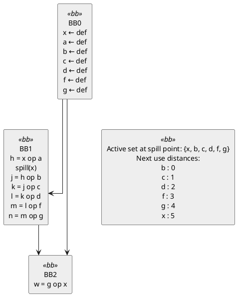

```plantuml
@startuml
skinparam linetype ortho
skinparam defaultTextAlignment center
skinparam rectangle {
    BackgroundColor<<bb>> #EEEEEE
    BorderColor<<bb>> black
}

' Main CFG nodes
rectangle "BB0\nx ← def\na ← def\nb ← def\nc ← def\nd ← def\nf ← def\ng ← def" as BB0 <<bb>>
rectangle "BB1\nh = x op a\nspill(x)\nj = h op b\nk = j op c\nl = k op d\nm = l op f\nn = m op g" as BB1 <<bb>>
rectangle "BB2\nw = g op x" as BB2 <<bb>>

' Extra analysis info node (unconnected)
rectangle "Active set at spill point: {x, b, c, d, f, g}\nNext use distances:\nb : 0\nc : 1\nd : 2\nf : 3\ng : 4\nx : 5" as INFO <<bb>>

' Flow arrows
BB0 --> BB1
BB1 --> BB2
BB0 --> BB2

' Layout hints
BB0 -[hidden]-> INFO
@enduml
```

