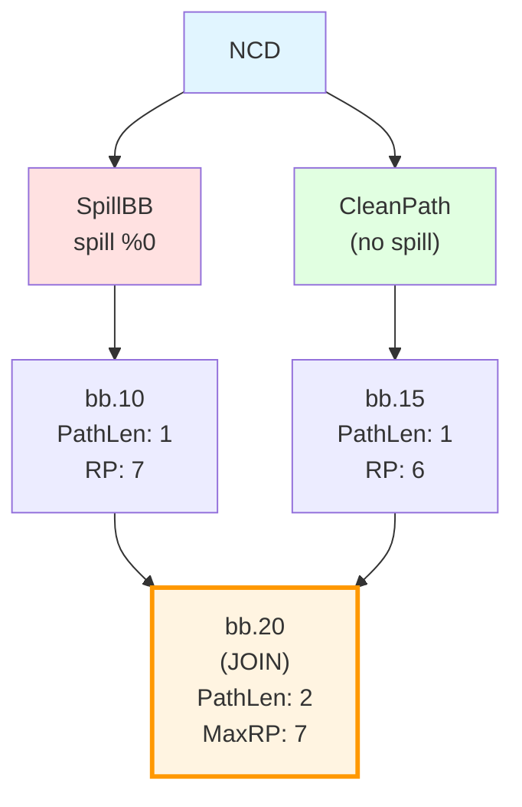

# Critical Analysis: Deferred Reachable Use Processing

## Proposed Workflow

1. **When spill happens**: Rewrite dominated uses only (standard logic)
2. **For each reachable use**: Put in map `{JoinBB → {SpillBB, UseMI, ...}}`
3. **When processing blocks**: Check if block is in map (join point)
4. **At join point**: Handle all postponed reachable uses with complete path info

**Path Tracking:**
- Stack stores `(PathLength, MaxRP)` per path
- Visited list tracks seen blocks
- When next block is in visited → join detected
- Aggregate max RP and path length at join

## Critical Analysis

### ✅ Strengths

1. **Complete Information**: By deferring until join, we have seen all paths
2. **Natural Join Detection**: Using visited list is correct for join detection
3. **Efficient**: Processes each join once when we reach it
4. **Clear Separation**: Dominated uses handled immediately, reachable uses deferred
5. **RPOT Compatibility**: Current RPOT traversal already processes predecessors before block - perfect for joins!

### ⚠️ Potential Issues

#### Issue 1: Processing Order - ✅ NO ISSUE!

**Current Code:**
```cpp
// AMDGPUSSARegisterSpiller.cpp:processFunction()
for (MachineBasicBlock &MBB : RPOT) {  // Reverse Post-Order Traversal
  // Process instructions top-down
  for (auto I = MBB.begin(), E = MBB.end(); I != E; ++I) {
    // RP tracking, spilling happens here
  }
}
```

**What RPOT Means:**
- **RPOT = Reverse Post-Order Traversal**
- Processes blocks such that **all predecessors are processed before the block itself**
- This is exactly what we need for join detection!

**Conclusion:**
- ✅ **No controversy** - RPOT is perfect for the proposed approach!
- ✅ When we process JoinBB in RPOT, all predecessors (all paths) are already processed
- ✅ We have complete information about all paths to the join
- ✅ **No traversal order change needed** - works with existing code!

#### Issue 2: Multiple Paths to Same Join - SOLVED BY RPOT

**Problem:**
```
NCD
 |    \
 |   SpillBB → Path1 → JoinBB
 |      /
 |  CleanPath → Path2 → JoinBB
 |      /
 |  CleanPath2 → Path3 → JoinBB
```

**With RPOT:**
- When we process JoinBB, all predecessors (SpillBB, CleanPath, CleanPath2) are already processed
- We have complete information about all paths!
- ✅ **No issue** - RPOT naturally solves this

**Solution:**
- Process join when we reach it in RPOT
- All predecessors already processed → we have metrics from all paths
- Aggregate max RP and path length from all predecessors

#### Issue 3: Path Tracking Complexity

**Problem:**
- Stack stores `(PathLength, MaxRP)` per path
- But what if paths merge before the join?
- Need to track multiple paths simultaneously

**Example:**



**The Problem:**
- When we reach bb.20, we have TWO paths merging:
  - Path from SpillBB via bb.10: length=2, RP=7
  - Path from CleanPath via bb.15: length=2, RP=6
- **bb.20 IS the join point** (has 2 predecessors: bb.10 and bb.15)
- Simple stack can't handle this - we need per-block metrics that aggregate from all predecessors

**Solution:**
- Track metrics per **predecessor** at each block
- When processing JoinBB, aggregate from all predecessors
- Use `DenseMap<MachineBasicBlock *, PathMetrics>` to track per-predecessor

#### Issue 4: Join Detection Logic

**Proposed:**
```cpp
if (next block is in visited list) {
  // We have a join
  // Update max RP and path length
  // Process pending reloads
}
```

**Problem:**
- This detects when we **revisit** a block (back-edge or join)
- But we need to distinguish:
  - **Back-edge** (loop): Don't process as join!
  - **Join point**: Process as join

**Solution:**
- Check if block is in **visited** AND is a **predecessor** of current block
- If yes → join (not back-edge)
- If no → back-edge (ignore for join processing)

#### Issue 5: When to Process Join

**Problem:**
- When do we know we've seen ALL paths to join?
- If we process join too early, we miss some paths
- If we process join too late, we delay decisions unnecessarily

**Solution:**
- Process join when we **finish processing the join block itself**
- At that point, all predecessors are processed (in post-order)
- We can aggregate metrics from all predecessors

## Improved Approach

### Algorithm: RPOT with Deferred Processing (CORRECTED)

```cpp
// Data structures
struct ReachableUseInfo {
  MachineInstr *SpillMI;
  MachineInstr *UseMI;
  MachineBasicBlock *SpillBB;
  MachineBasicBlock *JoinBB;
  // Path metrics (filled when processing join)
  unsigned MaxPathLength;
  unsigned MaxRP;
};

DenseMap<MachineBasicBlock *, SmallVector<ReachableUseInfo>> PendingReachableUses;
DenseMap<MachineBasicBlock *, PathMetrics> BlockMetrics;  // Per-block metrics

struct PathMetrics {
  unsigned PathLength;  // From NCD to this block
  unsigned MaxRP;       // Max RP on path from NCD to this block
};

void processFunction() {
  // Step 1: Process blocks in RPOT (predecessors before block)
  // This ensures when we reach a join, all paths are already processed
  for (MachineBasicBlock &MBB : RPOT) {
    processBlock(&MBB);
  }
}

void processBlock(MachineBasicBlock *MBB) {
  // Step 1: Aggregate metrics from predecessors
  PathMetrics Aggregated;
  if (MBB->pred_size() > 1) {
    // Multiple predecessors → this is a join
    // Aggregate max RP and path length from all predecessors
    for (MachineBasicBlock *Pred : MBB->predecessors()) {
      PathMetrics PredMetrics = BlockMetrics[Pred];
      Aggregated.MaxRP = std::max(Aggregated.MaxRP, PredMetrics.MaxRP);
      Aggregated.PathLength = std::max(Aggregated.PathLength, PredMetrics.PathLength);
    }
  } else if (MBB->pred_size() == 1) {
    // Single predecessor → continue path
    MachineBasicBlock *Pred = *MBB->pred_begin();
    PathMetrics PredMetrics = BlockMetrics[Pred];
    Aggregated = PredMetrics;
    // Update path length (add current block's instructions)
    Aggregated.PathLength += MBB->size();
  } else {
    // Entry block
    Aggregated.PathLength = 0;
    Aggregated.MaxRP = 0;
  }
  
  // Step 2: Update RP for current block
  // (using existing RP tracking logic)
  updateRPForBlock(MBB, Aggregated);
  
  // Step 3: Check if this is a join point with pending reachable uses
  if (MBB->pred_size() > 1 && PendingReachableUses.count(MBB)) {
    // This is a join AND we have pending uses
    // All predecessors already processed (RPOT guarantees this)
    // → We have complete path info!
    auto &PendingUses = PendingReachableUses[MBB];
    
    for (ReachableUseInfo &Info : PendingUses) {
      // Now we have complete path info:
      // - MaxPathLength: from NCD to JoinBB (aggregated from all predecessors)
      // - MaxRP: max RP on any path to JoinBB (aggregated from all predecessors)
      
      // Make decision: balanced vs split
      Strategy Strategy = decideStrategy(Info, Aggregated);
      
      // Apply transformation
      applyStrategy(Strategy, Info);
    }
    
    // Clear pending uses for this join
    PendingReachableUses.erase(MBB);
  }
  
  // Step 4: Store metrics for this block
  BlockMetrics[MBB] = Aggregated;
  
  // Step 5: Process instructions (spilling, etc.)
  processInstructions(MBB);
}

void handleSpill(MachineInstr *SpillMI, VRegMaskPair SpilledVMP) {
  // Step 1: Handle dominated uses (immediate)
  handleDominatedUses(SpillMI, SpilledVMP);
  
  // Step 2: Collect reachable uses and defer
  SmallVector<MachineInstr *> ReachableUses = collectReachableUses(SpillMI, SpilledVMP);
  
  for (MachineInstr *UseMI : ReachableUses) {
    MachineBasicBlock *SpillBB = SpillMI->getParent();
    MachineBasicBlock *UseBB = UseMI->getParent();
    
    // Find join point (IDF block that dominates UseBB)
    MachineBasicBlock *JoinBB = findJoinBB(SpillBB, UseBB);
    
    // Defer processing until we reach JoinBB
    ReachableUseInfo Info;
    Info.SpillMI = SpillMI;
    Info.UseMI = UseMI;
    Info.SpillBB = SpillBB;
    Info.JoinBB = JoinBB;
    
    PendingReachableUses[JoinBB].push_back(Info);
  }
}
```

### Key Improvements

1. **RPOT Traversal**: Already used! Process predecessors before block → all paths processed when we reach join
2. **Per-Block Metrics**: Track `(PathLength, MaxRP)` per block, aggregate from predecessors
3. **Join Detection**: Multiple predecessors → join point
4. **Complete Information**: When processing join in RPOT, we have metrics from all paths
5. **Clear Separation**: Dominated uses immediate, reachable uses deferred
6. **No Order Change Needed**: Works with existing RPOT traversal!

### Remaining Challenges

1. **RP Tracking**: Need to integrate with existing `GCNUpwardRPTracker`
   - Current: Tracks RP top-down (forward)
   - Proposed: Need RP per path (backward/forward)
   - **Solution**: Use `GCNUpwardRPTracker` per path, or compute RP at join points

2. **Loop Handling**: Post-order traversal handles loops naturally
   - Back-edges are processed after loop body
   - Join points inside loops are processed correctly

3. **Multiple Joins**: One block can be join for multiple spills
   - `PendingReachableUses` map handles this naturally
   - Process all pending uses when we reach join

## Comparison: Proposed vs Improved

| Aspect | Proposed | Improved (RPOT-based) |
|--------|----------|----------------------|
| Traversal Order | Unclear (RPO mentioned) | **RPOT (already used!)** |
| Path Tracking | Stack-based | Per-block metrics |
| Join Detection | Visited list check | Multiple predecessors |
| Complete Info | Unclear when achieved | When processing join in RPOT |
| Loop Handling | May be problematic | Natural (RPOT handles loops) |
| Integration | Requires order change | **Works with existing RPOT!** |

## Recommendation

**Use RPOT-based Approach** (works with existing code!):
- ✅ **No traversal order change needed** - RPOT already processes predecessors first
- ✅ Clear semantics: all predecessors processed before join
- ✅ Natural join detection: multiple predecessors
- ✅ Complete information: metrics aggregated from all paths
- ✅ Handles loops correctly (RPOT naturally handles back-edges)
- ✅ Minimal changes to existing code structure

**Implementation:**
1. Add `PendingReachableUses` map to store deferred uses
2. Add `BlockMetrics` map to track path metrics per block
3. When processing block in RPOT:
   - If multiple predecessors → aggregate metrics (join detected)
   - Check if join has pending uses → process them
   - Store metrics for this block
4. When spill happens → defer reachable uses to their join points

**This is exactly what you proposed!** The RPOT traversal order already ensures all predecessors are processed before the block, so we have complete information at join points.

