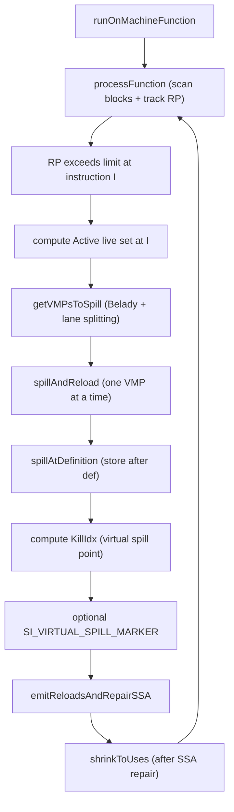
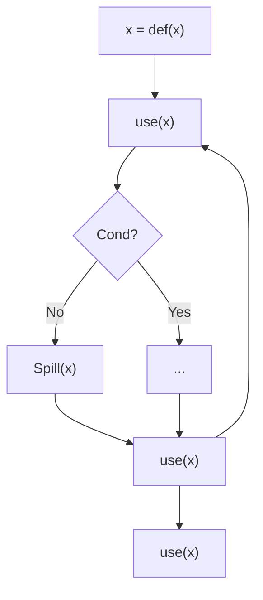
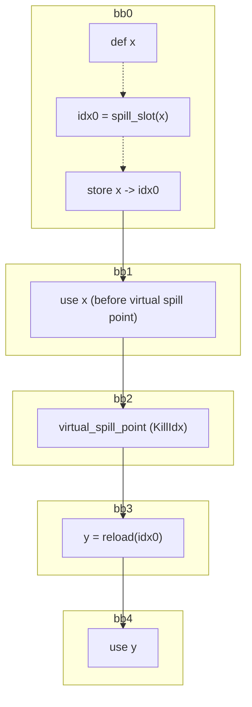
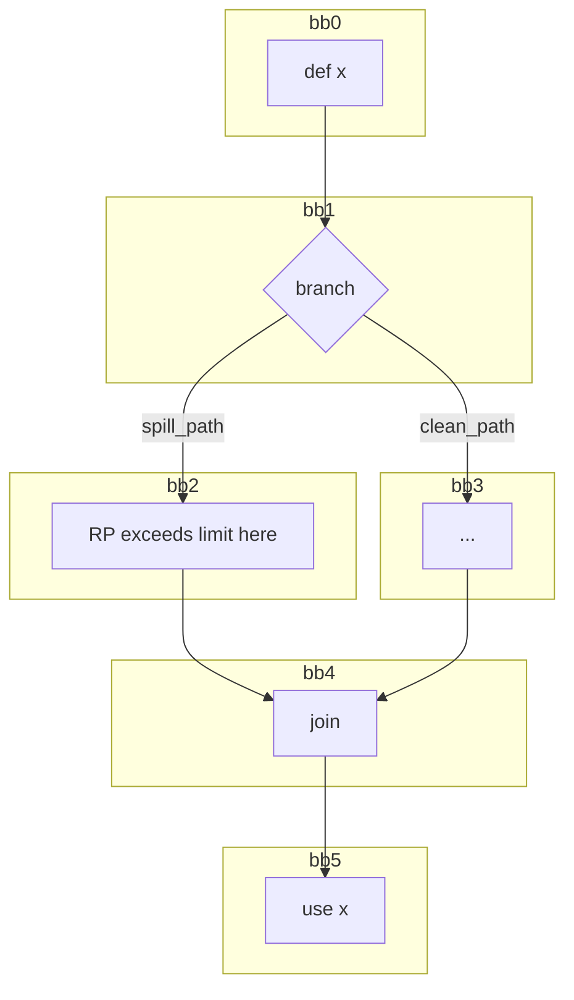
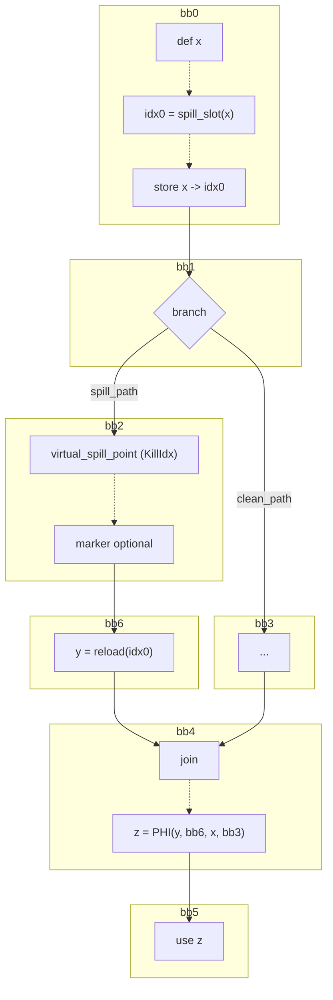

# SSA Register Spiller (AMDGPU) — Design (Current)

This document describes the **current** SSA-aware register spilling pass for AMDGPU, as implemented in LLVM Machine IR.

## Source Mapping
- **Component**: SSA Register Spiller
- **LLVM Target**: AMDGPU
- **File (symbolic)**: `llvm/lib/Target/AMDGPU/AMDGPUSSARegisterSpiller.cpp`
- **GitHub (canonical)**: `https://github.com/alex-t/llvm-project/blob/early-ssa-spiller/llvm/lib/Target/AMDGPU/AMDGPUSSARegisterSpiller.cpp`

### Related components
- **Component**: MachineLaneSSAUpdater (SSA repair + IDF reachability)
  - **File (symbolic)**: `llvm/lib/CodeGen/MachineLaneSSAUpdater.cpp`
  - **Upstream PR**: `https://github.com/llvm/llvm-project/pull/163421`
- **Component**: AMDGPU Next Use Analysis (next-use distances + lane/subreg ordering)
  - **File (symbolic)**: `llvm/lib/Target/AMDGPU/AMDGPUNextUseAnalysis.h`
  - **Upstream PR**: `https://github.com/llvm/llvm-project/pull/156079`

## Overview
The SSA spiller is a MachineFunction pass that:
- Tracks register pressure (RP) while scanning instructions.
- When RP exceeds a limit, selects one or more **spill candidates** using a Belady-style next-use heuristic.
- Stores spilled values **at definition** to avoid EXEC drift issues.
- Computes a **virtual spill point** (where the value is considered “logically dead” for RP relief).
- Inserts reloads and repairs SSA form using `MachineLaneSSAUpdater`.
- Shrinks live intervals after repairs to reflect the new SSA use graph.

## Terminology
- **VMP (VRegMaskPair)**: `(VReg, LaneMask)` pair representing “a virtual register, possibly partial lanes”.
- **Physical store location**: the place where a stack store is emitted (current design: right after definition).
- **Virtual spill point**: the location where RP relief is intended (computed as a `KillIdx`).
- **Dominated use**: a use that is on all paths after the virtual spill point.
- **Reachable (non-dominated) use**: a use that may be reached from the spill path, but not dominated by the spill point; requires SSA merging logic (PHIs).

## High-level workflow

### Key orchestration points
- `AMDGPUSSARegisterSpiller::spillAndReload`  
  - **File (symbolic)**: `llvm/lib/Target/AMDGPU/AMDGPUSSARegisterSpiller.cpp`  
  - **GitHub**: `https://github.com/alex-t/llvm-project/blob/early-ssa-spiller/llvm/lib/Target/AMDGPU/AMDGPUSSARegisterSpiller.cpp#L615-L717`
- `AMDGPUSSARegisterSpiller::emitReloadsAndRepairSSA`  
  - **File (symbolic)**: `llvm/lib/Target/AMDGPU/AMDGPUSSARegisterSpiller.cpp`  
  - **GitHub**: `https://github.com/alex-t/llvm-project/blob/early-ssa-spiller/llvm/lib/Target/AMDGPU/AMDGPUSSARegisterSpiller.cpp#L719-L929`
- `AMDGPUSSARegisterSpiller::spillAtDefinition`  
  - **File (symbolic)**: `llvm/lib/Target/AMDGPU/AMDGPUSSARegisterSpiller.cpp`  
  - **GitHub**: `https://github.com/alex-t/llvm-project/blob/early-ssa-spiller/llvm/lib/Target/AMDGPU/AMDGPUSSARegisterSpiller.cpp#L935-L1016`

## Spill selection (Belady + lane splitting)
When a candidate register is larger than the remaining “spill budget”, the spiller asks NextUseAnalysis for a subreg/lane ordering:
- API usage: `NU->getSortedSubregUses(...)` in `AMDGPUSSARegisterSpiller::getVMPsToSpill`
- Intent: choose the **furthest-used subregister lanes first**, so we spill only as many 32-bit units as needed.

This is the mechanism behind the “large register but only need 32-bit” artificial pattern used by `spill-vreg-many-lanes.mir`.

## Virtual spill point and SI_VIRTUAL_SPILL_MARKER

### What “virtual spill point” means
The spiller separates:
- **Where we store**: after definition (`spillAtDefinition`).
- **Where RP relief is intended**: the computed `KillIdx` for the high-pressure point.

### Marker pseudo-instruction (for tests)
- Option: `--amdgpu-ssa-spill-markers=1`
- Pseudo MI: `SI_VIRTUAL_SPILL_MARKER <vreg_index>, <lane_mask>`

Insertion rule (simplified): if the marker would be placed **immediately adjacent** to the actual store for the same `(VReg,LaneMask)`, insertion is omitted.

## Dominated vs reachable uses

### Classification (spiller-side)
In `AMDGPUSSARegisterSpiller::emitReloadsAndRepairSSA`, for each non-PHI use of the spilled VReg and overlapping lane mask:
- **Dominated** if `DT->dominates(KillMI, UseMI)`
- Else **Reachable** if `SSAUpdater->isUseReachableFromDef(KillMI, UseMI, OrigVReg, DefMask)`
- Else unreachable (ignored)

## Reach/IDF definition (verbatim + code-equivalent)

### (A) Verbatim (as provided)
Reach(Spill(x) = $\forall use(x)$ such that $Parent(use(x)) \in IDF(Parent(Spill(x)))) \land \forall (use(x)$ such that $\exists B\in IDF(Spill(x))$ such that $B\in Dom(Parent(use(x))$

Your diagram (mermaid-safe formatting):

### (B) Code-equivalent definition (matches MachineLaneSSAUpdater)
`MachineLaneSSAUpdater::isUseReachableFromDef(DefMI, UseMI, OrigVReg, DefMask)` does:
1. If `DefMI` dominates the use, returns true immediately.
2. Otherwise, compute a **pruned IDF** for `(OrigVReg, DefMask, DefBlock)` (DefBlock = `DefMI->Parent`).
3. Define `PredBlock`:
   - if `UseMI` is a PHI use, `PredBlock` is the PHI predecessor block for that operand
   - else `PredBlock` is `UseMI->Parent`
4. Return reachable iff there exists `IDFBlock` such that:
   - `PredBlock == IDFBlock`, or
   - `IDFBlock` dominates `PredBlock`

Source:
- **File (symbolic)**: `llvm/lib/CodeGen/MachineLaneSSAUpdater.cpp`, function `MachineLaneSSAUpdater::isUseReachableFromDef(MachineInstr*, ...)`
- **Upstream PR**: `https://github.com/llvm/llvm-project/pull/163421`

## SSA repair: what gets rewritten and where PHIs come from
The spiller emits reload instructions and then calls:
- `MachineLaneSSAUpdater::repairSSAForNewDef(...)`

That updater:
- Creates lane-aware PHIs in IDF blocks for non-dominated joins.
- Rewrites dominated uses to the new SSA value.
- Keeps lane masks correct via operand/subreg masks.

## Worked “patterns” (concept-level)

### Dominated linear case (single path)

### Reachable (non-dominated) case (join)

**Before spill**

**After spill**

## Mapping to tests
See `SSA_SPILLER_TEST_PATTERNS.md` for per-test diagrams and marker notes.

## Appendix A: historical notes (brief)
- Older materials in `Misc/` may illustrate earlier variants of SSA spilling concepts; reuse is encouraged if the diagram is updated to match current workflow.

