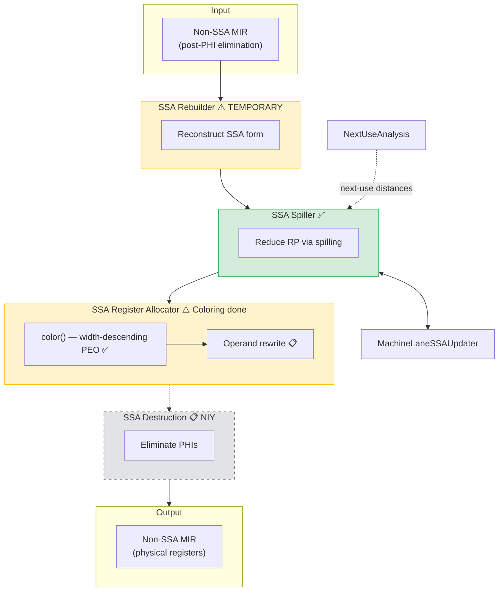

# Current Pipeline

**SSA-based register allocation pipeline (work in progress)**

## Legend

| Symbol | Meaning |
|--------|---------|
| ✅ | Implemented |
| 📋 NIY | Not Implemented Yet |
| ⚠️ TEMPORARY | Will be removed |
| ─── | Data flow |
| - - - | Planned (not connected yet) |

## MIR Format at Each Stage

| Stage | Input | Output |
|-------|-------|--------|
| SSA Rebuilder | Non-SSA (multiple defs/VReg) | SSA (single def/VReg, PHIs at merge) |
| SSA Spiller | SSA, high RP | SSA, RP within limits |
| Register Allocator | SSA, virtual regs | SSA, virtual regs + ColorMap (physreg assignment) |
| SSA Destruction | SSA, physical regs | Non-SSA, no PHIs |

## Components

- [[../02-Components/SSA_Rebuilder|SSA Rebuilder]] ⚠️
- [[../02-Components/SSA_Spiller|SSA Spiller]]
- [[../02-Components/Next_Use_Analysis|Next Use Analysis]]
- [[../02-Components/MachineLaneSSAUpdater|MachineLaneSSAUpdater]]
- [[../02-Components/SSA_Register_Allocator_Impl|SSA Register Allocator]] 📋
- [[../02-Components/SSA_Destruction|SSA Destruction]] 📋

