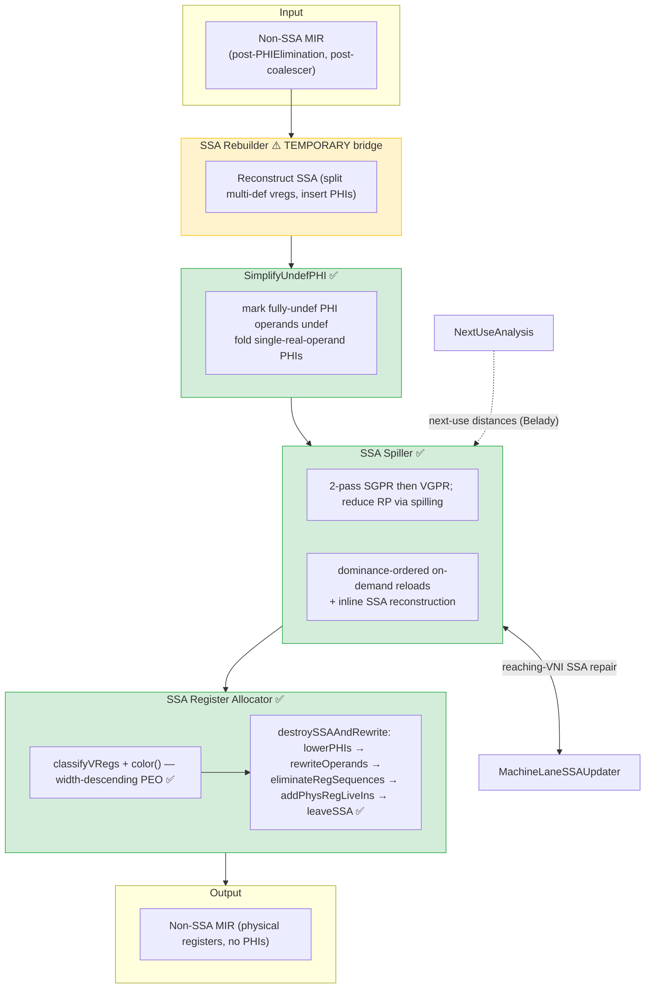

# Current Pipeline

**SSA-based register allocation pipeline** — enabled by the hidden experimental
flag `-amdgpu-ssa-regalloc` (default **off**), legacy pass manager only.
Wired in `AMDGPUTargetMachine.cpp::addRegAssignAndRewriteOptimized`.

## Legend

| Symbol | Meaning |
|--------|---------|
| ✅ | Implemented |
| ⚠️ TEMPORARY | Bridge that will be removed once the SSA RA runs on genuine SSA input |
| ─── | Data / control flow |
| - - - | Analysis dependency |

## Pass sequence (exact, `-amdgpu-ssa-regalloc`)

1. **SSA Rebuilder** (`createAMDGPURebuildSSALegacyPass`) — temporary bridge: converts
   post-PHIElimination MIR back to SSA so the SSA RA can run. Uses `MachineLaneSSAUpdater`.
2. **SimplifyUndefPHI** (`createAMDGPUSimplifyUndefPHIPass`) — undef-aware PHI simplification
   (mark fully-undef diamond-merge operands `undef`; fold "one real operand, rest undef" PHIs).
   Standalone so it survives removal of the RebuildSSA bridge; must remain the last pass before the spiller.
3. **SSA Spiller** (`createAMDGPUSSARegisterSpillerPass`) — reduces register pressure to the file budget.
4. **SSA Register Allocator** (`createAMDGPUSSARegisterAllocatorPass`) — coloring **and** SSA destruction +
   operand rewrite, all in one pass.

> There is **exactly one** RebuildSSA pass. The former second RebuildSSA (after the spiller) was
> **removed**: the spiller repairs SSA inline (reaching-VNI reconstruction) and returns SSA MIR.

## MIR Format at Each Stage

| Stage | Input | Output |
|-------|-------|--------|
| SSA Rebuilder | Non-SSA (multiple defs/VReg) | SSA (single def/VReg, PHIs at merges) |
| SimplifyUndefPHI | SSA with undef-heavy PHIs | SSA, simplified PHIs |
| SSA Spiller | SSA, high RP | SSA, RP within file budget (inline-repaired reloads) |
| Register Allocator | SSA, virtual regs | Non-SSA, physical registers, no PHIs |

## Known gaps / caveats

- **SI control-flow pseudos:** if a function still contains `SI_IF/SI_ELSE/SI_IF_BREAK/SI_LOOP/SI_END_CF`,
  `destroySSAAndRewrite` is **skipped** (coloring runs, but PHIs/vregs are left in place). Tracked as an
  open item.
- **New pass manager:** `AMDGPUCodeGenPassBuilder` has no `-amdgpu-ssa-regalloc` branch yet — SSA RA is
  legacy-PM only.
- **Full PHI coalescer:** not implemented. Today: SimplifyUndefPHI + phi-affinity coloring hints +
  PHI-copy metrics (instrumentation). See [[../04-Design/PHI_Coalescer|PHI Coalescer]].
- **`SI_VIRTUAL_SPILL_MARKER`:** test-only pseudo emitted under `-amdgpu-ssa-spill-markers`
  (default off); no logic consumer. Slated to be replaced by `SIMachineFunctionInfo` metadata
  (see backlog).

## Components

- [[../02-Components/SSA_Rebuilder|SSA Rebuilder]] ⚠️ temporary
- [[../02-Components/SSA_Spiller|SSA Spiller]] ✅
- [[../02-Components/Next_Use_Analysis|Next Use Analysis]] ✅
- [[../02-Components/MachineLaneSSAUpdater|MachineLaneSSAUpdater]] ✅
- [[../02-Components/SSA_Register_Allocator_Impl|SSA Register Allocator]] ✅ (coloring + destruction + rewrite)
- [[../02-Components/SSA_Destruction|SSA Destruction]] ✅ (inside the allocator)
