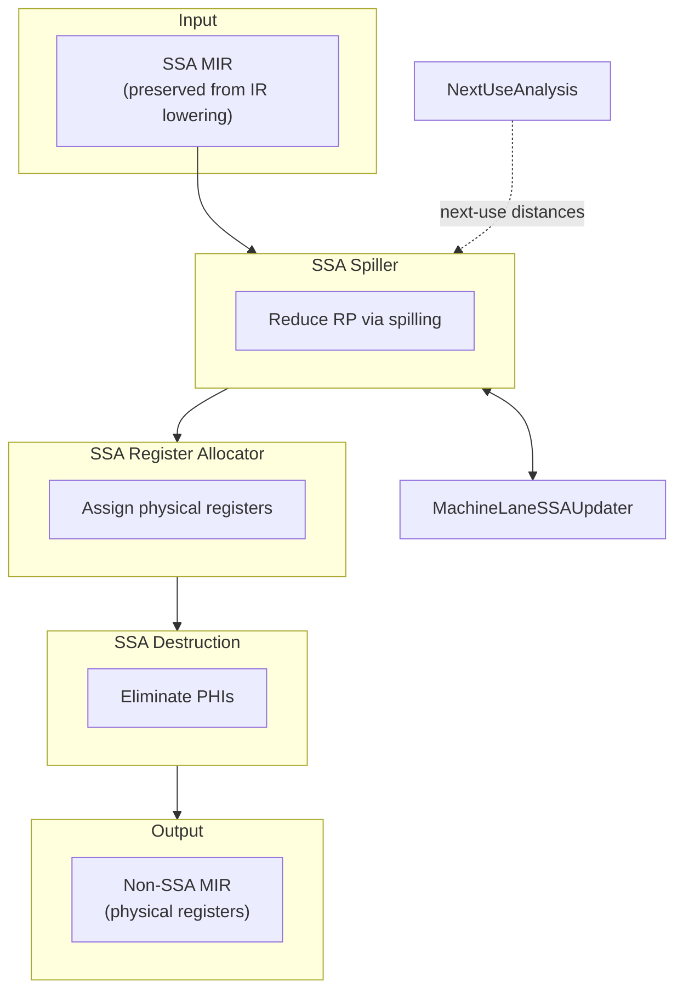

# Future Pipeline

**Target SSA-based register allocation (all upstream passes SSA-clean)**

## Key Difference from Current

**No SSA Rebuilder** — SSA form is preserved naturally from IR lowering through all MIR passes until register allocation.

## Already Done (no longer "future")

The following pieces are implemented today (behind the hidden
`-amdgpu-ssa-regalloc` option, legacy pass manager only):

- **SSA Spiller** with **inline SSA reconstruction** — reloads redefine the
  original vreg and SSA is repaired in place via
  `MachineLaneSSAUpdater::repairSSAForNewDef` (reaching-VNI oracle), so the
  spiller returns SSA MIR and no second SSA-rebuild pass is needed after it.
- **SSA Register Allocator** — width-descending PEO coloring (MDT pre-order,
  phi-affinity hints).
- **SSA Destruction + operand rewrite** — `destroySSAAndRewrite` runs
  `lowerPHIs` → `rewriteOperands` → `eliminateRegSequences` →
  `addPhysRegLiveIns` → `leaveSSA`.
- **SimplifyUndefPHI** — undef-flagging of fully-undef PHI operands plus
  single-real-operand PHI folding, running just before the spiller.

## Still Future

- **Full PHI coalescer** — only affinity hints + a PHI-copy metric +
  `SimplifyUndefPHI` exist today; a real coalescer is not implemented.
- **Removing the temporary RebuildSSA bridge** — currently one RebuildSSA pass
  runs first to re-establish SSA; it goes away once upstream passes stay
  SSA-clean.
- **SI control-flow-pseudo SSA destruction** — SSA destruction is skipped for
  functions still containing `SI_IF`/`SI_ELSE`/`SI_IF_BREAK`/`SI_LOOP`/
  `SI_END_CF`.
- **New pass manager support** — the pipeline is wired only into the legacy PM.
- **Replacing `SI_VIRTUAL_SPILL_MARKER`** (a test-only pseudo) with proper
  `SIMachineFunctionInfo` metadata.

## Prerequisites

- All MIR passes before RA must be SSA-clean
- PHI Elimination must move after register allocation
- SSA form survives through instruction selection

## Components

- [SSA Spiller](../02-Components/SSA_Spiller.md)
- [Next Use Analysis](../02-Components/Next_Use_Analysis.md)
- [MachineLaneSSAUpdater](../04-Design/MachineLaneSSAUpdater.md)
- [SSA Register Allocator](../02-Components/SSA_Register_Allocator_Impl.md)
- [SSA Destruction](../02-Components/SSA_Destruction.md)

