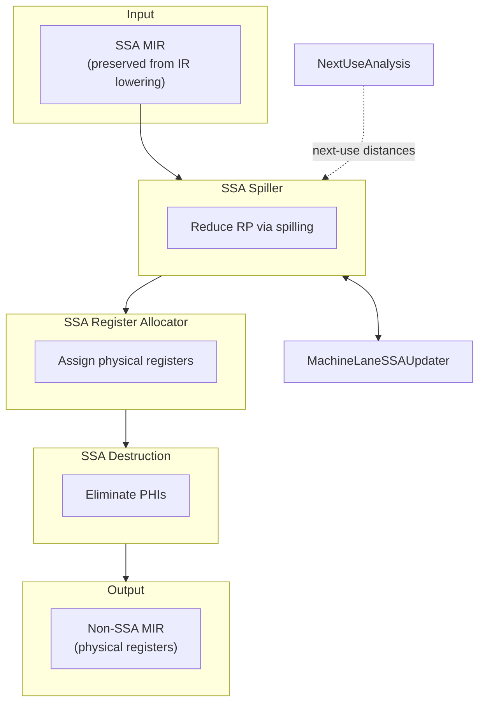

# Future Pipeline

**Target SSA-based register allocation (all upstream passes SSA-clean)**

## Key Difference from Current

**No SSA Rebuilder** — SSA form is preserved naturally from IR lowering through all MIR passes until register allocation.

## Prerequisites

- All MIR passes before RA must be SSA-clean
- PHI Elimination must move after register allocation
- SSA form survives through instruction selection

## Components

- [[../02-Components/SSA_Spiller|SSA Spiller]]
- [[../02-Components/Next_Use_Analysis|Next Use Analysis]]
- [[../02-Components/MachineLaneSSAUpdater|MachineLaneSSAUpdater]]
- [[../02-Components/SSA_Register_Allocator_Impl|SSA Register Allocator]]
- [[../02-Components/SSA_Destruction|SSA Destruction]]

