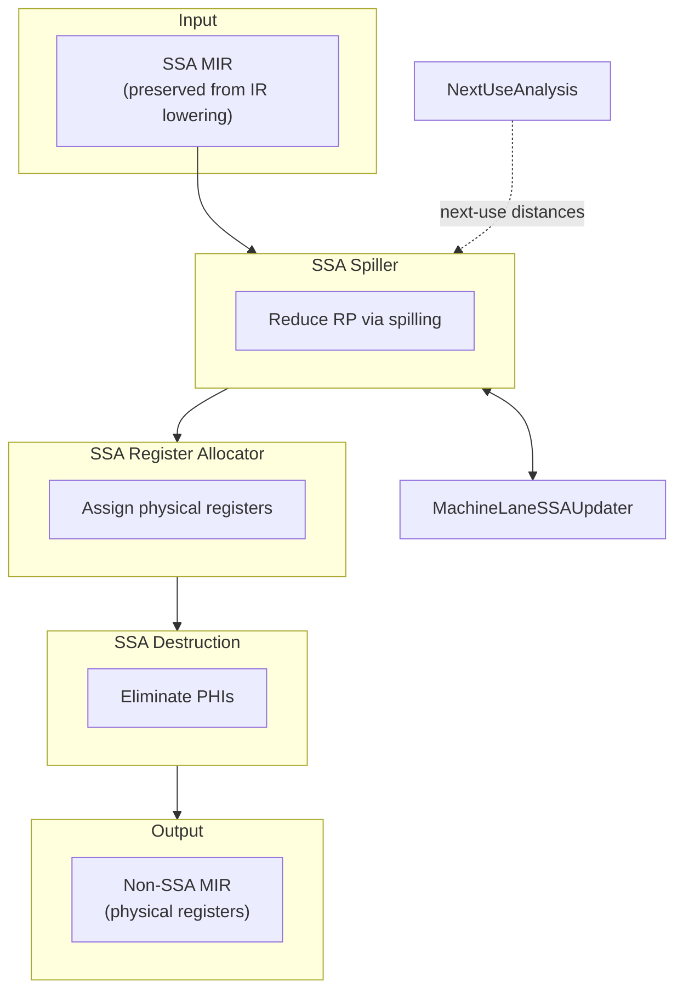

# Future Pipeline

**Target SSA-based register allocation (all upstream passes SSA-clean)**

## Key Difference from Current

**No SSA Rebuilder** — SSA form is preserved naturally from IR lowering through all MIR passes until register allocation.

## Prerequisites

- All MIR passes before RA must be SSA-clean
- PHI Elimination must move after register allocation
- SSA form survives through instruction selection

## Components

- [SSA Spiller](../02-Components/SSA_Spiller.md)
- [Next Use Analysis](../02-Components/Next_Use_Analysis.md)
- [MachineLaneSSAUpdater](../04-Design/MachineLaneSSAUpdater.md)
- [SSA Register Allocator](../02-Components/SSA_Register_Allocator_Impl.md)
- [SSA Destruction](../02-Components/SSA_Destruction.md)

