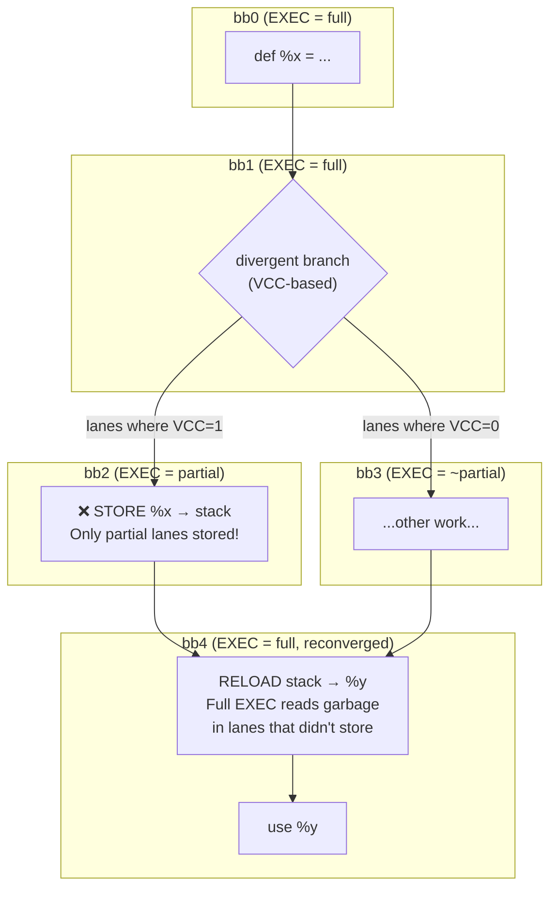
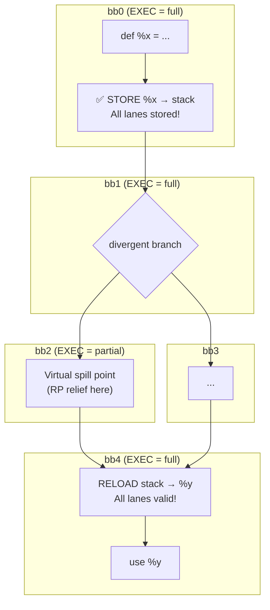

# EXEC Drift

**The problem that arises when storing/reloading values under different EXEC masks in divergent control flow**

## The Problem

On AMDGPU, the **EXEC mask** determines which lanes (threads) are active. In divergent control flow:

1. A value is **defined** when all lanes are active (EXEC = full)
2. Control flow diverges (some lanes take branch A, others take branch B)
3. If we **store** at the high-pressure point (inside a branch), only a subset of lanes execute the store
4. Later, after control flow **reconverges**, EXEC is full again
5. If we **reload** with full EXEC, we get **garbage** in lanes that didn't store

## Illustration

## Root Cause

The mismatch occurs because:
- **EXEC at store ≠ EXEC at reload**
- Lanes that didn't execute the store will read uninitialized/stale stack data

## Solution: Store at Definition

The SSA Spiller solves this by **storing immediately after definition**, when EXEC is guaranteed to be full:

## Key Insight

Separate **when to store** (at definition, for correctness) from **where RP relief is intended** (virtual spill point, for register pressure).

## Related

- [[../04-Design/Decisions#store-at-definition|Store at Definition Decision]]
- [[../02-Components/SSA_Spiller|SSA Spiller Component]]

