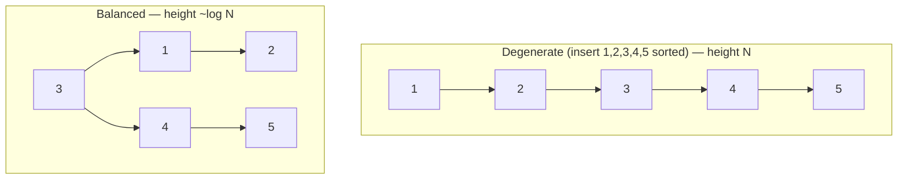
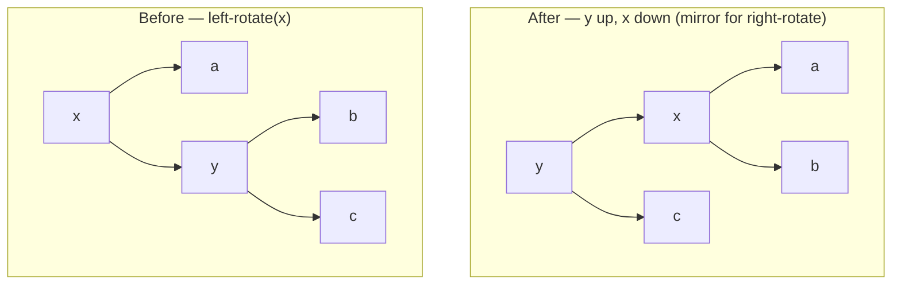
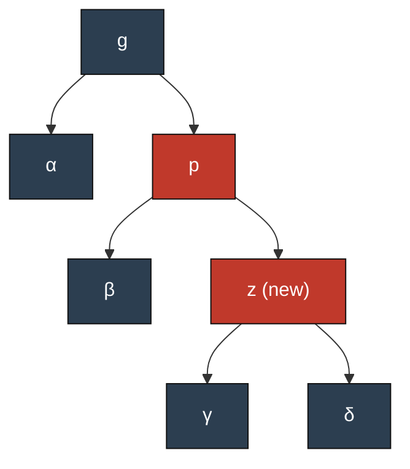
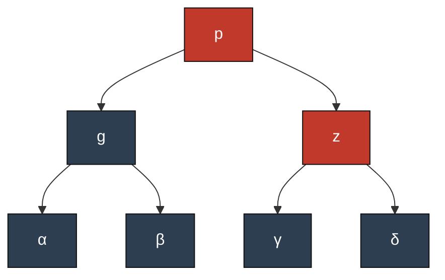
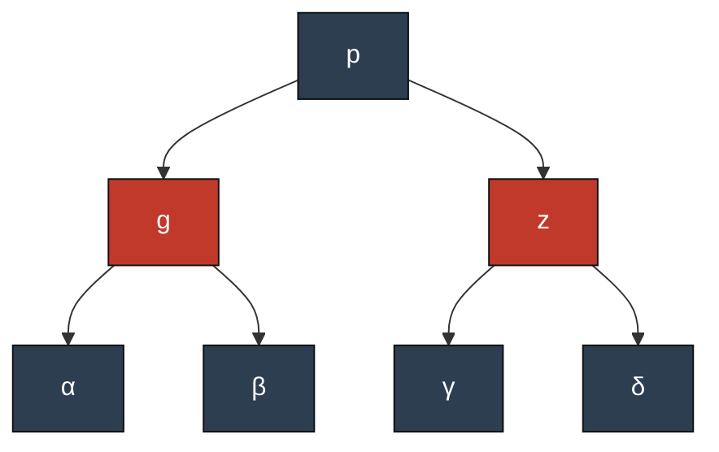
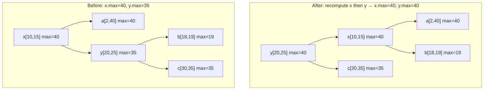
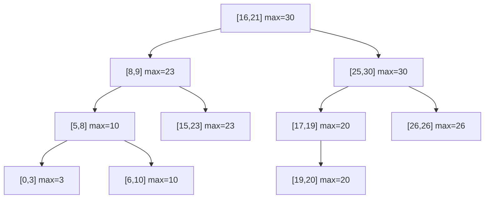
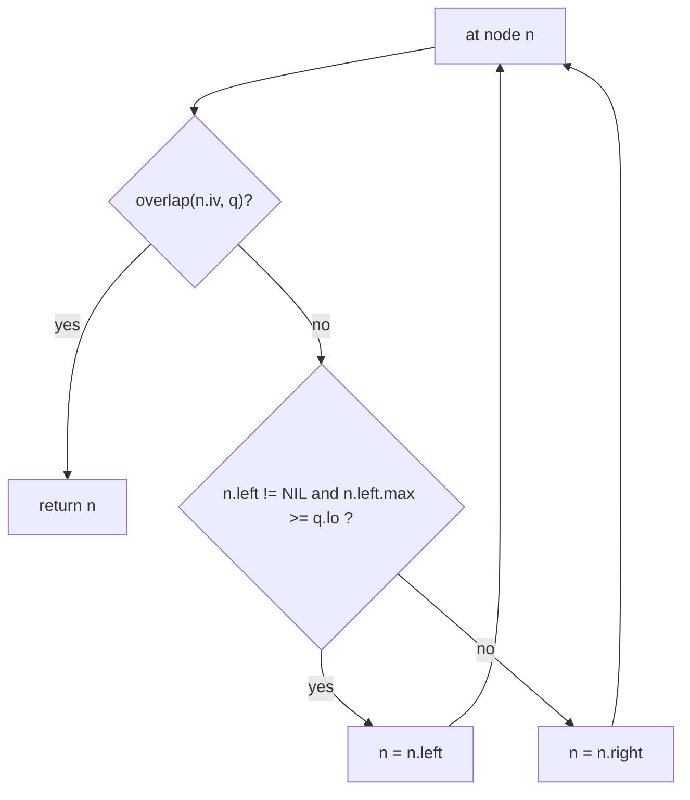
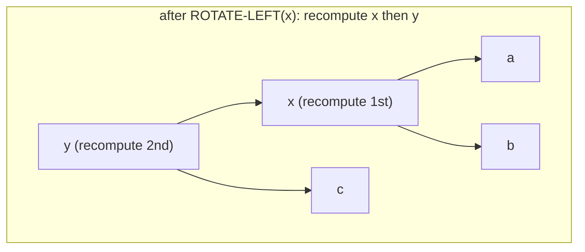

# Interval Trees — A Refresher and Working Guide

_Learning material. Assumes you once knew binary search trees and red–black (RB) trees
(maybe ~25 years ago) and want a clean refresh plus the interval-specific parts. The goal is
to make `search`, `insert`, and `delete` obvious, and to set up the data structure we will use
to answer "which already-colored wider registers overlap this live range?" in `O(log N + k)`
instead of an `O(N)` scan._

---

## 1. The problem an interval tree solves

We store a dynamic set of closed intervals `[lo, hi]` and want to answer, quickly:

- **Stabbing / overlap query:** given a query interval `q = [qlo, qhi]`, find an interval in the
  set that **overlaps** `q` (or report *all* of them).
- While the set keeps changing: **insert** and **delete** intervals.

A plain balanced BST keyed on `lo` answers "find an interval with a given `lo`" in `O(log N)`,
but **not** overlap — two intervals can overlap while having very different `lo` values. The
trick is to **augment** the tree with one extra number per node so overlap queries become
`O(log N)`.

### Overlap predicate
Two closed intervals `a` and `b` overlap iff:

```
a.lo <= b.hi  AND  b.lo <= a.hi
```

(For half-open `[lo, hi)` intervals — common in compilers/`SlotIndex` ranges — use strict `<`
on the touching ends: `a.lo < b.hi AND b.lo < a.hi`. Pick one convention and keep it.)

---

## 2. Refresher: balanced BST / red–black tree (the substrate)

An interval tree is just a **balanced BST plus one augmented field**. The balancing scheme is
usually a red–black tree; you could equally use an AVL tree or a treap — the interval logic is
identical.

### Why balance at all? The problem with a plain BST
A binary search tree answers `search`/`insert`/`delete` in time proportional to its **height**. In
the *best* case the tree is bushy and the height is `~log₂ N`. But a plain BST has no mechanism to
stay bushy: if you insert keys in sorted (or reverse-sorted) order, every new node hangs off the
same side and the tree degenerates into a **linked list** of height `N`. Then every operation is
`O(N)` — you have paid for a tree and gotten a list.



The whole point of a *balanced* tree is exactly your intuition: **prevent asymmetric growth so the
search path is roughly the same length down every branch**, keeping height `O(log N)` no matter what
order keys arrive in. The open question is *how* to detect and correct lopsidedness cheaply.

### The red–black idea: enforce balance with one color bit
AVL trees do this by storing each node's height (or balance factor) and rebalancing whenever the two
sides differ by more than 1 — strict balance, but more restructuring work per update. **Red–black
trees** take a looser, cheaper approach invented for exactly this trade-off: store a single **color
bit** (red or black) per node and enforce a handful of *coloring rules*. Those rules don't make the
tree perfectly balanced, but they guarantee the longest root→leaf path is **at most twice** the
shortest — which is enough for `O(log N)` height, while needing fewer rotations per update than AVL.
That makes RB trees the usual choice when inserts and deletes are frequent (e.g. `std::map`, the
Linux kernel scheduler, and LLVM's own `IntervalTree`).

Think of the colors as a **balance budget**: a path is allowed to be "stretched" by red nodes, but
only so much before the rules force a rotation to spend the slack back.

### The five invariants
A red–black tree is a BST (keyed, for us, on the interval's low endpoint `lo`) in which every node
is colored red or black such that:

1. **Node color:** every node is either red or black.
2. **Root is black.**
3. **Leaves are black:** every `NIL` leaf is treated as black.
4. **No red–red:** a red node's children are both black (so two reds can't be adjacent on a path).
5. **Equal black-height:** every path from a given node down to any `NIL` leaf passes through the
   **same number of black nodes**. Call that count the node's *black-height* `bh`.

### Why those rules force `O(log N)` height
This is the crux — it's worth seeing *why* the rules give balance:

- Invariant **5** says every root→leaf path has the **same number of black nodes**, `bh(root)`.
  So all paths agree on their "black skeleton" length.
- Invariant **4** says reds can't be consecutive, so on any path **at most half** the nodes are red.
  Hence the *total* length of a path is at most `2·bh` — black nodes plus at most an equal number of
  reds squeezed between them.
- Therefore the **longest** path (alternating black/red) is at most twice the **shortest** path
  (all black). The tree can't be more than 2× lopsided — that's the formal version of "keep the
  search path about the same length on both sides."

A short counting argument (CLRS) turns this into: a subtree rooted at a node with black-height `bh`
has at least `2^bh − 1` internal nodes, which gives **height `h ≤ 2·log₂(N+1)` = `O(log N)`**. Every
operation that walks one root-to-leaf path is thus `O(log N)`.

### How colors stay legal across operations
Insert and delete each start as the ordinary BST operation, then repair whichever invariant they may
have broken using only two `O(1)`-local tools — **recolor** and **rotate**:

- **Insert** colors the new node **red**. Why red? A red node doesn't change any path's black count,
  so invariant 5 (the expensive one) is preserved for free. The only rule a red insert can break is
  4 (red–red), if the new node's parent is also red. The fix-up handles this by looking at the
  **uncle's color**:
  - *Uncle red* → just **recolor** (push parent & uncle black, grandparent red) and continue
    checking upward. No rotation, no shape change — purely a color adjustment.
  - *Uncle black* → **rotate** (1 or 2 rotations to straighten a "triangle" into a "line") then
    **recolor**, exactly the 3-stage example shown below. This terminates immediately.
- **Delete** is the mirror trouble: removing a **black** node shortens one path's black count,
  breaking invariant 5. The deficit is modeled as a temporary "double-black" that is pushed up the
  tree, again resolved by case analysis on the **sibling's color** using recolors and rotations
  until the black-heights re-balance.

So the colors are bookkeeping that tells the fix-up *which* local rotation/recolor restores balance,
and the invariants guarantee that only `O(log N)` such local fixes are ever needed per operation.

### Rotations — the structural primitive
Recoloring alone can't fix everything (it never changes shape); when a path is genuinely too long,
we **rotate**. A rotation is a local, `O(1)` pointer rearrangement that lifts one child above its
parent while **preserving the BST in-order ordering** — it only changes the *shape*, never the set of
keys or their sorted order. This is the single RB mechanic that matters for the interval tree,
because rotations move subtrees around and we must keep the augmented field correct (Section 6).


`y` becomes the parent of `x`; `x` takes `y`'s left child `b` as its new right child. Subtree `a`
stays under `x`, `c` stays under `y`. In-order order is unchanged (`a x b y c` both before and
after); only the shape changes — and exactly the two touched nodes `x`, `y` need their augmented
field recomputed.

### Rotation in context: an RB insert fix-up, in 3 stages
A rotation rarely happens alone — it is one half of an RB repair, the other half being a
**recolor**. Here is the canonical "line" case (new node on the *outside*): we just BST-inserted a
red node `z`, its parent `p` is red, and `z`'s uncle is black. That is a red–red violation that one
left rotation **plus** one recolor fixes. (`α`, `β`, `γ`, `δ` are black subtrees, possibly `NIL`.)

**Stage 1 — initial tree (after plain BST insert): red–red violation `p–z`.**



`p` (red) and `z` (red) are adjacent — illegal. Uncle `α` is black, and `z` is the *outside*
(right-right) grandchild, so this is the single-rotation case.

**Stage 2 — rotation only: `left-rotate(g)`. Pointers move, colors are untouched.**



`p` is now the subtree root; `g` dropped to be `p`'s left child and adopted `β`. Note the violation
is **not** fixed yet — `p` and `z` are still both red. Rotation alone only reshaped the tree.

**Stage 3 — recolor: `p → black`, `g → red`. Violation resolved.**



Now the new subtree root `p` is black with two red children `g`, `z`, each having black children —
no red–red edge remains. Because `p` is black (the same color `g` had before), every root→leaf path
keeps its original black count, so the **black-height invariant is preserved** and the fix-up stops.

The takeaway: **rotation (Stage 2) restructures; recolor (Stage 3) restores the color invariants.**
For the interval tree, only Stage 2 concerns us for augmentation — that is where `g` and `p` get
new children and so must have `max` recomputed (child `g` first, then parent `p`). Recoloring in
Stage 3 never touches subtree membership, so it never changes any `max`.

### Concrete example (watch `max` move)
Intervals: `a=[2,40]`, `x=[10,15]`, `b=[18,19]`, `y=[20,25]`, `c=[30,35]`
(leaf maxes: `a.max=40`, `b.max=19`, `c.max=35`).



- **Before:** `y.max = max(25, b=19, c=35) = 35`; `x.max = max(15, a=40, y=35) = 40`.
- **After:** recompute the new lower node first — `x.max = max(15, a=40, b=19) = 40`; then the new
  upper node — `y.max = max(25, x=40, c=35) = 40`.

Notice `y.max` changed (35 → 40) because `x`'s subtree — which now carries the big `a=[2,40]` — sits
under `y`. Recomputing **child (`x`) before parent (`y`)** is what makes `y` pick up the correct
`40`. All other nodes (`a`, `b`, `c`) keep their subtrees, so their `max` is untouched — that is why
a rotation re-augments in `O(1)`.

---

## 3. The augmentation: a `max` field

Each node `n` stores, besides its interval `n.iv = [lo, hi]`:

```
n.max = maximum  hi  endpoint over all intervals in the subtree rooted at n
```

Maintained bottom-up:

```
n.max = max(n.iv.hi, n.left.max, n.right.max)   // missing child contributes -inf
```

This single number is what turns a BST into an interval tree: it lets a search **prune** an
entire subtree when that subtree cannot possibly contain an overlapping interval.

### Example tree (keyed by `lo`, annotated with `max`)



Note how `max` "bubbles up": the root's `max=30` comes from `[25,30]` deep on the right; `[8,9]`
has `max=23` because of `[15,23]` in its subtree.

---

## 4. Search — find one overlapping interval

This is the heart of the structure. Start at the root and at each node decide **which single
child to descend into**, using `max` to prune.

```
INTERVAL-SEARCH(T, q):
    n = T.root
    while n != NIL and not overlap(n.iv, q):
        if n.left != NIL and n.left.max >= q.lo:
            n = n.left          # left subtree may contain an overlap
        else:
            n = n.right         # otherwise it cannot — go right
    return n                    # NIL if none
```

**Why the left/right rule is correct.** At node `n`, if `n.left.max >= q.lo`, the left subtree
contains *some* interval whose `hi >= q.lo`; combined with the BST order on `lo`, the standard
argument shows: if an overlap exists at all, going left will find one. If `n.left.max < q.lo`,
*every* interval in the left subtree ends before `q` starts, so no overlap can be there — go
right. Each step descends one level ⇒ **`O(log N)`**.



### Report **all** overlaps
The single-overlap walk doesn't enumerate everything. To collect all `k` matches, recurse but
prune with `max`:

```
ALL-OVERLAPS(n, q, out):
    if n == NIL or n.max < q.lo:        # whole subtree ends before q starts → prune
        return
    ALL-OVERLAPS(n.left, q, out)
    if overlap(n.iv, q):
        out.append(n.iv)
    if n.iv.lo <= q.hi:                 # right subtree may still start within q
        ALL-OVERLAPS(n.right, q, out)
```

Cost `O(k log N)` worst case (often much less thanks to the two prunes), where `k` = number of
reported intervals. This is the variant the register allocator wants ("give me every wider
already-colored range overlapping the candidate's live range").

---

## 5. Insert

Insert is **ordinary BST/RB insert keyed on `lo`**, with two additions: update `max` on the way
down (or up), and keep `max` correct through the RB fix-up rotations.

```
INTERVAL-INSERT(T, iv):
    z = new node(iv); z.max = iv.hi
    # 1. BST descent by lo; on the way down, every ancestor's max can only grow:
    y = NIL; x = T.root
    while x != NIL:
        x.max = max(x.max, z.max)       # ancestor will contain z → widen its max
        y = x
        x = (iv.lo < x.iv.lo) ? x.left : x.right
    link z under y (left/right by lo)
    # 2. RB rebalance (recolor + rotate). Each rotation recomputes max for the two
    #    nodes it touches (Section 6).
    RB-INSERT-FIXUP(T, z)               # augmented so rotations call UPDATE-MAX
```

Key points:
- Updating `max = max(max, z.max)` **down the search path** is valid because `z` becomes a
  descendant of every node on that path, so each can only gain a larger `hi`.
- The RB fix-up only does **rotations and recoloring**; recoloring never changes `max`, and each
  rotation fixes `max` locally (Section 6). So the global `max` invariant is preserved.

**Total `O(log N)`** (one descent + `O(1)` rotations, each `O(1)` to re-augment).

---

## 6. Why rotations are cheap to re-augment (the one subtle part)

A rotation changes only the **parent/child relationship of two nodes** (`x` and `y` above); all
other subtrees keep their roots, hence keep their correct `max`. So we recompute `max` for just
those two nodes, **child first, then parent**:

```
UPDATE-MAX(n):
    n.max = max(n.iv.hi, n.left.max, n.right.max)   # NIL child = -inf

# In a left rotation around x producing parent y:
ROTATE-LEFT(T, x):
    ...standard pointer surgery...
    UPDATE-MAX(x)        # x is now lower → recompute from its (new) children
    UPDATE-MAX(y)        # y is now the parent → uses x.max
```

Because the new lower node (`x`) is recomputed before the new upper node (`y`), `y` sees `x`'s
fresh `max`. This is the general rule for augmenting an RB tree (CLRS §14.2): if the augmented
field of a node can be computed from the node plus its children, rotations maintain it in `O(1)`,
so insert/delete stay `O(log N)`.



---

## 7. Delete

Delete is **ordinary RB delete keyed on `lo`**, plus `max` maintenance.

```
INTERVAL-DELETE(T, z):
    RB-DELETE(T, z)                 # splice / replace-by-successor as usual
    # Two maintenance duties:
    #  (a) the RB-DELETE-FIXUP rotations each re-augment via UPDATE-MAX (Section 6)
    #  (b) max along the path from the structural change up to the root may shrink
    #      (we removed a hi); recompute it walking parent pointers upward:
    walk p = parent(point-of-change) up to root: UPDATE-MAX(p)
```

The subtlety vs insert: insertion only ever **increases** ancestors' `max` (cheap to do on the
way down), but deletion can **decrease** it (the removed interval might have been the subtree
maximum). So after the structural removal you must recompute `max` **upward** from the change
point to the root — still `O(log N)` because the path length is the height. The RB color fix-up's
rotations re-augment locally as in Section 6.

**Total `O(log N)`.**

Implementation tip: route every structural mutation (link, transplant, rotate) through a single
`UPDATE-MAX` helper and always call it **bottom-up**. Most delete bugs are a missed upward
recompute after a transplant.

---

## 8. Complexity summary

| Operation                | Time          | Notes |
|--------------------------|---------------|-------|
| Search one overlap       | `O(log N)`    | single root-to-leaf walk with `max` pruning |
| Report all `k` overlaps  | `O(k log N)`  | two-sided pruning; often far less |
| Insert                   | `O(log N)`    | BST insert + RB fix-up; `max` re-augmented on rotations |
| Delete                   | `O(log N)`    | RB delete + upward `max` recompute |
| Space                    | `O(N)`        | one `max` field per node |

Compare to the brute-force `O(N)` per query the augmentation replaces: for `Q` queries over `N`
intervals that is `O(Q·N)` vs `O(Q·log N)` (plus output) — the whole reason we are building this.

---

## 9. Practical notes for our use

- **Key choice:** key on `lo`. Duplicate `lo` values are fine — break ties by `hi` (or by an
  insertion id) so ordering is total and delete can find the exact node.
- **Interval convention:** `SlotIndex` live ranges are half-open; use the strict-`<` overlap test
  and the matching prune (`n.left.max > q.lo` etc.). Be consistent everywhere.
- **What we store:** `[lo, hi]` = a colored wider register's live range, with a payload (physreg /
  `&LiveInterval`). The "report all overlaps" query returns the wider entries whose ranges hit the
  candidate's range, replacing the `O(|ColorMap|)` scan in `pickFreePhysReg`.
- **Balancing is optional for correctness:** an unbalanced augmented BST still answers overlaps
  correctly, just not in guaranteed `O(log N)`. Start correct (even a simple balanced BST or a
  sorted structure), then confirm the height bound matters for large kernels before optimizing.

> **Implementation status (not yet wired in).** As of the current tree,
> `AMDGPUSSARegisterAllocator::pickFreePhysReg` still uses the brute-force
> `O(|ColorMap|)` linear scan over already-colored wider ranges (see the
> comments around the `ColorMap` scan in `AMDGPUSSARegisterAllocator.cpp`). The
> interval tree described here is a **planned optimization** to replace that
> scan; it has not been implemented.

---

### References
- CLRS, *Introduction to Algorithms*, ch. 13 (Red–Black Trees) and §14.3 (Interval Trees) /
  §14.2 (augmenting data structures).
- LLVM already ships `IntervalTree.h` (`llvm/ADT/IntervalTree.h`) and `IntervalMap.h` — worth
  evaluating before writing our own.
