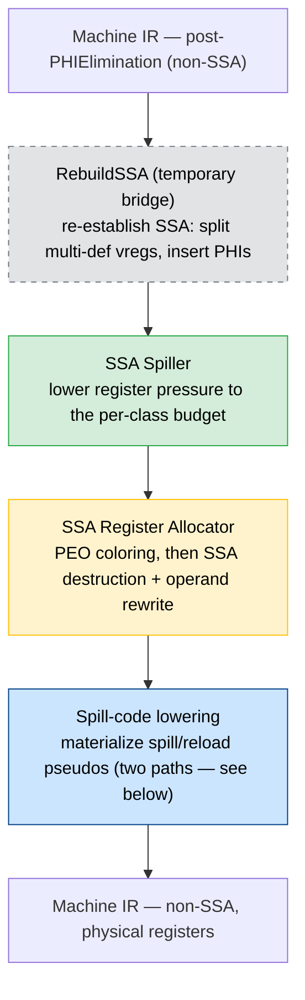
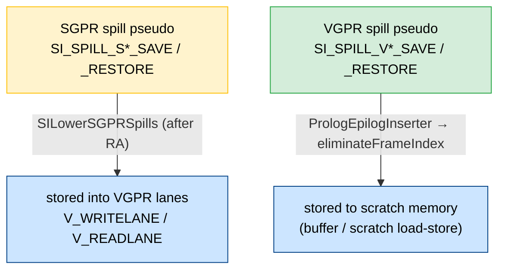

# Architecture

High-level architecture for SSA-based register allocation on AMDGPU.

> **Status (2026-07-11).** Wired behind `-amdgpu-ssa-regalloc` in
> [`GCNPassConfig::addRegAssignAndRewriteOptimized()`](https://github.com/alex-t/llvm-project/blob/ssara/llvm/lib/Target/AMDGPU/AMDGPUTargetMachine.cpp).
> Corpus health: **103 / 3060** AMDGPU LIT tests still crash under the SSA chain
> (down from ~850). See [[CRASH_TRIAGE_REPORT_2026-07-10]].

---

## Overview

The pipeline keeps the program in SSA form throughout allocation and spilling,
destroying SSA only at the final rewrite before code emission. The spiller's
reloads transiently redefine the original virtual register but are **repaired
inline** (reaching-VNI reconstruction), so the spiller returns SSA and there is
only a **single** `RebuildSSA` bridge pass.

Each box below is one pass; the details of spilling, coloring, SSA destruction,
and spill-code lowering live in the linked component documents (see the table in
[Component Design Documents](#component-design-documents)).



**Pipeline wiring** ([AMDGPUTargetMachine.cpp](https://github.com/alex-t/llvm-project/blob/ssara/llvm/lib/Target/AMDGPU/AMDGPUTargetMachine.cpp)):

```cpp
if (EnableSSARegAlloc) {                       // -amdgpu-ssa-regalloc
  addPass(createAMDGPURebuildSSALegacyPass());
  addPass(createAMDGPUSSARegisterSpillerPass());
  // Spiller repairs SSA inline (reaching-VNI reconstruction) and returns SSA,
  // so NO second RebuildSSA is needed here.
  addPass(createAMDGPUSSARegisterAllocatorPass());
  return true;
}
```

Pre-RA passes (`PHIElimination`, `TwoAddressInstruction`, `RegisterCoalescer`,
`RenameIndependentSubregs`) run unchanged before this chain — which is exactly
why `RebuildSSA` is needed to re-establish SSA.

---

## The two spill-code lowering paths

Spilling produces target pseudo-instructions during the SSA Spiller; the actual
machine code is materialized **after** register allocation, on two distinct
paths depending on the register file:



- **SGPRs → VGPR lanes.** SGPR spill pseudos stay in place until
  [`SILowerSGPRSpills`](https://github.com/alex-t/llvm-project/blob/ssara/llvm/lib/Target/AMDGPU/SILowerSGPRSpills.cpp)
  runs *after* the SSA RA, when the spilled register is physical. It rewrites
  them to `V_WRITELANE`/`V_READLANE` (each SGPR occupies one lane of a whole-wave
  VGPR). Materializing this before coloring is impossible because the lowering
  needs the physical register — so the spiller only **accounts** for the lane
  VGPRs (`countSGPRSpillVGPRs()`) and defers materialization.
- **VGPRs → scratch memory.** VGPR spill pseudos are lowered by
  `SIRegisterInfo::eliminateFrameIndex` on the standard PrologEpilogInserter
  path, to scratch buffer / flat load-stores.

---

## Register files: SGPR, VGPR, AGPR

The spiller runs **two** passes — SGPR (Pass 1) then VGPR (Pass 2); it has no
dedicated AGPR spill pass. The allocator, however, **is AGPR-aware** during
coloring and SSA destruction:

- Coloring classifies each value by the **chosen physical register's** file
  (`getPhysRegBaseClass`), so an AV (AGPR-or-VGPR) vreg is tracked correctly even
  though it is not `isVGPRClass`. High-water marks are kept per file
  (`MaxVGPRIdx`, `MaxSGPRIdx`, `MaxAGPRIdx`).
- AGPRs draw from the **vector** register budget alongside VGPRs
  (`getMaxNumVGPRs`).
- In SSA destruction, an AGPR permutation cycle cannot use `V_SWAP`/XOR (no such
  primitive for AGPRs), so it is broken with a **scratch AGPR** (plain COPYs,
  legalized to AGPR moves downstream). See
  [[SSA_RA_Coloring#SSA Destruction (PHI lowering + permutation resolution)]].

> AGPR *spilling to memory* (a spiller AGPR pass) is not implemented; AGPR
> pressure relief currently relies on the VGPR budget accounting above.

---

## Component Design Documents

### Core Components

| Component | Design Document | Status |
|-----------|-----------------|--------|
| **SSA Spiller** | [[SSA_SPILLER_DESIGN]] | Active |
| **Reload placement** | [[Reload_join_phi_coalescing]] | Active (supersedes [[Reload_optimizer]]) |
| **SSA Register Allocator** | [[SSA_RA_Coloring]] | Active |
| **MachineLaneSSAUpdater** | [[MachineLaneSSAUpdater]] | Active |
| **Per-class RP tracker** | [[GCNUpwardRPTracker_PerClassRP]] | Proposed |
| **Fragmentation-aware spiller** | [[Spiller_Redesign]] | Proposed |
| **Next Use Analysis** | [[NextUseAnalysis]] · [[Persistent_Map_for_NUA]] | Active |

### Design Decisions

- [[Decisions]] — key design decisions and their rationale.

---

## Key Design Principles

### 1. Store at Definition
Spill stores are emitted immediately after the value is defined (when the EXEC
mask is guaranteed full), not at the high-pressure point. This avoids EXEC drift
correctness issues in divergent control flow. See
[[Decisions#Store at Definition]].

> **Invariant (PHI defs).** When the stored value's def is a PHI, the store is
> inserted at `getFirstNonPHI()` — never `std::next(PHI)` — so all PHIs stay
> contiguous at the block top. See
> [[FIX_REPORT_spillAtDefinition-phi-order_2026-07-10]].

### 2. Separate Storage from Pressure Relief
- **Physical store location**: right after definition.
- **Virtual spill point**: where register pressure is actually reduced (the
  `KillIdx`; marked by `SI_VIRTUAL_SPILL_MARKER` in tests via
  `-amdgpu-ssa-spill-markers=1`).

### 3. SGPR Spill Accounting vs Materialization Split
- **Spiller** counts the lane VGPRs the SGPR spills will need
  ($\lceil \sum_{FI} \text{objectSize}(FI)/4 \div \text{WaveSize} \rceil$) and
  reduces the VGPR budget accordingly.
- **Materialization** (writelane/readlane) happens later in `SILowerSGPRSpills`
  (see [the two spill-code lowering paths](#the-two-spill-code-lowering-paths)).
- No pre-reservation in the allocator — coloring colors bottom-up, leaving
  top-of-file VGPRs free for `SILowerSGPRSpills` to claim.

### 4. Lane-Aware Operations
All spilling and SSA repair operations are lane-aware, tracking
[`(VReg, LaneBitmask)`](https://github.com/alex-t/llvm-project/blob/ssara/llvm/lib/Target/AMDGPU/VRegMaskPair.h)
pairs for correct subregister handling.

### 5. SSA Preservation Until Rewrite
The spiller keeps SSA form by using [[MachineLaneSSAUpdater]] to repair SSA
**inline** after inserting each reload redef (`emitReloadsAndRepairSSA` clears
`SSAInvalidated`). SSA is destroyed only at the end of the RA pass
(`destroySSAAndRewrite`). A `finalizeProperties()` step then mirrors what
`VirtRegRewriter` does on the greedy path (sets `NoPHIs`/`NoVRegs`, preserves
`TracksLiveness`).

### 6. Coloring Never Inserts Instructions
Coloring is a pure assignment; all spill/reload placement lives in the spiller.
This is a hard invariant — spill-on-placement-failure inside coloring is
**forbidden** (it would drag EXEC/WWM spill reasoning into coloring). See
[[Spiller_Redesign#1. Motivation & The Hard Invariant]].

---

## Temporary Components

### RebuildSSA ⚠️

> **Note:** temporary workaround component.
> Source: [`AMDGPURebuildSSA.cpp`](https://github.com/alex-t/llvm-project/blob/ssara/llvm/lib/Target/AMDGPU/AMDGPURebuildSSA.cpp).

`RebuildSSA` restores SSA form after the pre-RA passes (PHIElimination, etc.)
destroy it, so the SSA Spiller and allocator can operate on SSA-form IR. It
renames each multi-def vreg into single-def SSA values (dominance pre-order, with
the establishing/Root def processed last) and inserts lane-aware PHIs via
`MachineLaneSSAUpdater::repairSSAForNewDef`. It resets the `TiedOpsRewritten`
property, because re-SSA-ifying turns rewritten two-address tied operands back
into distinct SSA values (the RA re-sets it after coloring).

**Why temporary:** once the pre-RA passes preserve SSA, the bridge is removed and
SSA is maintained throughout.

---

## Future Work

| Feature | Description | Priority |
|---------|-------------|----------|
| PHI coalescer — greedy affinity (Option B + sub-reg hints) | 🟡 Done in `ssara-claude`, uncommitted; corpus-accepted (weighted φ-copies −62%, CRASH 55→47). Greedy color choice, not yet recoloring. See [[PHI_Coalescer#10.1 Status (2026-07-14)]] | — |
| PHI coalescer — real recoloring (paper §4.3, Option A) | Recolor PHI operands to reduce copies (design: [[PHI_Coalescer]]); durable fix for cross-call [[SSA_RA_Coloring#Cross-Call Color Constraint\|physreg-exhaustion]] — 99.8% of residual copies feasible | High |
| Per-class RP / feasibility gate | [[GCNUpwardRPTracker_PerClassRP]] + [[Spiller_Redesign]] fragmentation-aware spilling & greedy fallback | High |
| Spiller/RA budget reconcile | Spiller budgets via `getMaxNumVGPRs` (128 on gfx90a incl. AGPR half); RA colors into `getNumAllocatableRegs(VGPR_32)`=64 | High |
| Loop-filter fallback | `getVMPsToSpill` when the loop filter empties the candidate set | Medium |

---

## Historical Designs (superseded)

- **Second `RebuildSSA` after the spiller** — removed 2026-07-06 (inline repair).
- **Pruned-IDF / reload-optimizer / NCD-hoisting** — removed; superseded by
  [[Reload_join_phi_coalescing]] (cut-LI dominance-ordered reconstruction).
- **LR splitter** — removed; width-descending coloring reuses freed slots
  (see [[SSA_RA_Coloring#D3: Splitter Removal]]).
- **Interval-killing before SSA repair** — superseded; see [[Decisions]].
