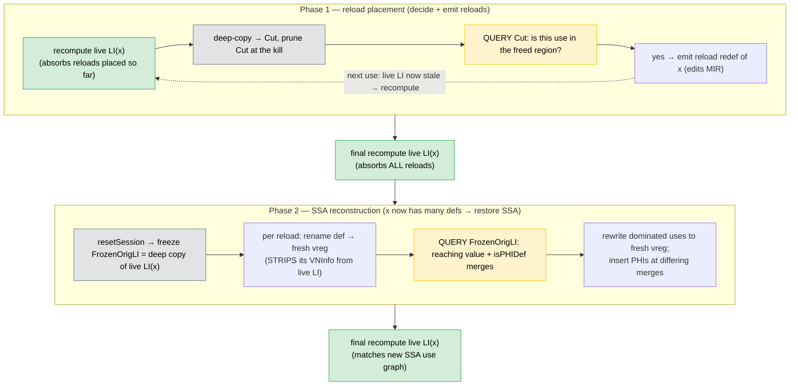
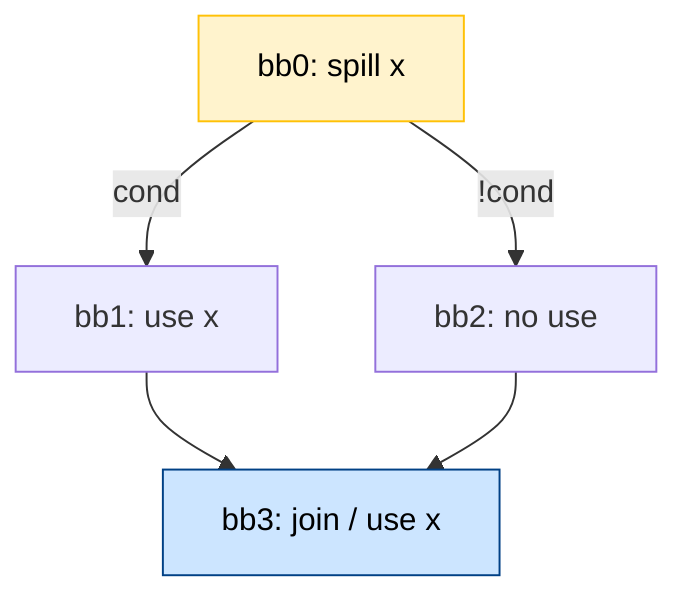

# Design Decisions

Durable design decisions for the SSA register-allocation stack and the rationale
behind them. Superseded decisions are kept at the bottom for history.

---

## Store at Definition

Spill stores are emitted right after the value's definition (EXEC full), not at
the high-pressure point.

**Chosen over:** WWM-wrapping the store; EXEC-aware reload placement.
**Reason:** correctness (no EXEC drift in divergent control flow), simplicity, no
SGPR overhead. See [[SSA_SPILLER_DESIGN#Spill candidate selection (Belady + lane splitting)]].

**PHI-def sub-rule.** When the stored value's def is a PHI, insert the store at
`getFirstNonPHI()`, not `std::next(PHI)`, so all PHIs stay contiguous at the block
top. See [[FIX_REPORT_spillAtDefinition-phi-order_2026-07-10]].

---

## Reloads Are Redefs, Repaired Inline

A reload **redefines `OrigVReg`** (a transient SSA violation) and is repaired
**inline** by [[MachineLaneSSAUpdater]] (reaching-VNI reconstruction), which also
inserts the merge PHIs. The spiller therefore returns SSA and needs **no second
`RebuildSSA`** pass after it.

**Reason:** one reconstruction engine for both `RebuildSSA` and the spiller; the
reload's PHIs fall out of the recomputed `isPHIDef` VNInfos for free. See
[[Reload_join_phi_coalescing]].

---

## Reload Placement: Cut-LI + Dominance-Ordered (No Optimizer)

Reload placement decides, per use, whether the spilled value is still available;
a use with no reaching value gets a reload, a use already reached by the original
or a dominating reload gets none, and differing merges become PHIs automatically.
Processing uses in **dominance order** makes a dominating reload visible to
dominated uses, so intra-chain sharing is free — no reload optimizer.

**Chosen over:** the earlier Pruned-IDF PHI-first strategy + NCD/clique reload
optimizer + `fixPathologicalPHIs`.
**Reason:** NCD-hoisting raises RP in the dominator region (against the spill's
purpose) and was usually blocked anyway. Full rationale: [[Reload_join_phi_coalescing]].

### Two phases, and which interval each one queries

Spilling one value runs two phases. Both consult a **frozen snapshot** as the
query oracle rather than the **live `LI(OrigVReg)`** (the interval LiveIntervals
owns): the live interval is either about to be edited or is being mutated by
renaming, so it is only ever *recomputed to absorb changes*, never queried
directly and never surgically cut.

**Phase 1 — reload placement.** *Purpose:* decide where reloads are needed and
emit them. Each reload is written as a redef of `OrigVReg`.
*Steps, per use in dominance order* (`emitReloadsAndRepairSSA` / `NeedsReload`):
1. **Recompute** the live `LI(OrigVReg)` so it includes the reload redefs placed
   so far (`removeInterval` + `createAndComputeVirtRegInterval`).
2. Take a **local deep copy `Cut`** and **prune `Cut` at the kill** (the live
   interval is *never* pruned).
3. **Query `Cut`**: if a spilled lane has no reaching value on some incoming edge,
   the use is in the freed region → emit a reload; otherwise the original or a
   dominating reload still covers it → nothing.
`Cut` is thrown away after each use; placing a reload leaves the live interval
stale until the next iteration's step 1.

**Phase 2 — SSA reconstruction.** *Purpose:* Phase 1 left `OrigVReg` with
**several defs** (its original def plus every reload redef) — that is not SSA.
Phase 2 turns it back into SSA: give each reload its own single-def name, point
every use at the correct name, and merge divergent names with PHIs.
*Steps* (a final recompute, then `repairSSAForNewDef` once per reload redef):
1. **Recompute** the live `LI(OrigVReg)` once more so it reflects **all** reloads;
   `resetSession()` then **freezes `FrozenOrigLI`** (a deep copy) as the oracle.
2. For each reload redef: **rename** its def to a fresh SSA vreg. Renaming
   **strips that def's VNInfo from the live interval**, which is exactly why the
   live interval can no longer be the oracle mid-session.
3. **Query `FrozenOrigLI`** for the reaching value at each use, and for its
   `isPHIDef` merge points.
4. **Rewrite** each dominated use to the reaching fresh vreg (or the original),
   and **insert a PHI** at every merge where the reaching values differ.
5. A final recompute leaves the live interval matching the new SSA use graph.

Result: SSA is restored (`SSAInvalidated` cleared), so the allocator runs with no
second `RebuildSSA`.

Legend: green = the **live** `LI(x)` being recomputed to absorb reloads; grey = a
**frozen snapshot** derived from it (`Cut` for placement, `FrozenOrigLI` for
reconstruction); yellow = the **query** step — always against a snapshot, never
the live interval.

---

## Coloring Never Inserts Instructions

Coloring is a pure assignment; **all** spill/reload placement lives in the
spiller. Spill-on-placement-failure inside coloring is forbidden.

**Reason:** correct spill/reload on AMDGPU needs a consistent EXEC mask
($\mathrm{EXEC}_{\text{spill}} = \mathrm{EXEC}_{\text{reload}}$) or WWM; after SI
control flow is lowered, finding such a point needs full exec-mask analysis and
is fragile. The early spiller makes that decision once. Consequence: coloring
must be guaranteed to succeed before it starts. See
[[Spiller_Redesign#1. Motivation & The Hard Invariant]].

---

## Width-Descending PEO Coloring; No Separate Splitter

Coloring runs one dominance-tree walk per distinct register width, widest first,
so wide tuples see an unfragmented file and narrow values fill the gaps. A
dedicated live-range **splitter** was implemented and then removed — the
width-descending coloring already reuses freed slots at def points.

**Reason:** fragmentation avoidance for AMDGPU's wide (128/256/512-bit) tuples,
without O(V²) interference-graph construction or a separate splitter pass. See
[[SSA_RA_Coloring#4. Algorithm: Width-Descending Multi-Pass Coloring]] and
[[SSA_RA_Coloring#D3: Splitter Removal]].

---

## Tied `undef` Self-Ties Color Like Ordinary Defs

In `color()`, a tied use that is `undef` (the DPP "old" source `%N = V_..._dpp
undef %N, ...`, a D16 load's untouched half, a MIX passthrough) has no earlier
color to inherit — the def is colored via `pickFreePhysReg`, and `rewriteOperands`
gives the self-tied use the same physreg. The tied-use-already-colored path is
kept for genuine two-address defs; the tied-uncolored-non-`undef` case is a hard
failure.

**Reason:** the tied source is a don't-care, so there is nothing to inherit;
coloring it as a normal def is correct and preserves two-address form. See
[[SSA_RA_Coloring#4.6 Tied Operands]].

---

## Deferred LiveInterval Shrinking

Live intervals are recomputed/shrunk only **after** all reloads are placed and SSA
is repaired — never before use rewriting (see the superseded interval-killing
note below for why premature surgery is wrong).

---

## SGPR Spill Accounting vs Materialization Split

The spiller only **accounts** for the VGPR lanes that SGPR spills will need
(`countSGPRSpillVGPRs()` → `VGPRLimit -= N`); materialization to
writelane/readlane happens later in `SILowerSGPRSpills`, once SGPRs are physical.

**Reason:** materializing pre-coloring would need the physical register (a
`SGPRSpillBuilder` on a virtual register crashes). See
[[Architecture#The two spill-code lowering paths]].

---

## Reset `NoPHIs` Only When Reconstruction Inserts a PHI

After the spiller repairs SSA inline, it clears the `NoPHIs`
`MachineFunctionProperty` **only** when reaching-VNI reconstruction actually
inserted a merge PHI (gated on `repairSSAForNewDef`'s `PHIDefs` out-parameter),
not whenever a reload was placed.

**Reason:** clearing `NoPHIs` needlessly enables `MachineVerifier` checks gated on
`!hasNoPHIs()` (e.g. the allocatable-physreg-live-in check), which would reject
otherwise-legal pre-RA MIR. `IsSSA` is likewise **not** cleared after inline
repair — the spiller returns SSA. (Mirrors `X86CmovConversion`.)

---

## Static Next-Use-Analysis Limitation → `ReloadedRegs`

NUA runs before spilling, so vregs it never saw (reload redefs, reconstruction
PHIs) have no next-use entry and could be treated as "dead" and re-spilled with no
RP relief. Workaround: track spilling-created vregs in `ReloadedRegs` and exclude
them from the Active candidate set. `repairSSAForNewDef` fills a vector of inserted
PHI def operands to support this. See [[NextUseAnalysis]] and
[[MachineLaneSSAUpdater#Integration with the AMDGPU SSA Spiller]].

---

# Superseded Decisions (history)

## SSA Repair Disorder — solved by the cut LiveInterval

**Original problem.** With a spill point in a diamond and dominated uses in both a
branch and the join, processing the branch use first could make the SSA updater
merge, at the join, the reloaded value with the **original (already-spilled)**
value from the clean path — which is not a valid SSA value there.

**Rejected fix — interval killing.** An early approach manually "killed" the
spilled *live* interval in the region dominated by the spill
(`cutFromLiveRange`, `killIntervalInDominatedRegion`) to hide the original from
the updater. It was abandoned:
- it made IDF see the value as dead → empty IDF → **no join PHI** → redundant
  reloads (3 instead of 2 in a diamond);
- it imposed liveness as a **precondition** rather than a consequence of use
  rewriting — order-dependent, and it fought the verifier ("doesn't live at use").

**Current solution — cut a *frozen copy*, never the live interval.** As detailed
in [Two phases, and which interval each one queries](#two-phases-and-which-interval-each-one-queries)
above: reload placement queries a pruned deep **copy** (`Cut`), and reconstruction
queries a frozen deep **copy** (`FrozenOrigLI`); the live LiveIntervals interval
is only ever *recomputed* (to absorb reloads), never surgically pruned. See
[[Reload_join_phi_coalescing#3. Availability via a cut LiveInterval (no dominance computation)]].

## Removed machinery
- `defDominatesUse`-based PHI-operand rewriting, `fixPathologicalPHIs` — replaced
  by reaching-VNI identity on the frozen oracle (dominance is no longer the
  ownership test).
- Pruned-IDF, `repairSSAForReload`, reload optimizer / NCD hoisting — removed;
  see [[Reload_optimizer]] (deprecated) and [[Reload_join_phi_coalescing]].
- Second `RebuildSSA` after the spiller — removed (inline repair).
