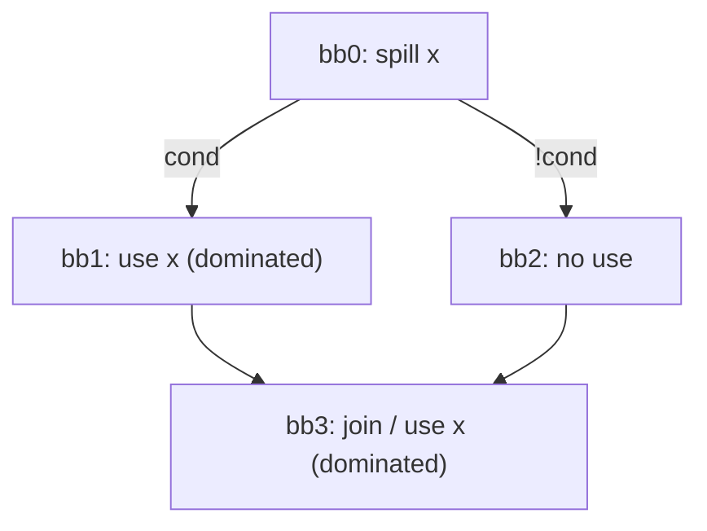
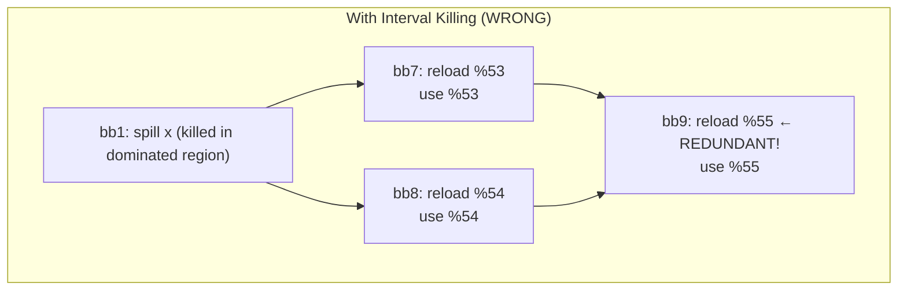
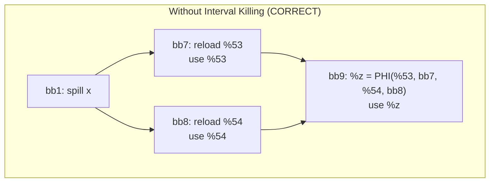
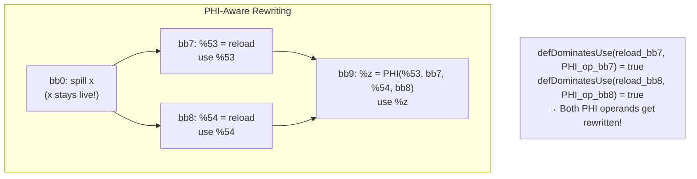
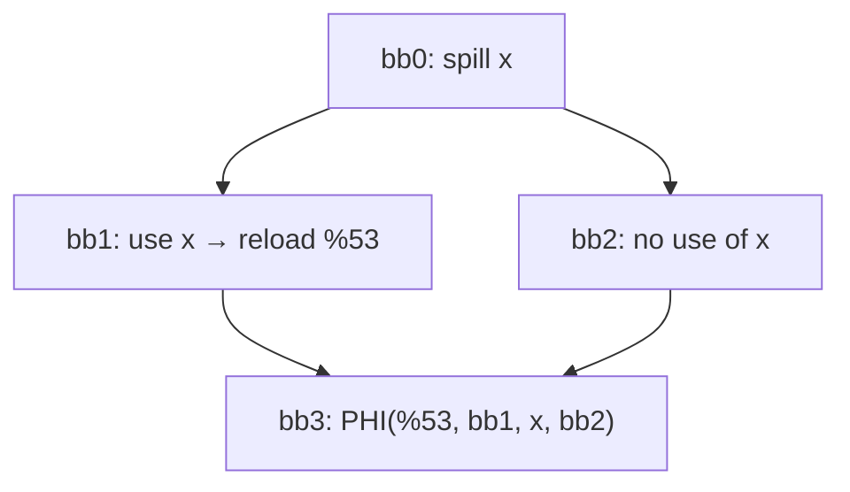

# Design Decisions

## Store at Definition
Chosen over:
- WWM wrapping
- EWF reload placement

Reason:
Correctness, simplicity, no SGPR overhead.

---

## Deferred LiveInterval Pruning
Shrink only after:
- all reloads placed
- SSA repaired

---

# PHI-Aware Use Rewriting (Supersedes Interval Killing)

## Context

Earlier design attempted to prevent SSA repair disorder by **killing the spilled register's LiveInterval** in the CFG subgraph dominated by the spill point. This section documents why that approach was abandoned and the new design that supersedes it.

## Original Problem: SSA Repair Disorder

If a spill point is in the NCD and there are dominated uses both:
- in one branch (a DF child), and
- later in the join block,

then processing the branch dominated-use first may cause SSAUpdater to insert a PHI at the join that merges:
- reloaded value from the processed path, and
- original (spilled) value from the other path.



**Why it's wrong:** `x` was already spilled in `bb0`, so `x` is not a valid SSA value flowing into `bb3` along the "clean" path.

## Failed Approach: Interval Killing

The original fix attempted to "kill" the spilled LiveInterval from the spill point onward in all dominated blocks, preventing SSAUpdater from seeing `x` as available.

### Issues with Interval Killing

#### Issue 1: Redundant Reloads in Diamond CFG

When the spilled register is artificially killed, it appears dead in IDF computation. This leads to **empty IDF** and **no PHI insertion** at join points, causing redundant reloads:



**Problem**: We have 3 reloads instead of 2. The reload in bb9 is explicitly wrong because:
- Reloaded values `%53` and `%54` already exist from both paths
- IDF is empty (x appears dead) → no PHI inserted
- Use in bb9 sees no available value → triggers another reload

**Correct behavior** (with PHI):


Only 2 reloads, with PHI merging at join point.

#### Issue 2: Conceptual Violation - Artificial Liveness Manipulation

**Principle**: A spilled register should become dead naturally after:
1. All uses are replaced with reloaded values
2. LiveInterval is recomputed via `shrinkToUses`

Artificially killing the interval **before** use replacement misleads SSA machinery:
- IDF computation sees incorrect liveness
- SSAUpdater cannot reason about correct value flow
- Results depend on processing order rather than CFG semantics

The spilled register's liveness should be a **consequence** of use replacement, not an artificially imposed **precondition**.

#### Issue 3: Too Complex Design - Manual LiveInterval Surgery

The interval killing approach required manually cutting LiveRange segments and subranges (`cutFromLiveRange`, `killIntervalInDominatedRegion`) to avoid machine verifier errors like *"Doesn't live at use"*.

**When you have to fight the verifier, you're on the wrong track.**

The need for manual LiveInterval manipulation to satisfy verification suggests the design contradicts LLVM's SSA semantics rather than working with them.

---

## New Design: PHI-Aware Use Rewriting (No Interval Killing)

### Key Insight: `defDominatesUse` Handles PHI Operands Correctly

The `MachineLaneSSAUpdater::defDominatesUse()` function has special handling for PHI operands:

```
For PHI operands: dominance is checked against the PREDECESSOR block,
not the PHI's block. This is because PHI semantics place the value
selection on the incoming edge - the operand is "used" at the end
of the predecessor, not at the PHI instruction itself.
```

This means:
- When reload is in `bb7` and PHI is in `bb9` with operand from `bb7`
- `defDominatesUse(reload_bb7, PHI_operand_from_bb7)` returns **true**
- The PHI operand gets rewritten to use the reloaded value

### New Algorithm

1. **DO NOT kill** the spilled register's LiveInterval at spill point
2. Process all uses (dominated and reachable) normally
3. Insert reloads and call SSA repair
4. `defDominatesUse` correctly rewrites PHI operands coming from reloaded paths
5. Final `shrinkToUses` naturally contracts the spilled register's LiveInterval

### Why This Works



The PHI operand `x` from `bb7` is dominated by the reload in `bb7` (because dominance is checked against `bb7`, not `bb9`), so it gets rewritten to `%53`. Same for `bb8` → `%54`.

### Edge Case: "Dead x" on Non-Reload Path

In some CFGs, a PHI may have the spilled register as operand from a path where no reload was inserted (because there were no uses on that path):



**Handling**: The `fixPathologicalPHIs` function detects PHIs with spilled register operands and replaces them with reload instructions that define directly into the PHI's result register.

See [SSA_Repairing_Disorder](../08-Worklog/issues/SSA_Spiller/SSA_Repairing_Disorder.md) for the original problem analysis.

---

# Static Next Use Analysis limitation
We currently don't consider virtual registers created by reload instructions and PHIs results created by SSA Updater for further live interval splitting/spilling because of the [Static_NUA_limitation](../08-Worklog/issues/Next_Use_Analysis/Static_NUA_limitation.md)
[MachineLaneSSAUpdater](MachineLaneSSAUpdater.md) repairSSAForNewDef has been changed to fill in the vector of the Machine Operands - inserted PHIs definitions.
