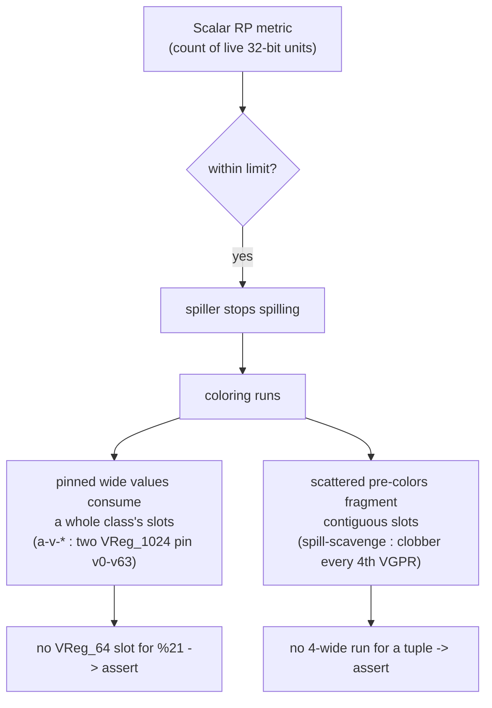
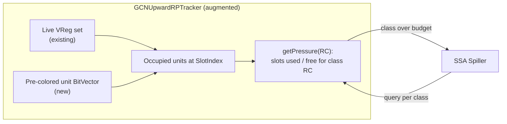
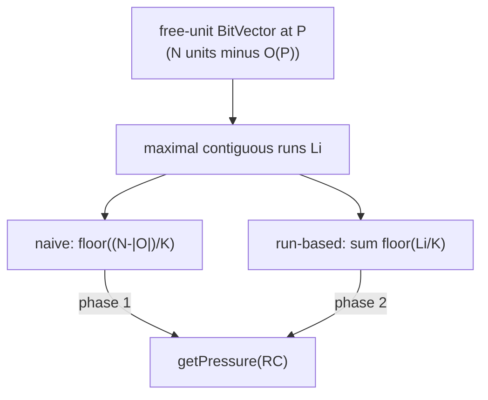
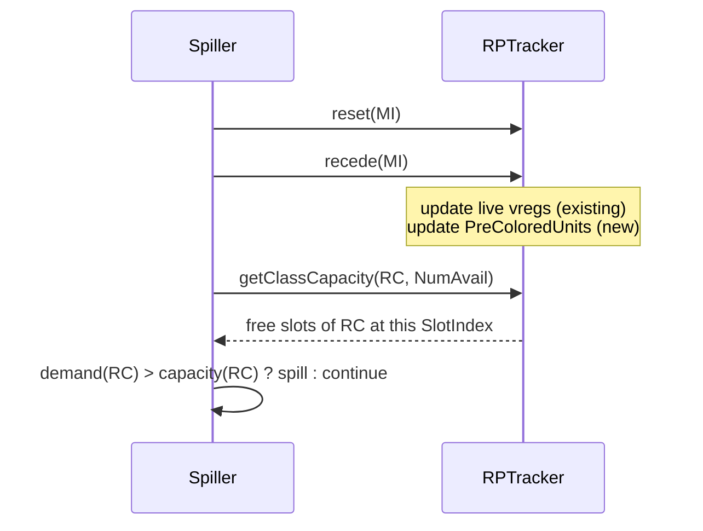

# GCNUpwardRPTracker Improvement — Per-Register-Class Pressure

## 1. Motivation

The SSA spiller must guarantee that, after spilling, the coloring pass can
always find a physical register — because **coloring never inserts
instructions** (spill/reload placement needs EXEC/WWM reasoning that is only
tractable in the dedicated early spiller). Today the spiller drives its
decisions from a **scalar** register-pressure metric: a single count of live
32-bit register units compared against one limit.

That scalar metric is **necessary but not sufficient** on AMDGPU because the
register file is:

- **Aliased / variable width** — a `VReg_128` needs 4 *contiguous* register
  units; a free unit count does not tell you a 4-wide slot exists.
- **Pre-colored** — inline-asm clobbers, ABI live-ins, and call/physreg defs pin
  specific physregs, fragmenting the file and consuming per-class capacity that
  a vreg-only tracker never sees.

Two observed failure modes (`Failed to find free physreg` asserts in coloring),
both invisible to scalar RP:



Fix: make the pressure tracker **register-class aware** and **pre-color aware**,
so the spiller can ask *"how many slots of class RC are free at this point?"*
rather than *"how many units are free?"*.

## 2. Background — Current Tracker

`GCNUpwardRPTracker` (backed by `GCNRegPressure`) walks a block bottom-up
(`recede(MI)`), maintaining the set of live virtual registers and deriving VGPR
and SGPR pressure in 32-bit-unit terms. It does **not** track physical-register
liveness — the spiller adds a separate ad-hoc `LivePhysRP` counter seeded from
block live-ins and updated per instruction, which:

- only produces a scalar (no per-class, no arrangement), and
- mis-handles dead physreg defs (an inline-asm dead clobber is added but never
  decremented, inflating pressure after the clobber).

## 3. The Enabling Invariant

During coloring the updater/spiller only assign colors; **pre-existing physregs
are immutable** for the whole allocation phase. Therefore the set of pre-colored
units live at any `SlotIndex` is a **static function of position**, computable
once and queried cheaply. This is what makes an incremental tracker sound.

## 4. Design Overview

Augment the tracker with:

1. a **pre-colored liveness BitVector** — one bit per physical register unit,
   set while that unit is held by a pre-existing physreg value; and
2. a **per-register-class pressure query** `getPressure(RC)` reporting, at the
   current position, how many *slots* of `RC`'s width are **used** (and hence
   how many are **free** against the class budget).



Both contributors — colored vregs (being placed) and pinned physregs — feed one
"occupied units at this SlotIndex" view; the per-class query derives slot counts
from it.

## 5. Two Capacity Models

Let a register class $RC$ occupy $K$ register units per value (e.g. `VReg_64`
$\Rightarrow K=2$, `VReg_128` $\Rightarrow K=4$), let $N$ be the number of
allocatable units of the underlying file, and let $O(P)$ be the set of units
occupied at position $P$ (pinned physregs $\cup$ already-placed wider values).

### 5.1 Naive count model (necessary bound)

$$
\text{capacity}_{RC}(P) \;=\; \left\lfloor \frac{N - |O(P)|}{K} \right\rfloor
$$

A popcount of free units divided by the class width. Cheap, and it already
catches the **pinned-wide-value** class (e.g. two `VReg_1024` consuming 64 of
64 units leaves $\lfloor 0/2 \rfloor = 0$ `VReg_64` slots). But it is
**fragmentation-blind**: it assumes free units are contiguous.

### 5.2 Run-based model (fragmentation-aware)

Decompose the free-unit bitvector into maximal contiguous runs $\{L_i\}$
(respecting the class alignment/stride $s$) and count placeable aligned slots:

$$
\text{capacity}_{RC}(P) \;=\; \sum_i \left\lfloor \frac{L_i}{K} \right\rfloor
\quad\text{(stride-1)}
$$

with the aligned-start count per run for stride-2/4 classes. This captures the
**scattered pre-color** case: clobbers at every 4th unit cut every run to
length 3, so $\lfloor 3/4\rfloor = 0$ `VReg_128` slots even though the naive
count is large.



**Phasing:** ship the naive model first (fixes the pinned-wide-value cases where
greedy also spills), then upgrade the *same* API to run-scanning for true
fragmentation — no interface change, only the counting kernel changes.

## 6. Data Structures & API

```cpp
class GCNUpwardRPTracker {
  // existing: live vreg set, GCNRegPressure ...

  // NEW: units held by pre-existing physregs at the current position.
  BitVector PreColoredUnits;          // sized to TRI->getNumRegUnits()

  // Combined occupied view (pinned physregs + placed wider values), refreshed
  // by recede(); or computed on demand from the live sets.
public:
  // Slots of class RC used / free at the current SlotIndex.
  unsigned getClassPressure(const TargetRegisterClass *RC) const;   // "used"
  unsigned getClassCapacity(const TargetRegisterClass *RC,
                            unsigned NumAvail) const;                // "free"
};
```

`PreColoredUnits` is seeded from the static pre-color state (see the Spiller
Redesign doc): reg-unit live ranges (`LIS->getRegUnit`) for physical defs/uses
plus a regmask-clobber index for calls (regmasks create no reg-unit range).

## 7. Incremental Bookkeeping

The tracker already updates the live vreg set in `recede(MI)`. Extend the same
step to update `PreColoredUnits` from `MI`'s physical operands (set on a
physreg def going live upward, clear when its use/def boundary is crossed),
using reg-unit granularity so wide physregs with partially-dead lanes are exact.
This removes the ad-hoc `LivePhysRP` counter and its dead-clobber over-count.



## 8. Complexity

- Naive query: one popcount over `PreColoredUnits` + live-unit set — $O(N/64)$.
- Run-based query: one linear scan of the free bitvector — $O(N)$.
- Both are per-queried-position; $N$ is small (≤ 256 VGPR units on most
  targets, 1024 on wide files). Acceptable inside the spiller's per-instruction
  walk; can be memoized per SlotIndex if needed.

## 9. Correctness Boundary

- The per-class capacity is **necessary** for colorability: if
  $\text{demand}_{RC}(P) > \text{capacity}_{RC}(P)$ the class genuinely cannot
  be colored at $P$ and a spill is mandatory.
- It is **not sufficient** in general: a globally consistent, alignment-
  respecting assignment across a value's whole live range is the pre-color +
  aliasing NP-hard problem. Per-class RP shrinks the residual; a coloring-time
  **greedy fallback gate** (Spiller Redesign doc) covers the remainder without
  ever letting coloring insert instructions.

## 10. Summary

| Aspect | Today (scalar `LivePhysRP`) | Proposed (per-class RP) |
|--------|------------------------------|--------------------------|
| Granularity | one 32-bit-unit count | per register class (slots) |
| Pre-colors | ad-hoc counter, dead-clobber bug | reg-unit BitVector, exact |
| Fragmentation | invisible | run-based model (phase 2) |
| Drives | scalar `CurRP < limit` | per-class demand vs capacity |
| Invariant | — | coloring still never inserts |
