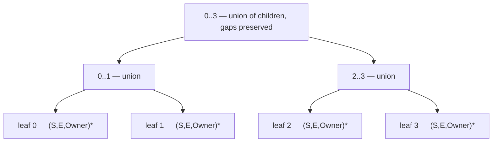

# Lane-Accurate Interference — Per-Unit Occupancy over Slot Ranges

> **Status: PROPOSED (2026-08-28).** Nothing in this document is implemented.
> The only code that exists is the measurement instrumentation
> (`-amdgpu-ssa-lane-waste-dump`, `AMDGPUSSARegisterAllocator::reportLaneWaste`).
>
> **This document amends [[RegisterTree_Driver_FSM]] §5–§6**, which concluded
> that an interval-augmented structure is unnecessary. That conclusion is correct
> *within a single width pass* and incorrect *across* them; see §3.

## 1. The defect

The allocator charges a value the **whole tuple for its whole range**, on both
axes:

- **Lane axis.** `markOccupied(PhysReg)` sets every register unit of the assigned
  physreg with no lane mask. A `vreg_128` whose `sub1..3` are dead occupies four
  registers.
- **Time axis.** The interference test against already-colored values is
  `LiveInterval::overlaps(VI)`, which compares **main ranges only** — subranges
  are never consulted — and on a hit sets *all* units of the other value's
  physreg.

Greedy has neither problem, and not because it transforms the program.
`LiveRegMatrix::assign` routes through `foreachUnit`, which walks
`MCRegUnitMaskIterator` and unifies into each unit **only the subrange whose lane
mask covers that unit**. Dead lanes are never claimed, so the registers stay
available. It is a property of how interference is tested, not of the IR.

The allocator already knows this is wrong. The partial-kill path in `color()`
frees the units of dead subranges and its comment says so outright — *"Holding
the dead lanes occupied is a soundness bug: spilling N lanes must drop RP by
N*32"* — but it only fires from the use-operand loop, so a lane is released only
if some instruction happens to read the value at a point where that subrange is
dead.

## 2. What the measurement says

480 corpus records replayed with per-function instrumentation, 27,308
function-and-file rows, each recording peak whole-tuple occupancy against
subrange occupancy at the same slot, joined to the archived per-kernel deltas
versus Greedy (`archive-rescuebound-0828`).

**Dead-lane occupancy is common but rarely binding.** 20% of rows carry some at
their peak slot. Of the 469 rows whose whole-tuple peak exceeds the allocatable
pool, only **46 (9.8%)** would fit under subrange accounting.

**It does not explain the quality gap.** Kernels worse than Greedy carry more
waste than equal-or-better ones — nonzero in 26.9% vs 18.2%, and at the 90th
percentile $0.219$ of the pool vs $0.021$ — but of the 6,100 kernels using more
VGPRs than Greedy, the waste covers the deficit in only 25%, and just **31 of
6,723** worse kernels would cross from "does not fit" to "fits". Median waste is
zero in both groups. Whatever drives `REGRESSION_OCC_OR_SPILL` and `MIXED`, this
is not it; coalescing remains the standing suspect.

**It is decisive for one crash family.** These fit outright under subrange
accounting:

| function | file | pool | whole-tuple | subrange | waste |
|---|---|---|---|---|---|
| `test_mfma_f32_32x32x1f32_rewrite…` | VGPR | 64 | 95 | 34 | 61 |
| `test_rewrite_mfma_direct_copy` | VGPR | 64 | 65 | 37 | 28 |
| `eliminate_spill_after_mfma_r…` | VGPR | 64 | 69 | 41 | 28 |
| `identical-subrange-spill-infloop / main` | SGPR | 70 | 84 | 48 | 36 |

The rest of the crash set is genuine over-pressure with nothing to reclaim:
`amdgcn.bitcast.1024bit` peaks at 96–193 against a pool of 64 with zero waste,
`spill-agpr` has zero waste at its peak on both gfx908 and gfx90a,
`scc-clobbered-sgpr-to-vmem-spill` is 150 against 53 with zero waste, and
`spill-scavenge-offset`'s SGPR peak is 47 subrange-accurate against a pool of 41.

**Conclusion.** This is a correctness and crash fix affecting roughly four of
eleven known failures. It should not be justified as a quality improvement.

*Caveats.* The dump truncates on 16-bit classes (`getRegSizeInBits/32` yields 0
while `getNumCoveredRegs` yields 1), so 82 of 27,308 rows report `lane > whole`;
none sit at a binding peak. Measurements are taken at function entry, before
pre-spill and before the in-allocator spiller runs.

## 3. Amendment to [[RegisterTree_Driver_FSM]] §5–§6

That design argues interference collapses to a point query: values are placed in
dominance order, so nothing already assigned starts after the frontier, so a
physreg free *now* is free for the whole unprocessed future. §6 concludes the
interval-augmented structure is not needed.

**The dividend is real but scoped to one width pass.** Coloring is
width-descending and multi-pass: every value of width 4 is colored across the
whole function before any value of width 1. When the narrow pass reaches its
frontier, the assigned set already contains wide values that **begin later in the
program than that frontier**. Dominance order holds within a pass; it does not
hold across passes, and the frontier of pass $k+1$ has no ordering relationship
to the definitions committed in pass $k$.

The shipped code is the proof. `pickFreePhysReg` cannot rely on the scanline
alone: it walks the entire `ColorMap` testing `LIS->getInterval(WReg).overlaps(VI)`
for every wider value, and takes a `WiderDefs` list as a parameter for wider defs
inside the current block that are not yet live at block entry. Those are range
queries, hand-rolled, because point-freedom is insufficient. `seedOccupiedAtBBEntry`
exists for the same reason.

So the question is not *whether* to hold occupancy over ranges — the allocator
already does, three times over, approximately. The question is whether to keep
doing it with whole-value hulls and whole-tuple units, or to hold it exactly.

## 4. Structure

One tree per register file (SGPR, VGPR/AGPR); their register units are disjoint.
Leaf $j$ is the 32-bit register unit at index $j$ within that file, $N$ rounded up
to a power of two.

**Leaf** — a sorted vector of `(Start, End, Owner)` half-open slot ranges.
Segments at one leaf are pairwise disjoint by construction: two values occupying
the same unit at the same slot *is* the interference bug, so an overlapping
insert is an allocator fault the tree can report at the moment it happens rather
than at the machine verifier.

**Internal node** — the coalesced union of its children's ranges, **gaps
preserved**. Not $[\min(\text{start}), \max(\text{end}))$: a hull at the tuple
level reintroduces the same over-claiming this design removes, one level up. A
64-bit node whose two leaves are busy at opposite ends of the function must not
read as busy throughout.

**Invariant.** Every internal node is a pure function of its children:
$\text{node} = \mathrm{coalesce}(\mathrm{merge}(\text{left}, \text{right}))$.
Nothing above the leaves carries independent state, so nothing above the leaves
can fall out of sync. Ownership is needed only at leaves.

**The range stored at a unit is the subrange covering that unit's lanes**, not
the value's whole interval. That sentence is the correctness fix; the rest is
mechanism.

This differs from [[RegisterTree_Driver_FSM]] §4, which stores one denormalized
`{Owner, start, end}` per node cached from the owner's interval *bounds*. That
representation cannot express either a lane-restricted extent or a gap.

## 5. Operations

| operation | method | cost |
|---|---|---|
| allocate | insert per leaf, recompute the block subtree then the root path | $O(w + \log N)$ merges |
| free | drop the owner's segments at its leaves, recompute identically | same |
| `isFree(units, [S,E))` | binary search one node, or the canonical decomposition of an arbitrary run | $O(\log N \cdot \log s)$ |
| `pickFree(W, [S,E))` | descend, taking the leftmost wholly-free node of span $\ge W$ | $O((N/W)\log s)$ |

Free needs no reference counting and no `NodeAllocated` bookkeeping: ancestors
are recomputed from children, so allocate and free are the same walk with a
different leaf mutation.

### Cost risk and the fallback

The merge at each level is linear in the node's array, and the root's array is
every busy period in the file — so one allocate or free is $O(\text{total
segments})$ at the top, with as many operations as there are values. On a large
function that is thousands of segments times thousands of operations. This is the
one number in the design that should be measured rather than reasoned about.

If it measures badly: keep exact segments **only at leaves** and give internal
nodes a one-word summary (hull, and perhaps a count) used solely as a sound
one-sided prune — miss the hull and the subtree is definitely free, intersect it
and descend. Updates become $O(1)$ per level, exactness still comes from the
leaves, and the worst case is $w$ leaf tests per candidate block: 32 binary
searches for a 1024-bit tuple. Pruning is weaker near the root, but the root
prunes nothing under either model, being busy almost everywhere.

Both variants are sound; they differ only in where the work happens.

## 6. Seeding

Reserved registers and physical-register liveness enter from
`LIS->getRegUnit(Unit)` with a sentinel owner — not from `MBB->liveins()`, which
is the current whole-block approximation. Both oracles must seed identically or
they will disagree for reasons that are not bugs.

## 7. Reference oracle and validator

The reference is `LiveIntervalUnion::Array` indexed by register unit, populated in
the `foreachUnit` pattern so each unit receives its matching subrange, queried
through `LiveIntervalUnion::Query::checkInterference()`. It is a *container*, not
Greedy's design: `LiveRegMatrix` is shaped around `VirtRegMap` coupling and around
enumerating interfering values so they can be evicted. This allocator never
evicts — SSA chordality means dominance-order coloring succeeds without a
priority queue, split costs or last-chance recoloring — so none of that is
adopted.

**Contract, deliberately asymmetric:**

- `isFree` verdicts must match **exactly**. A divergence is a real bug in one of
  the two and is reported with vreg, physreg, unit, query range and both answers —
  enough to reproduce without a rerun.
- `pickFree` results are **not** compared for equality. Two traversals may choose
  different legal registers and both be correct. The checks are that the tree's
  pick is free according to the reference, and that the two agree on *whether any*
  free block exists. Comparing picks directly would emit a stream of false
  warnings and train everyone to ignore the channel.

Warnings, never faults; flag-gated; default off; behaviour-neutral — the same
discipline the shadow tree runs under against `ColorMap` today.

## 8. What it replaces

| current mechanism | fate |
|---|---|
| `OccupiedRegUnits` + `markOccupied` / `markFree` | deleted |
| `seedOccupiedAtBBEntry` (full `ColorMap` walk per block) | deleted |
| `scanOverlappersForVI` (occupancy role) | deleted |
| `OccupiedAtDef` augmentation + `WiderDefs` parameter | deleted |
| kill tracking in `color()`, incl. partial-kill and early-clobber deferral | deleted |
| `shadowAllocate` / `shadowFree` / `shadowFreeUnit` / `shadowResetToOccupied` | deleted |

Three linear `ColorMap` walks per pick become segment-tree queries, which also
retires the standing performance item on `pickFreePhysReg`.

## 9. One decision this forces

VGPR tuples have stride 1 on most targets — `v[1:2]` is legal — so the legal
candidate set is **not** the set of power-of-two-aligned blocks. A `pickFree` that
enumerates only aligned nodes would miss placements and spill more. Likewise
`vreg_96` and the 96-bit-and-wider SGPR classes have no aligned node at all.

Two ways out:

1. Generalise `pickFree` to arbitrary starts.
2. Leave candidate enumeration where it already is — `RegClassInfo::getOrder(RC)`,
   which encodes each class's alignment and reserves correctly — and use the tree
   purely as the `isFree` oracle over the canonical decomposition.

**Recommendation: (2).** It keeps the allocator's own candidate order, needs no
new alignment logic, is the smaller change, and makes `pickFree` an optimisation
to add later rather than a prerequisite.

## 10. Staging

1. **Reference oracle authoritative.** Wire `LiveIntervalUnion` as the legality
   test, delete the scanline machinery in §8. This alone is the correctness fix
   and the bulk of the cleanup.
2. **Tree augmentation behind the validator.** Leaves and node unions per §4,
   observing until the divergence channel is quiet.
3. **Flip, if measurements justify it.** Tree authoritative, reference removed.

Each stage gates on: the four crash functions in §2, `cf512` as the
under-spilling canary, the SSARA lit suite, and a corpus run at `--timeout 300`
against `archive-rescuebound-0828`, with the lane-waste dump as before/after
evidence.

Stage 1 is deliberately independent of the tree's maturation, and gives the tree
real queries to be validated against instead of synthetic ones.

## 11. Open questions

- **Merge cost** (§5). Exact unions versus leaf-only segments with hull
  summaries. Decide on measurement.
- **Temporal holes are unmeasured.** The data in §2 quantifies *lane*
  over-claiming. Whether *hull-versus-segments* over-claiming costs anything is a
  separate question the same instrumentation could answer, and it determines
  whether node arrays need gaps at all or whether a per-unit extent would do.
- **Region pressure must follow.** Once occupancy is lane-accurate, the whole-width
  rule in `reduceRegionPressure` describes a limitation that no longer exists, and
  the region model has to become lane-accurate or it will over-estimate against an
  allocator that no longer over-claims. That is the point at which
  `findTightRegions`, `KillIdx = R.Start` and hole-aware candidate admission land,
  with the accounting question already settled.
- **Fate of `narrowSpilledRemnants`.** Narrowing still reduces spill *traffic*
  even when it no longer buys capacity. Keep, but re-justify.
- **Fate of the committed `SSARegisterTree` aggregates.** `FreeLeaves`,
  `MaxFreeAligned` and `FullAtLevel` are $O(1)$ scalars valid for "now". Under a
  range model they become query-relative and cannot be read off a stored value;
  `pickFreeAligned(Width)` becomes `pickFreeAligned(Width, S, E)` computed during
  the descent. Also note the file header of `SSARegisterTree.h` still describes
  `pickFreeAligned` and `fullCountAtLevel` as stubbed; both are implemented.
