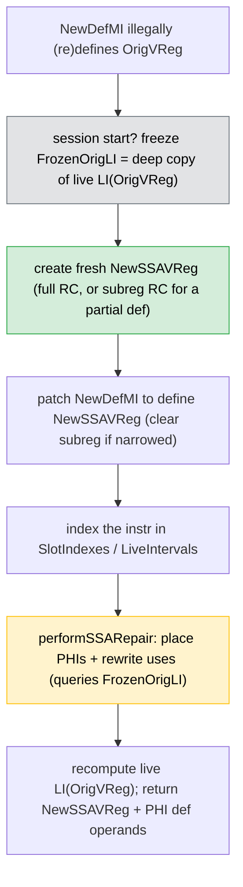
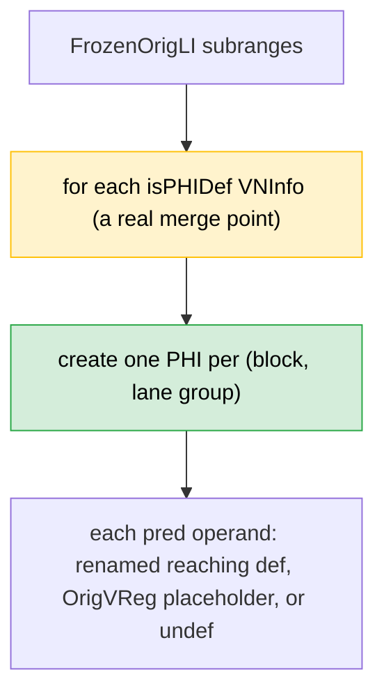

# MachineLaneSSAUpdater — Design

> Lane-aware **SSA repair** utility for Machine IR. Clients: **RebuildSSA**
> (`AMDGPURebuildSSA`) and the **AMDGPU SSA Spiller** (`AMDGPUSSARegisterSpiller`).

> **Design (2026-07):** ownership is decided by **reaching-VNInfo identity** read
> from a **frozen deep copy** of `OrigVReg`'s `LiveInterval`, not by dominance and
> not by an iterated dominance frontier. All the old IDF machinery
> (`getPrunedIDF`, `computePrunedIDF`, `IDFCache`, `repairSSAForReload`,
> `defDominatesUse`, `RenamedLaneDefs`) has been **removed**.

## Source mapping

- Header: [`MachineLaneSSAUpdater.h`](https://github.com/alex-t/llvm-project/blob/ssara/llvm/include/llvm/CodeGen/MachineLaneSSAUpdater.h)
- Impl: [`MachineLaneSSAUpdater.cpp`](https://github.com/alex-t/llvm-project/blob/ssara/llvm/lib/CodeGen/MachineLaneSSAUpdater.cpp)
- Upstream PR: [#163421](https://github.com/llvm/llvm-project/pull/163421)

## Problem statement

A transformation inserts a **new definition** of an existing virtual register,
violating SSA:
- a **reload** before a use (`loadRegFromStackSlot` writes `OrigVReg`), or
- **RebuildSSA** re-establishing SSA over post-PHIElimination multi-def vregs.

The updater must, per new def:
1. give it a **fresh** SSA name (new vreg),
2. preserve lane / subregister semantics,
3. insert **PHIs** where reaching values merge,
4. rewrite the uses it reaches to the correct name(s),
5. keep `LiveIntervals` consistent.

## Public API

```cpp
// Replace a new (SSA-violating) def of OrigVReg with a fresh vreg and repair SSA.
// Returns the fresh vreg; fills PHIRegDefOps with the def operands of any PHIs
// created (the spiller uses this for its ReloadedRegs workaround).
Register repairSSAForNewDef(MachineInstr &NewDefMI, Register OrigVReg,
                            SmallVectorImpl<MachineOperand *> &PHIRegDefOps);

// Invalidate the per-OrigVReg session so the next repair re-freezes the oracle.
// Required when new defs (e.g. spiller reloads) are added between repair calls.
void resetSession();

// CFG reachability def -> use (successor-closure BFS; SSA ⇒ exact). Used by the
// spiller to decide which uses a spill affects. No dominance frontier.
bool isUseReachableFromDef(MachineInstr *DefMI, MachineInstr *UseMI,
                           Register OrigVReg);
```

`rewriteDominatedUses` / `rewriteUseReaching` are the internal use-rewrite
helpers (public for testing).

### Finding the def operand
`repairSSAForNewDef` locates the `OrigVReg` def by scanning **all** operands
filtered on the `isDef` flag — **not** `MI.defs()`, whose leading-explicit-def
range is empty for variadic instructions (INLINEASM def operands sit after the asm
string and flag immediates). See commit `400c67924fc6`.

## The reaching-VNInfo oracle (frozen LiveInterval)

At session start (first `repairSSAForNewDef` for a new `OrigVReg`, or after
`resetSession()`) the updater takes a **deep copy** of `LI(OrigVReg)` into
`FrozenOrigLI` (own `BumpPtrAllocator`), preserving every VNInfo's def `SlotIndex`
and `isPHIDef` flag plus all subranges.

**Why a frozen copy is mandatory.** Renaming a def to a fresh vreg **strips that
def's VNInfo from the live interval** (recomputed during repair). So the live
`LI(OrigVReg)` degrades as the session proceeds and cannot answer "what value
reached this use originally?". The frozen copy is the stable oracle; the live
interval is only recomputed to absorb changes. (The spiller's reload-**placement**
phase uses a *different*, per-decision cut copy — see
[Decisions](Decisions.md#two-phases-and-which-interval-each-one-queries).)



## PHI placement — from frozen `isPHIDef` VNInfos (no IDF)

PHIs are **not** computed from an iterated dominance frontier. `LiveIntervalCalc`
already recorded, in `FrozenOrigLI`, an `isPHIDef` VNInfo at exactly each merge
point (per lane, via subranges) — that *is* the pruned IDF, for free. Placement:

- For each subrange overlapping the def mask, for each `isPHIDef` VNInfo, create
  **one PHI** at that merge block for that lane group (`createPHIInBlockReaching`,
  deduped per `(block, lane)`).
- Each PHI predecessor operand is resolved from the frozen oracle: if a renamed
  real def reaches that edge, use it; otherwise emit an `OrigVReg` **placeholder**
  (patched later) or an `undef` source when the lane has no reaching value on that
  edge (**placeholder-then-patch**).



## Use rewriting — ownership by reaching-VNInfo identity

For each use of `OrigVReg`, `rewriteUseReaching` asks the frozen oracle for the
reaching VNInfo (per lane) at the use, and this def **owns** exactly the lanes
whose reaching value *is this def's VNInfo*. Owned lanes are rewritten to the
fresh vreg; a partial-owning use is rebuilt with a `REG_SEQUENCE` (owned lanes
from the fresh vreg, the rest from the placeholder/original).

Two subtleties that were bugs (now invariants):

- **Tied uses query at the base index.** A tied use is read *before* the
  instruction's own def. For an early-clobber two-address def (e.g.
  `V_WMMA_*_twoaddr` accumulators) the def VNInfo sits at the early-clobber reg
  slot, so a reg-slot query would resolve to the instruction's *own* def and leave
  the tied use dangling. `rewriteUseReaching` queries a tied use at
  `getInstructionIndex(UseMI).getBaseIndex()` (gated on `MO.isTied()`); non-tied
  uses stay at `getRegSlot()`. `DefSlot` matching stays at `getRegSlot(EC)`. See
  `FIX_REPORT_wmma-ec-tied-use_2026-07-10`.
- **Never-defined padding lanes are sourced `undef`.** When a value lives in an
  oversized class (e.g. a 320-/384-/448-bit value in `sgpr_512`),
  `LiveIntervalCalc` fabricates a PHI-def subrange over the never-written padding
  lanes. A reaching value that is such a **PHI-def not backed by any real
  (non-PHI, non-undef) def** must be treated as `undef`, not as a live placeholder
  that nothing ever patches. The reaching-value query is restricted to lanes with
  a real establishing def; padding routes to the undef path. The direct-subreg
  fast path is also gated on the subreg index being **legal for the register
  class** (`sgpr_512` has no single `sub10_.._sub15` index), else it falls back to
  class-legal covering subregs. See
  `FIX_REPORT_bitcast-oversized-padding_2026-07-10`.
- **Loop back-edge self-reference.** `rewriteDominatedUses` must **not** skip the
  case `UseMI == DefMI` when `DefMI` is a PHI: a loop-carried PHI's own back-edge
  operand is a legitimate self-reference and must be rewritten. See commit
  `fad0fc8a00d7`.

## LiveIntervals handling

- The new def MI is inserted into LIS maps immediately.
- After repair, values for the new intervals are renumbered.
- `LI(OrigVReg)` is **recomputed** (not `shrinkToUses`-d) to account for new PHI
  operands: `shrinkToUses` mismodels PHI-operand liveness (a PHI operand is live at
  the *end of its predecessor*, not at the PHI). `createAndComputeVirtRegInterval`
  yields correct minimal liveness here.

## Integration with the AMDGPU SSA Spiller

The spiller's reloads redefine `OrigVReg`; after placing all of them it repairs
SSA inline, one call per reload redef:

```cpp
SSAUpdater->resetSession();                 // force a fresh frozen oracle
for (MachineInstr *RMI : ReloadDefs) {
  SmallVector<MachineOperand *> PHIDefs;
  SSAUpdater->repairSSAForNewDef(*RMI, SpilledReg, PHIDefs);
  // record renamed reload vreg in ReloadedRegs (static-NUA workaround)
}
```

`resetSession()` is essential: the updater caches `FrozenOrigLI` per `OrigVReg`
across the spiller's incremental spills; without a reset the oracle would miss the
newly added reload redefs (leaving dead reloads). See
[SSA_SPILLER_DESIGN](SSA_SPILLER_DESIGN.md#reload-placement-cut-li-dominance-ordered-redef-only).

The `PHIRegDefOps` out-parameter feeds the spiller's `ReloadedRegs` set (the
[static-NUA](NextUseAnalysis.md) workaround: exclude spilling-created vregs from
spill-candidate selection).

## Removed (do not look for in the source)

`getPrunedIDF` · `computePrunedIDF` · `IDFCache` · `repairSSAForReload` ·
`createPHIInBlock` (dominance) · `defDominatesUse` · `findRenamedReachingDef` ·
`RenamedLaneDefs` · the `UseReachingOracle` flag. Superseded by the frozen
reaching-VNInfo oracle above.

## Related

- [Reload_join_phi_coalescing](Reload_join_phi_coalescing.md) — the reload-placement theory that drives the
  spiller's calls into this updater.
- [Decisions](Decisions.md#two-phases-and-which-interval-each-one-queries) — live vs frozen
  interval usage across placement and reconstruction.
- [SSA_SPILLER_DESIGN](SSA_SPILLER_DESIGN.md) · [Architecture](Architecture.md).
