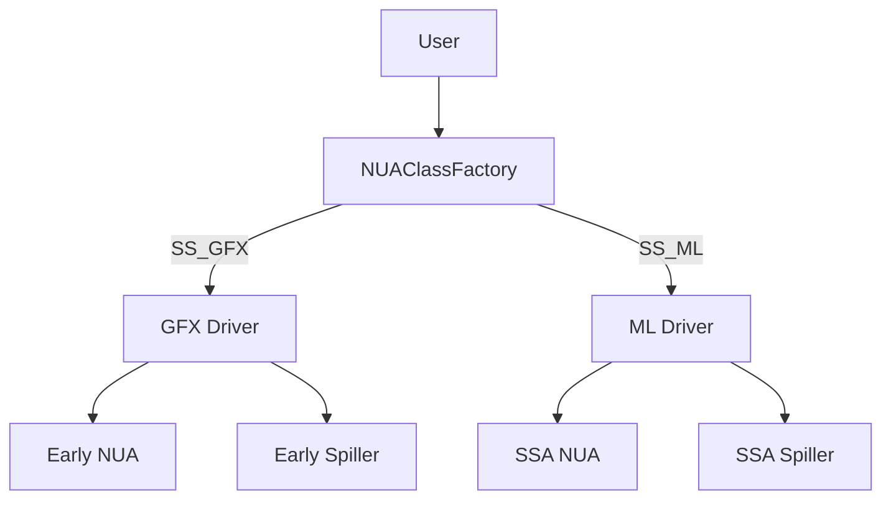
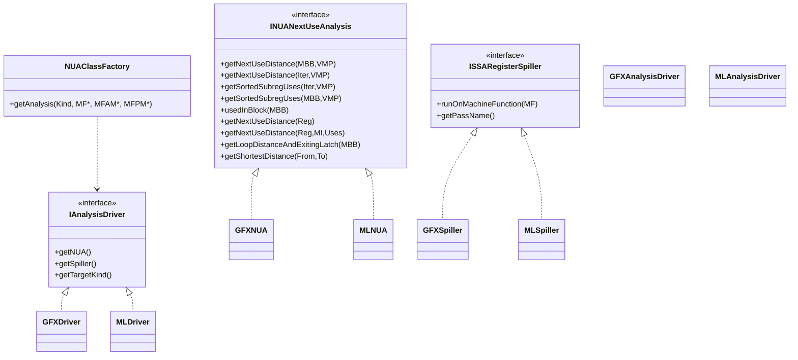
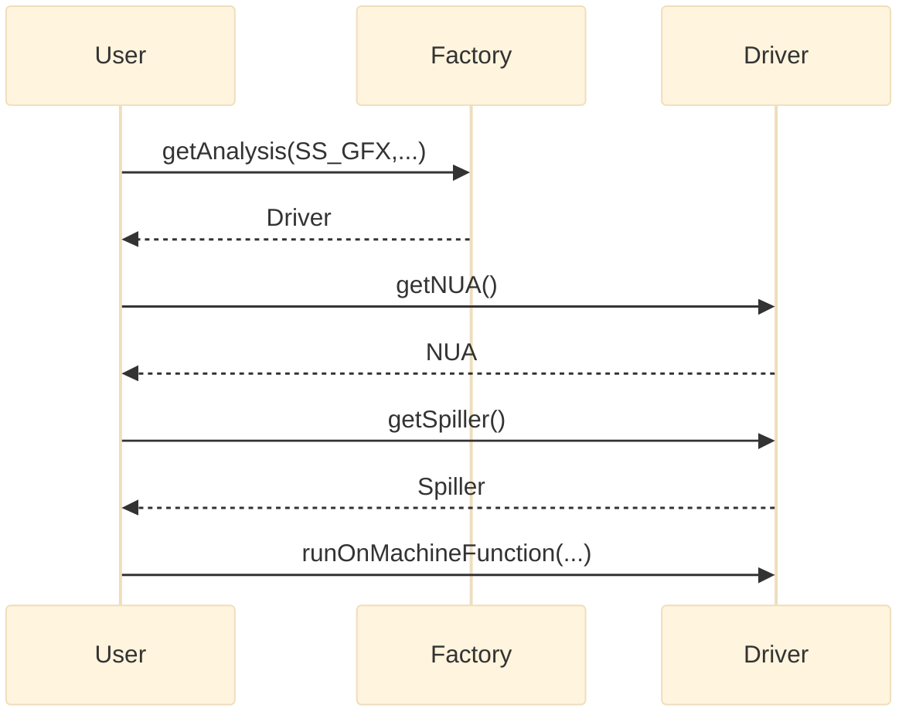

# NUA Factory + Driver Design (GFX/ML)

## Context and goal
Provide a single user-visible entry point for Next Use Analysis (NUA) and SSA
Spiller that hides the GFX vs ML implementations.

User workflow target:
1. Create a `NUAClassFactory`.
2. Call `getAnalysis(TargetKind, ...)`.
3. Receive a **driver** object that exposes:
   - Common NUA interface
   - Common Spiller interface

Both implementations stay independent, but use is transparent.

## Key requirements
- Two independent implementations remain unchanged internally.
- A unified factory creates a driver based on `TargetKind` (`SS_GFX`, `SS_ML`).
- NUA remains an analysis object (retrieved via `getAnalysis` where applicable).
- Spillers are `MachineFunctionPass` subclasses and can be constructed normally.
- Factory can accept `MF`, `MFAM`, and/or `MFPM` if required by implementation.
- Unsupported methods must fail with `llvm_unreachable` and a clear message.

## Terms
- **GFX**: Early register spilling pipeline using the GFX NUA implementation.
- **ML**: SSA register spiller pipeline using the ML NUA implementation.
- **Driver**: Aggregates NUA + Spiller and exposes common interfaces.

---

## High-level architecture



---

## Class diagram (interfaces + drivers)



---

## Sequence: factory and usage



---

## C++ interface sketch

```cpp
enum class TargetKind { SS_GFX, SS_ML };

class INUANextUseAnalysis {
public:
  virtual ~INUANextUseAnalysis() = default;

  // ML API
  virtual unsigned getNextUseDistance(const MachineBasicBlock &MBB,
                                      VRegMaskPair VMP) = 0;
  virtual unsigned getNextUseDistance(MachineBasicBlock::iterator I,
                                      VRegMaskPair VMP) = 0;
  virtual SmallVector<VRegMaskPair>
  getSortedSubregUses(MachineBasicBlock::iterator I, VRegMaskPair VMP) = 0;
  virtual SmallVector<VRegMaskPair>
  getSortedSubregUses(const MachineBasicBlock &MBB, VRegMaskPair VMP) = 0;
  virtual VRegMaskPairSet &usedInBlock(MachineBasicBlock &MBB) = 0;

  // GFX API
  virtual std::optional<uint64_t> getNextUseDistance(Register DefReg) = 0;
  virtual std::optional<uint64_t>
  getNextUseDistance(Register DefReg, MachineInstr *CurMI,
                     SmallVectorImpl<MachineInstr *> &Uses) = 0;
  virtual std::pair<uint64_t, MachineBasicBlock *>
  getLoopDistanceAndExitingLatch(MachineBasicBlock *CurMBB) const = 0;
  virtual uint64_t getShortestDistance(MachineBasicBlock *From,
                                       MachineBasicBlock *To) const = 0;
};

class ISSARegisterSpiller {
public:
  virtual ~ISSARegisterSpiller() = default;
  virtual bool runOnMachineFunction(MachineFunction &MF) = 0;
  virtual StringRef getPassName() const = 0;
};

class IAnalysisDriver {
public:
  virtual ~IAnalysisDriver() = default;
  virtual INUANextUseAnalysis &getNUA() = 0;
  virtual ISSARegisterSpiller &getSpiller() = 0;
  virtual TargetKind getTargetKind() const = 0;
};

class NUAClassFactory {
public:
  static std::unique_ptr<IAnalysisDriver>
  getAnalysis(TargetKind Kind,
              MachineFunction *MF = nullptr,
              MachineFunctionAnalysisManager *MFAM = nullptr,
              MachineFunctionPassManager *MFPM = nullptr);
};
```

---

## Adapter behavior and error handling

### Unsupported API calls
Each adapter implements all interface methods. Methods not supported by the
current target must fail with:
```cpp
llvm_unreachable("NUA method <name> not implemented for SS_GFX/SS_ML");
```

This allows single interface use while giving explicit diagnostics.

### NUA adapter mapping
- **GFX adapter** uses early NUA implementation:
  - `getNextUseDistance(Register, MI, Uses)` etc.
  - `getShortestDistance()`, `getLoopDistanceAndExitingLatch()`
- **ML adapter** uses SSA NUA result:
  - `getNextUseDistance(MBB|Iter, VMP)`
  - `getSortedSubregUses()`
  - `usedInBlock()`

### Spiller adapter mapping
Adapters wrap the concrete `MachineFunctionPass` classes and expose:
- `runOnMachineFunction(MF)`
- `getPassName()`

---

## Factory inputs and lifetime

### Optional inputs
The factory can accept optional inputs based on implementation needs:
- `MF`: the `MachineFunction` context (for immediate analysis/pass setup)
- `MFAM`: analysis manager (for ML NUA `getResult` pattern)
- `MFPM`: pass manager (if pass ownership is required)

Recommended behavior:
- If required inputs are missing, driver methods should fail with
  `llvm_unreachable` describing the missing dependency.

### Lifetime ownership
- The driver owns the concrete NUA adapter and Spiller adapter.
- The driver **does not** own `MF`, `MFAM`, or `MFPM`; it only references them.
- Callers must keep these alive for the lifetime of the driver.

---

## Example usage (pseudo-code)

```cpp
auto Driver = NUAClassFactory::getAnalysis(TargetKind::SS_ML, &MF, &MFAM, &MFPM);
INUANextUseAnalysis &NUA = Driver->getNUA();
ISSARegisterSpiller &Spiller = Driver->getSpiller();

unsigned Dist = NUA.getNextUseDistance(*MBB, VRegMaskPair(Reg, Mask));
bool Changed = Spiller.runOnMachineFunction(MF);
```

---

## Open questions
- Should the driver cache analysis results across multiple MFs, or be per-MF?
- Should the Spiller adapter expose more `MachineFunctionPass` hooks?
- How should `TargetKind` be selected (subtarget feature, pipeline option, or
  explicit user flag)?

---

## Acceptance criteria
- A single factory returns a driver for either `SS_GFX` or `SS_ML`.
- User code accesses NUA + Spiller through common interfaces only.
- Unsupported APIs fail loudly with `llvm_unreachable` and clear message.
- GFX and ML implementations remain independent.
