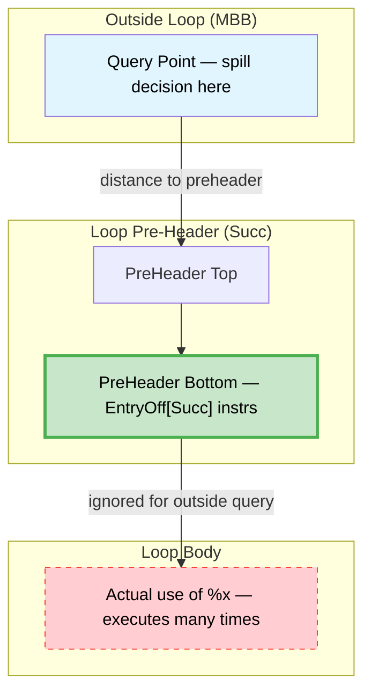
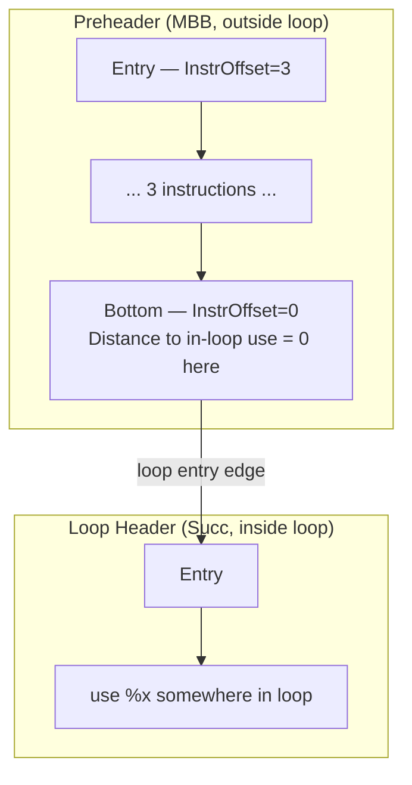
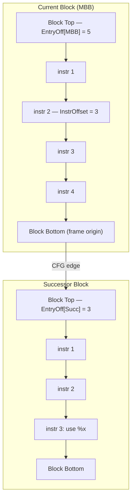
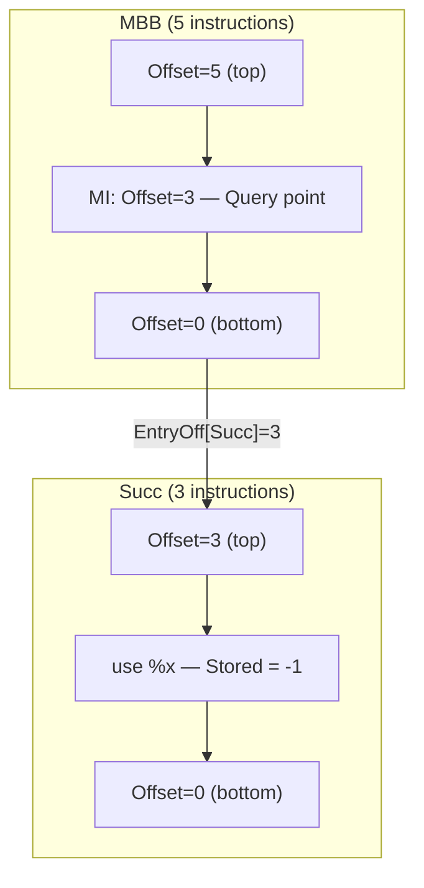

# Next Use Analysis — Design Document

**SSA-aware next-use distance computation for register spill candidate selection**

## Source

- **Header**: [`AMDGPUNextUseAnalysis.h`](https://github.com/alex-t/llvm-project/blob/45385c6f5f008cde206d5828a00a17d6bb7f7783/llvm/lib/Target/AMDGPU/AMDGPUNextUseAnalysis.h)
- **Implementation**: [`AMDGPUNextUseAnalysis.cpp`](https://github.com/alex-t/llvm-project/blob/45385c6f5f008cde206d5828a00a17d6bb7f7783/llvm/lib/Target/AMDGPU/AMDGPUNextUseAnalysis.cpp)

---

## Purpose

NextUseAnalysis computes the **distance to next use** for every virtual register (at lane-mask granularity) at every instruction. This enables optimal spill candidate selection using Belady's MIN algorithm: spill the register whose next use is furthest.

See [MIN Algorithm](../03-Concepts/MIN_Algorithm.md) for theoretical background.

---

## Data Structures

### VRegMaskPair

**Purpose**: Represent a virtual register at subregister granularity.

```cpp
class VRegMaskPair {
  Register VReg;
  LaneBitmask LaneMask;
};
```

**Source**: [`VRegMaskPair.h`](https://github.com/alex-t/llvm-project/blob/45385c6f5f008cde206d5828a00a17d6bb7f7783/llvm/lib/Target/AMDGPU/VRegMaskPair.h)

**Why**: AMDGPU has large vector registers (up to 32×32-bit). Spilling/tracking must operate at lane granularity to avoid unnecessary data movement.

---

### VRegDistances

**Purpose**: Store next-use distances for all lanes of a single virtual register.

```cpp
class VRegDistances {
  using Record = std::pair<LaneBitmask, int64_t>;  // (lanes, stored_distance)
  using SortedRecords = std::set<Record, CompareByDist>;  // sorted by distance
  DenseMap<unsigned, SortedRecords> NextUseMap;  // VReg.id() → records
};
```

**Source**: [`AMDGPUNextUseAnalysis.h:44-211`](https://github.com/alex-t/llvm-project/blob/45385c6f5f008cde206d5828a00a17d6bb7f7783/llvm/lib/Target/AMDGPU/AMDGPUNextUseAnalysis.h#L44-L211)

**Why sorted set?**
- Records sorted by distance → O(1) access to nearest use for any overlapping lane
- Per-VReg grouping → efficient lane-mask operations (overlap, subsume)
- Signed distance → enables relative encoding (negative = use before snapshot, positive = use after)

**Key Operations**:

| Operation | Description |
|-----------|-------------|
| `insert(VMP, dist)` | Add use record; rejects if existing closer use covers same lanes |
| `clear(VMP)` | Remove records covered by VMP (for definitions that kill liveness) |
| `merge(other, offset, weight)` | Combine from successor with distance adjustment |

---

### NextUseInfo

**Purpose**: Per-basic-block storage of computed distances.

```cpp
class NextUseInfo {
  VRegDistances Bottom;  // Distances at block exit (from successors)
  DenseMap<const MachineInstr*, VRegDistances> InstrDist;  // Snapshot at each MI
  DenseMap<const MachineInstr*, unsigned> InstrOffset;     // Offset for materialization
};
```

**Source**: [`AMDGPUNextUseAnalysis.h:212-219`](https://github.com/alex-t/llvm-project/blob/45385c6f5f008cde206d5828a00a17d6bb7f7783/llvm/lib/Target/AMDGPU/AMDGPUNextUseAnalysis.h#L212-L219)

**Why per-instruction snapshots?**
- Queries can occur at any program point
- Avoids re-walking the block for each query
- `InstrOffset` enables relative→absolute distance conversion

---

### Stored vs Materialized Distances

**Core Design Choice**: Store distances as **relative** (to snapshot point), materialize to **absolute** on query.

```
Stored value = -(offset from block bottom to use)
Materialized = Stored + SnapshotOffset
```

**Why relative storage?**
1. Enables efficient block-to-block propagation (add successor's EntryOffset)
2. Simplifies loop handling (add LoopTag to loop-exit edges)
3. One snapshot works for any query point via simple addition

---

### Three-Tier Ranking System

Distances are classified into three tiers for spiller ranking:

| Tier | Range | Meaning |
|------|-------|---------|
| **1: Finite** | 0 – 59999 | Concrete distance in instructions |
| **2: Loop-exit** | 60000 – 64999 | Use exists but after loop exit |
| **3: Dead** | 65535 (Infinity) | No use found → safe to spill |

**Implementation**: [`materializeForRank()`](https://github.com/alex-t/llvm-project/blob/45385c6f5f008cde206d5828a00a17d6bb7f7783/llvm/lib/Target/AMDGPU/AMDGPUNextUseAnalysis.cpp#L36-L57)

**Why?**
- Loop-exit uses shouldn't compete with in-loop uses (spill outside-loop values first)
- Dead registers (Infinity) are always best spill candidates
- Three tiers preserve Belady ordering while handling CFG complexity

---

### Loop Handling Constants

```cpp
static constexpr int64_t LoopTag = (int64_t)1 << 40;  // ~1e12
static constexpr int64_t DeadTag = (int64_t)1 << 60;  // ~1e18
```

**Source**: [`AMDGPUNextUseAnalysis.h:231-232`](https://github.com/alex-t/llvm-project/blob/45385c6f5f008cde206d5828a00a17d6bb7f7783/llvm/lib/Target/AMDGPU/AMDGPUNextUseAnalysis.h#L231-L232)

**Why such large values?**
- LoopTag must exceed any finite distance in a function (~1e6 instructions max)
- DeadTag must exceed any LoopTag accumulation (nested loops)
- Signed arithmetic allows negative stored values without underflow

---

### Loop Entry: Two Transformations

When backward analysis crosses a loop entry edge (from higher loop depth to lower), two transformations apply:

**Source**: [`AMDGPUNextUseAnalysis.cpp:303-323`](https://github.com/alex-t/llvm-project/blob/3d16512cb05156259f07f8b3d051b72fae6591c8/llvm/lib/Target/AMDGPU/AMDGPUNextUseAnalysis.cpp#L303-L323)

#### 1. Outside-Loop Uses (LoopTag Removal)

Uses that already have `LoopTag` (meaning they're outside the loop being exited) get the tag removed:

```cpp
if (R.second >= LoopTag) {
  R.second -= LoopTag;  // Remove the out-of-loop penalty
}
```

This unwraps the loop nesting—distances that were "beyond this loop" become finite again.

#### 2. Inside-Loop Uses (Pre-Header Truncation)

Uses **inside** the loop (no LoopTag, finite distance) get truncated to the **loop pre-header**:

```cpp
else {
  // Inside-loop use: reset so distance = 0 at preheader bottom
  R.second = -(int64_t)EntryOff[SuccNum];
}
```

**Why truncate?** If we spill before a loop, the reload will be placed at the **pre-header** (not inside the loop—that would execute every iteration). Therefore, from outside the loop, the meaningful distance is "how far to the pre-header", not "how far to the actual use".



**Mathematical effect**:
- Stored distance (in successor's frame) becomes `-EntryOff[SuccNum]`
- After rebasing into MBB's frame: `-EntryOff[SuccNum] + EntryOff[SuccNum] = 0`
- Result: Materialized distance = **0 at preheader bottom** (last instruction before loop entry)

**Example**:



- Original: use inside loop has some distance in Succ's frame
- Truncation sets: `Stored = -EntryOff[Succ]` (e.g., `-5` if loop header has 5 instrs)
- After merge into MBB: `Rebased = -5 + 5 = 0` (stored in MBB's frame)
- Query at **preheader bottom** (InstrOffset=0): `Materialized = 0 + 0 = 0`
- Query at **preheader entry** (InstrOffset=3): `Materialized = 0 + 3 = 3`

**Effect**: From preheader entry, the in-loop use appears **3 instructions away** (= distance to preheader bottom). This correctly models that a reload would be placed at preheader bottom, not inside the loop.

---

### Offset Materialization and EntryOff

The analysis uses a **relative offset scheme** to efficiently propagate distances across blocks. Understanding this is key to interpreting NUA results.

#### Frame of Reference



#### Key Data Structures

| Field | Meaning |
|-------|---------|
| `EntryOff[MBB]` | Total instruction count in MBB (distance from top to bottom) |
| `InstrOffset[MI]` | Distance from MI to block bottom (decreases as you go down) |
| `Stored distance` | Negative offset from snapshot point to use (relative) |

#### Rebasing Formula

When merging distances from successor into current block:

```cpp
// AMDGPUNextUseAnalysis.h:31-35
static inline int64_t rebaseFromSucc(int64_t SuccStored, 
                                     unsigned SuccEntryOff,
                                     int64_t EdgeWeight) {
  return SuccStored + SuccEntryOff + EdgeWeight;
}
```

#### Worked Example



**Distance Calculation** (at query point MI, Offset=3):

| Step | Formula | Result |
|------|---------|--------|
| 1. Stored distance in Succ | use is 1 instr before bottom | `-1` |
| 2. Rebase into MBB frame | `-1 + EntryOff[Succ]` | `-1 + 3 = 2` |
| 3. Materialize at MI | `rebased + InstrOffset[MI]` | `2 + 3 = 5` |

**Result**: Next use of `%x` is **5 instructions** from query point

---

## Main Workflow: `analyze()`

**Source**: [`analyze()`](https://github.com/alex-t/llvm-project/blob/45385c6f5f008cde206d5828a00a17d6bb7f7783/llvm/lib/Target/AMDGPU/AMDGPUNextUseAnalysis.cpp#L70-L221)

### Algorithm Overview

```
1. Initialize LoopExits map (which edges leave loops)
2. Iterate to fixed point:
   for each MBB in post-order:
     a. Merge distances from successors (adjust by EntryOffset + EdgeWeight)
     b. Filter PHI operands (only live on specific edges)
     c. Walk instructions bottom-up:
        - Use: insert distance record (negative offset)
        - Def: clear covered lanes
     d. Store per-instruction snapshots
     e. Update UpwardNextUses[MBB] for predecessors
```

### Key Steps

#### 1. Successor Merging

```cpp
Curr.merge(SuccDist, EntryOff[SuccNum], EdgeWeight);
```

**Source**: [`AMDGPUNextUseAnalysis.cpp:158`](https://github.com/alex-t/llvm-project/blob/45385c6f5f008cde206d5828a00a17d6bb7f7783/llvm/lib/Target/AMDGPU/AMDGPUNextUseAnalysis.cpp#L158)

- `EntryOff[SuccNum]` = instruction count in successor (distance adjustment)
- `EdgeWeight` = `LoopTag` if edge exits a loop, else 0

#### 2. Loop-Exit Edge Detection

```cpp
if (LoopExits.contains(MBB->getNumber())) {
  unsigned ExitTo = LoopExits[MBB->getNumber()];
  if (SuccNum == ExitTo)
    EdgeWeight = LoopTag;
}
```

**Source**: [`AMDGPUNextUseAnalysis.cpp:108-112`](https://github.com/alex-t/llvm-project/blob/45385c6f5f008cde206d5828a00a17d6bb7f7783/llvm/lib/Target/AMDGPU/AMDGPUNextUseAnalysis.cpp#L108-L112)

#### 3. PHI Operand Filtering

PHI inputs are only live on their specific incoming edge:

```cpp
for (auto &PHI : Succ->phis()) {
  for (unsigned OpIdx = 1; OpIdx < PHI.getNumOperands(); OpIdx += 2) {
    if (BlockOp.getMBB() != MBB) {
      SuccDist.clear(PhiVMP);  // Not live on this edge
    }
  }
}
```

**Source**: [`AMDGPUNextUseAnalysis.cpp:143-156`](https://github.com/alex-t/llvm-project/blob/45385c6f5f008cde206d5828a00a17d6bb7f7783/llvm/lib/Target/AMDGPU/AMDGPUNextUseAnalysis.cpp#L143-L156)

#### 4. Instruction Walk (Bottom-Up)

```cpp
for (auto &MI : make_range(MBB->rbegin(), MBB->rend())) {
  for (auto &MO : MI.operands()) {
    VRegMaskPair P(MO, TRI, MRI);
    if (MO.isUse()) {
      Curr.insert(P, -(int64_t)Offset);  // Record use at negative offset
    } else if (MO.isDef()) {
      Curr.clear(P);  // Definition kills previous uses
    }
  }
  NextUseMap[MBBNum].InstrDist[&MI] = Curr;  // Snapshot
  NextUseMap[MBBNum].InstrOffset[&MI] = Offset;
  if (!MI.isPHI()) ++Offset;
}
```

**Source**: [`AMDGPUNextUseAnalysis.cpp:167-190`](https://github.com/alex-t/llvm-project/blob/45385c6f5f008cde206d5828a00a17d6bb7f7783/llvm/lib/Target/AMDGPU/AMDGPUNextUseAnalysis.cpp#L167-L190)

---

## Public API

### Primary Query: `getNextUseDistance()`

```cpp
unsigned getNextUseDistance(MachineBasicBlock::iterator I, VRegMaskPair VMP);
unsigned getNextUseDistance(const MachineBasicBlock &MBB, VRegMaskPair VMP);
```

**Source**: [`getNextUseDistance()`](https://github.com/alex-t/llvm-project/blob/45385c6f5f008cde206d5828a00a17d6bb7f7783/llvm/lib/Target/AMDGPU/AMDGPUNextUseAnalysis.cpp#L315-L356)

**Returns**: Materialized distance using three-tier ranking (0–65535).

**Usage**:
```cpp
unsigned dist = NUA.getNextUseDistance(MI.getIterator(), {Reg, LaneMask});
if (dist == Infinity) {
  // Register is dead after this point
}
```

---

### Lane-Ordered Uses: `getSortedSubregUses()`

```cpp
SmallVector<VRegMaskPair> getSortedSubregUses(MachineBasicBlock::iterator I,
                                               VRegMaskPair VMP);
```

**Source**: [`getSortedSubregUses()`](https://github.com/alex-t/llvm-project/blob/45385c6f5f008cde206d5828a00a17d6bb7f7783/llvm/lib/Target/AMDGPU/AMDGPUNextUseAnalysis.cpp#L253-L303)

**Returns**: Subregister uses sorted by distance (furthest first).

**Usage**: Enables lane-level spill selection for large registers:
```cpp
for (VRegMaskPair SubUse : NUA.getSortedSubregUses(MI, VMP)) {
  // SubUse.getLaneMask() covers specific lanes
  // Process in order: furthest-use lanes first
}
```

---

### Dead Check: `isDead()`

```cpp
bool isDead(MachineBasicBlock &MBB, MachineBasicBlock::iterator I,
            VRegMaskPair VMP);
```

**Source**: [`AMDGPUNextUseAnalysis.h:380-397`](https://github.com/alex-t/llvm-project/blob/45385c6f5f008cde206d5828a00a17d6bb7f7783/llvm/lib/Target/AMDGPU/AMDGPUNextUseAnalysis.h#L380-L397)

**Returns**: `true` if VMP has no uses after the given point.

---

### Block-Level Liveness: `usedInBlock()`

```cpp
VRegMaskPairSet &usedInBlock(MachineBasicBlock &MBB);
```

**Source**: [`AMDGPUNextUseAnalysis.h:399-401`](https://github.com/alex-t/llvm-project/blob/45385c6f5f008cde206d5828a00a17d6bb7f7783/llvm/lib/Target/AMDGPU/AMDGPUNextUseAnalysis.h#L399-L401)

**Returns**: Set of (VReg, LaneMask) pairs used anywhere in the block.

---

## Pass Integration

### Legacy Pass Manager

```cpp
class AMDGPUNextUseAnalysisWrapper : public MachineFunctionPass {
  NextUseResult &getNU() { return NU; }
};
```

**Source**: [`AMDGPUNextUseAnalysis.h:418-438`](https://github.com/alex-t/llvm-project/blob/45385c6f5f008cde206d5828a00a17d6bb7f7783/llvm/lib/Target/AMDGPU/AMDGPUNextUseAnalysis.h#L418-L438)

**Dependencies**:
- `SlotIndexesWrapperPass`
- `MachineLoopInfoWrapperPass`

### New Pass Manager

```cpp
class AMDGPUNextUseAnalysis : public AnalysisInfoMixin<AMDGPUNextUseAnalysis> {
  using Result = NextUseResult;
  Result run(MachineFunction &MF, MachineFunctionAnalysisManager &MFAM);
};
```

**Source**: [`AMDGPUNextUseAnalysis.h:409-416`](https://github.com/alex-t/llvm-project/blob/45385c6f5f008cde206d5828a00a17d6bb7f7783/llvm/lib/Target/AMDGPU/AMDGPUNextUseAnalysis.h#L409-L416)

---

## Complexity

| Phase | Complexity |
|-------|------------|
| `init()` | O(loops × exit_edges) |
| `analyze()` | O(iterations × blocks × instructions) |
| `getNextUseDistance()` | O(lanes per VReg) |
| `getSortedSubregUses()` | O(lanes per VReg) |

Fixed-point iteration typically converges in 2–3 passes for acyclic regions, O(loop_depth) for nested loops.

---

## Limitations

### Static Analysis

NextUseAnalysis runs **before** spilling. Registers created by:
- Reload instructions
- SSA repair PHIs

...have no NUA entries. These are tracked separately via `ReloadedRegs` in the spiller.

See [Static NUA Limitation](Decisions.md#static-next-use-analysis-limitation) in Decisions.

---

## Related

- [Next Use Analysis (Component)](../02-Components/Next_Use_Analysis.md)
- [MIN Algorithm](../03-Concepts/MIN_Algorithm.md)
- [SSA Spiller Design](SSA_SPILLER_DESIGN.md) — consumer of NUA


