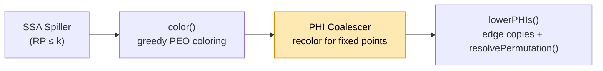
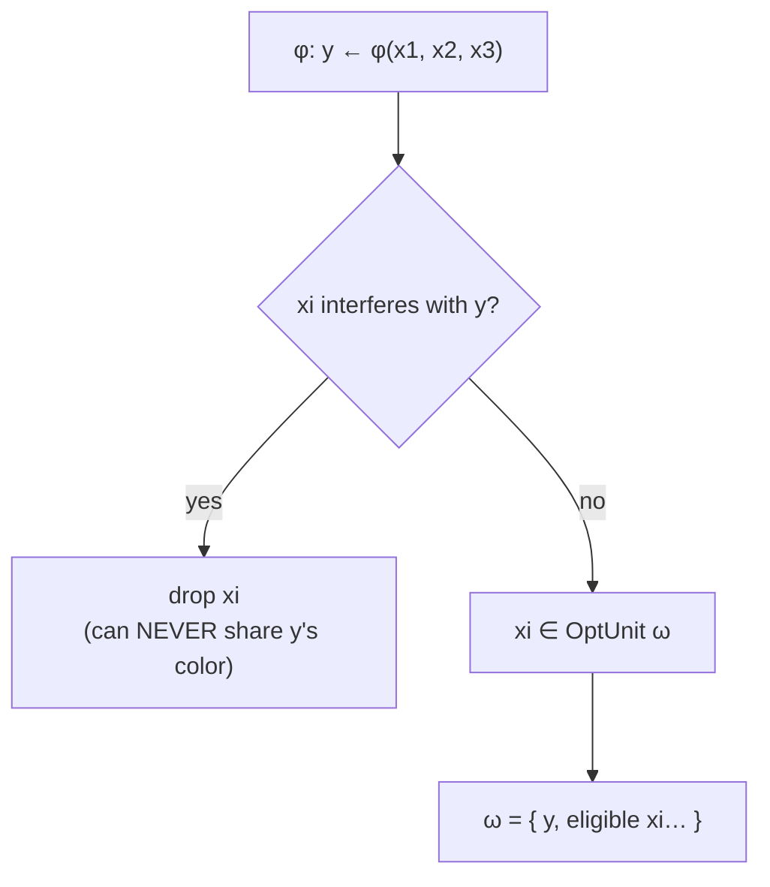
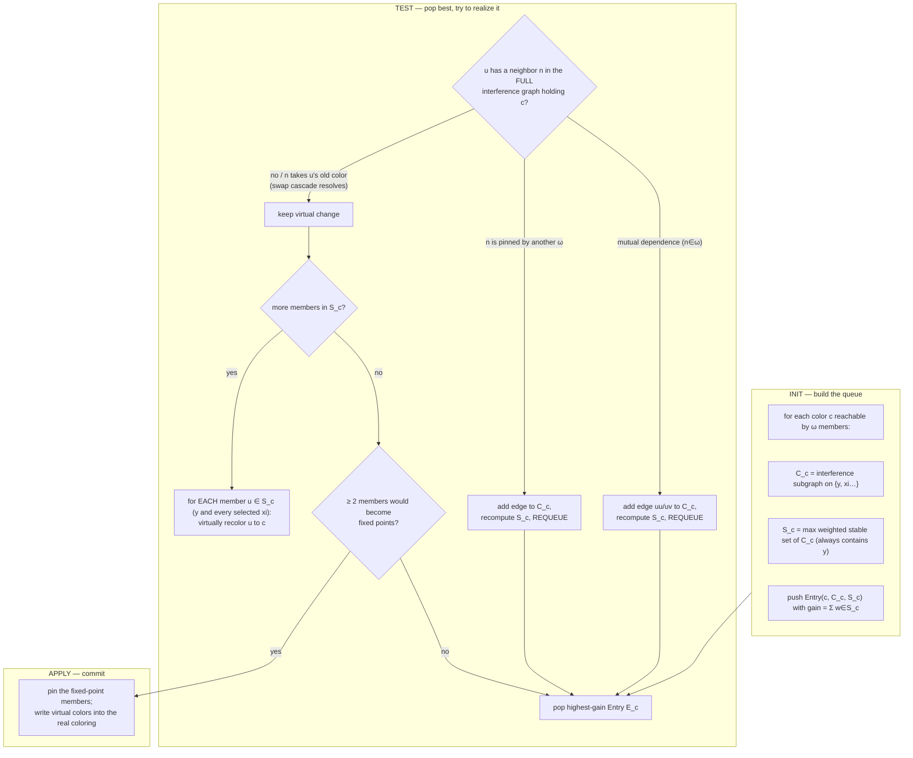
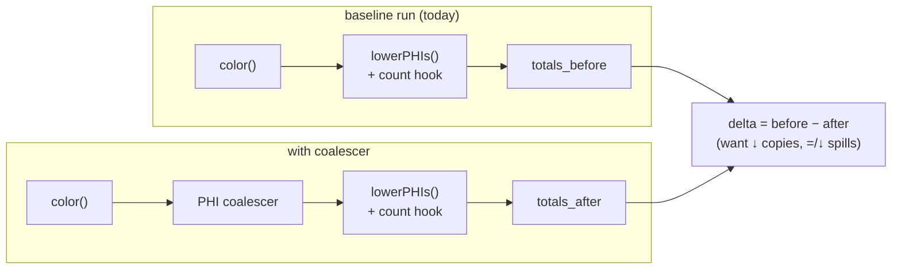

# SSA PHI Coalescer — Design (Hack §4.3, SSA-Maximize-Fixed-Points)

Design for the **real** PHI coalescer for the AMDGPU SSA register-allocation
stack. This is the fixed-point recoloring pass from the paper, **not** the
existing undef-PHI simplifier.

## Source Mapping
- **Component**: SSA PHI Coalescer (recoloring, fixed-point maximizing)
- **LLVM Target**: AMDGPU
- **File (symbolic, proposed)**: `llvm/lib/Target/AMDGPU/AMDGPUSSARegisterAllocator.cpp` (new coalescing phase between `color()` and `lowerPHIs()`)
- **Paper**: Hack, Grund & Goos, *Register Allocation for Programs in SSA-Form*, CC'06, §4.3 (SSA-Maximize-Fixed-Points).

### Related
- [[SSA_RA_Coloring]] — the phase that runs immediately before this one.
- [[SSA_Register_Allocator_Impl]] — `color()`, `lowerPHIs()`, `resolvePermutation()`.
- [[SSA_Destruction]] — where fixed points turn into "no copy".

---

## 1. Two different passes called "PHI coalescer"

| | Undef-PHI simplifier (**done**) | Fixed-point coalescer (**this doc**) |
|---|---|---|
| File | `AMDGPUPHICoalescer.cpp` | new phase in `AMDGPUSSARegisterAllocator.cpp` |
| Runs | **before** the spiller | **after** `color()`, **before** `lowerPHIs()` |
| Operates on | MIR (flags/folds PHIs) | the **coloring** (re-picks physregs) |
| Removes | *artificial* diamond-merge φs (one real op, rest undef) | copies for *genuine* φs by aligning colors |
| Graph | edits MIR, deletes PHIs | **never touches interference graph** |

They are complementary. The simplifier deletes φs that never should have existed;
this coalescer minimizes copies for the φs that legitimately remain.

---

## 2. The invariant that shapes everything

> **Coalescing re-picks colors only. It never merges interference-graph nodes.**

Conventional coalescing merges `y` and `x_i` into one graph node, which can raise
the chromatic number and **force a spill** (paper Fig.1: merging `d,g,f` pushes
χ from 2 → 3). Hack avoids this entirely: the graph is untouched, so it stays
**chordal**, χ stays `= max clique`, and **coalescing can never introduce a
spill.** Every design decision below serves this invariant.

> **The deeper point — coloring is *already done* when this pass runs.** The
> optimal `k`-coloring is produced by the chordal PEO `color()` pass
> ([[SSA_RA_Coloring]]) *before* the coalescer. The coalescer **never colors and
> never re-colors** — it only *shuffles an existing valid coloring* (permuting
> colors already assigned) to align φ endpoints, and it **bails the instant a
> shuffle doesn't fit**. Two consequences fall straight out of this:
>
> - **It cannot reopen NP-completeness.** Coloring is not being solved here; a
>   finished, valid coloring is only being permuted. No search, no backtracking.
> - **It cannot ever introduce a spill.** The number of colors in use never rises
>   (a swap exchanges existing colors), so a function that fit in `k` registers
>   before the pass still fits after.
>
> Keep this in mind through §5–§6: everything the Test phase does is a *bounded
> shuffle of an already-optimal coloring*, not a coloring attempt.

---

## 3. Where it sits



`color()` today calls `pickFreePhysReg` with **zero φ-affinity**, so nearly every
φ operand becomes an edge copy in `lowerPHIs()`. The coalescer's entire job is to
recolor so that φ result and operands share a register — turning those copies
into **fixed points** (no copy emitted).

---

## 4. Objective: maximize weighted fixed points

For φ `y ← φ(x₁,…,xₙ)` under coloring `f`, operand `xᵢ` is a **fixed point** iff
`f(xᵢ) = f(y)` → **no copy** on edge `i`. Cost (paper eq.1):

```
cost_f(y, xᵢ) = w_i   if f(xᵢ) ≠ f(y)      (a copy must be emitted)
             = 0      if f(xᵢ) = f(y)      (fixed point)
```

`w_i = 2^loopdepth(edge i)` so loop-carried φs coalesce first. Minimizing total
cost = maximizing weighted fixed points. This is exactly **fewer entries handed
to `resolvePermutation()`** — the coalescer and swap-based destruction are the
two halves that meet.

---

## 5. The data structures and how they nest

This is the part to get clear before any code. Three nested objects: **OptUnit**
⊃ per-color **PQ entries**, each holding a **conflict graph** and a **StableSet**.

### 5.1 The whole picture

```
                       ┌─────────────────────────────────────────────────────┐
                       │  OptimizationUnit  ω  (one per φ)                     │
                       │                                                       │
   φ: y ← φ(x1,x2,x3)  │   result  y   (always kept; anchors every StableSet)  │
                       │   operands { x1, x2, x3 }  minus any that interfere y │
                       │                                                       │
                       │   PriorityQueue (ordered by gain, descending)         │
                       │   ┌──────────────┬──────────────┬──────────────┐     │
                       │   │ Entry E_cA   │ Entry E_cB   │ Entry E_cC   │ ... │
                       │   │ color = cA   │ color = cB   │ color = cC   │     │
                       │   │ ConflictG C  │ ConflictG C  │ ConflictG C  │     │
                       │   │ StableSet S  │ StableSet S  │ StableSet S  │     │
                       │   │ gain=Σ w∈S   │ gain=Σ w∈S   │ gain=Σ w∈S   │     │
                       │   └──────────────┴──────────────┴──────────────┘     │
                       └─────────────────────────────────────────────────────┘
```

- **One OptUnit per φ.** It owns the result `y`, the eligible operands, and one
  PQ **entry per candidate color**.
- **One entry per color `c`.** "If we tried to paint this φ's members color `c`,
  which of them could all take `c` together, and what would that win?"
- The entry's **StableSet `S_c`** answers "which of them together" (a set with no
  internal conflict — they can *all* be `c` at once).
- The entry's **ConflictGraph `C_c`** is the bookkeeping that *shrinks* `S_c` as
  the Test phase discovers members that can't actually get `c`.
- **gain** = Σ weights of members in `S_c` — how many weighted fixed points this
  color would buy. The PQ pops highest-gain first.

### 5.2 OptUnit construction — who is even eligible



An operand that is simultaneously live with `y` can never be the same color, so
it is excluded up front — it would only ever add conflict, never a fixed point.

### 5.3 One PQ entry, unfolded

`y` is in **every** StableSet by construction (the φ result is what we are trying
to give a color; its weight is arbitrary/anchor). The operands join `S_c` only if
they can co-exist with `y` and each other at color `c`.

```
Entry E_c  (candidate color c):

   ConflictGraph C_c            StableSet S_c (max weighted, no internal edge)
   nodes = { y, x1, x2, x3 }        ┌─────────────────────────┐
   edges = interference AMONG       │  y      (anchor, w = *)  │
   OPERANDS only — y is isolated    │  x1     (w = w_1)        │
   (any xi interfering with y was   │  x3     (w = w_3)        │
   already dropped in §5.2)         └─────────────────────────┘

        y   (isolated)              x2 excluded here: it conflicts
                                    with x1 inside C_c (edge x1─x2),
        x1 ── x2      x3            and w_1 > w_2, so the max-weighted
                                    stable set keeps x1, drops x2.
   gain(E_c) = w_1 + w_3 (+ y's anchor weight)
```

Note `y` has **no edge to any operand** — that is the whole point of the §5.2
eligibility filter. The only edges in `C_c` are operand–operand interferences
(here `x1─x2`); they decide which operands can share color `c` *with each other*,
never whether an operand can share with `y`.

As the Test phase fails to give a member color `c`, it **adds an edge into
`C_c`**, which forces `S_c` to be recomputed smaller. Worst case `S_c` collapses
to just `{ y }` and the entry is worthless — which is exactly why Test always
terminates (§6).

---

## 6. The three phases (Init → Test → Apply)



**Why Test terminates:** every unsuccessful attempt *adds an edge* to some `C_c`,
monotonically shrinking future stable sets. In the limit `S_c = {y}` (nothing to
recolor), so the queue drains. (Paper: "the Test-Phase always terminates, since
in each step an edge is added to the conflict graph.")

**Recursive recolor applies to EVERY member of `S_c`, not just `y`.** Realizing
an entry means recoloring *each* `u ∈ S_c` (that is `y` **and** every selected
`xᵢ`) to `c`. The paper is explicit: "We try to change the color for each
`u ∈ {y, x₁,…,xₘ}` to `c`." `S_c` only guarantees the members don't conflict *with
each other* at `c` (it is stable inside `C_c`). It says **nothing** about the rest
of the function, so each member's recolor is a separate operation that must be
reconciled against the **full interference-graph coloring**:

- For each `u ∈ S_c`, look at `u`'s neighbors **in the whole interference graph**
  (not just the other OptUnit members). Any neighbor `n` currently holding `c`
  collides with `u`.
- Resolve the collision by a **swap, not a free recolor**: `n` inherits `u`'s
  *former* color (paper: "we annotate `n` with the former color of `u`"). This may
  in turn collide with `n`'s own neighbor, so the swap propagates recursively —
  but every step only ever *exchanges colors already in use*, never searches for
  a new assignment.
- A swap that cannot be completed (`n` is pinned by another ω, or `n` is itself an
  OptUnit member that needs `c`) is not chased further: it feeds an edge back into
  `C_c`, shrinks `S_c`, and the entry is requeued (branches T4/T5 above).

So "take care of every `x` in `S_c`'s interference" is exactly right — but the
"care" is bounded, and that boundedness is the answer to the NP worry below.

> ### Why this is NOT back to NP-complete optimal coloring
>
> The fear is legitimate: *arbitrary* recoloring of neighbors is graph coloring,
> which is NP-complete. This algorithm sidesteps it three ways:
>
> 1. **It's a swap, not a search.** A displaced neighbor `n` gets `u`'s *old*
>    color — a specific, already-legal color — not "some free color we go hunting
>    for." The coloring produced by `color()` (§[[SSA_RA_Coloring]]) is already a
>    complete, valid `k`-coloring; Test only *permutes* colors within it. Number
>    of colors never rises, so **it can never turn a colorable function into a
>    spill** (the invariant of §2).
> 2. **Every failure is terminal, not backtracked.** When a swap can't complete,
>    the algorithm does **not** try another color for `n` or explore alternatives.
>    It gives up on that member, records an edge in `C_c`, and moves on. There is
>    no search tree — each conflict monotonically *adds* an edge, so the process
>    strictly descends (§"Why Test terminates"). Worst case `S_c` collapses to
>    `{y}` and the entry is dropped.
> 3. **It's a heuristic, and admits it.** The paper's problem
>    (SSA-Maximize-Fixed-Points) *is* NP-complete (their Theorem 3). This is the
>    *heuristic* that approximates it — it does not claim the optimum. It trades
>    optimality for a polynomial, bail-out-on-conflict procedure that their
>    measurements show still captures >95% of the optimizable copy cost.
>
> In short: **optimal coloring is already done** by the chordal PEO coloring
> *before* this pass. The coalescer never re-solves coloring; it only shuffles an
> existing valid coloring to align φ endpoints, bailing the instant a shuffle
> doesn't fit.

This is exactly what `resolvePermutation()`/`emitSwap()` already do at destruction
— permute among assigned registers — so the coalescer is just deciding *which*
permutations are worth having.

> **Subtle point — members of `S_c` never collide with each other.** By
> construction `S_c` is stable in `C_c`, so no two members interfere; giving them
> all `c` is internally consistent. Every collision handled above is between an
> `S_c` member and a **non-member** neighbor in the interference graph.

---

## 7. Worked example — scalar φ (paper-style)

```
        f(y)=R2 initially, operands live on different edges

  φ:  y ← φ(x1, x2)        f: x1→R1, x2→R3, y→R2
```

- OptUnit ω = {y, x1, x2} (neither interferes with y).
- Entry E_R1: put y at R1. x1 already R1 → fixed point for x1. x2 (R3) would
  need recolor to R1 but conflicts with x1 → excluded. `S_R1 = {y, x1}`,
  gain = w_1.
- Entry E_R3: symmetric, `S_R3 = {y, x2}`, gain = w_2.
- Suppose edge for x1 is loop-carried: w_1 = 4 > w_2 = 1. PQ pops E_R1.
  Test succeeds → **pin y=R1, x1=R1**. One copy (x2→y on its edge) remains
  instead of two. Net: one fewer `resolvePermutation` entry, on the hot edge.

---

## 8. AMDGPU wrinkle — sub-register / tuple φs

The paper is scalar-RISC. Our φs carry `%x.sub0` sources and tuple results, so
"same color" and "interfere" must be evaluated **per lane**, not per whole
register. This is the biggest deviation and the main risk.

### 8.1 Concrete tuple φ

```
  %y:vreg_64 = PHI %a:vreg_64,        %bb.1,        ; whole-reg source
                   %b.sub0_sub1,      %bb.2         ; sub-register source
```

A "fixed point" is now **per lane**: `y.sub0` can be a fixed point with
`a.sub0`/`b.sub0` while `y.sub1` is not. So the OptUnit member is not "operand
`xᵢ`" but "**(operand, lane)**".

```
   OptUnit for a vreg_64 φ, expanded to lanes:

   result lanes:   y.sub0     y.sub1
                     │          │
   operand a:      a.sub0     a.sub1     (edge bb.1, weight w_1)
   operand b:      b.sub0     b.sub1     (edge bb.2, weight w_2)

   A candidate color c is a vreg_64 physreg pair (csub0, csub1).
   Fixed points are counted lane-by-lane:
     y.sub0=cA.sub0 == a.sub0 ?  → lane-0 fixed point on edge bb.1
     y.sub1=cA.sub1 == a.sub1 ?  → lane-1 fixed point on edge bb.1
```

### 8.2 Design choices to lock down

1. **Granularity.** Model OptUnit members as `(vreg, subLaneMask)` and count
   fixed points per covered lane. Interference queries hit `LiveIntervals` with
   the lane mask. (See how the spiller already reasons in `VRegMaskPair`.)
2. **Weighting.** `w = 2^loopdepth` of the incoming edge; a partially-coalesced
   tuple still saves the lanes it aligned.
3. **Tied / two-address groups.** `color()` inherits colors across ties
   (`AMDGPUSSARegisterAllocator.cpp` tied path). Recoloring a vreg that is tied
   elsewhere must move the **whole tie group** together, or skip the member.
   Needs an explicit rule before implementation.
4. **Alignment classes.** VGPR/SGPR tuple alignment constraints restrict which
   physregs are candidate colors `c`; enumerate only class-legal, aligned
   colors in Init.

---

## 9. Measurement infrastructure (Step 0 — build this first)

Nothing in §5–§8 can be evaluated without a number that says "how many copies do
we emit today, and did a change make it better or worse." This is that number.
It must exist **before** any coalescer code, because it is simultaneously the
**baseline** (what the naive coloring costs) and the **regression guard** (every
later step is "metric went down, spill count did not go up").

### 9.1 What exactly to count — the hook point already exists

The copy-vs-fixed-point decision is *already* made, once per φ operand, at a
single line in `lowerPHIs()`:

```cpp
// AMDGPUSSARegisterAllocator.cpp  (inside the per-operand loop)
if (SrcPhys != DstPhys)
    PredCopies[Pred].push_back({SrcPhys, DstPhys});   // <-- NOT a fixed point
// else: SrcPhys == DstPhys  -> fixed point, no copy emitted
```

- `SrcPhys == DstPhys` → **fixed point**, zero cost. This is exactly what the
  coalescer is trying to manufacture.
- `SrcPhys != DstPhys` → a copy the coalescer *might* have eliminated.

So the metric taps this decision. Note it is a **post-coloring, pre-lowering**
property: deterministic, and it is precisely the quantity the coalescer moves.

### 9.2 Two numbers, not one

A single "copy count" hides the thing we actually pay for. Track both:

| Metric | What it is | Why |
|---|---|---|
| **Static φ-copy count** | # of φ operands with `SrcPhys != DstPhys` | direct, coalescer-visible; the objective it optimizes |
| **Weighted φ-copy cost** | `Σ 2^loopdepth(Pred)` over those operands | matches the paper's `cost_f` (eq.1); a loop-carried copy is worth 2^depth of an entry-block copy |

Optionally a third, **emitted-instruction count** (after `resolvePermutation`):
a permutation *cycle* becomes 1–3 swap instructions (`emitSwap`), a *chain*
becomes N moves, undef edges become `IMPLICIT_DEF`. This is the true dynamic
cost, but it is noisier and lowering-dependent — keep it as a secondary check,
optimize against the weighted static cost.

### 9.3 How to expose it

Two channels, both cheap:

1. **`STATISTIC` counters** — for aggregate corpus runs (`-stats`):

   ```cpp
   STATISTIC(NumPhiCopies,       "PHI operands lowered to a copy (not a fixed point)");
   STATISTIC(NumPhiFixedPoints,  "PHI operands that were already fixed points");
   STATISTIC(NumPhiCopyWeight,   "Sum of 2^loopdepth over PHI-copy operands");
   ```

   Increment at the hook in §9.1. `NumPhiCopyWeight` needs
   `MachineLoopInfo` (loop depth of `Pred`); it is already available in the RA
   pass or added as an analysis dependency.

2. **Per-function remark / debug dump** — for A/B on a single test:

   ```
   -mllvm -debug-only=amdgpu-phi-metric   (or a MachineOptimizationRemarkEmitter)
   phi-metric  foo:  copies=42  fixed=17  weighted=136  (loops: bb.3 depth2 x8)
   ```

   Emit one line per function so a diff of two `llc` runs is a diff of these
   lines. This is the harness the staging table (§10) checks each step against.

### 9.4 Where the counting lives

The count belongs at the `lowerPHIs()` hook (§9.1) because that is the
ground-truth point where a copy is or isn't emitted — it stays correct no matter
what the coalescer does upstream. Structure it as a tiny helper so it can run in
**two modes**:

- **Measure-only** (coalescer off): the baseline. Run over the corpus now, before
  writing any coalescer, and record the totals.
- **After-coalescer**: same helper, same run, coalescer on. The delta is the win.



### 9.5 Guard rails

The metric is only trustworthy paired with a **spill counter** — the §2 invariant
promises coalescing never adds a spill, and the metric must be able to *prove*
that on the corpus, not just assert it. Reuse the existing spill/occupancy/scratch
accounting the corpus harness already reports (same run used for the naive-pass
verification under `08-Worklog/2026-07-14-phicoalescer/`). A step is accepted only
when:

```
weighted φ-copy cost:   strictly down (or equal)
spill count / scratch:  not up
occupancy:              not down
```

That triple is the acceptance test for every row of §10.

---

## 10. Staging plan (verifiable increments)

| Step | Deliverable | Verify against |
|---|---|---|
| 0 | **Copy-count metric**: weighted count of copies `lowerPHIs` emits today | baseline number; regression guard |
| 1 | **Option B**: affinity bias inside `color()` (prefer operand/result colors) | metric drops; no spill regression |
| 2 | **Option A single-φ**: Init/Test/Apply for one φ at a time, scalar | metric drops further |
| 3 | **Cross-φ pinning**: pinned-candidate handling across OptUnits | paper's ≥95% territory |
| 4 | **Sub-register lanes**: `(vreg, laneMask)` members (§8) | tuple φ tests |

Land the metric first (§9) — it is both the baseline and the guard for every
later step. Each step is checkable with the §9.5 acceptance triple: "weighted
copy count went down, spill count did not go up, occupancy did not drop".

### 10.1 Status (2026-07-14)

| Step | State | Result |
|---|---|---|
| 0 metric | ✅ done | baseline: 26766 static / 29889 weighted φ-copies |
| 1 Option B | ✅ done, corpus-accepted | weighted −62% cumulative; CRASH 55→47; zero real occupancy/scratch loss |
| 1b sub-register hints | ✅ done (part of the greedy pass, **not** the §8 lane coalescer) | both directions: `getSubReg` (result←wide-operand slice) and `getMatchingSuperReg` (wide-operand→narrow-result, loop-carried tuple). Direction B alone fixed −8 crashes |
| 2 Option A single-φ | ⏳ next | — |
| 3 cross-φ pinning | 🔮 later | — |
| 4 sub-register lanes (per-lane OptUnit) | 🔮 later | greedy sub-reg hints (1b) are a *cheaper subset*; per-lane *partial* tuple fixed points still need Option A |

Implementation lives in `ssara-claude` (uncommitted); collected as patches under
`../../08-Worklog/2026-07-14-phicoalescer/promote/`. Note steps 1/1b are
**affinity-biased greedy coloring**, not the paper's recoloring coalescer — they
capture fixed points that are *free to grab* in one forward pass, never recolor.

### 10.2 The feasibility ceiling is near-total (motivates Option A)

The Step-0 metric was extended with a **lane-accurate** feasibility test:
interference is checked at read-lane granularity (subrange overlap restricted to
the operand's `getSubRegIndexLaneMask`), not whole-vreg — a whole-vreg overlap
falsely rejects a sub-register operand whose sibling lanes are live but whose read
lane is not. Corpus result: of the residual φ-copies after greedy, only
**24 (0.2%) are genuinely infeasible** (read-lane interferes with the result);
**99.8% are feasible** — i.e. coalescable in principle by a recoloring pass.

So greedy (steps 1/1b) is *far* from the ceiling: it leaves a large feasible
remainder it cannot take because it never recolors an already-placed operand.
That remainder is exactly Option A's target. Caveat: 99.8% is a *necessary-
condition* upper bound (no read-lane/result interference); it ignores cross-φ
color contention, so Option A's real yield is below it.

---

## 11. Open questions

- Do we run recoloring globally (all φs into one PQ, paper-style cross-ω pinning)
  or per-region to bound cost on huge functions?
- Interference source during recoloring: query `LiveIntervals` directly per
  candidate, or cache a small per-φ conflict graph? (Paper caches `C_c`.)
- How aggressively to enumerate candidate colors for wide tuples (alignment
  explodes the color set) — cap at operands' current colors + a few frees?
