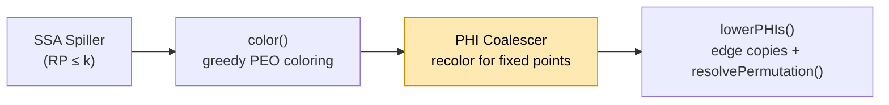
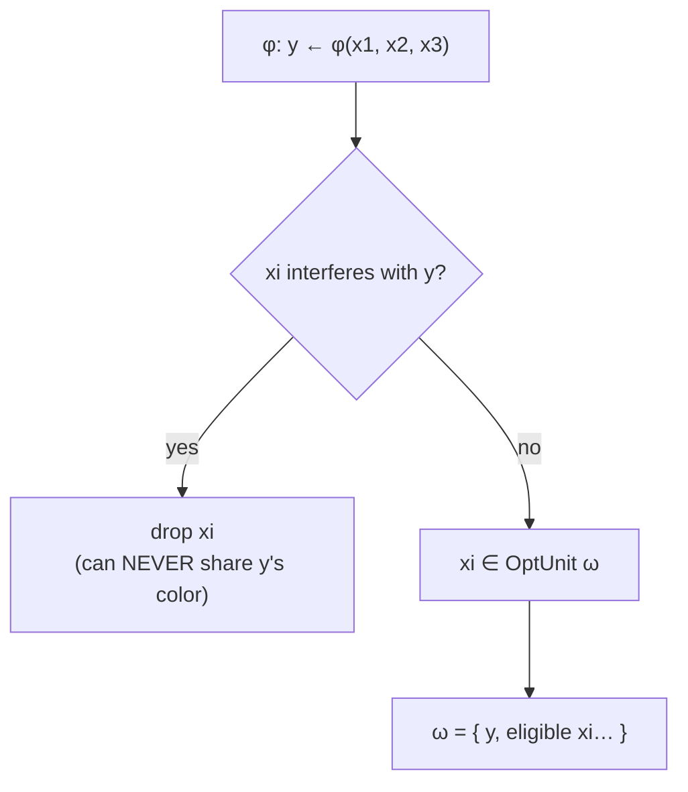
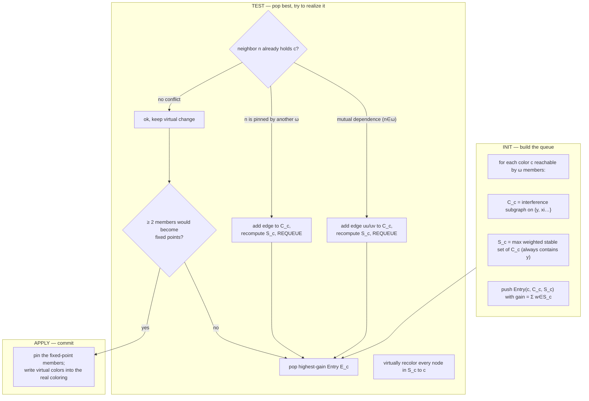

# SSA PHI Coalescer — Design (Hack §4.3, SSA-Maximize-Fixed-Points)

Design for the **real** PHI coalescer for the AMDGPU SSA register-allocation
stack. This is the fixed-point recoloring pass from the paper, **not** the
existing undef-PHI simplifier.

## Source Mapping
- **Component**: SSA PHI Coalescer (recoloring, fixed-point maximizing)
- **LLVM Target**: AMDGPU
- **File (symbolic, proposed)**: `llvm/lib/Target/AMDGPU/AMDGPUSSARegisterAllocator.cpp` (new coalescing phase between `color()` and `lowerPHIs()`)
- **Paper**: Hack, Grund & Goos, *Register Allocation for Programs in SSA-Form*, CC'06, §4.3 (SSA-Maximize-Fixed-Points).

### Related
- [[SSA_RA_Coloring]] — the phase that runs immediately before this one.
- [[SSA_Register_Allocator_Impl]] — `color()`, `lowerPHIs()`, `resolvePermutation()`.
- [[SSA_Destruction]] — where fixed points turn into "no copy".

---

## 1. Two different passes called "PHI coalescer"

| | Undef-PHI simplifier (**done**) | Fixed-point coalescer (**this doc**) |
|---|---|---|
| File | `AMDGPUPHICoalescer.cpp` | new phase in `AMDGPUSSARegisterAllocator.cpp` |
| Runs | **before** the spiller | **after** `color()`, **before** `lowerPHIs()` |
| Operates on | MIR (flags/folds PHIs) | the **coloring** (re-picks physregs) |
| Removes | *artificial* diamond-merge φs (one real op, rest undef) | copies for *genuine* φs by aligning colors |
| Graph | edits MIR, deletes PHIs | **never touches interference graph** |

They are complementary. The simplifier deletes φs that never should have existed;
this coalescer minimizes copies for the φs that legitimately remain.

---

## 2. The invariant that shapes everything

> **Coalescing re-picks colors only. It never merges interference-graph nodes.**

Conventional coalescing merges `y` and `x_i` into one graph node, which can raise
the chromatic number and **force a spill** (paper Fig.1: merging `d,g,f` pushes
χ from 2 → 3). Hack avoids this entirely: the graph is untouched, so it stays
**chordal**, χ stays `= max clique`, and **coalescing can never introduce a
spill.** Every design decision below serves this invariant.

---

## 3. Where it sits



`color()` today calls `pickFreePhysReg` with **zero φ-affinity**, so nearly every
φ operand becomes an edge copy in `lowerPHIs()`. The coalescer's entire job is to
recolor so that φ result and operands share a register — turning those copies
into **fixed points** (no copy emitted).

---

## 4. Objective: maximize weighted fixed points

For φ `y ← φ(x₁,…,xₙ)` under coloring `f`, operand `xᵢ` is a **fixed point** iff
`f(xᵢ) = f(y)` → **no copy** on edge `i`. Cost (paper eq.1):

```
cost_f(y, xᵢ) = w_i   if f(xᵢ) ≠ f(y)      (a copy must be emitted)
             = 0      if f(xᵢ) = f(y)      (fixed point)
```

`w_i = 2^loopdepth(edge i)` so loop-carried φs coalesce first. Minimizing total
cost = maximizing weighted fixed points. This is exactly **fewer entries handed
to `resolvePermutation()`** — the coalescer and swap-based destruction are the
two halves that meet.

---

## 5. The data structures and how they nest

This is the part to get clear before any code. Three nested objects: **OptUnit**
⊃ per-color **PQ entries**, each holding a **conflict graph** and a **StableSet**.

### 5.1 The whole picture

```
                       ┌─────────────────────────────────────────────────────┐
                       │  OptimizationUnit  ω  (one per φ)                     │
                       │                                                       │
   φ: y ← φ(x1,x2,x3)  │   result  y   (always kept; anchors every StableSet)  │
                       │   operands { x1, x2, x3 }  minus any that interfere y │
                       │                                                       │
                       │   PriorityQueue (ordered by gain, descending)         │
                       │   ┌──────────────┬──────────────┬──────────────┐     │
                       │   │ Entry E_cA   │ Entry E_cB   │ Entry E_cC   │ ... │
                       │   │ color = cA   │ color = cB   │ color = cC   │     │
                       │   │ ConflictG C  │ ConflictG C  │ ConflictG C  │     │
                       │   │ StableSet S  │ StableSet S  │ StableSet S  │     │
                       │   │ gain=Σ w∈S   │ gain=Σ w∈S   │ gain=Σ w∈S   │     │
                       │   └──────────────┴──────────────┴──────────────┘     │
                       └─────────────────────────────────────────────────────┘
```

- **One OptUnit per φ.** It owns the result `y`, the eligible operands, and one
  PQ **entry per candidate color**.
- **One entry per color `c`.** "If we tried to paint this φ's members color `c`,
  which of them could all take `c` together, and what would that win?"
- The entry's **StableSet `S_c`** answers "which of them together" (a set with no
  internal conflict — they can *all* be `c` at once).
- The entry's **ConflictGraph `C_c`** is the bookkeeping that *shrinks* `S_c` as
  the Test phase discovers members that can't actually get `c`.
- **gain** = Σ weights of members in `S_c` — how many weighted fixed points this
  color would buy. The PQ pops highest-gain first.

### 5.2 OptUnit construction — who is even eligible



An operand that is simultaneously live with `y` can never be the same color, so
it is excluded up front — it would only ever add conflict, never a fixed point.

### 5.3 One PQ entry, unfolded

`y` is in **every** StableSet by construction (the φ result is what we are trying
to give a color; its weight is arbitrary/anchor). The operands join `S_c` only if
they can co-exist with `y` and each other at color `c`.

```
Entry E_c  (candidate color c):

   ConflictGraph C_c            StableSet S_c (max weighted, no internal edge)
   nodes = { y, x1, x2, x3 }        ┌─────────────────────────┐
   initial edges = interference     │  y      (anchor, w = *)  │
   among them                       │  x1     (w = w_1)        │
                                    │  x3     (w = w_3)        │
        x1 ── x2                    └─────────────────────────┘
         │                          x2 excluded here: it conflicts
         y ── x3?                   with x1 inside C_c → cannot be c
                                    together with x1.
   gain(E_c) = w_1 + w_3 (+ y's anchor weight)
```

As the Test phase fails to give a member color `c`, it **adds an edge into
`C_c`**, which forces `S_c` to be recomputed smaller. Worst case `S_c` collapses
to just `{ y }` and the entry is worthless — which is exactly why Test always
terminates (§6).

---

## 6. The three phases (Init → Test → Apply)



**Why Test terminates:** every unsuccessful attempt *adds an edge* to some `C_c`,
monotonically shrinking future stable sets. In the limit `S_c = {y}` (nothing to
recolor), so the queue drains. (Paper: "the Test-Phase always terminates, since
in each step an edge is added to the conflict graph.")

**Recursive recolor (the swap cascade):** giving `y` color `c` when neighbor `n`
holds `c` tries to move `n` to another color, which may displace `n`'s neighbor,
etc. This mirrors what `resolvePermutation()`/`emitSwap()` already do at
destruction — the coalescer is deciding *which* permutations are worth having.

---

## 7. Worked example — scalar φ (paper-style)

```
        f(y)=R2 initially, operands live on different edges

  φ:  y ← φ(x1, x2)        f: x1→R1, x2→R3, y→R2
```

- OptUnit ω = {y, x1, x2} (neither interferes with y).
- Entry E_R1: put y at R1. x1 already R1 → fixed point for x1. x2 (R3) would
  need recolor to R1 but conflicts with x1 → excluded. `S_R1 = {y, x1}`,
  gain = w_1.
- Entry E_R3: symmetric, `S_R3 = {y, x2}`, gain = w_2.
- Suppose edge for x1 is loop-carried: w_1 = 4 > w_2 = 1. PQ pops E_R1.
  Test succeeds → **pin y=R1, x1=R1**. One copy (x2→y on its edge) remains
  instead of two. Net: one fewer `resolvePermutation` entry, on the hot edge.

---

## 8. AMDGPU wrinkle — sub-register / tuple φs

The paper is scalar-RISC. Our φs carry `%x.sub0` sources and tuple results, so
"same color" and "interfere" must be evaluated **per lane**, not per whole
register. This is the biggest deviation and the main risk.

### 8.1 Concrete tuple φ

```
  %y:vreg_64 = PHI %a:vreg_64,        %bb.1,        ; whole-reg source
                   %b.sub0_sub1,      %bb.2         ; sub-register source
```

A "fixed point" is now **per lane**: `y.sub0` can be a fixed point with
`a.sub0`/`b.sub0` while `y.sub1` is not. So the OptUnit member is not "operand
`xᵢ`" but "**(operand, lane)**".

```
   OptUnit for a vreg_64 φ, expanded to lanes:

   result lanes:   y.sub0     y.sub1
                     │          │
   operand a:      a.sub0     a.sub1     (edge bb.1, weight w_1)
   operand b:      b.sub0     b.sub1     (edge bb.2, weight w_2)

   A candidate color c is a vreg_64 physreg pair (csub0, csub1).
   Fixed points are counted lane-by-lane:
     y.sub0=cA.sub0 == a.sub0 ?  → lane-0 fixed point on edge bb.1
     y.sub1=cA.sub1 == a.sub1 ?  → lane-1 fixed point on edge bb.1
```

### 8.2 Design choices to lock down

1. **Granularity.** Model OptUnit members as `(vreg, subLaneMask)` and count
   fixed points per covered lane. Interference queries hit `LiveIntervals` with
   the lane mask. (See how the spiller already reasons in `VRegMaskPair`.)
2. **Weighting.** `w = 2^loopdepth` of the incoming edge; a partially-coalesced
   tuple still saves the lanes it aligned.
3. **Tied / two-address groups.** `color()` inherits colors across ties
   (`AMDGPUSSARegisterAllocator.cpp` tied path). Recoloring a vreg that is tied
   elsewhere must move the **whole tie group** together, or skip the member.
   Needs an explicit rule before implementation.
4. **Alignment classes.** VGPR/SGPR tuple alignment constraints restrict which
   physregs are candidate colors `c`; enumerate only class-legal, aligned
   colors in Init.

---

## 9. Staging plan (verifiable increments)

| Step | Deliverable | Verify against |
|---|---|---|
| 0 | **Copy-count metric**: weighted count of copies `lowerPHIs` emits today | baseline number; regression guard |
| 1 | **Option B**: affinity bias inside `color()` (prefer operand/result colors) | metric drops; no spill regression |
| 2 | **Option A single-φ**: Init/Test/Apply for one φ at a time, scalar | metric drops further |
| 3 | **Cross-φ pinning**: pinned-candidate handling across OptUnits | paper's ≥95% territory |
| 4 | **Sub-register lanes**: `(vreg, laneMask)` members (§8) | tuple φ tests |

Land the metric first — it is both the baseline and the guard for every later
step. Each step is checkable as "weighted copy count went down, spill count did
not go up".

---

## 10. Open questions

- Do we run recoloring globally (all φs into one PQ, paper-style cross-ω pinning)
  or per-region to bound cost on huge functions?
- Interference source during recoloring: query `LiveIntervals` directly per
  candidate, or cache a small per-φ conflict graph? (Paper caches `C_c`.)
- How aggressively to enumerate candidate colors for wide tuples (alignment
  explodes the color set) — cap at operands' current colors + a few frees?
