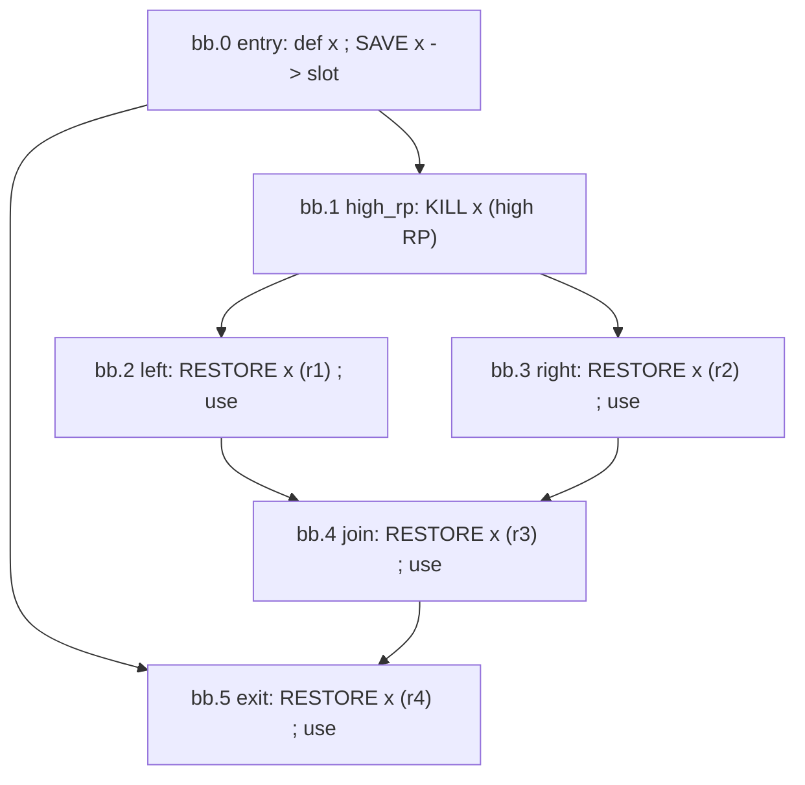
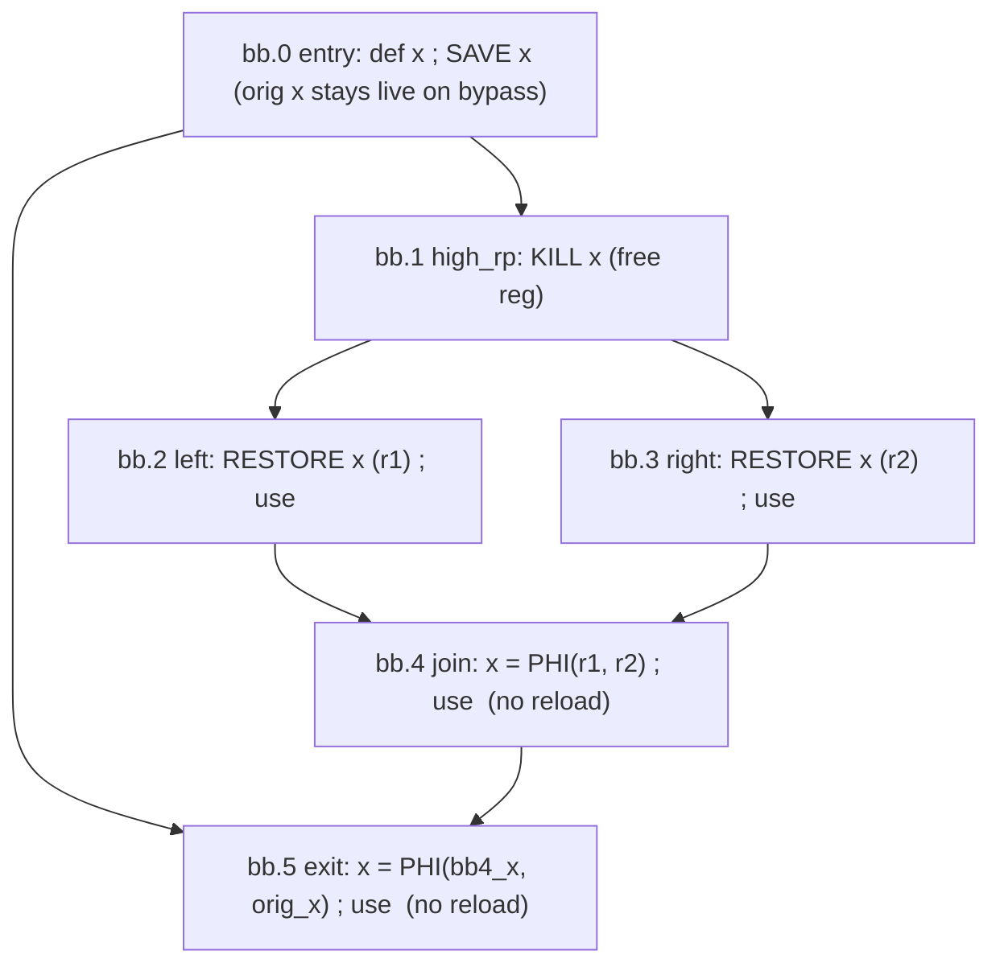

# Correct Minimal Reload Placement (Cut-LI + Dominance-Ordered Reconstruction)

## Summary

The SSA spiller must, for a spilled value `x`, make `x` available again before each
downstream use. The correct, minimal behavior is live-range-splitting SSA spilling:

- an in-register live range of the original `x` survives on every path that was not
  actually spilled,
- a reloaded range is created only inside the register-freed region,
- PHIs rejoin the two at every control-flow merge where the reaching values differ.

This note describes how to obtain that behavior by (1) cutting the frozen copy of
`x`'s `LiveInterval` at the kill point so the freed region is encoded as
"no reaching VNInfo", and (2) a single dominance-ordered pass that reloads on demand
and lets the existing reaching-VNI reconstruction insert the PHIs. It needs no
kill-dominance computation and no reload optimizer.

## 1. Problem

The spiller stores `x` at its definition (dominates all paths) and must then make `x`
available before each use. Today it reloads before *every* use reachable from the kill,
including uses at CFG joins whose predecessors already hold `x` in registers. Those join
reloads are redundant, and the original value is discarded even on paths that never
spilled.

Actual output of `spill-diamond-phi-merge.mir` today (`x` reloaded 4 times, zero
spiller-created PHIs):

`bb.4` reloads `x` (r3) although `r1` (from `bb.2`) and `r2` (from `bb.3`) already hold
`x` in registers on both incoming edges. The correct result is `x = PHI(r1, r2)` in
`bb.4`, and `bb.5` is `x = PHI(bb.4 value, original x from the bypass)`.

## 2. Core rule (PHIs are automatic; only placement is a decision)

At every use, look at the reaching VNInfo of `x` in the (recomputed) `LI(x)`:

- one value (original or a reload) -> rewrite the use to it;
- values differ on incoming edges -> `LiveIntervalCalc` has already recorded that merge
  as an `isPHIDef` VNInfo at the exact merge point; materialize a PHI there and rewrite
  the use to it.

A PHI exists iff the reaching values differ. This is precisely the existing reaching-VNI
reconstruction (`MachineLaneSSAUpdater::rewriteUseReaching` +
`insertLaneAwarePHI`, which reads `isPHIDef` VNInfos). It delivers, for free:

- originals surviving on non-spilled paths,
- PHIs at every differing merge (original-vs-reload, reload-vs-reload), at the
  auto-computed merge point,
- per-lane merges for partial spills.

So the only real decision is reload placement: place reloads minimally (only where the
register was actually freed and no dominating reload is available), and do not discard
the original on non-spilled paths.

## 3. Availability via a cut LiveInterval (no dominance computation)

The updater already keeps a frozen copy of `x`'s original `LI` (the reaching-def oracle).
Cut it at the kill point -- model the original value as dying at the kill. Standard
liveness then encodes the freed region:

- a point reached ONLY through the kill has no original VNInfo after the cut ->
  `x` is spilled there -> needs a reload;
- a point reachable from the def AVOIDING the kill still has the original VNInfo ->
  `x` is available in its original register.

This is exactly the kill-dominance test, but computed by `LiveIntervals` rather than the
dominator tree -- and it is per-lane (subranges) and exact for arbitrary CFGs. As reloads
(redefs of `x`) are added, they contribute their own VNInfos; the working interval is
`LI(x)` = cut-original + reloads-so-far.

Availability at any use U is then a single reaching-VNInfo query on the working `LI(x)`:

- reaching VNInfo == original -> original available (clean path); keep it (no-op);
- reaching VNInfo == a reload or a PHI -> reloaded value available; reuse it;
- no reaching VNInfo -> freed and not yet reloaded -> insert a reload here;
- reaching VNInfos differ -> `isPHIDef` at the merge -> materialize the PHI.

No separate freed-region / kill-dominance computation is needed: the "no VNI" case IS the
freed region.

Notes: (1) the query runs on `LI(x)` INCLUDING reloads -- the reloads' VNInfos are what
turn a pure-kill join (diamond `bb.4`) into a PHI rather than a null; the cut removes only
the original's reach. (2) "cut at the kill" is a liveness recompute of the original with
the kill as an end-point (or model the kill as a range-ending use), applied to the frozen
copy. (3) Multiple spills / partial-lane spills: cut each kill point / the relevant
subrange; the subrange machinery already gives per-lane behavior.

## 4. Algorithm: dominance-ordered incremental reconstruction (no reload optimizer)

Precondition: the frozen `LI(x)` is cut at the kill (Section 3). Process `x`'s uses in
dominance order (dominators first), with the working `LI(x)` reflecting reloads/PHIs
inserted so far, so each use sees the availability created by its dominators. For each use
U, query the reaching value `V` and apply the single rule:

- `V` is a reload value (or PHI of reloads) -> rewrite U to it. No new reload.
  (Dominance-order reuse: a dominating use's reload is already available to U -- this is
  what removes the need for a sharing optimizer.)
- `V` is the ORIGINAL def -> keep the original (no-op); U is on a non-kill path.
- `V` is empty -> U is in the freed region with no dominating reload yet -> insert a reload
  at U (as late as possible); it redefines `x` and becomes available to everything U
  dominates.
- reaching values differ -> materialize the `isPHIDef` PHI at the merge and rewrite U.

Result: one reload per dom-subtree root in the freed region, surviving originals on
non-freed paths, PHIs at every differing merge -- in a single dominance-ordered pass over
LI queries.

No reload optimizer. Dominance-order processing makes a dominating reload automatically
available to dominated uses, so intra-chain sharing is free. The only thing dropped is
NCD-hoisting (sharing one reload among sibling uses by placing it at a common dominator
ABOVE them); that raises RP in the dominator region (against the spill's purpose) and is
usually blocked anyway. It can return later as an optional low-RP-only optimization.

Implementation note: availability must be visible incrementally. Either (a) update `LI(x)`
after each reload insertion, or (b) track the nearest dominating reload during the walk and
do one final recompute + the existing reconstruction. Either way the PHI/rewrite step is
the existing reconstruction; only reload-on-demand is folded into the walk.

## 5. Target result for the diamond

2 reloads (r1 in bb.2, r2 in bb.3) and 2 PHIs (bb.4, bb.5), versus 4 reloads today. Zero
reloads on the clean path: bb.5 merges the original register (from the bb.0 bypass, never
spilled) with the join value via a PHI.

## 6. Correctness and RP invariants

- Correctness: store-at-def dominates all reloads; PHIs merge same-value vregs; the
  reconstruction is already validated by the existing suites.
- RP-neutrality of merges: merged values are already live at predecessor ends; a PHI adds
  no new value in the high-RP region.
- No early rematerialization: never hoist a reload above a use into the pressure window
  just to form a PHI (the rejected IPDOM approach).

## 7. Edge cases

- Loops: back-edge availability (a value reloaded in the loop is available on the
  back-edge); header PHIs fall out of the recompute.
- Partial-lane spills: availability and PHIs are per subrange/lane group; cut the relevant
  subrange.
- Chains of joins: iterated PHIs (a PHI feeding a deeper join) via iterated `isPHIDef`
  VNInfos.
- Bypass/clean joins: the clean predecessor carries the ORIGINAL value in-register, so the
  join is a pure PHI merging original + reloaded; no reload on the clean path.

## 8. Implementation touchpoints (AMDGPUSSARegisterSpiller / MachineLaneSSAUpdater)

- Use collection / `buildDomGroupsForSpill`: stop treating every reachable use as a reload
  site; a use already reached by `x` (original or an earlier reload) gets no reload.
- `emitReloadsAndRepairSSA` / `getOrCreateReloadInBlock`: emit reloads only where the
  working `LI(x)` query returns empty; skip blocks the reconstruction covers by
  original-survival or a merge PHI.
- Preserve the original on non-spilled paths (do not rewrite those uses to reloads) -- this
  is automatic if no reload is placed there.
- `optimizeReloadPlacing`: bypassed in the spill path (dominance-order reuse replaces its
  intra-chain sharing; NCD-hoisting dropped as RP-costly). Kept as an optional future
  optimization.
- `MachineLaneSSAUpdater::insertLaneAwarePHI` / `rewriteUseReaching`: unchanged; only
  reload-on-demand is folded into the dominance-ordered walk.

## Related

- [[Reload_optimizer]] -- the previous NCD-hoisting optimizer (now bypassed).
- [[SSA_SPILLER_DESIGN]] -- overall spiller architecture.
- [[MachineLaneSSAUpdater]] -- the reaching-VNI reconstruction that inserts the PHIs.
