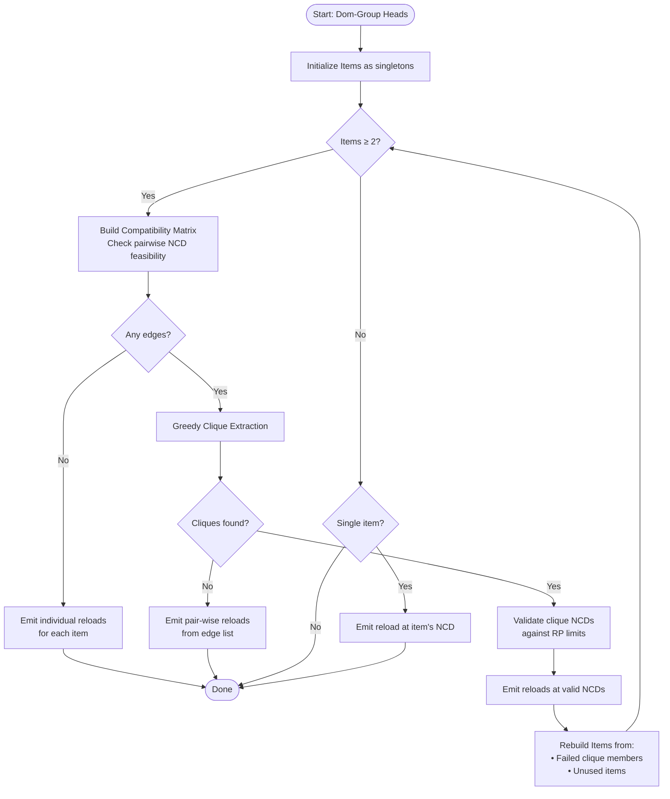
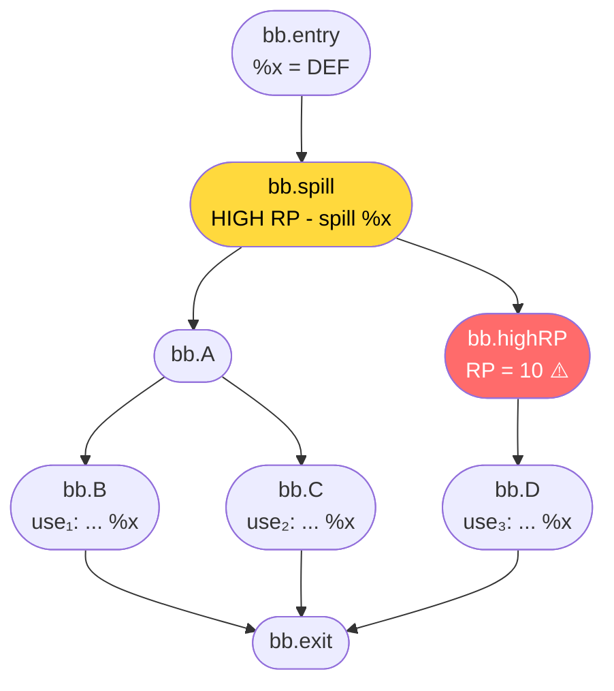

# Reload Optimizer Design

## Purpose

The `optimizeReloadPlacing` function minimizes reload count by intelligently **hoisting reloads to common dominators** of multiple uses. Instead of emitting a reload before each use, we find opportunities to share a single reload among multiple uses when register pressure (RP) permits.

## Scope and Preconditions

- **Input:** Dom-group heads — representative uses from dominance chains
- **Constraint:** All uses must be dominated by the spill point (guarantees NCD exists)
- **Timing:** Called immediately when a spill decision is made (during RPO traversal)
- **RP computation:** On-demand via `getMaxRPForBlock()` — no pre-computed RP required

## Key Insight: RP Invariant During Analysis

**Critical observation:** When tracing paths from uses to NCD, the spilled register `%x` is still **live** in LiveIntervals (uses not yet rewritten).

| Event | RP Effect |
|-------|-----------|
| Spill insertion | RP **decreases** at spill point forward |
| Reload analysis | No change — `%x` already counted as live |
| Reload insertion | RP stays same — just "moving availability" |

**Implication:** Since we analyze paths *before* rewriting uses, the spilled register is still counted as live. The RP we measure reflects the true pressure on those paths, and cached values remain valid for the duration of this spill's analysis.

---

## Algorithm Overview

The algorithm uses an **iterative, greedy, clique-based approach** to find optimal reload points:



---

## Detailed Algorithm Steps

### Step 1: Initialize Items

Each dom-group head becomes a singleton item:

```
Items = [ {use₁}, {use₂}, {use₃}, {use₄}, ... ]
```

### Step 2: Build Compatibility Matrix

For each pair (i, j), check if `NCD(Items[i] ∪ Items[j])` is feasible:

```
itemNCDIfOK(A, B):
  Union = A ∪ B
  NCD = findNearestCommonDominator(Union)
  if NCD in FailedNCDs: return null
  for each Use in Union:
    if NOT canHoistReloadTo(Use.block, NCD): return null
  return NCD
```

**Edge exists** iff `itemNCDIfOK` returns a valid NCD.

### Step 3: Greedy Clique Extraction

Starting from remaining items, greedily build maximal cliques:

```
while Remaining not empty:
  seed = pop Remaining
  Clique = {seed}
  repeat:
    for each candidate in Remaining:
      if candidate connected to ALL Clique members:
        add to Clique
    update Remaining
  until no growth
  if |Clique| ≥ 2: save Clique
```

### Step 4: Validate and Emit

For each clique:
1. Compute `NCD(clique)`
2. Verify all paths from uses to NCD are RP-safe
3. If valid: emit reload at NCD for all clique uses
4. If invalid: break clique, add members back to items

### Step 5: Iterate

Repeat until no items remain or cannot form groups.

---

## Concrete Example

### CFG Structure

Consider this CFG where `%x` is spilled in `bb.spill` and used in three locations:



**Configuration:**
- RP limit = 8
- `bb.highRP` has max RP = 10 (exceeds limit)
- `bb.A`, `bb.B`, `bb.C`, `bb.D` all have RP ≤ 6

### Iteration 1: Initial Matrix

**Items:** `[ {use₁}, {use₂}, {use₃} ]` (indices 0, 1, 2)

**NCD Analysis:**
| Pair | NCD | Paths | Feasible? |
|------|-----|-------|-----------|
| (0,1) | `bb.A` | B→A, C→A | ✅ RP OK on both |
| (0,2) | `bb.spill` | B→A→spill, D→highRP→spill | ❌ highRP blocks |
| (1,2) | `bb.spill` | C→A→spill, D→highRP→spill | ❌ highRP blocks |

**Compatibility Matrix:**

```
    0   1   2
  ┌───┬───┬───┐
0 │ . │ * │ . │   * = edge (compatible)
  ├───┼───┼───┤   . = no edge
1 │ * │ . │ . │
  ├───┼───┼───┤
2 │ . │ . │ . │
  └───┴───┴───┘
```

**Only one edge:** (0, 1) with NCD = `bb.A`

### Clique Extraction

**Cliques found:** `{ {0, 1} }` — pair of use₁ and use₂

**Remaining:** `{2}` — use₃ is isolated

### Emit Results

| Reload Point | Uses Covered | Reasoning |
|--------------|--------------|-----------|
| `bb.A` | use₁, use₂ | NCD of items 0,1; all paths RP-OK |
| `bb.D` | use₃ | Individual; can't share due to highRP path |

### Final Output

```
Result = [
  (bb.A, [use₁, use₂]),   // Shared reload
  (bb.D, [use₃])          // Individual reload
]
```

**Benefit:** 2 reloads instead of 3 (saved 33% reload instructions)

---

## Helper Functions

### `getMaxRPForBlock(MBB, Cache)`

Computes and caches maximum register pressure within a basic block:

```cpp
if MBB in Cache: return Cache[MBB]

MaxRP = 0
for each MI in reverse(MBB):
  RPTracker.recede(MI)
  MaxRP = max(MaxRP, current RP)

Cache[MBB] = MaxRP
return MaxRP
```

### `canHoistReloadTo(FromBB, ToBB, Cache)`

Traces all CFG paths from `FromBB` to `ToBB` (via predecessors), checking RP limits:

```cpp
if FromBB == ToBB: return true

Worklist = [FromBB]
Visited = {}

while Worklist not empty:
  BB = pop Worklist
  if BB in Visited: continue
  Visited.add(BB)
  
  if getMaxRPForBlock(BB) > RPLimit:
    return false  // Path blocked
  
  for Pred in BB.predecessors:
    if Pred ≠ ToBB and Pred not in Visited:
      Worklist.add(Pred)

return true
```

**Key insight:** We stop at `ToBB` (the NCD) — we don't check ToBB's RP because the reload will be placed there regardless.

---

## RP Cache Strategy

| Scenario | Action |
|----------|--------|
| Block not in cache | Compute max RP, cache result |
| Block in cache | Return cached value (O(1)) |
| Path check succeeds | All blocks along path now cached |
| Path check fails | Blocks visited are still cached |

**Why caching is safe:** The spilled register `%x` is counted as live during the entire analysis. Placing a reload doesn't increase RP — it just materializes a value that was already considered live.

---

## Edge Cases

### Single Use
- Skip optimization entirely
- Reload at use's block

### All Uses Share NCD
- Check paths from all uses to global NCD
- If all OK: single reload at NCD
- If any fails: iteratively find sub-groups

### No Feasible Groups
- Matrix has no edges
- Emit individual reloads for each use

### Loop-Aware Consideration
- `canHoistReloadTo` naturally handles loops via BFS
- A loop header may be NCD; backedges don't affect feasibility check (we traverse predecessors, not successors)

---

## Complexity Analysis

| Operation | Complexity |
|-----------|------------|
| Build matrix | O(n² × path_length) |
| Clique extraction | O(n² × clique_iterations) |
| Path check (cached) | O(1) per block |
| Path check (uncached) | O(path_length) |
| Total iterations | O(n) in worst case |

**Practical:** Dominated use counts are typically small (< 10), making this algorithm efficient in practice.

---

## Related

- [SSA_SPILLER_DESIGN](SSA_SPILLER_DESIGN.md) — Overall spiller architecture
- [Decisions](Decisions.md) — PHI-aware use rewriting (predecessor to this optimization)
- [MachineLaneSSAUpdater](MachineLaneSSAUpdater.md) — SSA repair after reload insertion