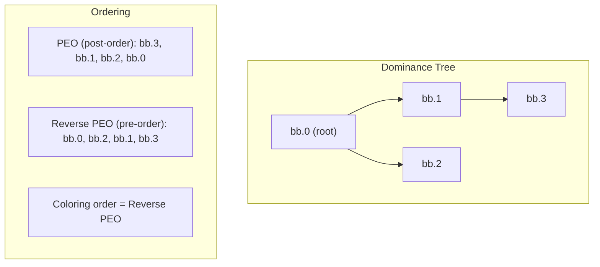
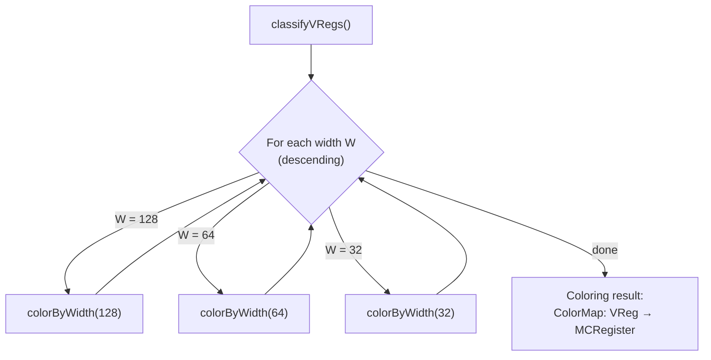
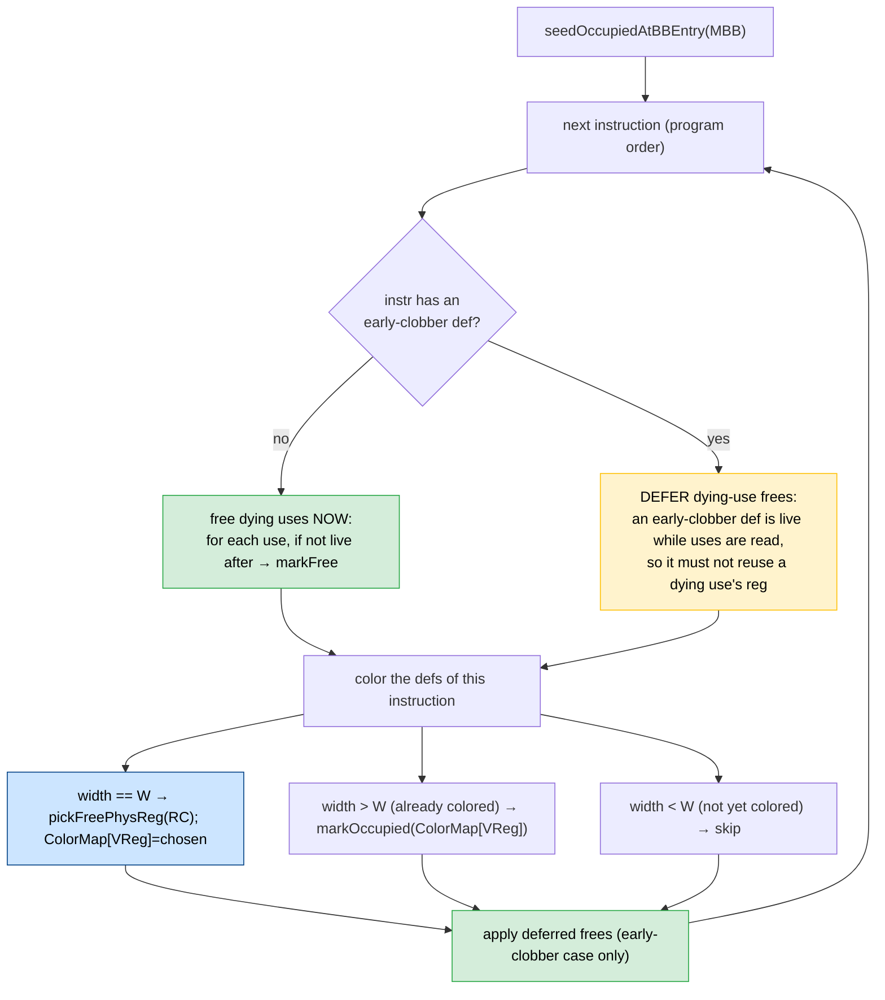
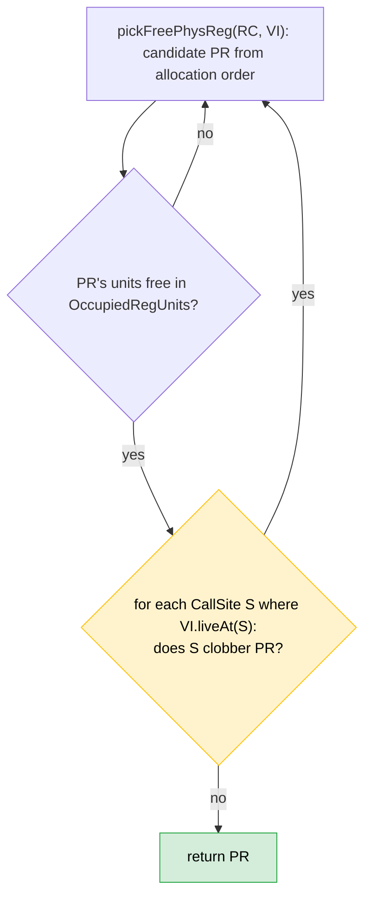
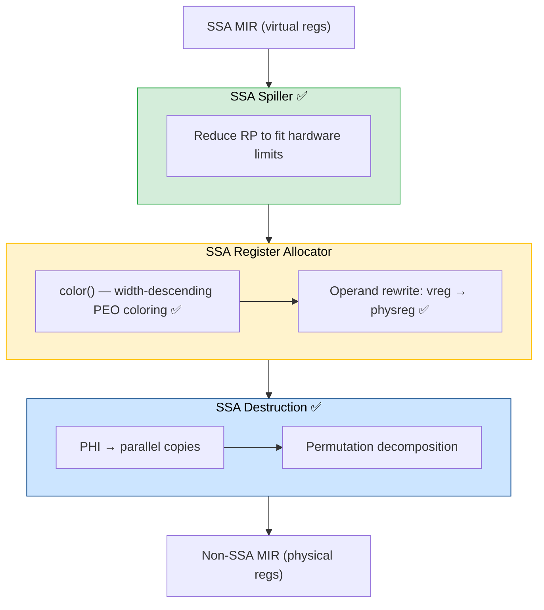
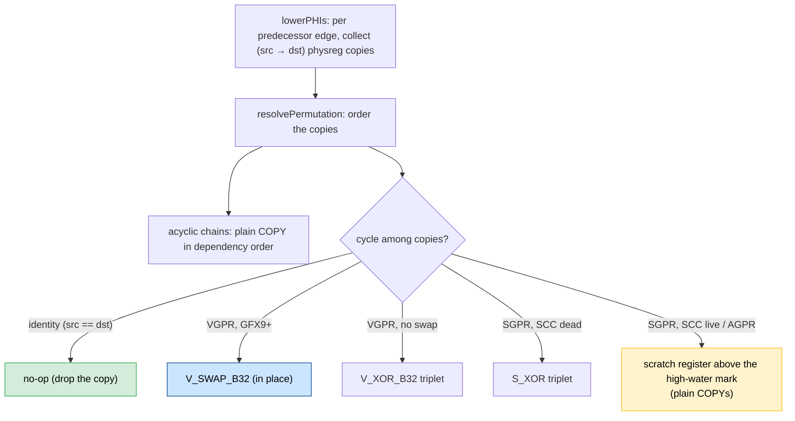

# SSA Register Allocator — Coloring Phase Design

## 1. Motivation

AMDGPU kernels are register-pressure sensitive: occupancy (number of concurrent
wavefronts) is inversely proportional to VGPR/SGPR usage.  The existing greedy
register allocator destroys SSA form before allocation, losing structural
information that guarantees polynomial-time optimal coloring.

An SSA-based allocator can exploit the following theoretical result:

> **Theorem (Hack, Grund & Goos, CC'06):**
> The interference graph of a program in strict SSA form is *chordal*.
> Every chordal graph admits a *perfect elimination ordering* (PEO),
> and greedy coloring on a PEO uses the minimum number of colors
> (= the *chromatic number* = the *clique number*).

This means register allocation on SSA programs reduces to:
1. Compute a PEO.
2. Color greedily in reverse PEO.

No backtracking, no spilling decisions during allocation, no NP-hard graph
coloring — the result is optimal in the number of simultaneously live physical
registers.

### Reference

Sebastian Hack, Daniel Grund, Gerhard Goos.
*Register Allocation for Programs in SSA-Form.*
Compiler Construction (CC), 2006.
[PDF](../06-Research/Papers/ssara.pdf)

---

## 2. Theoretical Foundation

### 2.1 SSA Interference Graphs Are Chordal

See [Chordal Graphs](../03-Concepts/Chordal_Graphs.md) for the definition and
consequences.

The key result for register allocation: in strict SSA form every virtual
register has exactly one definition, so its live range is a connected subtree
of the dominance tree. The intersection graph of subtrees of a tree is always
chordal — this is a theorem, not an approximation.

### 2.2 PEO from the Dominance Tree

See [Perfect Elimination Order (PEO)](../03-Concepts/Perfect_Elimination_Order_%28PEO%29.md)
for the general definition.

For SSA interference graphs, a PEO is obtained directly from the dominance
tree without running MCS or LexBFS:

- **PEO**: post-order traversal of the dominance tree (children before parent).
- **Reverse PEO** (coloring order): pre-order traversal (parent before children).

The implementation uses `depth_first(MDT->getRootNode())` which produces
dominance pre-order — exactly the reverse PEO needed for greedy coloring.



### 2.3 Greedy Coloring Guarantee

When vertices are processed in reverse PEO, each vertex's already-colored
neighbors form a clique (by the PEO property). Greedy assignment of the
smallest available color therefore uses at most ω(G) colors, where ω(G) is
the maximum clique size — which equals the chromatic number for chordal
graphs.

---

## 3. AMDGPU-Specific Challenge: Mixed Register Widths

AMDGPU programs use registers of multiple widths simultaneously:

| Register Class | Width | Example Physical Register |
|---------------|-------|--------------------------|
| `VGPR_32`     | 32-bit | `VGPR0` |
| `VReg_64`     | 64-bit | `VGPR0_VGPR1` |
| `VReg_128`    | 128-bit | `VGPR0_VGPR1_VGPR2_VGPR3` |
| `VReg_256`    | 256-bit | `VGPR0_VGPR1_..._VGPR7` |

A single 128-bit allocation blocks four 32-bit slots. Naively interleaving
widths in a single pass causes fragmentation: narrow allocations may prevent
later wide allocations from finding contiguous slots, even when the total
pressure is within limits.

---

## 4. Algorithm: Width-Descending Multi-Pass Coloring

### 4.1 Overview

The coloring runs one complete dominance-tree walk **per distinct register
width**, processing widths from widest to narrowest.



### 4.2 Why Width-Descending?

**Problem:** If 32-bit vregs are colored first, they may scatter across the
register file. A later 128-bit vreg needing 4 contiguous slots may find no
available aligned tuple, even though 4 individual slots are free.

**Solution:** Coloring widest first guarantees wide tuples see an unfragmented
register file. Narrow vregs colored later fill gaps between wide allocations.

**Key insight:** During narrow-width passes, freed wide-register slots are
immediately available for reuse. When a 128-bit vreg dies mid-block, its 4
constituent reg units are released, and subsequent 32-bit defs in the same
block can reuse those slots. This makes a separate post-coloring "splitter"
pass unnecessary — the coloring itself achieves optimal packing within each
width pass.

### 4.3 Per-Block State: `colorByWidth(Width)`

For each BB in dominance pre-order, and for each instruction in program order, the
order is **kills-before-defs**: dying uses are freed *before* the defs are colored,
so a def can reuse a source's physreg when that source dies at this instruction (no
interference). PHIs are skipped in the kill step (their sources are live only to
the predecessor boundaries; freeing here would clear physregs preceding PHI defs
already claimed).



### 4.4 `seedOccupiedAtBBEntry`

At each block entry, the occupied-register state is reconstructed from scratch:

1. Clear `OccupiedRegUnits` bitvector.
2. For every `(VReg, PhysReg)` in `ColorMap`: if `LIS->getInterval(VReg).liveAt(BBStart)`,
   mark PhysReg's reg units as occupied.
3. Mark physical live-ins (e.g., `$exec`) as occupied.

This reconstruction is correct because SSA guarantees each vreg has exactly
one live range (one segment in LiveIntervals). Checking `liveAt(BBStart)` is
sufficient.

### 4.5 Handling Wider Defs in Narrower Passes

When processing width W and encountering a def of width W' > W:
- The vreg was already colored in an earlier pass.
- Its reg units must be marked as occupied **at its def point**, not just at
  block entry. This is because the vreg may be born mid-block (not live-in),
  so `seedOccupiedAtBBEntry` wouldn't catch it.

### 4.6 Tied Operands

For a genuine two-address instruction (e.g. `$dst = V_MAC_F32 $src0, $src1,
$dst(tied)`), the def inherits the tied use's already-assigned physical register,
preserving the hardware constraint that tied operands share one register:

```cpp
bool IsTied = MI.isRegTiedToUseOperand(MO.getOperandNo(), &UseOpIdx);
if (IsTied && (Chosen = ColorMap.lookup(MI.getOperand(UseOpIdx).getReg()))) {
  // ordinary two-address def: inherit the tied use's color
}
```

**Tied `undef` self-ties.** Some instructions carry a tied operand whose value is
a *don't-care* passthrough tied to the def's own (not-yet-colored) vreg — the DPP
"old" source `%N = V_..._dpp undef %N, ...`, a D16 load's untouched half, or a MIX
partial def. Here there is **no earlier color to inherit** (`ColorMap.lookup`
returns nothing). The def is colored like an ordinary def via `pickFreePhysReg`;
`rewriteOperands` then assigns the same physreg to the self-tied use (same vreg),
preserving two-address form:

```cpp
else if (IsTied && MI.getOperand(UseOpIdx).isUndef()) {
  Chosen = pickFreePhysReg(MRI->getRegClass(Reg), LIS->getInterval(Reg), WiderDefs);
} else if (IsTied) {
  llvm_unreachable("Tied use must be colored already or undef");
}
```

The tied-uncolored-**non-undef** case is a hard failure (it cannot happen in valid
SSA input). Guard: `FIX_REPORT_tied-use-undef_2026-07-10` (§4.4 crash class, 18
tests).

### 4.7 Cross-Call Color Constraint

A value **live across a call** may not occupy a register the call clobbers — a
`csr_*` regmask clobbers all caller-saved registers, and an explicit call def
(e.g. the return-address SGPR pair) clobbers its own registers. `pickFreePhysReg`
enforces this: it collects **clobber sites** into `CallSites` (call regmasks, and
allocatable implicit physreg defs such as an inline-asm clobber) and rejects any
candidate physreg that a site clobbers when the value is live at that site.



> **Open problem — physreg exhaustion (`Failed to find free physreg`).** This
> constraint, combined with **no coalescing** and no eviction, is the current
> largest crash class (~30 tests, §4.1 of `CRASH_TRIAGE_REPORT_2026-07-10`). A
> value live across a call may take *only* callee-saved registers; one-shot
> greedy-smallest-free lets non-cross-call values grab those first, and the lack
> of coalescing inflates the working set (observed 11 → 20 distinct VGPRs) past
> the callee-saved capacity — where greedy still succeeds via **eviction**. It is
> a **coloring/coalescer** problem, **not** under-spilling (greedy compiles these
> with `ScratchSize:0`); see `ANALYSIS_A1_underspill_vs_coalescer_2026-07-10`.
>
> **Theory constraint (Hack).** Chordal SSA coloring is optimal only in
> **dominance order**. A fix may bias the color *choice* (cross-call values →
> callee-saved; others → caller-saved) but must **not** reorder to color
> cross-call values first — that would break PEO optimality. Prototype biases were
> tried and reverted (net regressions). The durable fix is the **PHI coalescer**
> (paper §4.3), coalescing by color choice (never graph merge, to preserve
> chordality).

### 4.8 AGPR-Coloring Gap: AV-class values are pinned to VGPR

On split-file targets (gfx90a+) the vector register file is physically two
files: **VGPR** and **AGPR**. Many values are **AV-class** (VGPR-*or*-AGPR): the
hardware/ABI permits either file. Greedy uses this to relieve pressure — when the
VGPR file fills it places AV values in AGPRs (staged with
`v_accvgpr_write/read`), effectively doubling the vector budget.

**The SSA RA never uses the AGPR file.** Root cause: `color()` chooses the
allocation order from the **vreg's register class**
(`pickFreePhysReg(MRI->getRegClass(Reg), …)`), and AV values arrive already
classed as `vgpr_32` — only the *operand constraint* is `AV_32` (e.g. an
inline-asm `regdef:AV_32`, or an MFMA operand). Verified on
`ds_bpermute_b32_av_av_no_vgprs`: right after `finalize-isel` the value has
`class: vgpr_32` (0 `av_32` vreg classes); the AV flexibility lives in the
operand constraint / register bank, recovered by greedy via
`SIRegisterInfo::getConstrainedRegClassForOperand`. The SSA RA never consults
operand constraints, so it hands `pickFreePhysReg` a **VGPR-only** order and the
256-entry AGPR file sits unused while the 64-entry VGPR file exhausts →
`Failed to find free physreg`.

This is a distinct contributor to the §4.7 exhaustion class, and it is **not**
relieved by coalescing, by the spiller budget cap ([SSA_SPILLER_DESIGN](SSA_SPILLER_DESIGN.md#register-budget-cap-by-allocatable-file-size)), or by narrowing reloads — those reduce
*VGPR* pressure but never reach the AGPR file. Greedy fits the worked case with
`NumVgprs: 64, NumAgprs: 18`; the SSA RA aborts at 64.

**Partial machinery already present.** The high-water tracking classifies by the
*chosen* physreg's file (`MaxVGPRIdx` / `MaxAGPRIdx`, the `isAGPRClass` branch),
and `resolvePermutation` has an AGPR cycle path (scratch AGPR). So the allocator
can *account for* AGPR-colored values — it just never *chooses* them.

**Design for the fix (proposed, not yet implemented).** Give the coloring stage a
file choice for AV-class values:

1. **Derive the true allocation class from operand constraints** (intersect the
   def + all use constraints, per `getConstrainedRegClassForOperand`) so an
   AV-legal value is colored as `AV_*` (AGPR-inclusive order) instead of
   `vgpr_32`. Must handle sub-registers / tuple alignment.
2. **Per-operand file legality**: some ops require VGPR for a specific operand
   even on an AV value (and MFMA prefers AGPR). The chosen file must satisfy
   *every* operand.
3. **Cross-file copies** (`v_accvgpr_read/write`) where a value's file does not
   match an operand's requirement — greedy gets these from copy legalization; the
   SSA RA needs its own path.
4. **Split VGPR/AGPR pressure model** in `pickFreePhysReg` / `OccupiedRegUnits`
   and in the spiller budget (currently the two files are treated as one budget).

This is a genuine feature (estimated several hundred lines), not a quick fix.
**Recommended first step — a small probe:** for a value that is AV-legal at
*all* its operands (no operand forces VGPR), derive its class from the operand
constraints and give it an AGPR-inclusive order. Such values need **no**
cross-file copies, so steps 2–3 may be skippable for the crash cluster
(`a-v-*`, `ds_*_a_v`, `*no_vgprs`), which is exactly this shape. Measure before
committing to the full feature.

> Worklog: `RELOAD_NARROWING_AND_AGPR_GAP`
> (evidence + scoping), `REMAINING_CRASHES_CLASSIFICATION`.

---

## 5. Data Structures

### 5.1 `ColorMap: DenseMap<Register, MCRegister>`

Maps each virtual register to its assigned physical register. Populated
during coloring, consumed by SSA destruction and the operand-rewrite phase.

### 5.2 `OccupiedRegUnits: BitVector`

Sized to `TRI->getNumRegUnits()`. Each bit corresponds to one MCRegUnit.
Used for O(1) interference checking: a physical register is free iff none
of its constituent reg units are set.

**Why reg units?** Reg units are LLVM's canonical way to represent hardware
register overlap. A 128-bit register like `VGPR0_VGPR1_VGPR2_VGPR3` decomposes
into 4 reg units. Checking/setting at the reg-unit level automatically handles
all overlap cases without explicit tuple-intersection logic.

### 5.3 `ColoringOrder: std::set<unsigned, std::greater<unsigned>>`

Sorted set of distinct register widths (in bits) present in the function,
ordered descending. Drives the multi-pass loop.

---

## 6. Design Decisions

### D1: Width-Descending vs. Single-Pass

| Approach | Pros | Cons |
|----------|------|------|
| Single pass (all widths) | One MDT walk | Fragmentation: narrow defs block wide tuples |
| Width-descending | No fragmentation, optimal packing | Multiple MDT walks (one per width) |

**Decision:** Width-descending. The extra MDT walks are cheap (linear in IR size).
Fragmentation avoidance is critical for AMDGPU where 128/256-bit tuples are common.

### D2: Per-Point Liveness via Reg Units (not Explicit Interference Graph)

The classical approach builds an interference graph and then colors it.
We skip graph construction entirely:

- Interference is tracked implicitly via `OccupiedRegUnits` updated
  at each program point.
- The MDT pre-order walk ensures we process blocks in reverse PEO.
- Within a block, we process instructions in program order, maintaining
  accurate per-point liveness.

This avoids O(V²) graph construction and achieves O(V × U) coloring
where V = number of vregs and U = average reg units per register.

### D3: Splitter Removal

An occupancy-driven LR splitting phase was designed and implemented, then
removed after empirical analysis showed it was redundant:

- The width-descending coloring already reuses freed register slots at def
  points. When a wide vreg dies and a new vreg is born later in the same block,
  the coloring phase assigns the freed slot immediately.
- The splitter's main value proposition — splitting a long-lived wide vreg to
  free slots for narrower vregs — is already achieved by the coloring's natural
  per-point liveness tracking.
- Removed ~330 lines of infrastructure (ShadowMap, planSplit, commitPlan,
  gap-filling, recoloring) with no test regressions.

### D4: No SGPR/VGPR Separation in Pass Structure

SGPR and VGPR register units occupy disjoint namespaces in LLVM's reg-unit
scheme. A VGPR allocation never conflicts with an SGPR allocation at the
reg-unit level. Therefore, a single pass handles all register files without
explicit class separation.

### D5: SSA ⇒ Single Segment per VReg

In SSA form, each vreg has exactly one definition. Therefore each vreg's
`LiveInterval` consists of a single segment. This simplifies:
- Liveness queries: `liveAt(SlotIndex)` is a single-range check.
- Kill detection: a use is a kill iff the vreg is not live after the use slot.
- No need to iterate subranges for liveness decisions.

---

## 7. Pipeline Position



See also: [SSA Destruction](../02-Components/SSA_Destruction.md) for the theory
behind PHI lowering as permutation synthesis.

---

## 8. Correctness Argument

### 8.1 Width-Descending Preserves PEO Optimality

**Claim:** For each width W, the coloring produced by `colorByWidth(W)` is
optimal (uses minimum colors) for the sub-interference-graph restricted to
vregs of width W, given the constraints imposed by already-colored wider vregs.

**Argument:**
1. The sub-graph of same-width vregs is still chordal (a subgraph of a chordal
   graph induced by a vertex subset is chordal).
2. The MDT pre-order provides a valid PEO for this sub-graph.
3. Wider vregs' reg units are marked occupied, acting as additional constraints.
   These constraints are fixed (not part of the greedy choice), so the greedy
   coloring on the PEO remains optimal for the remaining degrees of freedom.

### 8.2 Correctness of Freed-Slot Reuse

When a vreg dies (last use) mid-block, `markFree()` releases its reg units.
A subsequent def in the same block may reuse those units. This is correct
because:
- The dying vreg's live range ends before the new def's live range begins.
- They do not interfere.
- The PEO ordering ensures all interfering vregs are already colored
  before the current vertex.

---

## 9. Example: Width-Descending Coloring

```
bb.0:
  %A:vreg_128 = IMPLICIT_DEF          ; 128-bit
  %B:vreg_128 = IMPLICIT_DEF          ; 128-bit
  S_NOP 0, implicit %A                ; %A dies
  %C:vgpr_32  = V_MOV_B32 0           ; 32-bit, born after %A dies
  S_BRANCH %bb.1

bb.1:
  S_ENDPGM 0, implicit %B, implicit %C
```

**Pass 1 (128-bit):**
- `%A → VGPR0_VGPR1_VGPR2_VGPR3`
- `%B → VGPR4_VGPR5_VGPR6_VGPR7`
- `%A` dies → free units 0–3

**Pass 2 (32-bit):**
- At `%C`'s def: mark `%B` occupied (wider, already colored). `%A` is dead.
- `%C → VGPR0` (reuses freed slot from `%A`)

**Result:** 8 VGPRs used (VGPR0–VGPR7), not 9. No splitter needed.

---

## 10. SSA Destruction (PHI lowering + permutation resolution)

After coloring, `destroySSAAndRewrite` lowers PHIs to physical-register moves and
rewrites virtual operands to physregs. A block's PHIs form a **parallel copy** on
each incoming edge (all read, then all written); `resolvePermutation` sequences
them, breaking cycles by a tiered strategy (`emitSwap` where a swap primitive
exists):



`eliminateRegSequences` lowers surviving `REG_SEQUENCE` the same way (a
`REG_SEQUENCE` is also a parallel assignment). See
[SSA Destruction](../02-Components/SSA_Destruction.md) for the permutation-synthesis
theory, and [Architecture](Architecture.md#register-files-sgpr-vgpr-agpr) for why an AGPR
cycle must use a scratch AGPR.

---

## 11. Current Status and Future Work

| Item | Status |
|------|--------|
| Width-descending PEO coloring | ✅ Implemented |
| Tied operand handling (incl. `undef` self-ties) | ✅ Implemented |
| Cross-call clobber constraint (`CallSites`) | ✅ Implemented |
| Physical live-in tracking | ✅ Implemented |
| kills-before-defs ordering (early-clobber aware) | ✅ Implemented |
| Physreg defs/kills in colorByWidth | ✅ Implemented |
| Operand rewrite (vreg → physreg) | ✅ Implemented |
| SSA destruction (PHI lowering + permutation) | ✅ Implemented (no-op / swap / XOR / scratch) |
| SGPR-spill accounting → `SILowerSGPRSpills` | ✅ Implemented |
| **Pipeline wiring (`-amdgpu-ssa-regalloc`)** | ✅ **Done — wired in `addRegAssignAndRewriteOptimized`; corpus-tested end-to-end** |
| Physreg exhaustion / cross-call (needs coalescer) | 🔧 Open (§4.7; ~30 crashes) |
| AGPR coloring for AV-class values (split-file targets) | 🔧 Open (§4.8; distinct contributor to exhaustion — AV values pinned to VGPR, AGPR file unused) |
| PHI coalescing — greedy affinity (Option B + sub-reg hints) | 🟡 Done in `ssara-claude`, uncommitted; corpus-accepted (weighted φ-copies −62%, CRASH 55→47) — see [PHI_Coalescer](PHI_Coalescer.md#101-status-2026-07-14) |
| PHI coalescing — real recoloring (paper §4.3, Option A) | 🔧 Pending (durable fix for the above; 99.8% of residual copies feasible) — design: [PHI_Coalescer](PHI_Coalescer.md) |
| Per-class / fragmentation-aware spilling | 🔧 Proposed ([GCNUpwardRPTracker_PerClassRP](GCNUpwardRPTracker_PerClassRP.md), [Spiller_Redesign](Spiller_Redesign.md)) |
| Loop-filter fallback (`getVMPsToSpill`) | 🔧 Pending |

Corpus health: **103 / 3060** AMDGPU LIT tests crash under the SSA chain (see
`CRASH_TRIAGE_REPORT_2026-07-10`).

---

## 12. Source Files

| File | Description |
|------|-------------|
| [`AMDGPUSSARegisterAllocator.h`](https://github.com/alex-t/llvm-project/blob/ssara/llvm/lib/Target/AMDGPU/AMDGPUSSARegisterAllocator.h) | Pass class, data structures |
| [`AMDGPUSSARegisterAllocator.cpp`](https://github.com/alex-t/llvm-project/blob/ssara/llvm/lib/Target/AMDGPU/AMDGPUSSARegisterAllocator.cpp) | Coloring, SSA destruction, operand rewrite |
| [`llvm/test/CodeGen/AMDGPU/SSARA/`](https://github.com/alex-t/llvm-project/tree/ssara/llvm/test/CodeGen/AMDGPU/SSARA) | LIT tests (coloring + destruction + pipeline) |
