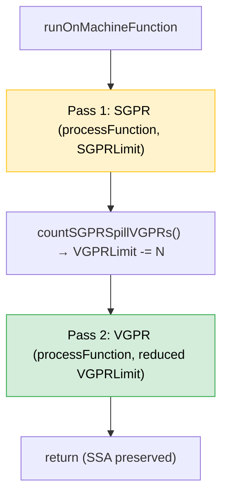
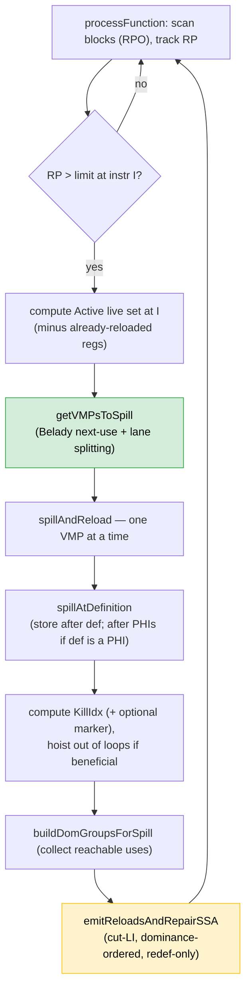
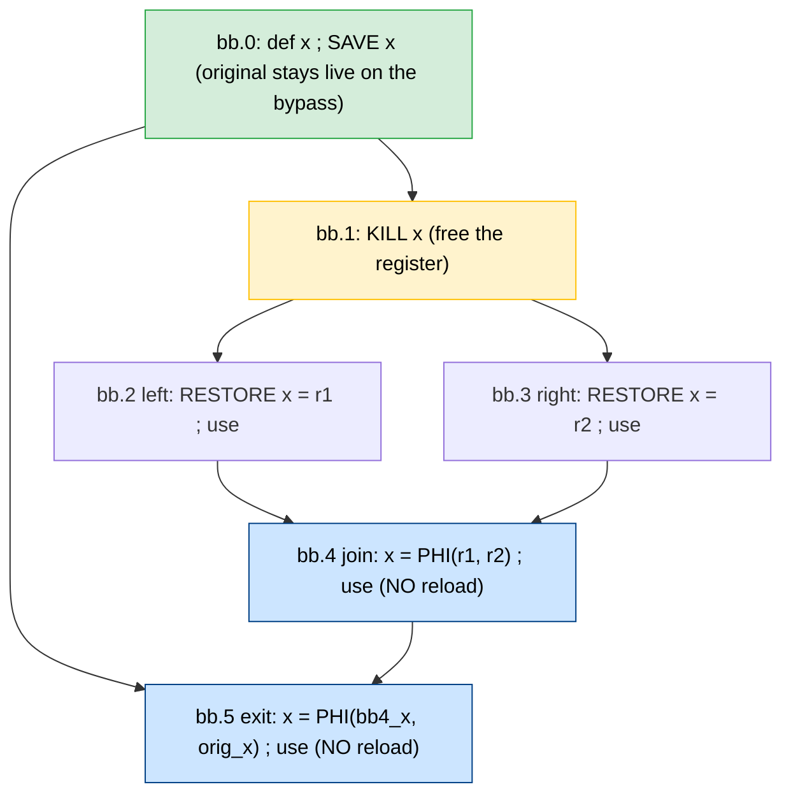
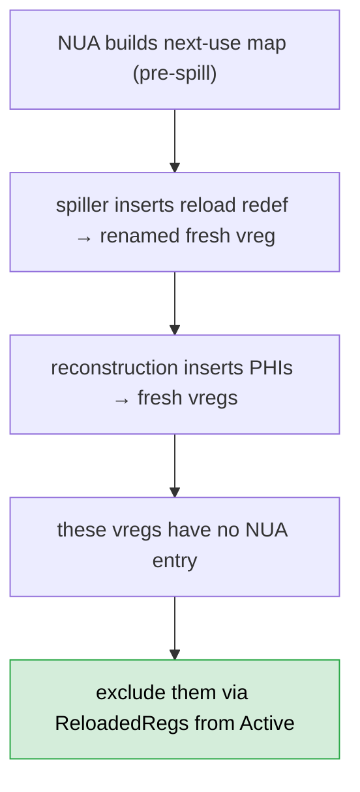

# SSA Register Spiller (AMDGPU) — Design (Current)

This document describes the **current** SSA-aware register spilling pass for
AMDGPU, as implemented in LLVM Machine IR.

> **Reload model (2026-07):** the spiller uses the **cut-LI, dominance-ordered,
> redef-only** reload model — reloads redefine `OrigVReg` and SSA is repaired
> **inline** via reaching-VNI reconstruction. This **supersedes** the older
> Pruned-IDF / PHI-first / reload-optimizer / `fixPathologicalPHIs` design (all
> removed). The reload-placement theory lives in
> [[Reload_join_phi_coalescing]]; the SSA-repair engine is [[MachineLaneSSAUpdater]].

## Source Mapping

- **Component**: SSA Register Spiller (AMDGPU)
- **File**: [`AMDGPUSSARegisterSpiller.cpp`](https://github.com/alex-t/llvm-project/blob/ssara/llvm/lib/Target/AMDGPU/AMDGPUSSARegisterSpiller.cpp) ·
  [`AMDGPUSSARegisterSpiller.h`](https://github.com/alex-t/llvm-project/blob/ssara/llvm/lib/Target/AMDGPU/AMDGPUSSARegisterSpiller.h)

### Related components
- [[MachineLaneSSAUpdater]] — SSA repair (reaching-VNI reconstruction):
  [`MachineLaneSSAUpdater.cpp`](https://github.com/alex-t/llvm-project/blob/ssara/llvm/lib/CodeGen/MachineLaneSSAUpdater.cpp) · upstream PR [#163421](https://github.com/llvm/llvm-project/pull/163421)
- [[NextUseAnalysis]] — Belady next-use distances + lane/subreg ordering:
  [`AMDGPUNextUseAnalysis.h`](https://github.com/alex-t/llvm-project/blob/ssara/llvm/lib/Target/AMDGPU/AMDGPUNextUseAnalysis.h) · upstream PR [#156079](https://github.com/llvm/llvm-project/pull/156079)
- [[Reload_join_phi_coalescing]] — the reload-placement theory this pass implements.
- [[GCNUpwardRPTracker_PerClassRP]] · [[Spiller_Redesign]] — proposed per-class /
  fragmentation-aware upgrade.

## Overview

The SSA spiller is a `MachineFunction` pass that:

- Scans instructions and tracks register pressure (RP).
- When RP exceeds the per-class limit, selects **spill candidates** with a
  [Belady next-use heuristic](../03-Concepts/MIN_Algorithm.md).
- Stores each spilled value **[at its definition](Decisions.md#store-at-definition)**
  (EXEC full) — not at the high-pressure point.
- Places reloads **on demand**, in dominance order, only where the value is not
  already available; each reload **redefines `OrigVReg`** and SSA is repaired
  inline by [[MachineLaneSSAUpdater]], which also materializes the merge PHIs.
- Leaves the function in SSA form (`SSAInvalidated` cleared) so the allocator
  runs directly, with no second `RebuildSSA`.

## Two-Pass Architecture

The spiller processes the function twice; there is **no** dedicated AGPR pass
(see [[Architecture#Register files: SGPR, VGPR, AGPR]]).

1. **Pass 1 (SGPR).** Spill candidates go to the stack as `SI_SPILL_S*_SAVE` /
   `_RESTORE` pseudos. Afterward, `countSGPRSpillVGPRs()` computes how many VGPR
   lanes those SGPR spills will consume
   ($\lceil \sum_{FI} \text{objectSize}(FI)/4 \div \text{WaveSize} \rceil$ over
   distinct `SGPRSpill` frame indices) and reduces the VGPR budget:
   `VGPRLimit -= N`.
2. **Pass 2 (VGPR).** Vector registers, with the reduced budget. VGPR spills go
   to memory as `SI_SPILL_V*_SAVE` / `_RESTORE`.

SGPR spill **materialization** (writelane/readlane) is **not** done here — the
pseudos survive until `SILowerSGPRSpills` runs after the SSA RA, when the spilled
register is physical (see [[Architecture#The two spill-code lowering paths]]).

## Terminology

- [**VMP (VRegMaskPair)**](https://github.com/alex-t/llvm-project/blob/ssara/llvm/lib/Target/AMDGPU/VRegMaskPair.h):
  `(VReg, LaneBitmask)` — a virtual register, possibly partial lanes.
- **Store-at-definition**: the stack store is emitted right after the def (EXEC
  full); tracked in `StoredAtDefinition`.
- **Virtual spill point / `KillIdx`**: the high-pressure point where RP relief is
  intended (marked by `SI_VIRTUAL_SPILL_MARKER` under `-amdgpu-ssa-spill-markers=1`).
- **KillBB**: the block containing the virtual spill point.
- **Cut LiveInterval**: a frozen deep copy of `LI(OrigVReg)` pruned at the kill —
  the availability oracle for reload placement (Section *Reload placement*).

## High-level per-function workflow

## Spill candidate selection (Belady + lane splitting)

`getVMPsToSpill` sorts the Active set by next-use distance (furthest-first) via
`sortRegSetByNextUse`, then greedily takes candidates until the spill budget
(`CurRP - RPLimit`) is met. Lanes **read** by the current instruction are
excluded (spilling them would force an immediate reload).

When a candidate is wider than the remaining budget, it is **split by
subregister**:

- `NU->getSortedSubregUses(...)` returns per-lane use distances (furthest-first)
  for lanes appearing as distinct-mask uses in the NUA table.
- For each returned lane group: if it fits, spill it; if it is still too wide,
  decompose into 32-bit parts with `TRI->getRegSplitParts(SubRC, 4)` and take
  only as many parts as the budget needs. `getRegSplitParts` provides the
  sub-register boundary decomposition NUA cannot (NUA records use-site masks, not
  physical sub-register layout), guaranteeing 32-bit minimum granularity.

Store/reload of a partial lane mask is sub-register aware: `spillAtDefinition`
derives `SubRegIdx` from the mask (`VMP.getSubReg`), so the store is e.g.
`SI_SPILL_S32_SAVE %w.sub0`, and the reaching-VNI reconstruction rebuilds the
full value with a `REG_SEQUENCE` from the reloaded sub-slot plus the surviving
lanes.

> **Store-at-definition PHI invariant.** `spillAtDefinition` inserts the store at
> `std::next(DefMI)` for an ordinary def, but at `DefMBB->getFirstNonPHI()` when
> the def is a PHI — PHI results are fully defined at the block top, and inserting
> between PHIs would violate the PHIs-contiguous invariant
> ("Found PHI after non-PHI"). See
> [[FIX_REPORT_spillAtDefinition-phi-order_2026-07-10]].

### Latent under-cover paths (must fail loud, not silently)
`getVMPsToSpill` has two paths that can return a set covering **less** than the
budget: the loop filter emptying `Active`, and the greedy loop exiting with
`RemainingToSpill > 0`. These are **not** the cause of the current
`Failed to find free physreg` crashes (that is a coloring/coalescer problem — see
[[ANALYSIS_A1_underspill_vs_coalescer_2026-07-10]] and
[[SSA_RA_Coloring#Cross-Call Color Constraint]]), but they should assert / fall
back rather than silently under-cover once spilling is genuinely needed.

## Reload placement — cut-LI, dominance-ordered, redef-only

This is the heart of the current design; the full rationale is in
[[Reload_join_phi_coalescing]]. Summary:

1. **Cut the frozen `LI(OrigVReg)` at the kill.** The updater keeps a frozen deep
   copy of the original interval as its reaching-def oracle. Pruning it at the
   kill encodes the freed region as "no reaching VNInfo" — a point reachable only
   through the kill has no original value (needs a reload); a point reachable from
   the def while **avoiding** the kill still holds the original (no reload). This
   is the kill-dominance test, computed by `LiveIntervals` and **per-lane**
   (subranges), for arbitrary CFGs — no dominator-tree frontier computation.
2. **Walk uses in dominance order** (dominators first), querying availability on
   the working `LI(OrigVReg)` (= cut original + reloads so far):
   - reaching value is a reload / PHI-of-reloads → rewrite the use to it (a
     dominating reload is already visible → intra-chain sharing is free, no
     optimizer);
   - reaching value is the **original** → keep it (non-kill path, no-op);
   - **no** reaching value → freed region with no dominating reload → insert a
     reload here (redefining `OrigVReg`);
   - reaching values **differ** on incoming edges → `LiveIntervalCalc` already
     recorded an `isPHIDef` VNInfo at the merge → the reconstruction materializes
     the PHI.

For the diamond: **2 reloads** (r1, r2) + **2 PHIs** (bb.4, bb.5), versus 4
reloads under the old per-use model. The clean path (bb.0 bypass) keeps the
original register and merges via a PHI — zero reloads there.

### Implementation touchpoints

| Function | Role |
|---|---|
| `spillAndReload` | drives one VMP: store-at-def, KillIdx, dom-groups, reload+repair |
| `spillAtDefinition` | emit the stack store after the def (after PHIs if def is a PHI) |
| `buildDomGroupsForSpill` | collect uses reachable from the kill, grouped by dominance |
| `emitReloadsAndRepairSSA` | cut-LI availability walk → `getOrCreateReloadInBlock` → inline `repairSSAForNewDef` |
| `getOrCreateReloadInBlock` | emit a reload redef (block-end reloads cached in `BlockReloadCache`) |
| `insertReloadForUse` | place a reload for a specific use (PHI use → per predecessor) |

### Loop-aware reload hoisting
`adjustReloadForLoop` / `canHoistReloadTo` hoist a reload to a loop preheader when
the use is in a loop but the spill is outside and RP on the path allows it — so a
loop-invariant value is reloaded once, not per iteration. (This is the surviving
loop optimization; the old NCD/clique **reload optimizer** is gone.)

## `ReloadedRegs` and the static-NUA limitation

NUA runs **before** spilling, so vregs created during spilling (reload redefs,
reconstruction PHIs) have no next-use entries and could be treated as "dead" and
immediately re-selected for spilling — yielding no RP relief. Workaround: after
inline repair renames a reload to a fresh vreg, the spiller records it in
`ReloadedRegs` and subtracts that set from the Active candidate set. See
[[NextUseAnalysis]] and the issue note *Static NUA limitation*.

## Final RP validation

`validateFinalRegisterPressure` re-walks the function and reports a fatal error if
RP still exceeds the limit at any instruction (skipping spill/reload pseudos). It
uses the same peak (read/write phase) metric the spiller targets and runs under
`-amdgpu-ssa-spiller-verify-rp` (and by default in expensive-checks builds). It is
a safety net until the per-class / feasibility-gate work
([[GCNUpwardRPTracker_PerClassRP]], [[Spiller_Redesign]]) lands.

## Mapping to tests

See [`SSA_SPILLER_TEST_PATTERNS.md`](../05-Testing/SSA_Spiller/SSA_SPILLER_TEST_PATTERNS.md).
Key end-to-end tests live under
[`llvm/test/CodeGen/AMDGPU/SSARA/`](https://github.com/alex-t/llvm-project/tree/ssara/llvm/test/CodeGen/AMDGPU/SSARA)
(`pipeline-spill-*.ll`, `spill-*.mir`).

## Appendix: source files involved in spill emission

| File | Role |
|------|------|
| [`AMDGPUSSARegisterSpiller.cpp`](https://github.com/alex-t/llvm-project/blob/ssara/llvm/lib/Target/AMDGPU/AMDGPUSSARegisterSpiller.cpp) | `getVMPsToSpill`, `spillAtDefinition`, `emitReloadsAndRepairSSA`, `countSGPRSpillVGPRs` |
| [`SIInstrInfo.cpp`](https://github.com/alex-t/llvm-project/blob/ssara/llvm/lib/Target/AMDGPU/SIInstrInfo.cpp) | `storeRegToStackSlot` / `loadRegFromStackSlot` — emit `SI_SPILL_*_SAVE/RESTORE` (SubRegIdx-aware) |
| [`SIRegisterInfo.cpp`](https://github.com/alex-t/llvm-project/blob/ssara/llvm/lib/Target/AMDGPU/SIRegisterInfo.cpp) | `eliminateFrameIndex` — lowers **VGPR** spill pseudos to scratch memory |
| [`SILowerSGPRSpills.cpp`](https://github.com/alex-t/llvm-project/blob/ssara/llvm/lib/Target/AMDGPU/SILowerSGPRSpills.cpp) | materializes **SGPR** spill pseudos to writelane/readlane, post-RA |

## Appendix: superseded design (removed from source)

The following were part of an earlier PHI-first / IDF design and **no longer
exist**; do not look for them in the code:

- Pruned-IDF PHI insertion (`getPrunedIDF`, `computePrunedIDF`, `IDFCache`).
- `repairSSAForReload`, `createPHIInBlock` (dominance-based).
- Reload optimizer / NCD clique hoisting (`optimizeReloadPlacing`).
- `fixPathologicalPHIs`, `processPIdfBlock`, kill-dominance classification.
- Interval-killing before SSA repair (see [[Decisions]]).
