# SSA Register Spiller (AMDGPU) — Design (Current)

This document describes the **current** SSA-aware register spilling pass for AMDGPU, as implemented in LLVM Machine IR.

## Source Mapping
- **Component**: SSA Register Spiller
- **LLVM Target**: AMDGPU
- **File (symbolic)**: `llvm/lib/Target/AMDGPU/AMDGPUSSARegisterSpiller.cpp`
- **GitHub (canonical)**: [`AMDGPUSSARegisterSpiller.cpp`](https://github.com/alex-t/llvm-project/blob/early-ssa-spiller/llvm/lib/Target/AMDGPU/AMDGPUSSARegisterSpiller.cpp)

### Related components
- **Component**: MachineLaneSSAUpdater (SSA repair + IDF reachability)
  - **File (symbolic)**: [`llvm/lib/CodeGen/MachineLaneSSAUpdater.cpp`](https://github.com/alex-t/llvm-project/blob/early-ssa-spiller/llvm/lib/CodeGen/MachineLaneSSAUpdater.cpp)
  - **Upstream PR**: [#163421](https://github.com/llvm/llvm-project/pull/163421)
- **Component**: AMDGPU Next Use Analysis (next-use distances + lane/subreg ordering)
  - **File (symbolic)**: [`llvm/lib/Target/AMDGPU/AMDGPUNextUseAnalysis.h`](https://github.com/alex-t/llvm-project/blob/early-ssa-spiller/llvm/lib/Target/AMDGPU/AMDGPUNextUseAnalysis.h)
  - **Upstream PR**: [#156079](https://github.com/llvm/llvm-project/pull/156079)

## Overview
The SSA spiller is a MachineFunction pass that:
- Tracks register pressure (RP) while scanning instructions.
- When RP exceeds a limit, selects one or more **spill candidates** using a [Belady-style next-use heuristic](../03-Concepts/MIN_Algorithm.md).
- Stores spilled values [**at definition**](Decisions.md#store-at-definition) to avoid EXEC drift issues.
- Computes a [**virtual spill point**](#virtual-spill-point-and-si_virtual_spill_marker) (where the value is considered "logically dead" for RP relief).
- Inserts PHIs at **Pruned IDF (PIDF) blocks** first, then places reloads that automatically rewrite PHI operands.
- Uses [`MachineLaneSSAUpdater`](../02-Components/MachineLaneSSAUpdater.md) for SSA repair.
- Shrinks live intervals after repairs to reflect the new SSA use graph.


## Static Next-Use Analysis limitation (reload/PHI-created vregs)

### The issue
NextUseAnalysis (NUA) currently runs **before** spilling. During spilling we insert:
- reloads before uses of a spilled value, and
- PHIs during SSA repair (via [`MachineLaneSSAUpdater`](../02-Components/MachineLaneSSAUpdater.md)).

Each reload/PHI creates a **new SSA variable** (new virtual register / new live interval).
We run Next Use Analysis before the spiller when these new register don't yet exist. As a result, they have no entries in the NUA map and analysis consider these new vregs **dead**, which can immediately select them for spilling again — yielding **no RP relief** and eventually an RP validation failure. See [Static NUA limitation issue](../08-Worklog/issues/Next_Use_Analysis/Static_NUA_limitation.md).

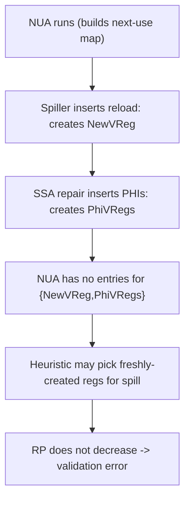

### Longer-term directions (proposed)
- Return a special value from NUA meaning "no distance computed for this vreg".
- Add an on-demand API to compute next-use distance for new vregs created during spilling.

See [Static NUA limitation - Proposed solution](../08-Worklog/issues/Next_Use_Analysis/Static_NUA_limitation.md#proposed-solution).

### Temporary workaround (implemented now)
Maintain a [`VRegMaskPairSet`](https://github.com/alex-t/llvm-project/blob/early-ssa-spiller/llvm/lib/Target/AMDGPU/VRegMaskPair.h) of vregs created by reload SSA repair and exclude them from the spiller's Active set selection.

See [Static NUA limitation - Temporary workaround](../08-Worklog/issues/Next_Use_Analysis/Static_NUA_limitation.md#temporary-workaround).

## Terminology
- [**VMP (VRegMaskPair)**](https://github.com/alex-t/llvm-project/blob/early-ssa-spiller/llvm/lib/Target/AMDGPU/VRegMaskPair.h): `(VReg, LaneMask)` pair representing "a virtual register, possibly partial lanes".
- **Physical store location**: the place where a stack store is emitted (current design: right after definition).
- **Virtual spill point**: the location where RP relief is intended (computed as a `KillIdx`).
- **KillBB**: The basic block containing the virtual spill point (`KillMI`).
- **PIDF (Pruned IDF)**: Iterated Dominance Frontier of KillBB, pruned to blocks where the spilled register is live-in.
- **Kill-dominated use**: A use where `DT->dominates(KillMI, UseMI)` is true.
- **PIDF-dominated use**: A use dominated by a block in PIDF but not by KillMI.

## Two-Pass Architecture

The spiller processes the function twice:

1. **Pass 1 (SGPR)**: Process scalar registers. When pressure exceeds the SGPR limit, spill candidates are stored to the stack as `SI_SPILL_S*_SAVE` / `SI_SPILL_S*_RESTORE` pseudos. After Pass 1, `countSGPRSpillVGPRs()` computes how many VGPR lanes the SGPR spills will consume: $\lceil \sum_{FI} \text{objectSize}(FI)/4 \div \text{WaveSize} \rceil$ over distinct `SGPRSpill` frame indices. The VGPR budget is reduced: `VGPRLimit -= N`.
2. **Pass 2 (VGPR)**: Process vector registers with the reduced budget. VGPR spills go to memory as `SI_SPILL_V*_SAVE` / `V*_RESTORE`.

**SGPR spill materialization** (writelane/readlane) is **not done in the spiller**. SGPR spill pseudos stay in place until `SILowerSGPRSpills` runs after the SSA Register Allocator, when `SuperReg` is physical. This avoids the `SGPRSpillBuilder::getPhysRegBaseClass(virtual_reg)` crash that would occur if materialization were attempted pre-coloring.

> **Note:** AGPRs (accumulator GPRs) allocation has not been addressed yet.

This ordering ensures SGPR spills account for VGPR pressure correctly without double-counting.

## Dominance Grouping ([`DomGroup` class](https://github.com/alex-t/llvm-project/blob/early-ssa-spiller/llvm/lib/Target/AMDGPU/AMDGPUSSARegisterSpiller.h#L42-L60))

To minimize reload count, uses are grouped by dominance chains.

### Group Head Definition

A **group head** is the first (dominating) use instruction in a DomGroup. All other uses in the group are dominated by the head. A single reload placed before the head will satisfy all uses in the group.

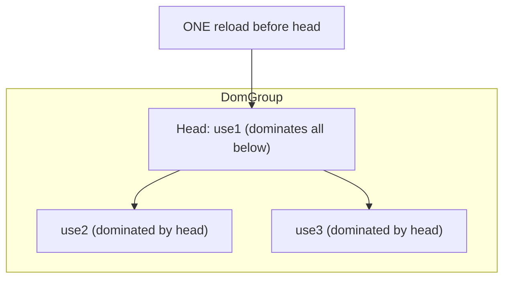

### DomGroup class

```cpp
class DomGroup {
  MachineInstr *Head;                    // First use - dominates all others
  SmallVector<MachineInstr *, 4> DominatedUses;
public:
  MachineInstr *getHead() const;         // Get the dominating use
  void addDominatedUse(MachineInstr *MI);
  void promoteHead(MachineInstr *NewHead); // When new use dominates current head
  size_t size() const;
};
```

### Algorithm in `buildDomGroupsForSpill()`

1. Collect all uses of spilled register (reachable from KillMI)
2. Sort uses by dominance order (dominating uses first)
3. For each use:
   - If an existing group's head dominates this use → add to that group
   - If this use dominates an existing group's head → promote this use as new head
   - Otherwise → create new group with this use as head
4. Result: minimal set of groups; one reload per group head covers all uses in group

## Block Reload Cache

### Purpose

The `BlockReloadCache` prevents duplicate reloads when multiple uses in the same block or multiple PHI operands from the same predecessor need the reloaded value.

### Data Structure

```cpp
DenseMap<std::pair<MachineBasicBlock *, Register>, Register> BlockReloadCache;
// Key: (Block, SpilledReg) → Value: ReloadedReg
```

### Lifecycle

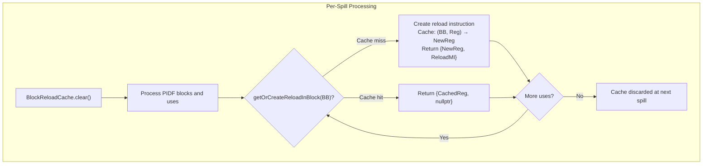

### When Cached vs Not Cached

| Scenario | Cached? | Reason |
|----------|---------|--------|
| Reload at block end (before terminator) | Yes | May be reused by multiple PHI operands |
| Reload before specific use instruction | No | Position-specific, can't be reused |

### Cache Invalidation

The cache is **cleared at the start of each spill** (`emitReloadsAndRepairSSA()`). This ensures:
- Reloads from previous spill iterations don't interfere
- Fresh state for each register being spilled

### Return Value Semantics

`getOrCreateReloadInBlock()` returns `std::pair<Register, MachineInstr*>`:

| Return Value | Meaning | Caller Action |
|--------------|---------|---------------|
| `{Reg, ReloadMI}` | New reload created | Call `repairSSAForReload()` for IDF processing |
| `{Reg, nullptr}` | Cached reload reused | Call `rewriteDominatedUses()` only |

## Final RP Validation

After all spilling, `validateFinalRegisterPressure()` traverses the function to verify RP is within limits:

- Skips spill/reload instructions during validation
- If RP exceeds limit at any instruction, reports a fatal error
- This is a safety check until split-before-use optimization is implemented

## High-level workflow

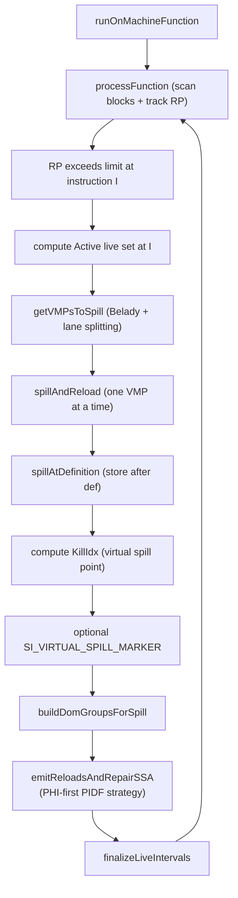

## Spill selection (Belady + lane splitting)

When a candidate register is larger than the remaining "spill budget", the spiller
selects only the minimum number of 32-bit sub-slots needed.

### Step 1 — NUA-based subreg ordering

`NU->getSortedSubregUses(...)` asks NextUseAnalysis for the per-lane use distances
of the candidate. This returns only lanes that appear as **distinct-mask uses** in the NUA
table (sorted furthest-first). If all uses reference the whole register (e.g.
`S_AND_B64 %w, %w` → mask `0x0F`), the result is a single entry covering all lanes.

### Step 2 — Fit-or-split loop

For each entry returned by NUA:

- If entry size ≤ `RemainingToSpill` → insert into `ToSpill`, decrement remaining.
- If entry size > `RemainingToSpill` (**"too large" branch**):  
  Decompose the entry into 32-bit parts using `TRI->getRegSplitParts(SubRC, 4)` and
  take only as many consecutive parts as `RemainingToSpill` requires. This guarantees
  exactly the needed number of slots are freed without over-spilling.

### Why NUA alone is insufficient for the "too large" case

NUA records use-site lane masks, not physical sub-register decompositions.
For a wide register used as a whole (e.g. `%w:sreg_64` always read/written as 64 bits),
`getSortedSubregUses` returns `[{%w, fullMask}]` — one entry of size 2.
If only 1 slot is needed, NUA cannot split further.
`getRegSplitParts` provides the sub-register boundary decomposition independently of NUA,
ensuring the minimum spill granularity is always 32 bits.

### Sub-register aware emission

When a partial lane mask is selected (e.g. sub0 of `sreg_64`):

- `spillAtDefinition` derives `SubRegIdx` from the lane mask via `VMP.getSubReg(MRI, TRI)`.
- `SIInstrInfo::storeRegToStackSlot` is called with `SubRegIdx`; it now emits
  `addReg(SrcReg, kill, SubRegIdx)` so the store pseudo is e.g.
  `SI_SPILL_S32_SAVE %w.sub0` rather than `SI_SPILL_S64_SAVE %w`.
- `constrainRegClass` is guarded by `SubRegIdx == 0` (the parent 64-bit vreg must not
  be constrained to a 32-bit register class).
- `loadRegFromStackSlot` already handled `SubRegIdx` correctly (unchanged).
- At the restore site, `MachineLaneSSAUpdater` inserts a `REG_SEQUENCE` to reconstruct
  the full wide value from the reloaded sub-slot plus the surviving remaining lanes.

### Example: `%w:sreg_64`, `RemainingToSpill = 1`

```
Before fix:  SI_SPILL_S64_SAVE %w       (2 lanes spilled, 1 VGPR lane wasted)
After fix:   SI_SPILL_S32_SAVE %w.sub0  (1 lane spilled, sub1 stays live)
             REG_SEQUENCE at restore: { reload_sub0, %w.sub1 } → full sreg_64
```

## Virtual spill point and SI_VIRTUAL_SPILL_MARKER

### What "virtual spill point" means
The spiller separates:
- **Where we store**: after definition (`spillAtDefinition`).
- **Where RP relief is intended**: the computed `KillIdx` for the high-pressure point.

### Marker pseudo-instruction (for tests)
- Option: `--amdgpu-ssa-spill-markers=1`
- Pseudo MI: `SI_VIRTUAL_SPILL_MARKER <vreg_index>, <lane_mask>`

---

# PHI-First PIDF Strategy

This section describes the core algorithm for reload placement and SSA repair.

## Key Design Insight: Why PHI-First Works

### The Invariant

By SSA construction, any block `B` in `IDF(KillBB)` where the spilled register is live-in **must** have a PHI to merge:
- The **reloaded value** from spill-path predecessors
- The **original value** from clean-path predecessors

This is not a choice—it's a requirement for SSA form correctness.

### The Strategy

Since PHIs are inevitable at PIDF blocks, we insert them **first** with all incoming operands set to `SpilledReg`:

```cpp
// All operands initially reference SpilledReg
PHI = insertPHIAtBlock(PIdfBB, SpilledReg, /*IncomingValues=*/{}, SpilledMask);
// Result: %phi = PHI [%x, bb.2], [%x, bb.3]  -- all operands = %x
```

### How Reloads Fix PHI Operands

When we insert a reload and call `rewriteDominatedUses(SpilledReg, ReloadReg, Mask)`, the SSA updater rewrites uses **dominated by the reload**. 

**Critical insight**: For PHI operands, the "use location" is the **end of the predecessor block**, not the PHI instruction itself. So if a reload dominates that predecessor's end, the PHI operand gets rewritten.

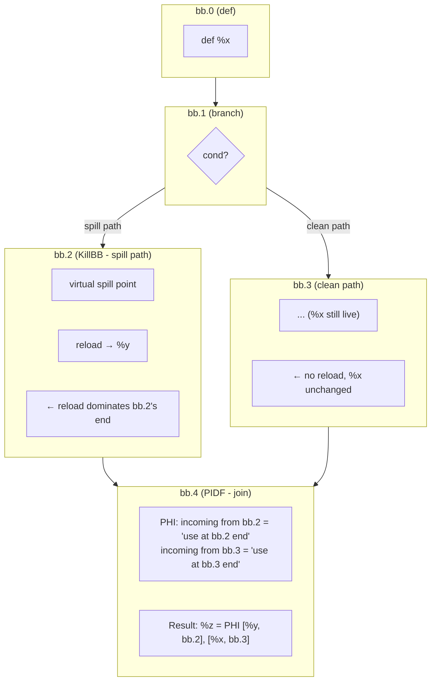

### Step-by-Step Execution

| Step | Action | PHI State |
|------|--------|-----------|
| 1 | Insert PHI at bb.4 (PIDF) | `%z = PHI [%x, bb.2], [%x, bb.3]` |
| 2 | Insert reload at bb.2 end: `%y = reload` | (unchanged) |
| 3 | `rewriteDominatedUses(%x, %y, mask)` | — |
| 3a | PHI operand from bb.2: "use at bb.2's end" → **dominated by reload** → **rewrite** | `%z = PHI [%y, bb.2], [%x, bb.3]` |
| 3b | PHI operand from bb.3: "use at bb.3's end" → **not dominated** → keep | (no change) |
| 4 | Final result | `%z = PHI [%y, bb.2], [%x, bb.3]` ✓ |

### Why This Is Elegant

We don't explicitly track "spill-path vs clean-path" for each PHI operand. Instead:

1. **All PIDF blocks get PHIs** (because SSA requires it)
2. **All operands start as SpilledReg** (the reaching definition before any reload)
3. **Reloads naturally fix the right operands** via dominance-based use rewriting
4. **Clean-path operands stay unchanged** (no reload dominates them)

This leverages the existing SSA repair machinery rather than building special-case logic.

## Algorithm: `emitReloadsAndRepairSSA()`

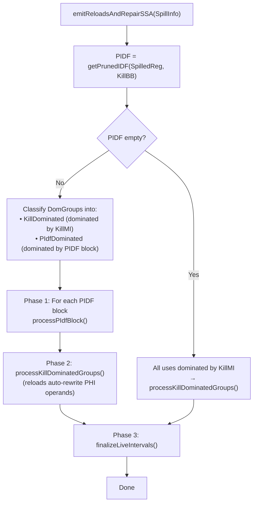

### Phase 1: `processPIdfBlock()`

For each PIDF block, we process the **group heads** (dominating uses) associated with it.

**Recall**: A group head is the first instruction in a DomGroup that dominates all other uses in the group. One reload before the head covers all uses in the group.

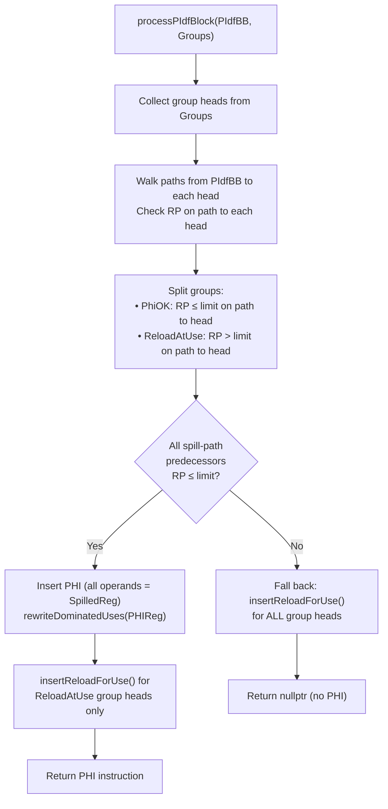

**Predecessor RP check rationale**: A PHI at a PIDF block requires spill-path predecessors to provide the reloaded value. This means a reload must be inserted at each spill-path predecessor's end, adding +1 to live-out RP. If the predecessor is already at the RP limit, we must fall back to reload-at-use.

### Phase 2: `processKillDominatedGroupsWithList()`

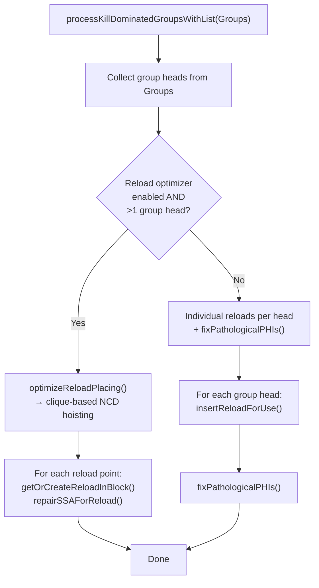

## SSA Repair: Two Methods

### `repairSSAForReload()` — For reload IDF PHI insertion

When a new reload is inserted, we call `SSAUpdater->repairSSAForReload(ReloadReg, SpilledReg, Mask, ReloadBB)`:

- Computes IDF of the reload block
- Inserts PHIs at IDF blocks where needed
- Rewrites dominated uses of SpilledReg to ReloadReg
- **Key**: Checks for existing PHIs to avoid duplicates (when reload IDF overlaps with PIDF)

### `rewriteDominatedUses()` — For cached reloads

When reusing a cached reload (already in `BlockReloadCache`), we only call `rewriteDominatedUses()`:

- No new PHIs needed (IDF already processed)
- Just rewrites any remaining uses dominated by the reload

## `fixPathologicalPHIs()` — Handling Asymmetric Use Patterns

### The Problem

The PHI-first strategy relies on `rewriteDominatedUses()` to fix PHI operands from spill-path predecessors. This works when there's a reload that dominates the predecessor's end.

**But what happens when there's a use on the spill path but NO use on the clean path?**

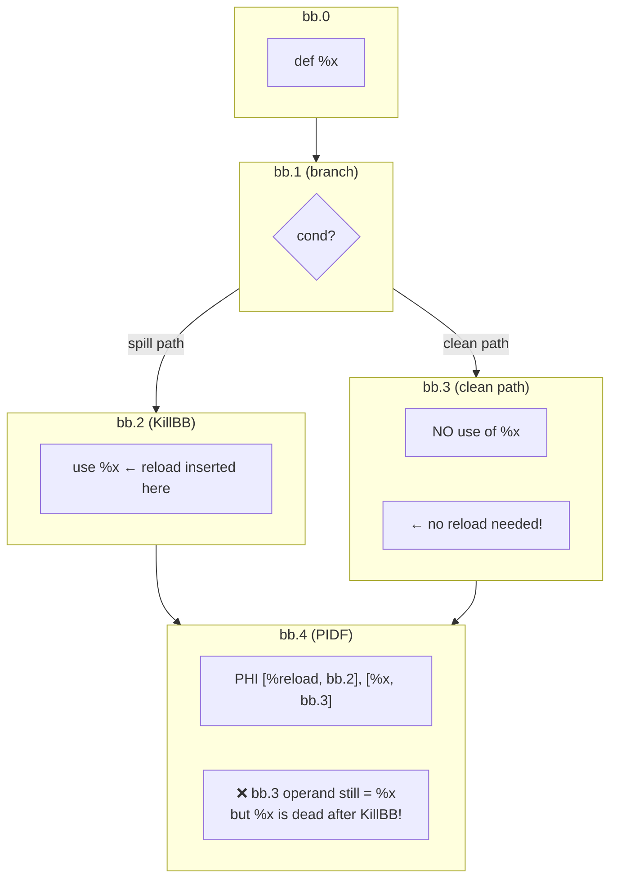

### Why This Happens

1. The spill path (bb.2) has a use → reload inserted → `rewriteDominatedUses()` fixes the PHI operand from bb.2
2. The clean path (bb.3) has **no use** → no reload inserted → no `rewriteDominatedUses()` call for bb.3
3. The PHI operand from bb.3 still references the original `%x`, but `%x` is supposed to be dead after KillBB

### The Solution: `fixPathologicalPHIs()`

After individual reloads are placed (when reload optimizer is disabled), we scan for PHIs that:
1. Are dominated by `KillMI` (spill point)
2. Still have operands referencing `SpilledReg`

These are "pathological PHIs" that need direct replacement with a reload:

```cpp
void fixPathologicalPHIs(SpilledVMP, FrameIndex, KillMI) {
  for each PHI using SpilledReg:
    if (DT->dominates(KillMI, PHI)):
      // Replace entire PHI with reload into PHI destination
      Insert: PHIDest = reload(FrameIndex)
      Remove: PHI
}
```

### When Is This Needed?

| Reload Optimizer | Asymmetric Uses | `fixPathologicalPHIs()` Needed? |
|------------------|-----------------|----------------------------------|
| Enabled | Any | No (IDF PHIs handle it) |
| Disabled | Symmetric | No (all paths get reloads) |
| Disabled | Asymmetric (use on spill, none on clean) | Yes |

---

## Reload Optimizer

When enabled (default), the reload optimizer minimizes reload count by hoisting multiple group heads to their Nearest Common Dominator (NCD).

### The Goal

Instead of N reloads (one per group head), place fewer reloads at NCDs that dominate multiple heads.

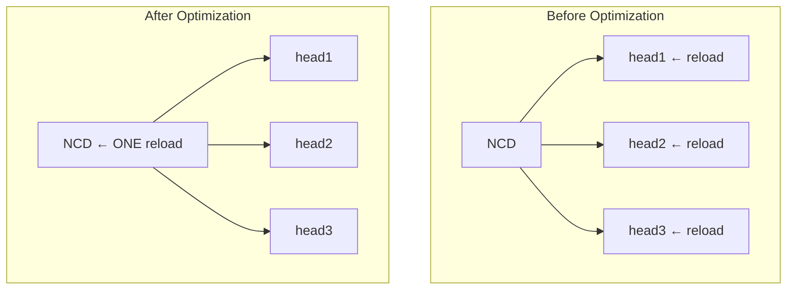

### Constraint: RP Must Not Exceed Limit

Hoisting a reload to NCD makes the reloaded value live across ALL paths from NCD to the heads. If any block on these paths has high RP, hoisting would exceed the limit.

### Good Path vs Bad Path

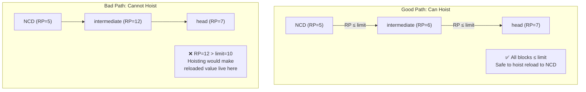

### Algorithm: `canHoistReloadTo()`

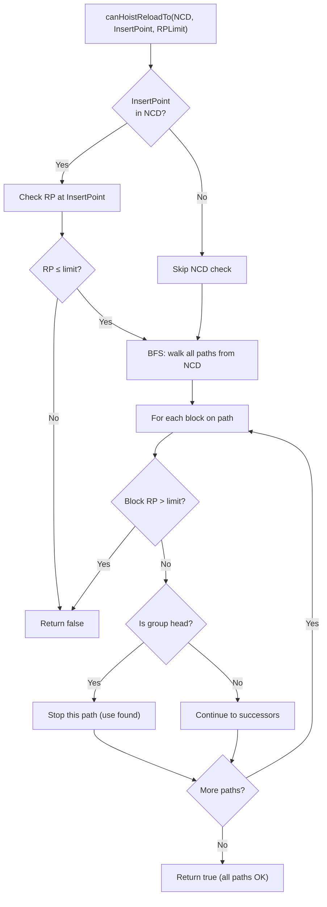

### Algorithm: `optimizeReloadPlacing()`

Greedy clique-based NCD algorithm:

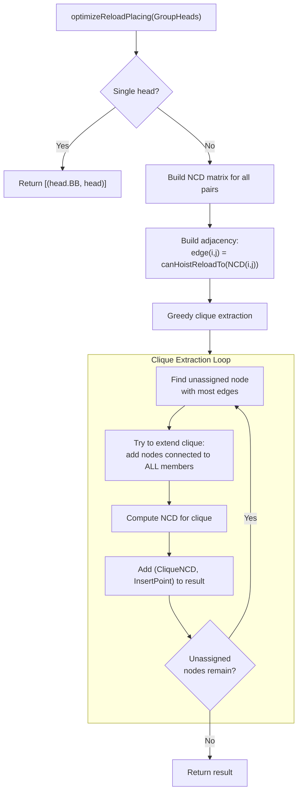

### Worked Example

Given 4 group heads with this CFG:

```
        bb.0 (NCD of all)
       /    \
    bb.1    bb.2
   /    \      \
 bb.3   bb.4   bb.5
 [h1]   [h2]   [h3,h4]
```

RP analysis:
- Path bb.0 → bb.1 → bb.3: RP OK
- Path bb.0 → bb.1 → bb.4: RP OK  
- Path bb.0 → bb.2 → bb.5: RP **exceeds limit** at bb.2

Result:
- Clique 1: {h1, h2} → reload at bb.1 (their NCD)
- Clique 2: {h3, h4} → reload at bb.5 (can't hoist past bb.2)

## Loop-Aware Spilling

### `adjustReloadForLoop()`

If a reload is inside a loop but the spill point is outside:
- Check if hoisting to loop preheader would exceed RP
- If safe, hoist reload to preheader (one reload vs N iterations)
- If unsafe, keep reload inside loop

### Loop Filtering in `getVMPsToSpill()`

Skip spill candidates that have:
- Definition inside any loop (would require store inside loop)
- Uses inside the same loop as the high-RP point (reload would still be in loop)

## Worked Example: Diamond CFG

### Before spill

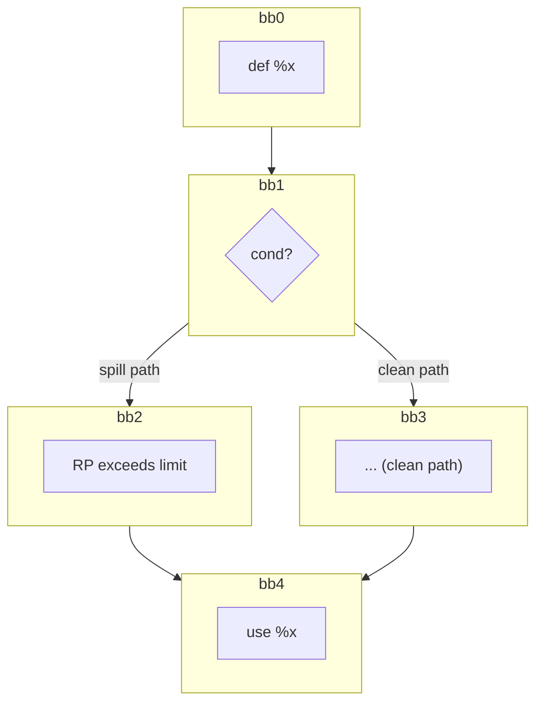

### After spill (PHI-first strategy)

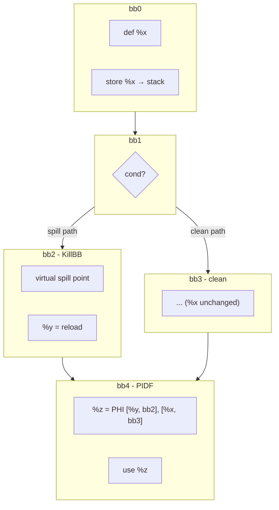

## Mapping to tests
See [`SSA_SPILLER_TEST_PATTERNS.md`](../05-Testing/SSA_Spiller/SSA_SPILLER_TEST_PATTERNS.md) for per-test diagrams and marker notes.

Key tests for PHI-first strategy:
- `spill-diamond-phi-merge.mir` - Diamond CFG with PHI merge
- `spill-triangle-phi.mir` - Triangle CFG with pathological PHI (asymmetric uses)
- `spill-reload-opt-basic.mir` - Reload optimizer NCD hoisting

## Appendix A: Historical notes (brief)
- Older materials in [`06-Research/Archive/`](../06-Research/Archive/) may illustrate earlier variants.
- The previous "dominated vs reachable" classification was replaced by "kill-dominated vs PIDF-dominated" in January 2026.

## Appendix B: Source files involved in spill emission

| File | Role |
|------|------|
| `llvm/lib/Target/AMDGPU/AMDGPUSSARegisterSpiller.cpp` | `getVMPsToSpill`, `spillAtDefinition`, `emitReload`, `countSGPRSpillVGPRs` |
| `llvm/lib/Target/AMDGPU/SIInstrInfo.cpp` | `storeRegToStackSlot` / `loadRegFromStackSlot` — emit `SI_SPILL_*_SAVE/RESTORE` pseudos; SubRegIdx support added 2026-06-11 |
| `llvm/lib/Target/AMDGPU/SIRegisterInfo.cpp` | `eliminateFrameIndex` — lowers VGPR spill pseudos via PEI; `eliminateSGPRToVGPRSpillFrameIndex` — lowers SGPR pseudos (called by `SILowerSGPRSpills`) |
| `llvm/lib/Target/AMDGPU/SILowerSGPRSpills.cpp` | Materialises SGPR spill pseudos to writelane/readlane after SSA RA; runs post-coloring when `SuperReg` is physical |
