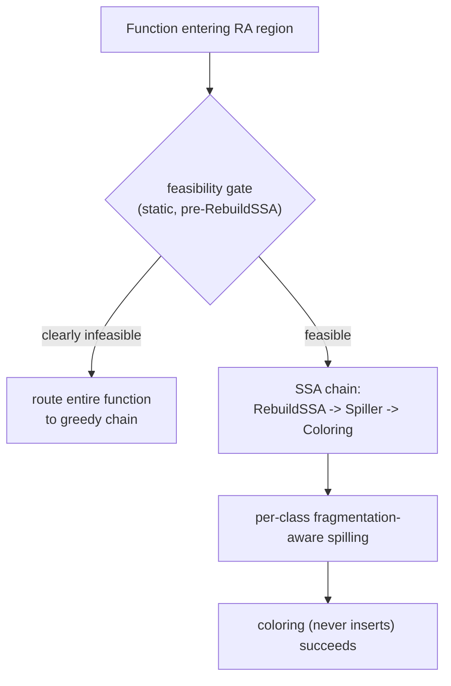
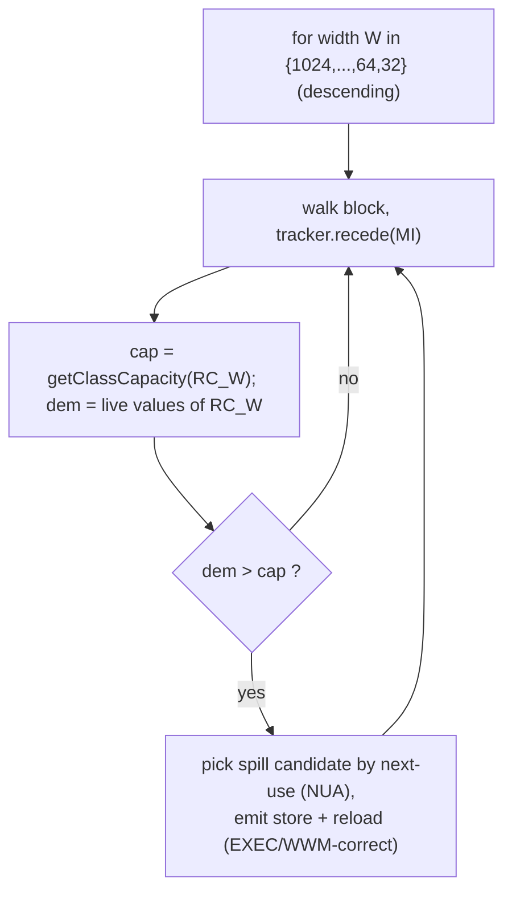
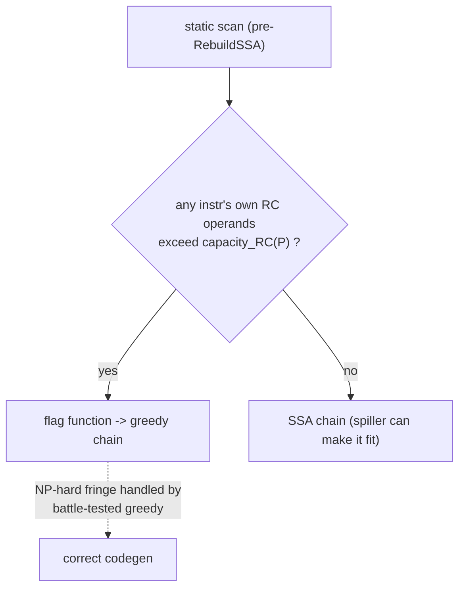
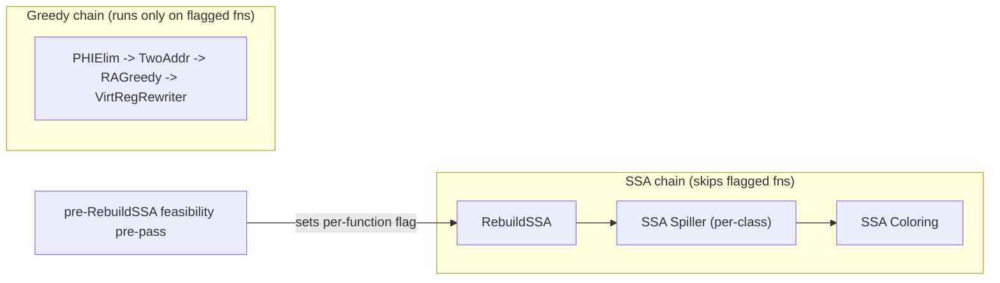

# SSA Spiller Redesign — Fragmentation-Aware, Per-Class Spilling

## 1. Motivation & The Hard Invariant

The SSA register allocator splits responsibilities so that **coloring is a pure,
non-inserting assignment**:

> **Invariant.** Coloring MUST NEVER insert instructions. Spill/reload placement
> on AMDGPU is only correct when the store and reload observe a consistent EXEC
> mask ($\mathrm{EXEC}_{\text{spill}} = \mathrm{EXEC}_{\text{reload}}$) or run in
> WWM. After SI control flow is lowered, finding such a point needs full
> exec-mask analysis and is fragile. The **early spiller** makes that decision
> once, in a dedicated pass — so no later stage (coloring) has to.

Consequence: **coloring must be guaranteed to succeed before it starts.** There
is no in-flight recovery. The spiller therefore has to lower pressure to a point
where the coloring theorem (chordal SSA, per width) holds — or, for the cases
that theorem cannot cover, the function must be routed elsewhere *before*
coloring commits.

## 2. Why the Current Spiller Is Insufficient

Today the spiller compares a **scalar** register-pressure count to one limit
(`CurRP < RPLimit`). On an aliased + pre-colored file this is necessary but not
sufficient, producing `Failed to find free physreg` asserts in coloring even
though the scalar count was "within limit":

- **Pinned wide values.** `a-v-global-atomicrmw`: two `vreg_1024_align2` pin all
  of `v0–v63`; a `vreg_64_align2` REG_SEQUENCE then has no slot. Greedy compiles
  it at `NumVgprs=64, ScratchSize=132` (it *spills*); our spiller does not.
- **Scattered pre-colors.** `spill-scavenge-offset`: an inline-asm clobbers every
  4th VGPR, so no 4-wide contiguous slot exists for a `VReg_128` regardless of
  the free-unit count.

Root issue: spill decisions are driven by a count blind to **register class** and
to **pre-color arrangement**.

## 3. Design Overview

Two components:

1. **Per-class, pre-color-aware pressure** from an augmented
   `GCNUpwardRPTracker` (see companion doc *GCNUpwardRPTracker Improvement*):
   `getClassCapacity(RC)` reports free slots of class `RC` at each `SlotIndex`,
   accounting for pinned physregs and (phase 2) fragmentation.
2. **A conservative, pre-`RebuildSSA` feasibility gate** that routes genuinely
   infeasible functions to the greedy allocator (the NP-hard pre-color+aliasing
   fringe), since coloring cannot recover.

## 4. Static Pre-Colored State

Pre-existing physregs are immutable during allocation, so their per-position
occupancy is static and cheap to obtain:

$$
\text{preColored}(P) \;=\; \{\, u : \mathrm{LIS.getRegUnit}(u).\text{liveAt}(P)\,\}
\;\cup\; \{\text{regmask clobbers at call slots}\}
$$

- Physical defs/uses (inline-asm clobbers, ABI live-ins, physreg defs) come
  directly from reg-unit live ranges.
- **Regmasks create no reg-unit range** (they are stored as `RegMaskSlots`), so
  call clobbers are folded in from the clobber-site set the allocator already
  collects.

This state seeds the tracker's `PreColoredUnits` BitVector.

## 5. Per-Class Spill Decision

Process **width-descending** (mirror coloring) so a class's wider consumers are
resolved before narrower ones. For each position $P$ and class $RC$ of width $K$
units:

$$
\text{demand}_{RC}(P) = \#\{\text{live values of class } RC \text{ at } P\},
\qquad
\text{spill while } \text{demand}_{RC}(P) > \text{capacity}_{RC}(P).
$$

Spill candidate selection reuses the existing next-use (NUA) ordering; spill and
reload placement reuses the existing EXEC/WWM-correct emission — only the
*trigger* (per-class capacity vs demand) changes.

## 6. Feasibility Gate → Greedy Fallback

Because coloring cannot spill, the gate must be **sound toward fallback**: route
to greedy whenever there is any risk coloring could fail. A sound *local*
infeasibility test (static, from pre-colored state) is:

$$
\exists\, \text{instr } I \text{ at } P,\ \exists\, RC:\quad
\text{needs}_{RC}(I) \;>\; \text{capacity}_{RC}(P)
$$

where $\text{needs}_{RC}(I)$ counts the class-$RC$ operands that must co-exist at
$I$ (its own defs+uses, tied/early-clobber aware). If an instruction's *own*
operands cannot fit, **no spilling helps** → fall back.

- **Conservative start:** fall back if the function merely *contains* scattered
  physreg clobbers overlapping any wide-tuple ($K \ge 4$) live range — a few
  lines, provably safe, converts the whole bucket from crashes to correct greedy
  codegen; tighten toward the precise $\text{needs} > \text{capacity}$ trigger as
  the per-class spiller matures.
- **Necessary, not sufficient:** the local test cannot guarantee global
  colorability (alignment + pre-color is NP-hard), so the gate over-approximates
  risk rather than risk a no-recovery crash.

## 7. Pipeline Integration

The two allocators are different pass chains added at module scope, so
per-function routing is by a flag set before `RebuildSSA`:

In-allocator "spill on placement failure" is **rejected** — it violates the hard
invariant (it would drag EXEC/WWM spill reasoning into coloring).

## 8. Milestones

1. **Tracker augmentation** — `PreColoredUnits` BitVector + `getClassCapacity(RC)`
   (naive count). Removes ad-hoc `LivePhysRP` and its dead-clobber bug.
2. **Per-class spill trigger** — replace scalar `CurRP < RPLimit` with
   width-descending per-class demand-vs-capacity. Target: `a-v-*` pinned-wide
   cases (greedy also spills) compile.
3. **Feasibility gate (conservative)** — flag + greedy fallback for the fringe;
   convert remaining `Failed to find free physreg` crashes to correct codegen.
4. **Fragmentation-aware capacity** — upgrade `getClassCapacity` to the run-based
   model; target: `spill-scavenge-offset` scattered-clobber cases. Tighten the
   gate toward the precise local test.

## 9. Correctness Summary

| Property | Mechanism |
|----------|-----------|
| Coloring never inserts | all spill/reload in the early spiller (invariant) |
| Pinned-wide / high pressure | per-class demand vs capacity (naive count) |
| Scattered-clobber fragmentation | run-based capacity (phase 4) |
| NP-hard pre-color+aliasing fringe | conservative feasibility gate → greedy |
| No no-recovery crashes | gate is sound-toward-fallback; coloring pre-guaranteed |
