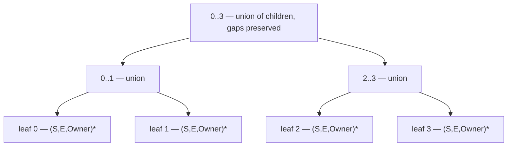

# Lane-Accurate Interference — Per-Unit Occupancy over Slot Ranges

> **Status: guarding scheme SETTLED (2026-08-29); structure PROPOSED.**
> Implemented today: the measurement instrumentation
> (`-amdgpu-ssa-lane-waste-dump`, `AMDGPUSSARegisterAllocator::reportLaneWaste`)
> and the per-unit interference probe inside `pickFreePhysReg`, which is the
> reference oracle of §7 in unlifted form. §7 and §10 are settled and supersede
> the earlier two-oracle plan built on `LiveIntervalUnion`, which is rejected.
> The tree structure of §4–§6 is still proposed.
>
> **This document amends [[RegisterTree_Driver_FSM]] §5–§6**, which concluded
> that an interval-augmented structure is unnecessary. That conclusion is correct
> *within a single width pass* and incorrect *across* them; see §3.

## 1. The defect

The allocator charges a value the **whole tuple for its whole range**, on both
axes:

- **Lane axis.** `markOccupied(PhysReg)` sets every register unit of the assigned
  physreg with no lane mask. A `vreg_128` whose `sub1..3` are dead occupies four
  registers.
- **Time axis.** The interference test against already-colored values is
  `LiveInterval::overlaps(VI)`, which compares **main ranges only** — subranges
  are never consulted — and on a hit sets *all* units of the other value's
  physreg.

Greedy has neither problem, and not because it transforms the program.
`LiveRegMatrix::assign` routes through `foreachUnit`, which walks
`MCRegUnitMaskIterator` and unifies into each unit **only the subrange whose lane
mask covers that unit**. Dead lanes are never claimed, so the registers stay
available. It is a property of how interference is tested, not of the IR.

The allocator already knows this is wrong. The partial-kill path in `color()`
frees the units of dead subranges and its comment says so outright — *"Holding
the dead lanes occupied is a soundness bug: spilling N lanes must drop RP by
N*32"* — but it only fires from the use-operand loop, so a lane is released only
if some instruction happens to read the value at a point where that subrange is
dead.

## 2. What the measurement says

480 corpus records replayed with per-function instrumentation, 27,308
function-and-file rows, each recording peak whole-tuple occupancy against
subrange occupancy at the same slot, joined to the archived per-kernel deltas
versus Greedy (`archive-rescuebound-0828`).

**Dead-lane occupancy is common but rarely binding.** 20% of rows carry some at
their peak slot. Of the 469 rows whose whole-tuple peak exceeds the allocatable
pool, only **46 (9.8%)** would fit under subrange accounting.

**It does not explain the quality gap.** Kernels worse than Greedy carry more
waste than equal-or-better ones — nonzero in 26.9% vs 18.2%, and at the 90th
percentile $0.219$ of the pool vs $0.021$ — but of the 6,100 kernels using more
VGPRs than Greedy, the waste covers the deficit in only 25%, and just **31 of
6,723** worse kernels would cross from "does not fit" to "fits". Median waste is
zero in both groups. Whatever drives `REGRESSION_OCC_OR_SPILL` and `MIXED`, this
is not it; coalescing remains the standing suspect.

**It is decisive for one crash family.** These fit outright under subrange
accounting:

| function | file | pool | whole-tuple | subrange | waste |
|---|---|---|---|---|---|
| `test_mfma_f32_32x32x1f32_rewrite…` | VGPR | 64 | 95 | 34 | 61 |
| `test_rewrite_mfma_direct_copy` | VGPR | 64 | 65 | 37 | 28 |
| `eliminate_spill_after_mfma_r…` | VGPR | 64 | 69 | 41 | 28 |
| `identical-subrange-spill-infloop / main` | SGPR | 70 | 84 | 48 | 36 |

The rest of the crash set is genuine over-pressure with nothing to reclaim:
`amdgcn.bitcast.1024bit` peaks at 96–193 against a pool of 64 with zero waste,
`spill-agpr` has zero waste at its peak on both gfx908 and gfx90a,
`scc-clobbered-sgpr-to-vmem-spill` is 150 against 53 with zero waste, and
`spill-scavenge-offset`'s SGPR peak is 47 subrange-accurate against a pool of 41.

**Conclusion.** This is a correctness and crash fix affecting roughly four of
eleven known failures. It should not be justified as a quality improvement.

*Caveats.* The dump truncates on 16-bit classes (`getRegSizeInBits/32` yields 0
while `getNumCoveredRegs` yields 1), so 82 of 27,308 rows report `lane > whole`;
none sit at a binding peak. Measurements are taken at function entry, before
pre-spill and before the in-allocator spiller runs.

## 3. Amendment to [[RegisterTree_Driver_FSM]] §5–§6

That design argues interference collapses to a point query: values are placed in
dominance order, so nothing already assigned starts after the frontier, so a
physreg free *now* is free for the whole unprocessed future. §6 concludes the
interval-augmented structure is not needed.

**The dividend is real but scoped to one width pass.** Coloring is
width-descending and multi-pass: every value of width 4 is colored across the
whole function before any value of width 1. When the narrow pass reaches its
frontier, the assigned set already contains wide values that **begin later in the
program than that frontier**. Dominance order holds within a pass; it does not
hold across passes, and the frontier of pass $k+1$ has no ordering relationship
to the definitions committed in pass $k$.

The shipped code is the proof. `pickFreePhysReg` cannot rely on the scanline
alone: it walks the entire `ColorMap` testing `LIS->getInterval(WReg).overlaps(VI)`
for every wider value, and takes a `WiderDefs` list as a parameter for wider defs
inside the current block that are not yet live at block entry. Those are range
queries, hand-rolled, because point-freedom is insufficient. `seedOccupiedAtBBEntry`
exists for the same reason.

So the question is not *whether* to hold occupancy over ranges — the allocator
already does, three times over, approximately. The question is whether to keep
doing it with whole-value hulls and whole-tuple units, or to hold it exactly.

## 4. Structure

One tree per register file (SGPR, VGPR/AGPR); their register units are disjoint.
Leaf $j$ is the 32-bit register unit at index $j$ within that file, $N$ rounded up
to a power of two.

**Leaf** — a sorted vector of `(Start, End, Owner)` half-open slot ranges.
Segments at one leaf are pairwise disjoint by construction: two values occupying
the same unit at the same slot *is* the interference bug, so an overlapping
insert is an allocator fault the tree can report at the moment it happens rather
than at the machine verifier.

**Internal node** — the coalesced union of its children's ranges, **gaps
preserved**. Not $[\min(\text{start}), \max(\text{end}))$: a hull at the tuple
level reintroduces the same over-claiming this design removes, one level up. A
64-bit node whose two leaves are busy at opposite ends of the function must not
read as busy throughout.

**Invariant.** Every internal node is a pure function of its children:
$\text{node} = \mathrm{coalesce}(\mathrm{merge}(\text{left}, \text{right}))$.
Nothing above the leaves carries independent state, so nothing above the leaves
can fall out of sync. Ownership is needed only at leaves.

**The range stored at a unit is the subrange covering that unit's lanes**, not
the value's whole interval. That sentence is the correctness fix; the rest is
mechanism.

This differs from [[RegisterTree_Driver_FSM]] §4, which stores one denormalized
`{Owner, start, end}` per node cached from the owner's interval *bounds*. That
representation cannot express either a lane-restricted extent or a gap.

## 5. Operations

| operation | method | cost |
|---|---|---|
| allocate | insert per leaf, recompute the block subtree then the root path | $O(w + \log N)$ merges |
| free | drop the owner's segments at its leaves, recompute identically | same |
| `isSpanFree(first, w, [S,E))` | canonical decomposition of the run into maximal aligned nodes, ANDed | $O(\log N \cdot \log s)$ |

`isSpanFree` is the **only** query the allocator needs (§9): candidates come from
`getOrder`, so there is no search primitive. It handles arbitrary starts and
arbitrary widths, because any run decomposes into at most two nodes per level and
"free" ANDs across the cover. The width-3 run $[1,4)$ over four leaves is
`isFree(leaf 1) AND isFree(node 2..3)` — no phase arrays, no doubled tree, no extra
storage beyond what the nodes already hold.

It must read only the free-extent aggregates, never `NodeAllocated`, which records
"this exact aligned block was claimed by one `allocateAligned` call" — something an
unaligned span never is. An unaligned tuple is allocated by marking its leaves as
width-1 cells, which keeps every ancestor aggregate correct.

**The leaf axis is hardware register index, not `getOrder` ordinal.** A span needs
consecutive *hardware* registers, and allocation order is not hardware order on
targets that reserve registers. The shadow tree indexes leaves by ordinal and
explicitly refuses to assume contiguity in that space — harmless at its width-1
scope, wrong for any span query — so the leaf mapping must change before
`isSpanFree` means anything.

Free needs no reference counting and no `NodeAllocated` bookkeeping: ancestors
are recomputed from children, so allocate and free are the same walk with a
different leaf mutation.

### Cost risk and the fallback

The merge at each level is linear in the node's array, and the root's array is
every busy period in the file — so one allocate or free is $O(\text{total
segments})$ at the top, with as many operations as there are values. On a large
function that is thousands of segments times thousands of operations. This is the
one number in the design that should be measured rather than reasoned about.

If it measures badly: keep exact segments **only at leaves** and give internal
nodes a one-word summary (hull, and perhaps a count) used solely as a sound
one-sided prune — miss the hull and the subtree is definitely free, intersect it
and descend. Updates become $O(1)$ per level, exactness still comes from the
leaves, and the worst case is $w$ leaf tests per candidate block: 32 binary
searches for a 1024-bit tuple. Pruning is weaker near the root, but the root
prunes nothing under either model, being busy almost everywhere.

Both variants are sound; they differ only in where the work happens.

## 6. Seeding

Reserved registers and physical-register liveness enter from
`LIS->getRegUnit(Unit)` with a sentinel owner — not from `MBB->liveins()`, which
is the current whole-block approximation. Both oracles must seed identically or
they will disagree for reasons that are not bugs.

## 7. Reference oracle and validator — SETTLED 2026-08-29

`LiveIntervalUnion` is **rejected** as the reference. It would mean creating,
debugging and maintaining a body of potentially throwaway code whose staleness
discipline (`unassign` before any interval mutation) is an *unenforced upstream
convention* — not an assertion, not checked by `MachineVerifier` — and whose
snapshots hold `const LiveInterval *`, so `removeInterval` +
`createAndComputeVirtRegInterval` can dangle them. `LiveRegMatrix` is additionally
shaped around `VirtRegMap` coupling and around enumerating interferers so they can
be *evicted*; this allocator never evicts, because SSA chordality means
dominance-order coloring succeeds without a priority queue, split costs or
last-chance recoloring.

### The principle: two implementations of one question, the slow one judging the fast one

The question is: **for value V, which register units are unavailable?**

The **reference** answers it by brute force on every call — walk every colored
value in `ColorMap`, ask `LiveIntervals` whether its subranges overlap V on each
unit it holds, set a bit if so. Its defining property is that it **derives
everything and caches nothing**: no stored state to go stale, no update hook to
miss, no ordering assumption to violate. It is correct *by construction*, and too
slow to ship (cost proportional to the colored set, per query). It is the
definition of the right answer, not a candidate implementation.

This code already exists — it is the per-unit probe now in `pickFreePhysReg`
(building `OccupiedAtDef` from scratch per call). Stage 1 only lifts it into a
named `recomputeOccupancy(V)` with that contract written down. Nothing is
throwaway, and the checker exists *before* the cached structure it checks.

The **tree** is the fast implementation of the same query.

### What is compared, and how disagreement is read

Compare the **bitvector of unavailable units over V's range** — the legality
predicate. Do **not** compare which register was chosen: choice is governed by the
AGPR preference and the phi-affinity hints, is orthogonal to occupancy, and two
traversals may pick different legal registers and both be right.

Disagreement is read **directionally**, and the two directions are not
symmetric in severity:

| tree says | reference says | meaning | severity |
|---|---|---|---|
| free | occupied | two live values could share a register | **miscompile — hard error, must be zero** |
| occupied | free | tree is merely pessimistic; a register is lost | warning: possible needless spill or colorfail |

Only the first row blocks the flip. The second is counted, bucketed by the corpus
harness, and accepted knowingly.

### Why the existing shadow cannot serve as this guard

The `SSARegisterTree` shadow wired today is **fed by the incumbent**:
`shadowResetToOccupied` re-derives the tree *from* `OccupiedRegUnits`, and
`shadowAllocate`/`shadowFree` are driven by the same events. It is a photocopy of
the incumbent's answer and can only detect *copying* mistakes — which is exactly
what its drift probe calls "a mirror bug". Three further limits: its comparator
tests `pickFreeAligned(1) == RealLeaf`, i.e. "did the allocator pick the lowest
free leaf", which is systematically false whenever an AGPR preference or affinity
hint fires, so its diff can never reach zero and its residual carries no signal;
it is gated on `Reporter->active()`, so ordinary corpus runs never exercise it;
and its scope is VGPR_32 width-1, with wider tuples logged as skips and mirrored
as *independent* width-1 leaves, so the aligned-tuple logic that motivates a
segment tree is never exercised.

Corollary, and the reason "zero diff against the existing code" is the wrong
criterion outright: the incumbent whole-tuple model is the defect being removed.
Reproducing it bit-for-bit means faithfully reproducing over-claiming. A diff
against it is *wanted*. Only a diff against the recompute reference is meaningful.

### The validator survives the flip

Shadowing observes only the states the *incumbent's* decision sequence reaches.
The moment the tree is authoritative it steers the allocator down paths the shadow
never walked, so zero diff while shadowing cannot certify post-flip behaviour.
Therefore `recomputeOccupancy` is **retained** under `EXPENSIVE_CHECKS` rather
than deleted once green, cross-checking every query on the new trajectory. That is
strictly stronger than upstream, where `LiveRegMatrix` has no validator at all.

## 8. What it replaces

| current mechanism | fate |
|---|---|
| `OccupiedRegUnits` + `markOccupied` / `markFree` | deleted |
| `seedOccupiedAtBBEntry` (full `ColorMap` walk per block) | deleted |
| `scanOverlappersForVI` (occupancy role) | deleted |
| `OccupiedAtDef` augmentation + `WiderDefs` parameter | deleted |
| kill tracking in `color()`, incl. partial-kill and early-clobber deferral | deleted |
| `shadowAllocate` / `shadowFree` / `shadowFreeUnit` / `shadowResetToOccupied` | deleted |

Three linear `ColorMap` walks per pick become segment-tree queries, which also
retires the standing performance item on `pickFreePhysReg`.

## 9. Candidate order — SETTLED 2026-08-29: enumerate from `getOrder`, ask the tree only "is it available"

VGPR tuples have stride 1 on most targets — `v[1:2]` is legal, and
`FeatureRequiresAlignedVGPRs` has only three use sites in `AMDGPU.td` — so the
legal candidate set is **not** the set of power-of-two-aligned blocks. Likewise
`vreg_96` and the 96-bit-and-wider SGPR classes have no aligned node at all.

**Decision: candidates come from `RegClassInfo::getOrder(RC)`, and the tree answers
only `isSpanFree`.** `getOrder` already encodes each class's stride (SGPR 2 for
64-bit, 4 for 96-bit and wider) and its reserved registers, and it is the order the
allocator's own policy layers sit on top of — the AGPR preference and the
phi-affinity hints run before first-fit. No search primitive is needed in the tree,
so `pickFreeAligned` never has to be generalised.

### Why a search primitive was rejected, in both forms considered

**Generalising `pickFree` to arbitrary starts** would need the standard
maximum-consecutive-free-run augmentation per node — prefix run, suffix run,
longest internal run, with a straddling run being left-suffix plus right-prefix.
Sound and $O(\log N)$, but it buys nothing while candidate order must come from
`getOrder` anyway. Kept on the shelf as a later optimisation, not a prerequisite.

**Scanning one tree level** is attractive because the heap layout makes a level a
contiguous index range — width-$2^k$ nodes occupy $[N \gg k,\; N \gg (k-1))$, so it
is a flat array sweep with no pointer chasing. It is nonetheless **incomplete**, and
one 4-leaf example shows why. With leaf 0 occupied, leaves 1 and 2 free, leaf 3
occupied, a level-1 scan sees `[01]` and `[23]`, neither wholly free, and reports no
width-2 block — yet `v[1:2]` is free and legal. Level $k$ *contains only*
$2^k$-aligned blocks, so a straddling free span is invisible to it, and a
non-power-of-two width has no level at all: at width 3, level 2 demands a full
aligned 4 and level 1 accepts 2. The failure mode is pessimism, not a wrong answer —
legal placements go unseen, so the allocator spills or fails to color where it need
not. Separately, leaf order is not candidate order once registers are reserved.

Note also that a level scan is not even an optimisation over what exists: the
committed tree answers the aligned query in $O(\log N)$ through the
`MaxFreeAligned` descent, against $O(N/2^k)$ for the sweep — 11 steps versus 1536
entries at width 1 on `gfx1200` wave32.

### The one place a level sweep does earn its keep

As a cheap **admission filter** ahead of the exact test, where the aggregate is
necessary but not sufficient: sweep level 2 for nodes with `FreeLeaves >= 3` before
verifying a specific three leaves for a stride-4 width-3 SGPR. Reuses aggregates
the tree already maintains, and the decomposition supplies the truth.

## 10. Staging — REVISED 2026-08-29

1. **Reference authoritative.** Lift the per-unit probe out of `pickFreePhysReg`
   into `recomputeOccupancy(V)` with the "derives everything, caches nothing"
   contract written down; delete the scanline machinery in §8. This alone is the
   correctness fix and the bulk of the cleanup. Also invert the spill ordering at
   RA `:2171-2178` — the victim and `lastWebErased()`/`lastWebGround()` must leave
   the map BEFORE `spillOneVMP`, which rewrites their intervals.
2. **Augment the tree** (decided before guarding, since there is no point diffing
   a structure that cannot express the query): per-unit `(Start, End)` arrays per
   §4, plus span queries at arbitrary starts and non-power-of-two widths. Until
   this exists the tree answers only "occupied *now*" point queries and cannot be
   asked the interference question at all.
3. **Diff tree against the reference**, on the legality bitvector, with the
   directional severity of §7. Unsound disagreements must reach zero;
   lost-capacity ones are bucketed and understood.
4. **Flip legality to the tree**, keep `recomputeOccupancy` under
   `EXPENSIVE_CHECKS` permanently as the validator, then delete
   `OccupiedRegUnits`, `seedOccupiedAtBBEntry`, `markOccupied`/`markFree`, the
   partial-kill deferral and the shadow mirrors.

Gates for each stage: the crash functions in §2, `cf512` as the under-spilling
canary (an earlier, more accurate pressure model under-spilled and broke it), and
a corpus run at `--timeout 300` against `archive-rescuebound-0828` compared by
per-test bucket **transition**, with the lane-waste dump as before/after evidence.

**The SSARA and SSASpiller lit suites are NOT a gate** (user ruling 2026-08-29):
they were authored for the abandoned NUA + EarlySpiller + old-RA design, so their
CHECK lines encode expectations of machinery that no longer exists. Earlier
revisions of this document listed them as a gate; that is withdrawn.

Nothing built in stages 1–3 is throwaway, and the checker exists before the cached
structure it checks — the opposite of how the shadow tree was introduced.

## 11. Open questions

- **Merge cost** (§5). Exact unions versus leaf-only segments with hull
  summaries. Decide on measurement.
- **Temporal holes are unmeasured.** The data in §2 quantifies *lane*
  over-claiming. Whether *hull-versus-segments* over-claiming costs anything is a
  separate question the same instrumentation could answer, and it determines
  whether node arrays need gaps at all or whether a per-unit extent would do.
- **Region pressure must follow.** Once occupancy is lane-accurate, the whole-width
  rule in `reduceRegionPressure` describes a limitation that no longer exists, and
  the region model has to become lane-accurate or it will over-estimate against an
  allocator that no longer over-claims. That is the point at which
  `findTightRegions`, `KillIdx = R.Start` and hole-aware candidate admission land,
  with the accounting question already settled.
- **Fate of `narrowSpilledRemnants`.** Narrowing still reduces spill *traffic*
  even when it no longer buys capacity. Keep, but re-justify.
- **Fate of the committed `SSARegisterTree` aggregates.** `FreeLeaves`,
  `MaxFreeAligned` and `FullAtLevel` are $O(1)$ scalars valid for "now". Under a
  range model they become query-relative and cannot be read off a stored value.
  `pickFreeAligned` is no longer on the critical path at all (§9), so it needs no
  range-aware successor; `MaxFreeAligned` survives only if the admission-filter use
  proves worthwhile, and `FullAtLevel` serves the packing-pressure invariant, not
  allocation. Also note the file header of `SSARegisterTree.h` still describes
  `pickFreeAligned` and `fullCountAtLevel` as stubbed; both are implemented.
- **CLOSED 2026-08-29 — alignment and odd widths.** Handled by the canonical
  decomposition in §5 with no new storage; see §9 for why generalised search and
  level sweeps were both rejected.
