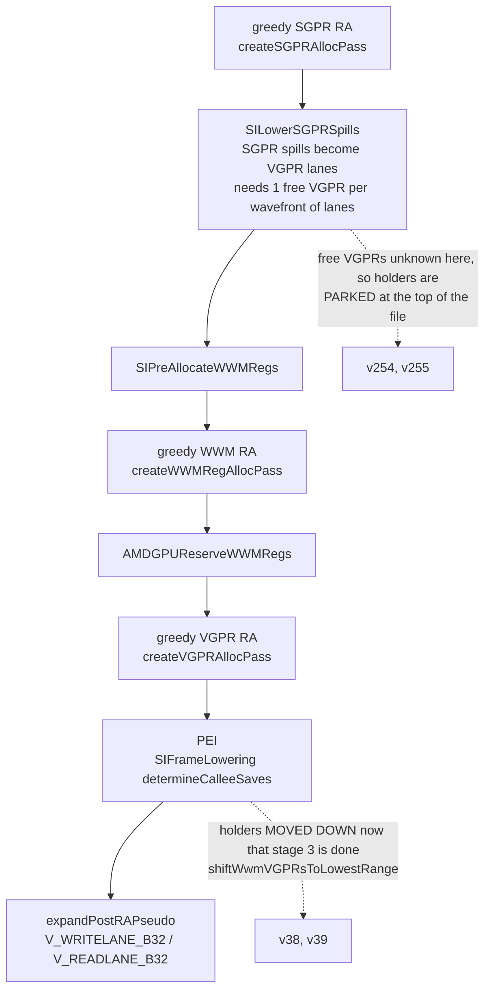
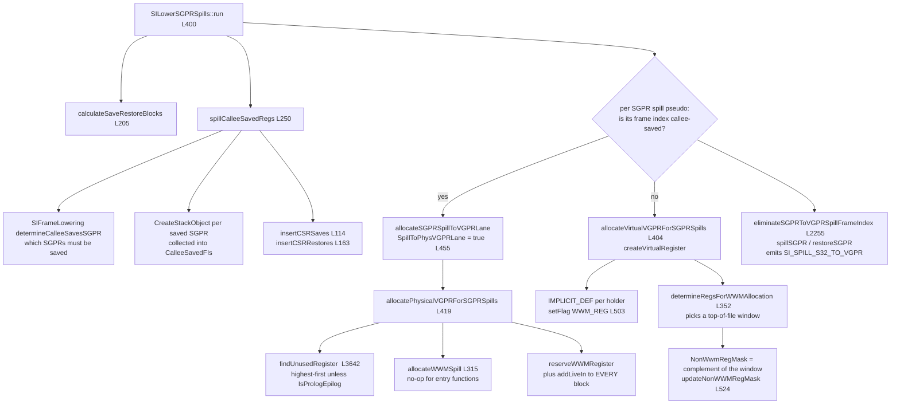
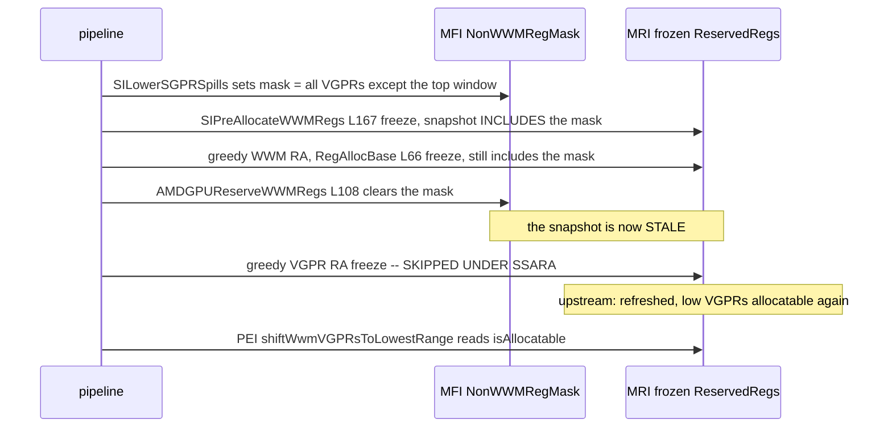
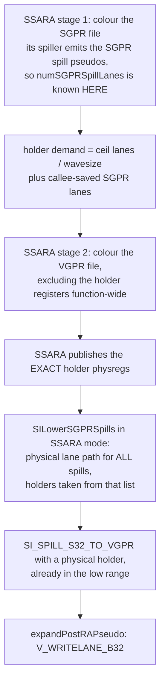

# SGPR Spill Lowering Inside the SSARA Pipeline

> Source Mapping: `SILowerSGPRSpills.cpp` (`run` :400, `spillCalleeSavedRegs` :250,
> `determineRegsForWWMAllocation` :352, `updateNonWWMRegMask` call :524);
> `SIMachineFunctionInfo.cpp` (`shiftWwmVGPRsToLowestRange` :363,
> `allocateVirtualVGPRForSGPRSpills` :404, `allocatePhysicalVGPRForSGPRSpills` :419,
> `allocateSGPRSpillToVGPRLane` :455, `allocateWWMSpill` :315);
> `SIRegisterInfo.cpp` (`getReservedRegs` NonWWMRegMask loop :724,
> `eliminateSGPRToVGPRSpillFrameIndex` :2255, `findUnusedRegister` :3642);
> `AMDGPUReserveWWMRegs.cpp` (`clearNonWWMRegAllocMask` :108);
> `SIFrameLowering.cpp` (`determineCalleeSaves` shift-back :1720-1732);
> `AMDGPUTargetMachine.cpp` (`addRegAssignAndRewriteOptimized` :1714-1776);
> `RegAllocBase.cpp` (`freezeReservedRegs` :66); `SIInstrInfo.cpp`
> (`expandPostRAPseudo` SI_SPILL_S32_TO_VGPR :2116).

Status: **DESIGN ONLY — NOT IMPLEMENTED. Scheduled AFTER the register-allocator
code cleanup** (user decision, 2026-09-01). A minimal workaround for the concrete
regression is applied separately; see "Interim workaround" below. Rationale for the
deferral: the allocator currently has several entities doing overlapping work and a
tangled control flow (the `reduceRegionPressure` rewrite is the first step of that
cleanup). Re-plumbing the spill-lowering pipeline before that cleanup would land a
large change into code that is still moving, and the debugging cost would dominate.

## 1. The question the whole design turns on

When an SGPR spill needs a VGPR to hold its lanes, **who knows which VGPRs are
free?**

- Upstream: nobody yet — the per-thread VGPR allocator has not run. So the choice
  is *deferred*, parked at the top of the register file, and *repaired later*.
- Under SSARA: the allocator has already coloured the VGPR file when the lanes are
  needed. The deferral buys nothing, and the repair step is a liability.

## 2. Upstream: three stages and the knowledge gap

The per-thread VGPR allocator is last on purpose: per-thread demand is not final
until SGPR spilling has minted its lane holders and WWM has claimed its window. Both
sites document the parking explicitly — `determineRegsForWWMAllocation`: *"Try to use
the highest available registers for now. Later after vgpr-regalloc, they can be
shifted to the lowest range."*

`addRegAssignAndRewriteFast` has the same shape: SGPR, then `SILowerSGPRSpills`,
`SIPreAllocateWWMRegs`, WWM, `SILowerWWMCopies`, `AMDGPUReserveWWMRegs`, then VGPR.

## 3. Inside `SILowerSGPRSpills`: the call graph

Two structural facts that matter for the design:

1. The callee-saved spills **already** use a physical lane path, chosen because
   routing them through a register allocator can split or spill the holder and break
   CFI encoding (comment at `SILowerSGPRSpills.cpp` :461-470).
2. A holder is added as a live-in to *every* block, so it is a **function-wide
   reservation**, not a live-range-scoped assignment.

## 4. Why it broke under SSARA (root cause, 2026-09-01)

`MachineRegisterInfo` keeps reserved registers as a *frozen snapshot*
(`freezeReservedRegs` is a plain recompute-and-assign, idempotent), and
`isAllocatable(R)` is `isInAllocatableClass(R) && !isReserved(R)` against that
snapshot. `SIRegisterInfo::getReservedRegs` reserves every VGPR named in
`NonWWMRegMask`, which is the *complement* of the small top-of-file window — i.e.
practically the whole per-thread range.

`AMDGPUReserveWWMRegs` clears the mask but declares `setPreservesAll()` and never
re-freezes; the only later refresh was the VGPR allocator's `RegAllocBase::init`.
Commit `2296b3084604` skips that pass under SSARA, so the stale WWM-era snapshot
reaches PEI. `findUnusedRegister` finds nothing allocatable, the move-down breaks on
its first iteration, holders stay at the top of the file, and since `NumVgprs` is the
highest index used the occupancy collapses. The register scavenger and PEI's scratch
searches read the same snapshot, producing two additional crash signatures.

Evidence (all by execution, `si-sgpr-spill.ll [tonga]`, pins `0829` vs `0831`):

| Observation | Result |
|---|---|
| Pre-PEI MIR + MachineFunctionInfo, both binaries | identical: `v0-v37` + `v254/v255`, `wwmReservedRegs: $vgpr254,$vgpr255`, `occupancy: 6` |
| `-run-pass=prologepilog` on that same MIR | **both** binaries shift to `v38/v39`, 40 VGPRs (MIR parser re-freezes, `MIRParser.cpp` :663) |
| `-start-before=prologepilog` on each crashing test's own pre-PEI MIR | both crash signatures disappear |
| Full pipeline, new binary | `NumVgprs` 40 -> 256, occupancy 6 -> 1; holder `v39` -> `v254` |
| `freezeReservedRegs` callers remaining in the tail | `SIPreAllocateWWMRegs`, `RegAllocBase`, MIR parser only |

Corpus impact (`corpus-0831-phisimp-reserve` vs `archive-intervalfix-0829`): 2 new
crashes (`preserve-wwm-copy-dst-reg.ll [gfx908]` PEI *failed to find free scratch
register*; `schedule-amdgpu-tracker-physreg.ll [tahiti]` `RegisterScavenging.h:81`)
plus 5 occupancy/spill regressions, the worst `si-sgpr-spill.ll [tonga]` at +216
VGPRs / occupancy -5. All seven are this one bug.

## 5. Interim workaround (applied now)

Refresh the snapshot where it is invalidated, in `AMDGPUReserveWWMRegs::run`, right
after `clearNonWWMRegAllocMask()`. One statement, no new logic, and it is arguably a
latent upstream bug that never shows upstream because a register allocator always
follows. Blast radius: the pass runs on both pipelines, but on the greedy path the
next pass re-freezes immediately, so the extra refresh is unobservable there.

This does **not** address the design issue below; it restores the invariant the
existing machinery depends on.

## 6. Proposed design (after the RA cleanup)

What becomes unnecessary: virtual lane holders; the top-of-file window
(`determineRegsForWWMAllocation`); `NonWWMRegMask`; WWM allocation *for holders*;
`shiftWwmVGPRsToLowestRange`; and any dependence on a later `freezeReservedRegs`.

What still has to happen: `determineCalleeSavesSGPR` plus CSR save/restore insertion;
`eliminateSGPRToVGPRSpillFrameIndex`; `expandPostRAPseudo`; and the
`SGPRForEXECCopy` reservation.

Secondary benefit: it repairs the weakest part of the current reserve. `availableOrder`
drops $N$ registers from the **tail** of the allocation order, while the lowering
ultimately wants a **low** register just above the coloured range. The two are coupled
only by *count*, never by identity, so nothing can check that the prediction matched
reality. If SSARA picks the holders, reserved set and consumed set are the same
registers and a mismatch becomes an assertion rather than a silent occupancy cliff.

## 7. Open questions (must be answered with evidence before implementing)

1. `IsPrologEpilog=true` also triggers `allocateWWMSpill`, which reserves a stack
   slot to preserve the holder's inactive lanes in non-entry functions (no-op for
   entry functions). Decide whether to reuse that flag or introduce a distinct
   "the allocator owns this file" flag.
2. Confirm holder sharing across frame indices behaves identically on the physical
   path — `allocateSGPRSpillToVGPRLane` rejects more than a wavefront of lanes per
   index and reuses `SpillPhysVGPRs.back()`, which is what should make the holder
   count equal $\lceil \text{lanes} / \text{wavesize} \rceil$.
3. Confirm by statistics (not assumption) that the WWM tail is a no-op for everything
   except holders under SSARA. `SIPreAllocateWWMRegs` inspects only
   `SI_SPILL_S32_TO_VGPR` defs and `STRICT_WWM`/`STRICT_WQM` region defs, and after
   SSARA plus `VirtRegRewriter` those are already physical.
4. WWM values, holders included, need their register reserved across the **whole
   function**, because inactive lanes matter outside the live range. SSARA's colouring
   is live-range-scoped, so owning WWM allocation means teaching it a function-wide
   reservation class — which `VGPRReserve` currently approximates by shrinking the pool.
5. The callee-saved fixpoint: `determineCalleeSavesSGPR` must run after SGPR
   colouring, yet the CSR saves it inserts create *more* SGPR spills needing lanes.
   SSARA only half-closes this today (it counts them for the reserve).
