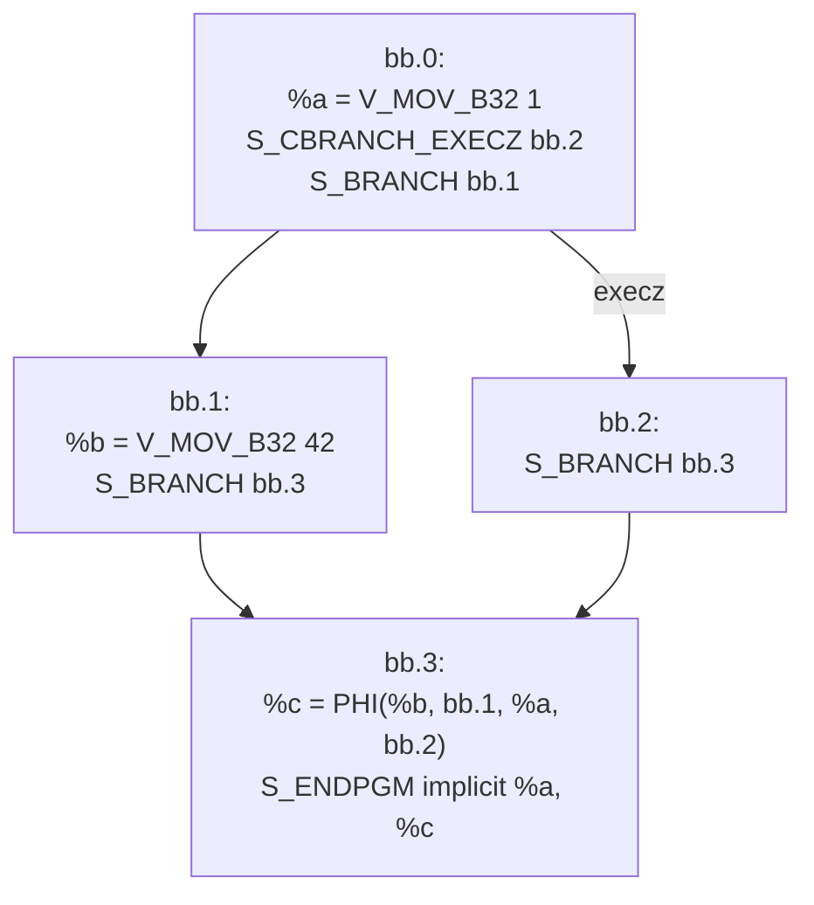
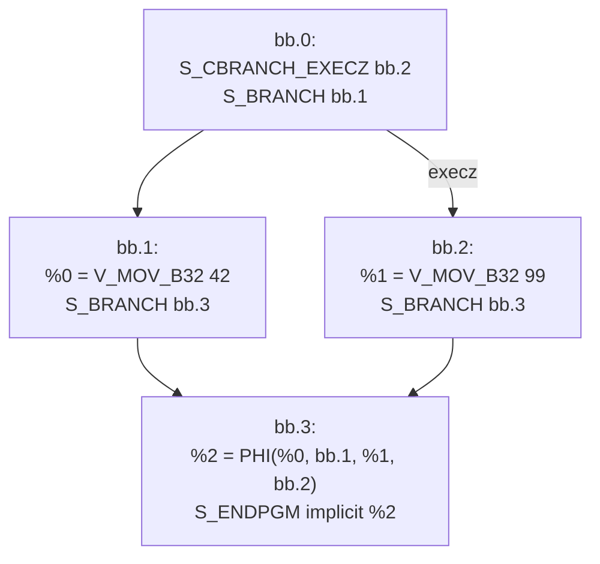
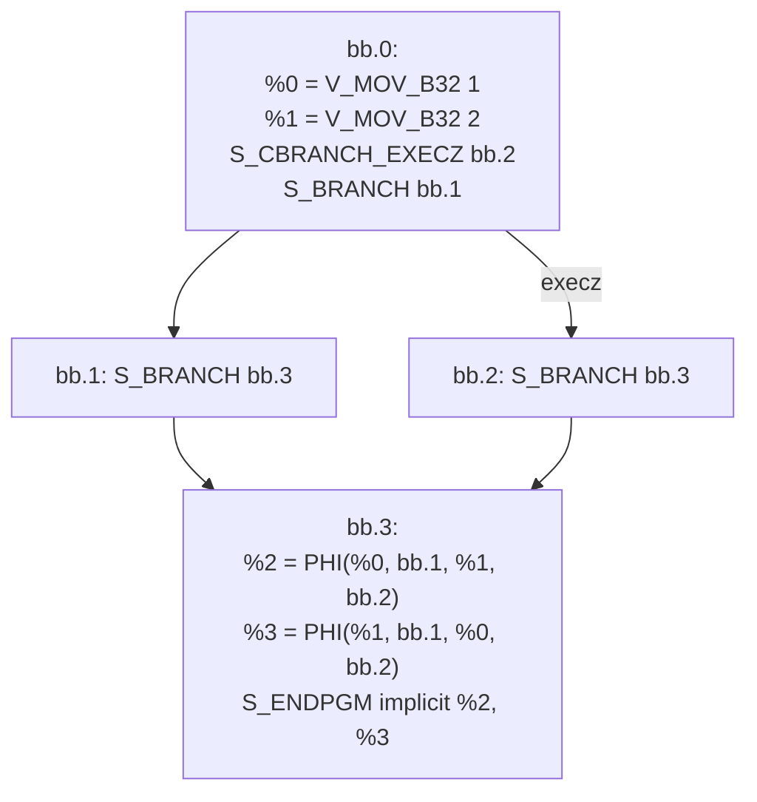
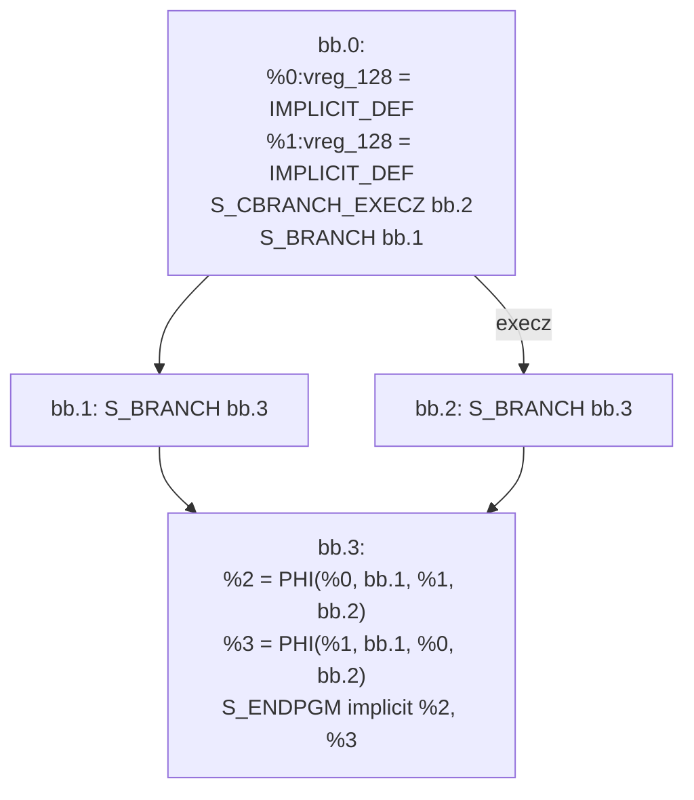

# SSA Register Allocator — Test Patterns

Tests live in `llvm/test/CodeGen/AMDGPU/SSARA/`.

The allocator runs as `-run-pass=amdgpu-ssa-register-allocator` (MIR tests);
end-to-end pipeline tests use the hidden `-amdgpu-ssa-regalloc` option (e.g.
`pipeline-*.ll`). The allocator entry point runs
`classifyVRegs` → `color` (width-descending PEO, MDT pre-order, phi-affinity
hints) → `destroySSAAndRewrite` (`lowerPHIs` → `rewriteOperands` →
`eliminateRegSequences` → `addPhysRegLiveIns` → `leaveSSA`).

Beyond the coloring and destruction tests below, the directory also holds
end-to-end `pipeline-*.ll` tests and `ra-*` / `rebuildssa-*` regression tests
(revert-proven crash/miscompile guards).

> **Note:** SSA destruction is **skipped** when a function still contains SI
> control-flow pseudos (`SI_IF`/`SI_ELSE`/`SI_IF_BREAK`/`SI_LOOP`/`SI_END_CF`),
> detected by `hasCFPseudos` — an open gap.

---

## Coloring Tests

12 tests covering width-descending PEO coloring: `color-*.mir` (5 tests) and
`split-*.mir` (7 tests, originally for the removed splitter, now verify coloring
behavior only).

---

## SSA Destruction Tests

### Test 1: `destruct-simple-copy.mir`

**Purpose**: Diamond CFG with a live-through value forcing a COPY on one PHI edge.
One edge is an identity (no copy needed), the other requires a COPY.



**Live ranges**:

```
         bb.0       bb.1       bb.2       bb.3
%a(32)  |————————————————————————————————————|
%b(32)              |————————————————————————|  (bb.1 path only)
%c(32)                                  |————|  (PHI result)
```

**Coloring**: %a→VGPR0, %b→VGPR1, %c→VGPR1

**SSA destruction**:

| Edge | Src | Dst | Action |
|------|-----|-----|--------|
| bb.1 → bb.3 | VGPR1 | VGPR1 | Identity |
| bb.2 → bb.3 | VGPR0 | VGPR1 | COPY |

**Exercises**: basic PHI lowering, identity suppression, COPY insertion, operand rewrite.

---

### Test 2: `destruct-identity.mir`

**Purpose**: Diamond CFG with no live-through value. All PHI sources and result
get the same physreg. No copies emitted.



**Coloring**: %0→VGPR0, %1→VGPR0, %2→VGPR0 (no interference, all identity)

**Exercises**: all-identity PHI lowering, PHI erasure without any copies.

---

### Test 3: `destruct-swap.mir`

**Purpose**: Two PHIs that cross-reference sources, producing a register swap
(cycle of length 2) on one edge.



**Coloring**: %0→VGPR0, %1→VGPR1, %2→VGPR0, %3→VGPR1

**SSA destruction**: from bb.2 — VGPR0↔VGPR1 swap via scratch register
(3 COPYs: save, chain, restore).

**Exercises**: cycle detection, scratch-based cycle breaking (Tier 1).

---

### Test 4: `destruct-rewrite.mir`

**Purpose**: Straight-line code with no PHIs. Tests operand rewrite only —
all virtual register operands replaced with physical registers.

**Coloring**: %0→VGPR0, %1→VGPR1, %2→VGPR0 (reuse after death)

**Exercises**: vreg→physreg operand replacement, no PHI lowering.

---

### Test 5: `destruct-wide-swap.mir`

**Purpose**: 128-bit PHI swap with `amdgpu-num-vgpr=8` to reject scratch tier.
Two RUN lines exercise both Tier 2 (V_SWAP_B32) and Tier 3 (XOR triplet).



**Coloring**: %0→VGPR0-3, %1→VGPR4-7, %2→VGPR0-3, %3→VGPR4-7

**SSA destruction** (from bb.2): VGPR0-3 ↔ VGPR4-7 swap, per-subreg:

| Subtarget | Method | Instructions |
|-----------|--------|-------------|
| gfx900 (GFX9+) | V_SWAP_B32 | 4 swaps (one per subreg pair) |
| fiji (GFX8) | XOR triplet | 12 V_XOR_B32_e64 (3 per subreg pair) |

**Exercises**: wide register cycle breaking, `getRegSplitParts` subreg decomposition,
V_SWAP_B32 (Tier 2) and XOR (Tier 3) paths, `amdgpu-num-vgpr` budget enforcement.
