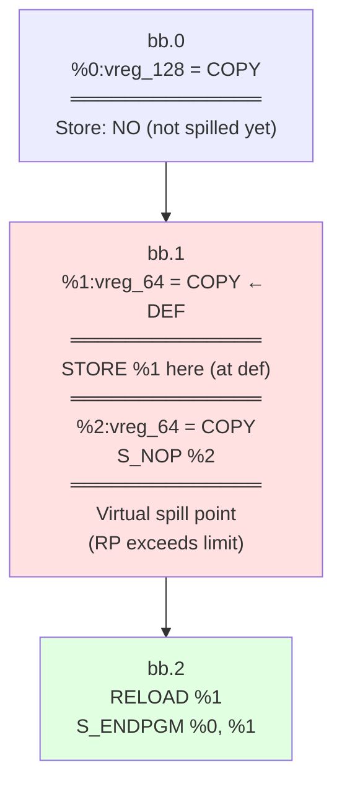
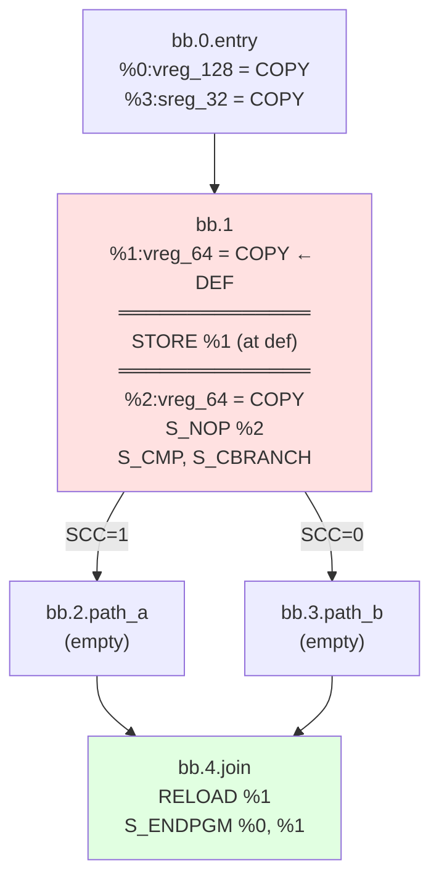
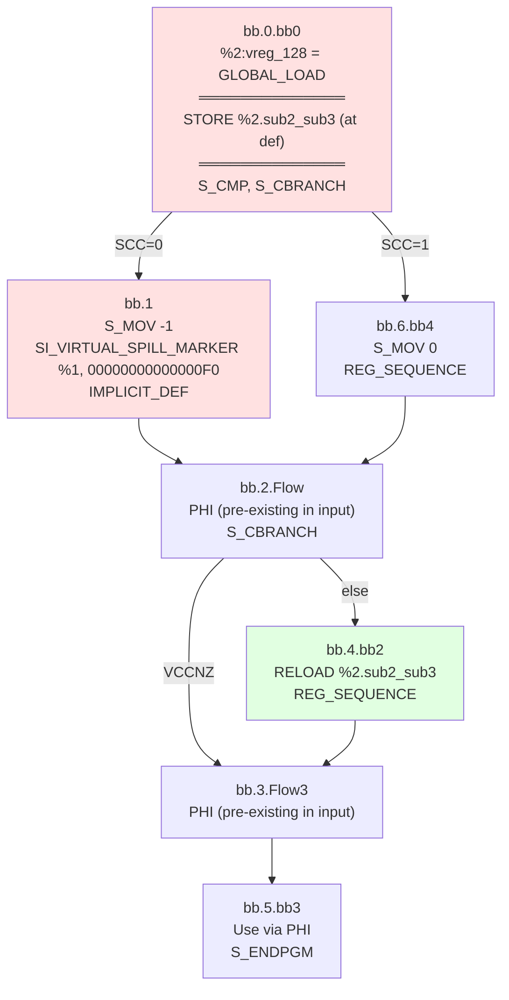
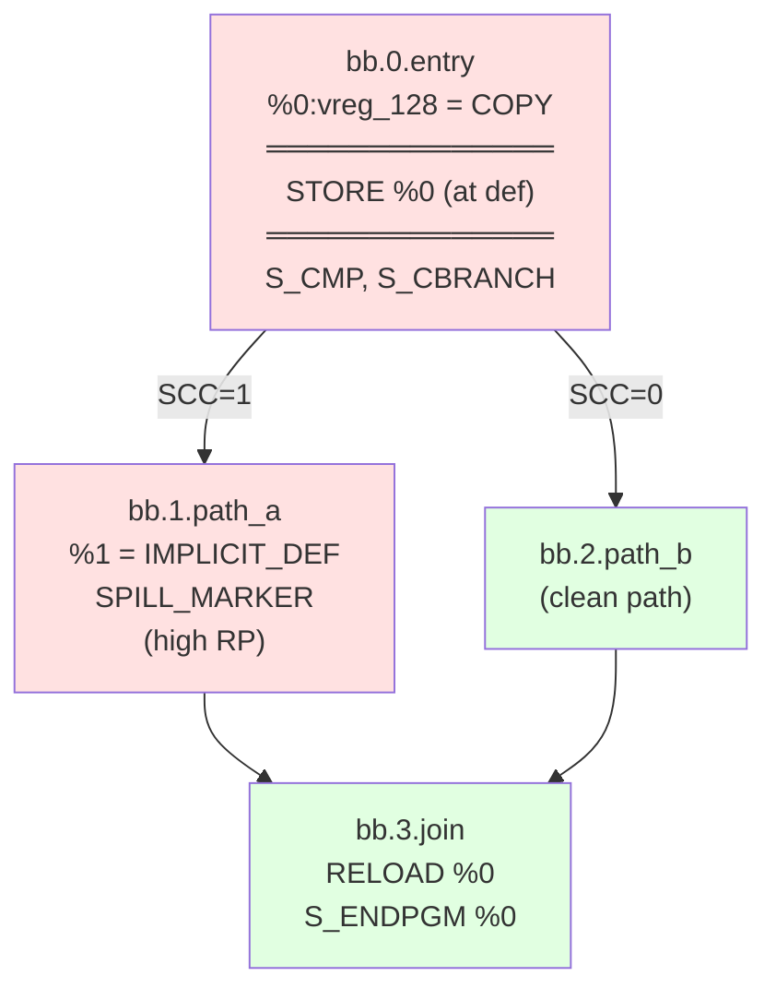
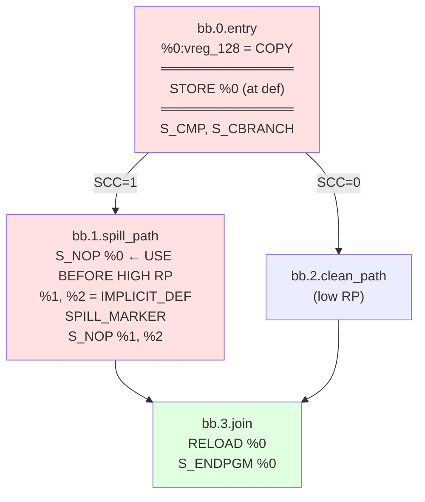
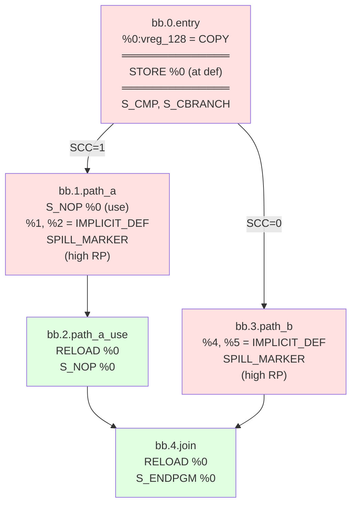
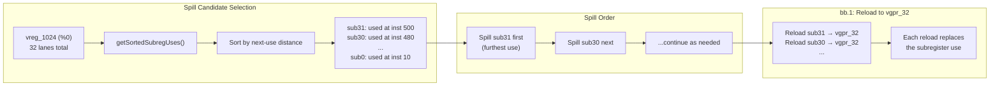
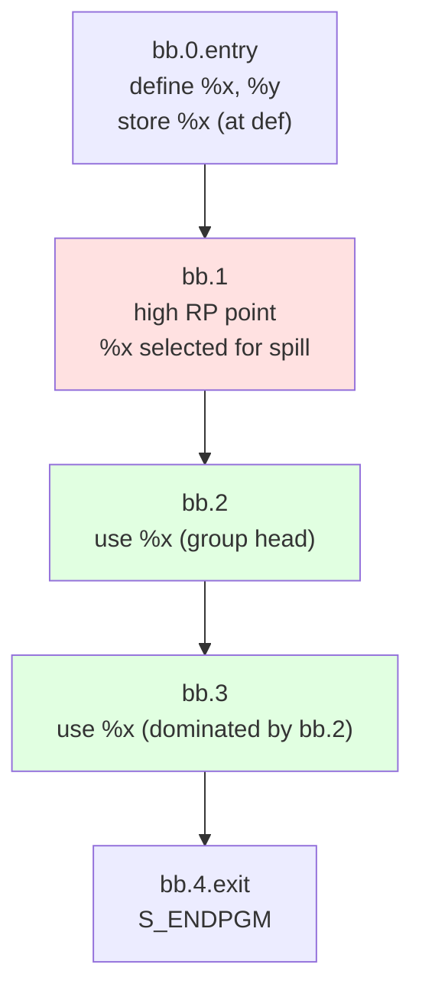
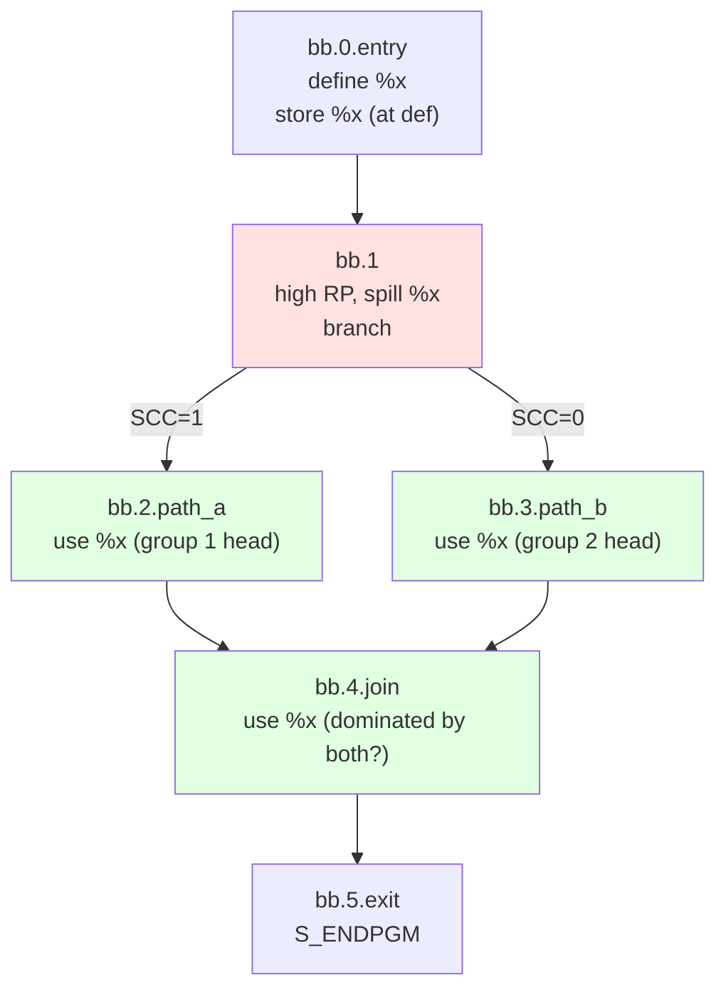

# SSA Spiller Test Documentation (New Design)

## Current Spiller Design (2025-11-19)

### Core Strategy: Store at Definition

**Key Innovation:** Store register immediately after its definition (when EXEC is full), NOT at the high-pressure point.

**Flow:**
```
1. spillAtDefinition(VMP)         → Store right after def (EXEC full)
2. Compute KillIdx                → Virtual spill point (where RP drops)
3. emitReloadsAndRepairSSA()      → Place reloads, repair SSA
4. shrinkToUses()                 → Trim LiveInterval after all repairs
```

Source: [`spillAtDefinition`](https://github.com/alex-t/llvm-project/blob/45385c6f5f008cde206d5828a00a17d6bb7f7783/llvm/lib/Target/AMDGPU/AMDGPUSSARegisterSpiller.cpp#L966-L1047), [`emitReloadsAndRepairSSA`](https://github.com/alex-t/llvm-project/blob/45385c6f5f008cde206d5828a00a17d6bb7f7783/llvm/lib/Target/AMDGPU/AMDGPUSSARegisterSpiller.cpp#L744-L960)

### Virtual Spill Marker Pseudo-Instruction

**Compiler Option:** `--amdgpu-ssa-spill-markers=1`

**Instruction:** [`SI_VIRTUAL_SPILL_MARKER`](https://github.com/alex-t/llvm-project/blob/45385c6f5f008cde206d5828a00a17d6bb7f7783/llvm/lib/Target/AMDGPU/SIInstructions.td) `%<vreg>, <lane_mask>`

**Purpose:** A test-only pseudo-instruction that marks the **virtual spill point** - the location where register pressure is relieved (register logically becomes dead). This may differ from the **physical store location** ([store-at-definition](../../04-Design/Decisions.md#store-at-definition)).

**Arguments:**
- `%<vreg>`: Virtual register being spilled (e.g., `%0`, `%1`)
- `<lane_mask>`: Lane mask in 16-digit hex format (e.g., `00000000000000FF` = all lanes of vreg_64, `00000000000000F0` = sub2_sub3)

**Omission Rule:** The marker is **omitted** when the virtual spill point immediately follows the physical store of the same [VMP](https://github.com/alex-t/llvm-project/blob/45385c6f5f008cde206d5828a00a17d6bb7f7783/llvm/lib/Target/AMDGPU/VRegMaskPair.h) (i.e., store-at-definition and virtual spill point are at the same position).

Source: [`AMDGPUSSARegisterSpiller.cpp` L709-720](https://github.com/alex-t/llvm-project/blob/45385c6f5f008cde206d5828a00a17d6bb7f7783/llvm/lib/Target/AMDGPU/AMDGPUSSARegisterSpiller.cpp#L709-L720)

**Summary:**

| Test File | Marker Present | Reason |
|-----------|----------------|--------|
| `spill-linear-dominated.mir` | ✅ `SI_VIRTUAL_SPILL_MARKER` in bb.1 | IMPLICIT_DEF inputs; store in bb.0, spill point in bb.1 after first IMPLICIT_DEF (2026-06-11) |
| `spill-dominated-branches.mir` | ✅ `SI_VIRTUAL_SPILL_MARKER` in bb.1 | IMPLICIT_DEF inputs; store in bb.0, spill point between IMPLICIT_DEFs in bb.1 (2026-06-11) |
| `spill-vreg-subregister.mir` | ✅ `SI_VIRTUAL_SPILL_MARKER %1, 00000000000000F0` | Spill point in bb.1, store in bb.0 |
| `spill-multi-predecessor-join.mir` | ✅ `SI_VIRTUAL_SPILL_MARKER` at start of path_a | IMPLICIT_DEF inputs; store in bb.0.entry, marker before local IMPLICIT_DEF in path_a (2026-06-11) |
| `spill-use-before-spill.mir` | ✅ `SI_VIRTUAL_SPILL_MARKER %0, 00000000000000FF` | Spill point in bb.1, store in bb.0 |
| `spill-multi-path-independent.mir` | ✅ `SI_VIRTUAL_SPILL_MARKER %0, 00000000000000FF` | Spill points in bb.1/bb.3, store in bb.0 |

### Current Use Handling

| Use Type | Current Behavior |
|----------|-----------------|
| **Dominated** | Emit reload at [group head](../../04-Design/SSA_SPILLER_DESIGN.md#dominance-grouping-domgroup-class), rewrite uses |
| **Reachable** | Emit reload at use, [`MachineLaneSSAUpdater`](../../02-Components/MachineLaneSSAUpdater.md) inserts PHIs |

---

## Test Files Overview

| Test File | What It Tests |
|-----------|--------------|
| [`spill-linear-dominated.mir`](https://github.com/alex-t/llvm-project/blob/45385c6f5f008cde206d5828a00a17d6bb7f7783/llvm/test/CodeGen/AMDGPU/SSASpiller/spill-linear-dominated.mir) | Basic dominated use case |
| [`spill-dominated-branches.mir`](https://github.com/alex-t/llvm-project/blob/45385c6f5f008cde206d5828a00a17d6bb7f7783/llvm/test/CodeGen/AMDGPU/SSASpiller/spill-dominated-branches.mir) | Dominated use through diamond CFG |
| [`spill-vreg-subregister.mir`](https://github.com/alex-t/llvm-project/blob/45385c6f5f008cde206d5828a00a17d6bb7f7783/llvm/test/CodeGen/AMDGPU/SSASpiller/spill-vreg-subregister.mir) | Subregister spilling with value PHIs |
| [`spill-multi-predecessor-join.mir`](https://github.com/alex-t/llvm-project/blob/45385c6f5f008cde206d5828a00a17d6bb7f7783/llvm/test/CodeGen/AMDGPU/SSASpiller/spill-multi-predecessor-join.mir) | Reachable use at multi-pred join |
| [`spill-use-before-spill.mir`](https://github.com/alex-t/llvm-project/blob/45385c6f5f008cde206d5828a00a17d6bb7f7783/llvm/test/CodeGen/AMDGPU/SSASpiller/spill-use-before-spill.mir) | Use before high-RP (no hoist) |
| [`spill-multi-path-independent.mir`](https://github.com/alex-t/llvm-project/blob/45385c6f5f008cde206d5828a00a17d6bb7f7783/llvm/test/CodeGen/AMDGPU/SSASpiller/spill-multi-path-independent.mir) | Independent spills on multiple paths |
| [`spill-vreg-many-lanes.mir`](https://github.com/alex-t/llvm-project/blob/45385c6f5f008cde206d5828a00a17d6bb7f7783/llvm/test/CodeGen/AMDGPU/SSASpiller/spill-vreg-many-lanes.mir) | Large vreg_1024 stress test |
| [`spill-dom-groups-a.mir`](https://github.com/alex-t/llvm-project/blob/45385c6f5f008cde206d5828a00a17d6bb7f7783/llvm/test/CodeGen/AMDGPU/SSASpiller/spill-dom-groups-a.mir) | [Dominance grouping](../../04-Design/SSA_SPILLER_DESIGN.md#dominance-grouping-domgroup-class) - basic |
| [`spill-dom-groups-b.mir`](https://github.com/alex-t/llvm-project/blob/45385c6f5f008cde206d5828a00a17d6bb7f7783/llvm/test/CodeGen/AMDGPU/SSASpiller/spill-dom-groups-b.mir) | [Dominance grouping](../../04-Design/SSA_SPILLER_DESIGN.md#dominance-grouping-domgroup-class) - complex CFG |
---

## Test 1: spill-linear-dominated.mir

### Pattern: Dominated Use (Linear CFG)

### CFG Diagram



### Analysis

| Aspect | Value |
|--------|-------|
| **Spilled Register** | `%1:vreg_64` |
| **Store Location** | bb.1: Right after `%1 = COPY` (store-at-definition) |
| **Virtual Spill Point** | bb.1: Right after `%1 = COPY`, same as store (before `%2` def) |
| **Reload Location** | bb.2: Before use |
| **Use Type** | Dominated (spill dominates use) |
| **PHI Nodes** | None |
| **Spill Marker** | ✅ Present in bb.1 (IMPLICIT_DEF inputs; store in bb.0, spill point in bb.1) — updated 2026-06-11 |

### CHECK Expectations
```
bb.1:
  %1 = COPY $vgpr4_vgpr5
  SI_SPILL_V64_SAVE %1, %stack.0  ← Store at definition
  %2 = COPY ...
  S_NOP %2

bb.2:
  SI_SPILL_V64_RESTORE %stack.0  ← Reload before use
  S_ENDPGM %0, %1
```

---

## Test 2: spill-dominated-branches.mir

### Pattern: Dominated Use (Diamond CFG)

### CFG Diagram



### Analysis

| Aspect | Value |
|--------|-------|
| **Spilled Register** | `%1:vreg_64` |
| **Store Location** | bb.1: Right after `%1 = COPY` |
| **Virtual Spill Point** | bb.1: Right after `%1 = COPY`, same as store (before `%2` def) |
| **Reload Location** | bb.4.join: Before use |
| **Use Type** | Dominated (bb.1 dominates bb.4 through both paths) |
| **PHI Nodes** | None (single value on all paths) |
| **Spill Marker** | ✅ Present in bb.1 (IMPLICIT_DEF inputs; store in bb.0, spill point between IMPLICIT_DEFs in bb.1) — updated 2026-06-11 |

---

## Test 3: spill-vreg-subregister.mir

### Pattern: Subregister Spilling (Complex Pre-existing CFG)

### CFG Diagram



### Analysis

| Aspect | Value |
|--------|-------|
| **Spilled Register** | `%2.sub2_sub3:vreg_64` (subregister of vreg_128) |
| **Store Location** | bb.0: Right after `GLOBAL_LOAD` (store-at-definition) |
| **Virtual Spill Point** | bb.1: `SI_VIRTUAL_SPILL_MARKER %1, 00000000000000F0` |
| **Reload Location** | bb.4.bb2: `SI_SPILL_V64_RESTORE` before REG_SEQUENCE |
| **Use Type** | Dominated by bb.4 |
| **PHI Nodes** | Pre-existing in INPUT MIR |
| **Subregister** | Only `sub2_sub3` lanes (mask 0xF0) spilled/reloaded |
| **Spill Marker** | `SI_VIRTUAL_SPILL_MARKER %1, 00000000000000F0` |

### Key Points
- **Subregister precision**: Only `sub2_sub3` (2 lanes of 4) are spilled
- **Store at definition**: `SI_SPILL_V64_SAVE` right after `GLOBAL_LOAD` in bb.0
- **Simple reload**: `SI_SPILL_V64_RESTORE` in bb.4
- **Pre-existing PHIs**: The PHIs in the output are from the INPUT MIR

---

## Test 4: spill-multi-predecessor-join.mir

### Pattern: Reachable Use at Multi-Predecessor Join

### CFG Diagram



### Analysis

| Aspect | Value |
|--------|-------|
| **Spilled Register** | `%0:vreg_128` |
| **Store Location** | bb.0: Right after `COPY` (store-at-definition) |
| **Virtual Spill Point** | bb.1: After `%1` def (path_a only) |
| **Reload Location** | bb.3.join: Before use |
| **Use Type** | Reachable (path_b is clean) |
| **PHI Nodes** | None |
| **Spill Marker** | `SI_VIRTUAL_SPILL_MARKER %0, 00000000000000FF` |

---

## Test 5: spill-use-before-spill.mir

### Pattern: Use Before High-RP (Cannot Hoist to NCD)

### CFG Diagram



### Analysis

| Aspect | Value |
|--------|-------|
| **Key Feature** | Early use of `%0` in bb.1 BEFORE high RP |
| **Store Location** | bb.0: At definition (before branch) |
| **Virtual Spill Point** | bb.1: After `%1`, `%2` defs |
| **Reload Location** | bb.3.join |
| **Spill Marker** | `SI_VIRTUAL_SPILL_MARKER %0, 00000000000000FF` |

---

## Test 6: spill-multi-path-independent.mir

### Pattern: Independent Spills on Multiple Paths

### CFG Diagram



### Analysis

| Aspect | Value |
|--------|-------|
| **Spilled Register** | `%0:vreg_128` |
| **Store Location** | bb.0: At definition |
| **Path A Spill Point** | bb.1: After `%1`, `%2` defs |
| **Path B Spill Point** | bb.3: After `%4`, `%5` defs |
| **Reloads** | bb.2 (path_a_use) and bb.4 (join) |
| **Spill Markers** | `SI_VIRTUAL_SPILL_MARKER %0, 00000000000000FF` in bb.1 and bb.3 |

### Note
Both paths independently exceed RP limit.

---

## Test 7: spill-vreg-many-lanes.mir

### Pattern: Subregister Selection by Use Distance (vreg_1024)

### Concept Diagram

Uses [`getSortedSubregUses()`](https://github.com/alex-t/llvm-project/blob/45385c6f5f008cde206d5828a00a17d6bb7f7783/llvm/lib/Target/AMDGPU/AMDGPUNextUseAnalysis.cpp#L253-L303) for lane ordering by [next-use distance](../../03-Concepts/MIN_Algorithm.md):



### Analysis

| Aspect | Value |
|--------|-------|
| **Register Class** | `vreg_1024` (32 VGPRs, 32 lanes) |
| **Selection Strategy** | [`getSortedSubregUses()`](https://github.com/alex-t/llvm-project/blob/45385c6f5f008cde206d5828a00a17d6bb7f7783/llvm/lib/Target/AMDGPU/AMDGPUNextUseAnalysis.cpp#L253-L303) - sort lanes by next-use distance |
| **Spill Order** | Furthest-used subregister first ([Belady's algorithm](../../03-Concepts/MIN_Algorithm.md) per-lane) |
| **Reload Target** | `vgpr_32` - each lane reloaded independently |
| **Purpose** | Stress test for lane-aware spilling with large registers |

---

## Test 8: spill-dom-groups-a.mir

### Pattern: Dominance Grouping (Basic)

Tests the [`DomGroup`](https://github.com/alex-t/llvm-project/blob/45385c6f5f008cde206d5828a00a17d6bb7f7783/llvm/lib/Target/AMDGPU/AMDGPUSSARegisterSpiller.h#L44-L59) mechanism that minimizes reload count by grouping dominated uses.

### CFG Diagram



### Analysis

| Aspect | Value |
|--------|-------|
| **Pattern** | Multiple dominated uses of same register in linear chain |
| **Key Feature** | Uses grouped by dominance → single reload at group head |
| **DomGroup Behavior** | bb.2 use dominates bb.3 use → merged into one group |
| **Reload Count** | 1 (not 2) |
| **SSA Repair** | Minimal - single reload rewrites both uses |

### Key Points
- Validates [`DomGroup::merge()`](https://github.com/alex-t/llvm-project/blob/45385c6f5f008cde206d5828a00a17d6bb7f7783/llvm/lib/Target/AMDGPU/AMDGPUSSARegisterSpiller.h#L52) correctly identifies dominated uses
- Demonstrates reload minimization in [`emitReloadsAndRepairSSA()`](https://github.com/alex-t/llvm-project/blob/45385c6f5f008cde206d5828a00a17d6bb7f7783/llvm/lib/Target/AMDGPU/AMDGPUSSARegisterSpiller.cpp#L744-L960)
- No PHIs needed (all uses dominated by single reload)

---

## Test 10: spill-dom-groups-b.mir

### Pattern: Dominance Grouping (Complex CFG with Diamond)

Tests dominance grouping with diamond CFG where multiple uses exist across different branches.

### CFG Diagram



### Analysis

| Aspect | Value |
|--------|-------|
| **Pattern** | Diamond CFG with uses on both branches and at join |
| **Key Feature** | Multiple dominance groups possible |
| **Group Detection** | Uses in bb.2 and bb.3 are NOT in same group (neither dominates other) |
| **Reload Count** | 2 (one per branch) |
| **SSA Repair** | PHI at join merges reloaded values |

### Key Points
- Validates correct group separation when uses don't dominate each other
- Tests PHI insertion at join block
- More complex than basic dom-groups-a test

---

## Pattern Classification (New Design)

### Case 1: Dominated Uses

**Definition:** Spill point dominates use point. See [Dominated linear case](../../04-Design/SSA_SPILLER_DESIGN.md#dominated-linear-case-single-path).

**Handling:**
1. [Store at definition](../../04-Design/Decisions.md#store-at-definition)
2. Virtual spill point at high-RP location
3. Reload at [dominated group head](../../04-Design/SSA_SPILLER_DESIGN.md#dominance-grouping-domgroup-class)
4. Rewrite all uses in group

**Tests:** [`spill-linear-dominated.mir`](https://github.com/alex-t/llvm-project/blob/45385c6f5f008cde206d5828a00a17d6bb7f7783/llvm/test/CodeGen/AMDGPU/SSASpiller/spill-linear-dominated.mir), [`spill-dominated-branches.mir`](https://github.com/alex-t/llvm-project/blob/45385c6f5f008cde206d5828a00a17d6bb7f7783/llvm/test/CodeGen/AMDGPU/SSASpiller/spill-dominated-branches.mir)

### Case 2: Reachable Uses

**Definition:** Use reachable from spill point but not dominated. See [Reachable case](../../04-Design/SSA_SPILLER_DESIGN.md#reachable-non-dominated-case-join).

**Handling:**
1. [Store at definition](../../04-Design/Decisions.md#store-at-definition)
2. Virtual spill point on one path
3. Reload at use (all paths currently)
4. [`MachineLaneSSAUpdater`](../../02-Components/MachineLaneSSAUpdater.md) inserts value PHIs

**Tests:** [`spill-multi-predecessor-join.mir`](https://github.com/alex-t/llvm-project/blob/45385c6f5f008cde206d5828a00a17d6bb7f7783/llvm/test/CodeGen/AMDGPU/SSASpiller/spill-multi-predecessor-join.mir), [`spill-use-before-spill.mir`](https://github.com/alex-t/llvm-project/blob/45385c6f5f008cde206d5828a00a17d6bb7f7783/llvm/test/CodeGen/AMDGPU/SSASpiller/spill-use-before-spill.mir), [`spill-vreg-subregister.mir`](https://github.com/alex-t/llvm-project/blob/45385c6f5f008cde206d5828a00a17d6bb7f7783/llvm/test/CodeGen/AMDGPU/SSASpiller/spill-vreg-subregister.mir)

### Case 3: Subregister Spilling

**Handling:**
1. [`VRegMaskPair`](https://github.com/alex-t/llvm-project/blob/45385c6f5f008cde206d5828a00a17d6bb7f7783/llvm/lib/Target/AMDGPU/VRegMaskPair.h) tracks lane mask
2. Only spill/reload affected lanes
3. [`MachineLaneSSAUpdater`](../../02-Components/MachineLaneSSAUpdater.md) handles lane merging
4. `REG_SEQUENCE` reconstructs full register

**Tests:** [`spill-vreg-subregister.mir`](https://github.com/alex-t/llvm-project/blob/45385c6f5f008cde206d5828a00a17d6bb7f7783/llvm/test/CodeGen/AMDGPU/SSASpiller/spill-vreg-subregister.mir), [`spill-vreg-many-lanes.mir`](https://github.com/alex-t/llvm-project/blob/45385c6f5f008cde206d5828a00a17d6bb7f7783/llvm/test/CodeGen/AMDGPU/SSASpiller/spill-vreg-many-lanes.mir)

---

## Future Work

| Feature | Description |
|---------|-------------|
| **Loop-aware spilling** | Optimize spill/reload placement around loops |

---

**Last Updated:** 2026-06-11
**Design Version:** [Store-at-Definition](../../04-Design/Decisions.md#store-at-definition); SGPR accounting split from materialization (2026-06-11)
**Test Count:** SGPR lowering + budget tests passing; 2 XFAIL (loop-filter fallback). Balanced-spill test removed (obsolete — superseded by store-at-definition).
**Source:**  ( branch)

---

## SGPR Spill / Lowering Tests (Planned, 2026-06-11)

Verified via `-run-pass=amdgpu-ssa-register-spiller,amdgpu-ssa-register-allocator,si-lower-sgpr-spills`.

The spiller leaves SGPR spill pseudos in place; `SILowerSGPRSpills` materializes them after coloring.  
Tests use `IMPLICIT_DEF + COPY` for all incoming values — no physreg live-ins.

| # | Test (planned filename) | What it tests |
|---|-------------------------|---------------|
| 1 | `spill-sgpr-linear-basic.mir` | ✅ Done. Single 32-bit SGPR, linear CFG. Three-stage pipeline checks pass. |
| 2 | `spill-sgpr-wide.mir` | ✅ Done. 64-bit SGPR, partial subreg fix: only sub0 spilled, one writelane, REG_SEQUENCE on restore. Also fixed `storeRegToStackSlot` SubRegIdx + `getVMPsToSpill` partial decomposition. |
| 3 | `spill-sgpr-lane-packing.mir` | ✅ Done. Multiple distinct SGPR spills packed into successive lanes of one lane VGPR |
| 4 | `spill-sgpr-budget-reduction.mir` | ✅ Done. `countSGPRSpillVGPRs()` reduces VGPR budget; one VGPR spill appears in Pass 2 only because of the reduced budget |
| 5 | `spill-sgpr-implicit-def-linear.mir` | ✅ Done. `IMPLICIT_DEF` for lane VGPR precedes first writelane in single-block function |
| 6 | `spill-sgpr-implicit-def-ncd.mir` | ✅ Done. Two spill sites in sibling diamond branches packed into one lane VGPR; `IMPLICIT_DEF` placed at NCD (bb.0) via `updateLaneVGPRDomInstr` |
| 7 | `spill-sgpr-implicit-def-loop.mir` | ✅ Done. Spill inside loop: `IMPLICIT_DEF` hoisted to preheader |

**Status: 7/7 complete.** All SGPR spill/reload lowering tests pass.

**Design rule**: design one at a time — show CFG + liveness sketch → get `APPROVED:` → create file → run.

