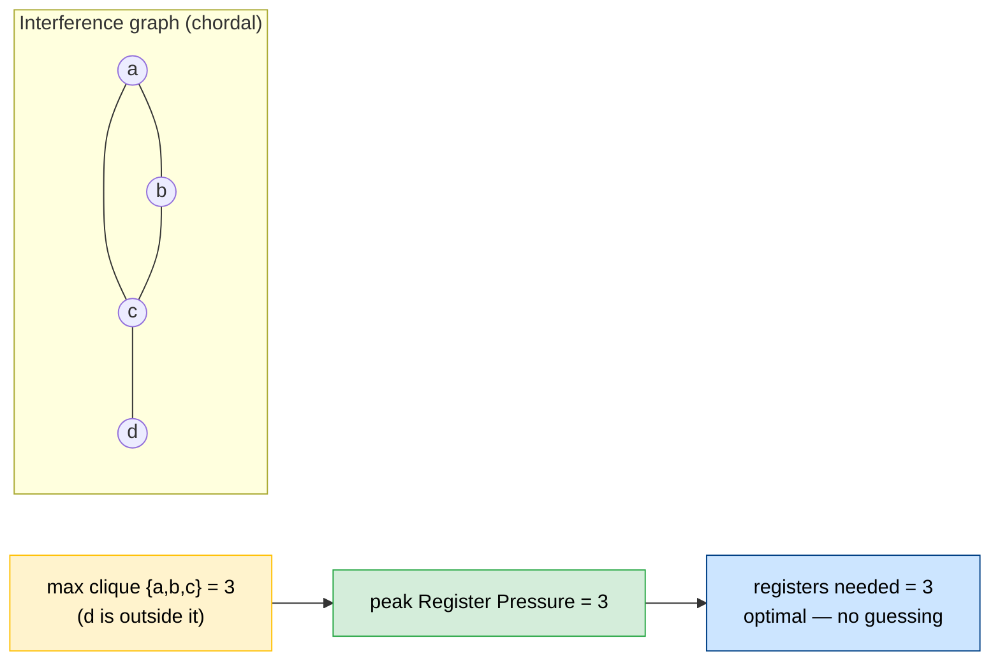
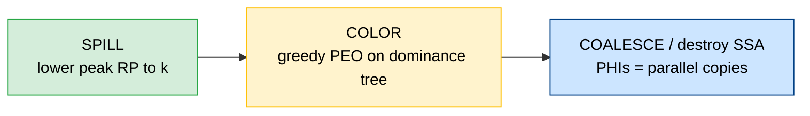
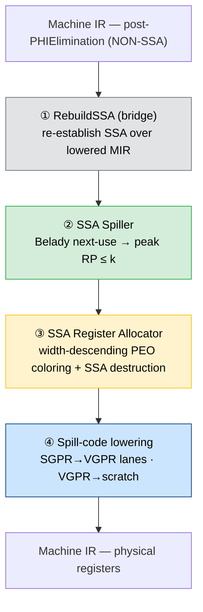
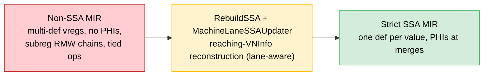
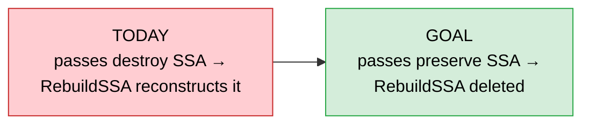

<script src="https://cdn.jsdelivr.net/npm/mermaid@10/dist/mermaid.min.js"></script>
<script>
  // Marp renders ```mermaid fences as <code class="language-mermaid">. Convert
  // each to an inline SVG at load time.
  window.addEventListener('load', async () => {
    mermaid.initialize({ startOnLoad: false, theme: 'default' });
    const blocks = document.querySelectorAll('code.language-mermaid');
    for (let i = 0; i < blocks.length; i++) {
      const code = blocks[i];
      const src = code.textContent;
      const host = code.closest('pre') || code;
      try {
        const { svg } = await mermaid.render('mmd' + i, src);
        const wrap = document.createElement('div');
        wrap.className = 'mermaid-output';
        wrap.style.textAlign = 'center';
        wrap.innerHTML = svg;
        // Mermaid stamps an inline max-width on the <svg> that caps it small, and
        // its own <style> fixes the width. Strip both and size the element
        // directly so the diagram fills the slide but never overflows its box.
        const g = wrap.querySelector('svg');
        if (g) {
          // Aspect ratio from the viewBox decides whether width or height binds:
          // wide (LR) diagrams fill the width; tall (TD) diagrams cap the height
          // so they never spill into the footer.
          const vb = (g.getAttribute('viewBox') || '').split(/\s+/).map(Number);
          const ratio = (vb.length === 4 && vb[3]) ? vb[2] / vb[3] : 3;
          g.removeAttribute('width');
          g.removeAttribute('height');
          g.style.maxWidth = 'none';
          if (ratio >= 1.6) {          // wide: bind to slide width
            g.style.width = '100%';
            g.style.height = 'auto';
          } else {                     // tall: bind to height budget
            g.style.height = '58vh';
            g.style.width = 'auto';
          }
        }
        host.replaceWith(wrap);
      } catch (e) { /* leave the code block as-is on error */ }
    }
  });
</script>

<!-- _class: lead -->

# Register Allocation on SSA for AMDGPU

### An optimal, decoupled allocator built on Hack's thesis

Kick-off overview — July 2026

<!--
Notes: Welcome. This is a kick-off for our new SSA-based register allocator for
AMDGPU. Big picture: register allocation is usually treated as hard and iterative
— we're building one that's optimal and single-pass by exploiting SSA. I'll cover
the theory, our four-pass stack, the one fragile dependency, and where the team
comes in.
-->


---

## The idea in one line

> Classic graph-coloring RA (Chaitin/Briggs) treats coloring as **NP-hard** and
> *iterates* build → color → spill → rebuild.

**On SSA form the problem becomes easy and separable:**

- the interference graph is **chordal** → optimal coloring in polynomial time,
- **spilling, coloring, coalescing decouple** into a single pass — no iteration,
- register demand is known up front: it is just the **max register pressure**.

Foundation: **Hack, Grund & Goos, *Register Allocation for Programs in SSA-Form***
(CC'06) and Sebastian Hack's PhD thesis (2007).

<!--
Notes: The one thing to remember. Classic Chaitin/Briggs coloring is NP-hard, so it
guesses, spills, and retries in a loop. On SSA the graph is chordal, so coloring is
polynomial and optimal; spill/color/coalesce stop fighting each other and separate
into one pass; and we know the exact register demand up front — it's just peak
pressure. Everything today follows from these three facts.
-->


---

## Hack's theorem

> **Theorem (Hack, Grund & Goos, CC'06).**
> The interference graph of a program in **strict SSA form** is **chordal**.
> Every chordal graph has a **perfect elimination order (PEO)**, and greedy
> coloring along a PEO uses the minimum number of colors
> ( = chromatic number = **clique number** ).

Two consequences we exploit directly:

- **χ(G) = ω(G)** — colors needed = size of the largest clique.
- For SSA, a PEO is *free*: it is a walk of the **dominance tree** (no MCS/LexBFS).

*Why chordal?* In strict SSA every value has **one definition**, so its live range
is a **connected subtree** of the dominance tree — and intersection graphs of
subtrees of a tree are chordal (a theorem, not a heuristic).

<!--
Notes: This is the theorem the whole project rests on. Chordal graphs have a perfect
elimination order, and greedy coloring along it uses the minimum number of colors.
Two payoffs: colors needed equals the largest clique (χ = ω), and for SSA the
elimination order is free — just walk the dominance tree, no expensive MCS/LexBFS.
The intuition for "why chordal": one def per value ⇒ live range is a subtree ⇒
subtree intersection graphs are provably chordal.
-->


---

## Illustration — live ranges on SSA

Straight-line SSA; single def ⇒ each value's live range is **one interval**
(def → last use). Two values **interfere** iff their intervals overlap.

```
 line  program       a  b  c  d     live set
  1    a = def       █  ·  ·  ·     {a}
  2    b = def       █  █  ·  ·     {a,b}
  3    c = def       █  █  █  ·     {a,b,c}   ← peak, RP = 3
  4    .. = f(a)     █  █  █  ·     {a,b,c}   (a dies)
  5    .. = f(b)     ·  █  █  ·     {b,c}     (b dies)
  6    d = def       ·  ·  █  █     {c,d}
  7    .. = f(c)     ·  ·  █  █     {c,d}     (c dies)
  8    .. = f(d)     ·  ·  ·  █     {d}       (d dies)
```

Overlaps ⇒ edges **a–b, a–c, b–c, c–d**. At the busiest point (lines 3–4) three
values are simultaneously live.

<!--
Notes: A concrete picture of the abstract claim. Single def means each value is one
interval from def to last use. Two values interfere exactly when their intervals
overlap. Walk the live-set column: peak is lines 3–4 with {a,b,c} — three values at
once. That "3" is the number to carry to the next slide.
-->


---

## RP = max clique  (demand known before we color)

The three values live at the peak form a **clique**; `d` overlaps only `c`.



- **RP at a point** = values live there = clique size; **peak RP** = max clique.
- Peak RP = the colors greedy-PEO needs, so we **spill first** to bring peak RP to
  the hardware limit *k* — then coloring is **guaranteed** to succeed with *k*.

<!--
Notes: Same example as a graph. {a,b,c} form a clique (max clique = 3); d hangs off
c and isn't part of it. So peak pressure = 3 = registers needed, known before we
color — no guessing. The key inversion vs classic RA: because peak RP tells us the
exact demand, we spill FIRST to get peak down to k hardware registers, and then
coloring is guaranteed to succeed. Spilling drives coloring, not the other way round.
-->


---

## What this buys us: a decoupled, single-pass allocator

Classic allocators couple coloring and spilling and iterate. On SSA the three
tasks separate cleanly and run **once**:



- **Spill** = a program transformation (Belady next-use), not a graph repair.
- **Color** = one dominance-tree walk; provably optimal, never fails after spill.
- **Coalesce / SSA-destruction** = PHIs are register permutations (swaps/moves).

No build–color–spill–rebuild loop.

<!--
Notes: The architecture in three boxes, run once. Spill is a program transformation
using Belady's next-use heuristic (evict what's used farthest in the future), not
graph surgery. Color is a single dominance-tree walk that can't fail once pressure
is at k. Coalesce/SSA-destruction handles PHIs as parallel copies — swaps and moves.
Contrast with classic: no build–color–spill–rebuild loop at all. That's the win.
-->


---

## Our RA stack — four passes behind `-amdgpu-ssa-regalloc`



- SSA is preserved throughout; the spiller repairs SSA **inline** after reloads.
- Lane-aware everywhere — values tracked as `(VReg, LaneBitmask)` for subregisters.

<!--
Notes: Our actual implementation, four passes behind the -amdgpu-ssa-regalloc flag.
(1) RebuildSSA re-establishes SSA over already-lowered MIR — that's the bridge, more
on it shortly. (2) Spiller: Belady, gets peak RP to k. (3) Register allocator: the
PEO coloring plus SSA destruction. (4) Spill-code lowering: SGPR→VGPR lanes, VGPR→
scratch. Two things carry through all of it: SSA stays intact end to end, and
everything is lane-aware — values are (VReg, LaneBitmask) so subregisters work.
-->


---

## The critical dependency: SSA in, SSA out

The theory needs **strict SSA input** — but LLVM's pre-RA pipeline
(`PHIElimination`, `TwoAddress`, coalescing) has already **destroyed** SSA before
we run. Today a temporary bridge, **RebuildSSA**, reconstructs it:



- **Why it's hard on AMDGPU:** wide tuples, subregister/lane liveness, early-clobber
  two-address ops (WMMA), oversized register classes with undef padding lanes.
- Reconstructing SSA from lowered MIR is **fragile and expensive** — a scaffold,
  not the destination. Which is exactly where the team comes in ↓

<!--
Notes: The catch. The theory needs strict SSA input, but LLVM's pre-RA pipeline —
PHIElimination, TwoAddress, coalescing — has already destroyed SSA before we run.
So today we bolt on RebuildSSA to reconstruct it. On AMDGPU that's genuinely hard:
wide register tuples, subregister/lane liveness, early-clobber two-address ops like
WMMA, oversized classes with undef padding lanes. It works, but it's fragile and
expensive — scaffolding, not the destination. That sets up the team's mission.
-->


---

## The team's mission — make SSA the native form

**Goal:** teach the pre-RA machine passes to **preserve SSA** instead of destroying
it — so the bridge disappears and SSA is the pipeline's native form end to end.



**Why it matters:** the optimal-coloring guarantee *assumes* strict SSA input.
Preserving it upstream removes a fragile reconstruction step, cuts compile time,
and is the key to the hardest AMDGPU cases (subreg/lane liveness, WMMA, wide tuples).

**Who does what:** allocator / spiller / coloring core — Alex · the shared
lane-aware SSA-repair engine (`MachineLaneSSAUpdater`) is common ground · **the
pre-RA pass → SSA-preserving conversion is the team's charter.**

<!--
Notes: The ask for the room. Instead of reconstructing SSA after the fact, teach the
pre-RA passes to preserve it — then RebuildSSA gets deleted and SSA is the native
form end to end. Why it's worth it: the optimality guarantee assumes strict SSA
input, so preserving it removes the fragile step, cuts compile time, and unlocks the
hardest AMDGPU cases. Division of labor: I own allocator/spiller/coloring core, the
lane-aware SSA-repair engine is shared, and making the pre-RA passes SSA-preserving
is the team's charter — the main thing I want people to leave thinking about.
-->


---

## Status & what's next

**Working today** — full pipeline wired behind `-amdgpu-ssa-regalloc`, run
end-to-end across the **3060-test** AMDGPU LIT corpus.

| Area | State |
|------|-------|
| Pipeline (RebuildSSA → Spiller → RA → lowering) | ✅ live, corpus-tested |
| Chordal PEO coloring, SSA destruction | ✅ implemented |
| Lane-aware SSA reconstruction (WMMA, padding, tied) | ✅ hardened this cycle |
| Corpus crashes | **103 / 3060** (from ~850) |

**Next:**

- **PHI coalescer** (paper §4.3) — the durable fix for cross-call physreg pressure.
- **Per-class / fragmentation-aware spilling** + feasibility gate.
- Reconcile spiller vs RA register-budget accounting.

<!--
Notes: Where we stand. Full pipeline is live behind the flag and runs end to end on
the whole 3060-test AMDGPU LIT corpus — not a toy. Coloring and SSA destruction are
in; lane-aware reconstruction got hardened this cycle. Headline number: crashes down
to 103 from ~850, so trajectory is good. Next up: the real PHI coalescer from paper
§4.3 (durable fix for cross-call pressure), smarter per-class/fragmentation-aware
spilling, and reconciling budget accounting between spiller and RA. Corpus is our
real gate, not local lit.
-->


---

<!-- _class: lead -->

# Questions?

### SSARA — optimal SSA-based register allocation for AMDGPU

Design docs: `SSARA/04-Design/` · Foundation: Hack, Grund & Goos (CC'06) + Hack PhD (2007)

<!--
Notes: Thanks — happy to take questions. Likely ones: How is this different from
greedy RA today? (optimal coloring, no iteration, once SSA holds). What's the
compile-time story? (deleting RebuildSSA is a big part of it). Why AMDGPU first?
(lane/subreg complexity is where SSA pays off most). Point people at the design docs
in 04-Design and the Hack paper for depth.
-->

