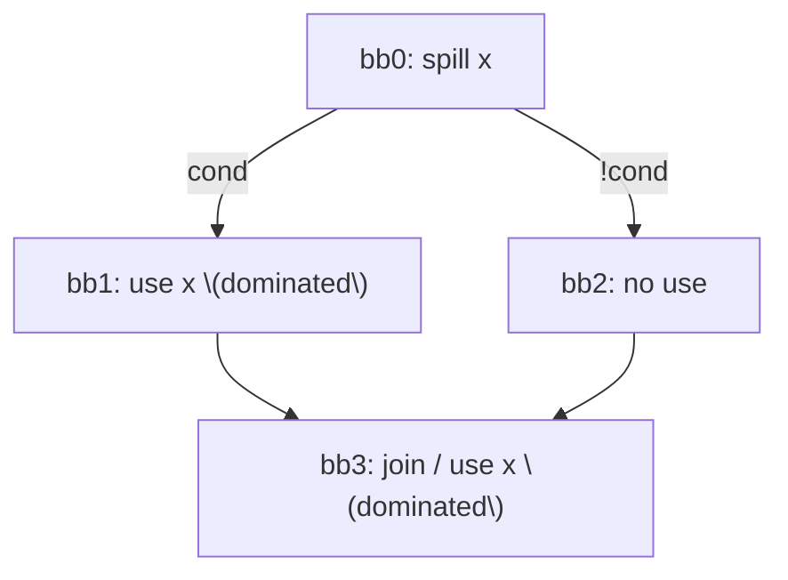
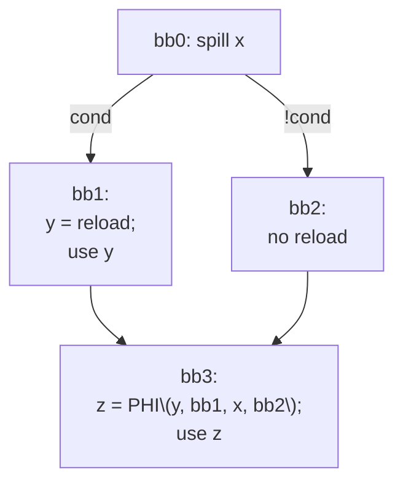
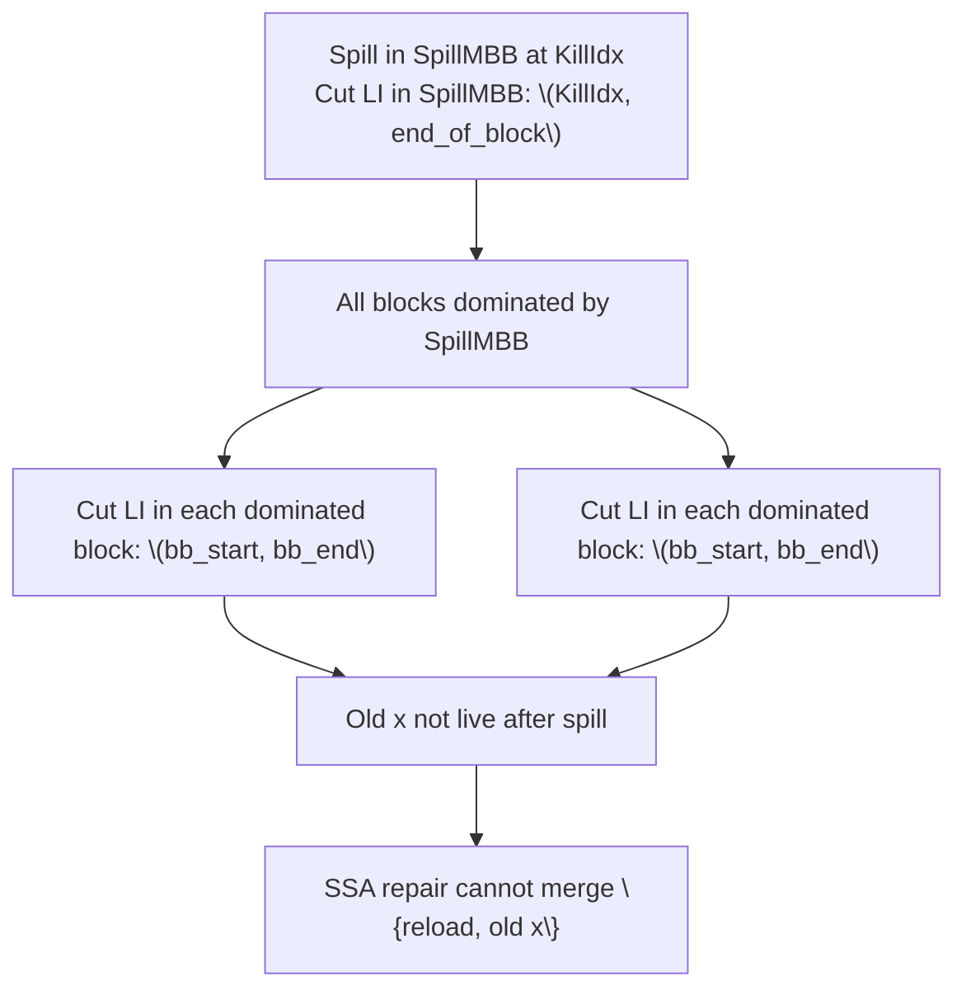

# Design Decisions

## Store at Definition
Chosen over:
- WWM wrapping
- EWF reload placement

Reason:
Correctness, simplicity, no SGPR overhead.

---

## Deferred LiveInterval Pruning
Shrink only after:
- all reloads placed
- SSA repaired

---
# Design Change: Prevent SSA Repair Disorder by Killing Spilled LiveIntervals in Dominated Region

## Context

Current flow processes **dominated uses** in a single loop and performs SSA repair immediately after inserting each reload:

```cpp
for (auto &G : Groups) {
  Register NewVReg = reloadBefore(Head->getIterator(), SpilledVMP);
}
```


`reloadBefore()` emits the reload and immediately calls `MachineLaneSSAUpdater::repairSSAForNewDef()` (via the spiller wrapper).

[SSA_Repairing_Disorder](SSA_Spiller/08-Worklog/issues/SSA_Spiller/SSA_Repairing_Disorder.md)

This “repair-as-you-go” approach is convenient, but it creates an **ordering hazard** when multiple dominated uses exist in a diamond-like CFG.

## Problem

### Symptom

If a spill point is in the NCD and there are dominated uses both:

- in one branch (a DF child), and
    
- later in the join block,
    

then processing the branch dominated-use first may cause SSAUpdater to insert a PHI at the join that merges:

- reloaded value from the processed path, and
    
- original (spilled) value from the other path.
    

This is incorrect because the original value is already spilled at the dominator.

### Minimal CFG reproducer



### What SSAUpdater may construct (wrong)




**Why it’s wrong:** `x` was already spilled in `bb0`, so `x` is not a valid SSA value flowing into `bb3` along the “clean” path.

- [SSA_Repairing_Disorder](SSA_Spiller/08-Worklog/issues/SSA_Spiller/SSA_Repairing_Disorder.md)

## Root cause

SSAUpdater is allowed to pick an incoming value along any predecessor edge where that value appears “available”. In the current design:

- after the spill, the original `x` still looks **live** (via LiveIntervals / LiveAt filtering),
    
- so SSAUpdater considers `x` a valid incoming candidate in blocks dominated by the spill,
    
- and it can legally (from its perspective) synthesize a PHI that merges `{reload, x}`.
    

But semantically, once we spill `x` at the spill point, the original SSA value must be treated as **dead after spill** (in the dominated region), because its only valid continuation is via reloads.

## Decision (design change)

When we insert a spill for a VRegMaskPair at instruction index `KillIdx`, we must:

1. Identify blocks dominated by the spill block.
    
2. “Kill” the original LiveInterval (and any subranges) **from the spill point onward** in:
    
    - the remainder of the spill block (after `KillIdx`), and
        
    - all blocks dominated by the spill block.
        

This prevents dominated blocks from being considered “live for old x”, so they will not be pulled into the reload’s IDF set when filtered by LiveAt, and SSAUpdater cannot synthesize PHIs that merge with the original value.

### Implementation Reference
- Commit: `45385c6f5f00`
- [collectDominatedBlocks](https://github.com/alex-t/llvm-project/blob/45385c6f5f008cde206d5828a00a17d6bb7f7783/llvm/lib/Target/AMDGPU/AMDGPUSSARegisterSpiller.cpp#L1523-L1531)
- [cutFromLiveRange](https://github.com/alex-t/llvm-project/blob/45385c6f5f008cde206d5828a00a17d6bb7f7783/llvm/lib/Target/AMDGPU/AMDGPUSSARegisterSpiller.cpp#L1533-L1555)
- [killIntervalInDominatedRegion](https://github.com/alex-t/llvm-project/blob/45385c6f5f008cde206d5828a00a17d6bb7f7783/llvm/lib/Target/AMDGPU/AMDGPUSSARegisterSpiller.cpp#L1557-L1581)


## How the fix changes the situation

### Before

- Old `x` still considered live after spill inside dominated blocks.
    
- SSA repair for an early dominated reload can create a later PHI mixing `{reload, old x}`.
    

### After

- Old `x` becomes dead immediately after spill in all dominated blocks.
    
- SSAUpdater can only see reloaded defs (or “no value”), so it cannot construct a PHI that uses old `x` on the clean path.
    
- Reload IDF is filtered by LiveAt, and dominated blocks are filtered out.
    

## illustration: “kill dominated region”



## Notes / constraints

- This change assumes that **all uses of old x after spill in the dominated region are rewritten** to reload-produced vregs, otherwise verifier errors are expected.
    
- The cut must apply to:
    
    - the parent LiveInterval, and
        
    - all LaneMask subranges, if present.
        

## Appendix: link to original note

See: [SSA_Repairing_Disorder](SSA_Spiller/08-Worklog/issues/SSA_Spiller/SSA_Repairing_Disorder.md) for the original reasoning and diagrams.

SSA Repairing Disorder

Sources


# Static Next Use Analysis limitation
We currently don't consider virtual registers created by reload instructions and PHIs results created by SSA Updater for further live interval splitting/spilling because of the [Static_NUA_limitation](SSA_Spiller/08-Worklog/issues/Next_Use_Analysis/Static_NUA_limitation.md)
[MachineLaneSSAUpdater](SSA_Spiller/04-Design/MachineLaneSSAUpdater.md) repairSSAForNewDef has been changed to fill in the vector of the Machine Operands - inserted PHIs definitions.


