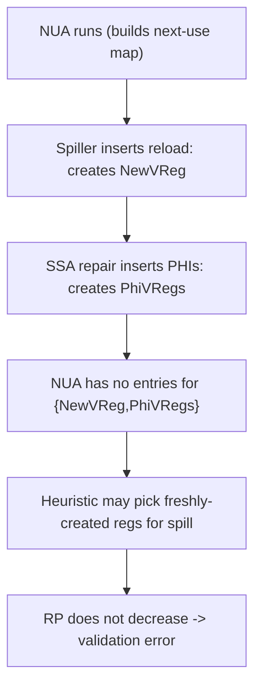
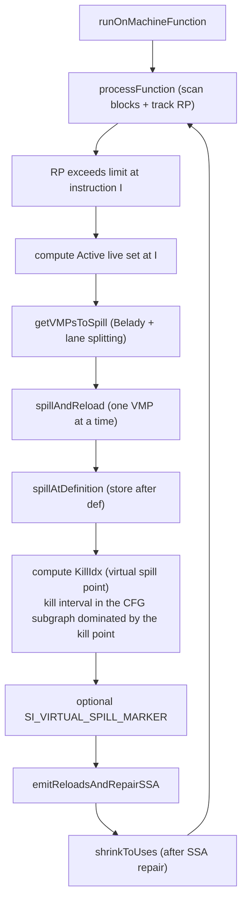
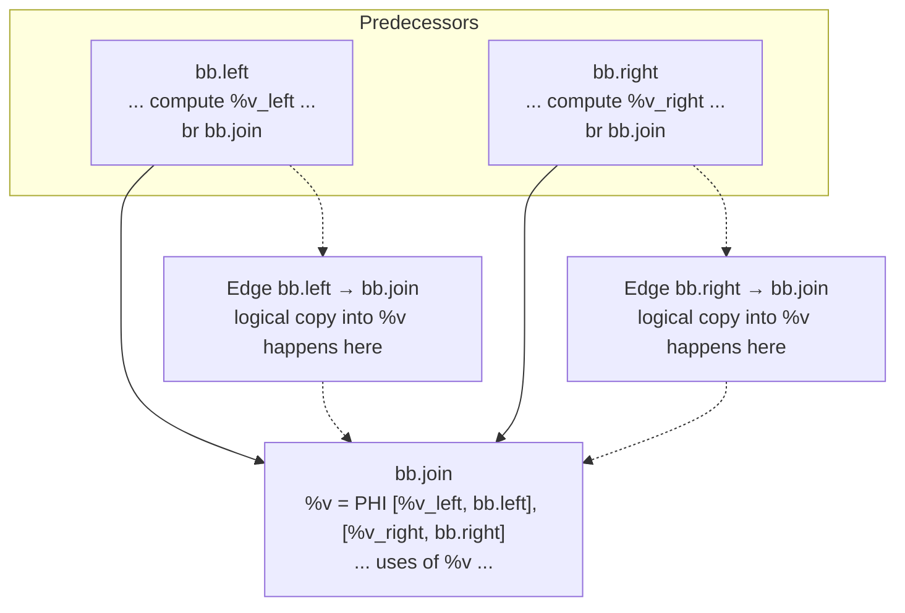
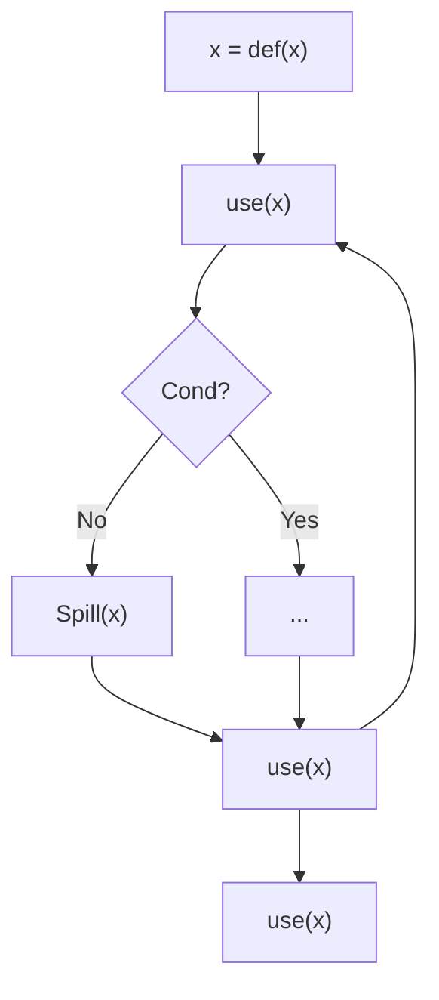
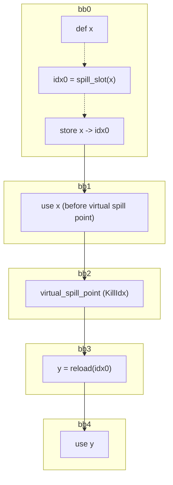
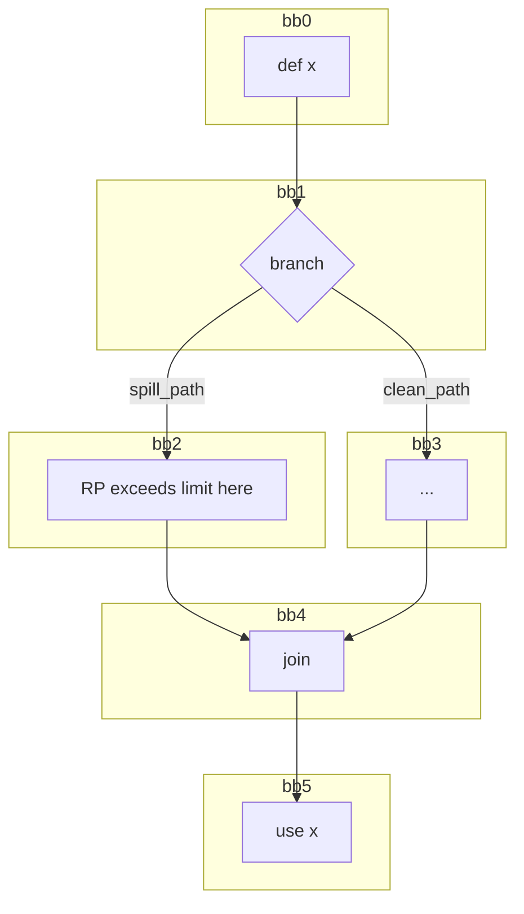
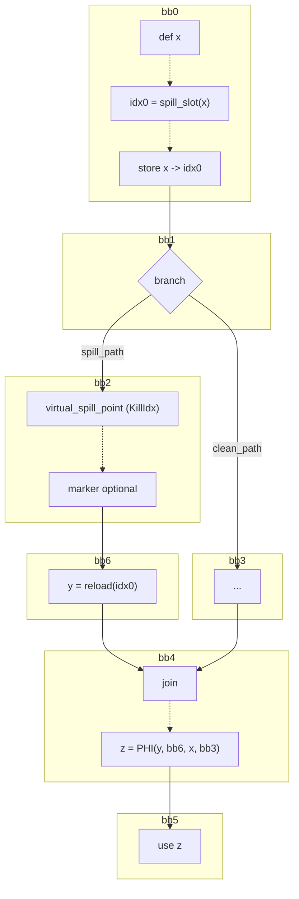

# SSA Register Spiller (AMDGPU) — Design (Current)

This document describes the **current** register spilling pass for AMDGPU that operates on SSA-form Machine IR. The pass assumes the input is in SSA form and relies on SSA properties (single definition, dominance) for correctness.

## Source Mapping
- **Component**: SSA Register Spiller
- **LLVM Target**: AMDGPU
- **File (symbolic)**: `llvm/lib/Target/AMDGPU/AMDGPUSSARegisterSpiller.cpp`
- **GitHub (canonical)**: [`AMDGPUSSARegisterSpiller.cpp`](https://github.com/alex-t/llvm-project/blob/45385c6f5f008cde206d5828a00a17d6bb7f7783/llvm/lib/Target/AMDGPU/AMDGPUSSARegisterSpiller.cpp)

### Related components
- **Component**: MachineLaneSSAUpdater (SSA repair + IDF reachability)
  - **File (symbolic)**: [`llvm/lib/CodeGen/MachineLaneSSAUpdater.cpp`](https://github.com/alex-t/llvm-project/blob/45385c6f5f008cde206d5828a00a17d6bb7f7783/llvm/lib/CodeGen/MachineLaneSSAUpdater.cpp)
  - **Upstream PR**: [#163421](https://github.com/llvm/llvm-project/pull/163421)
- **Component**: AMDGPU Next Use Analysis (next-use distances + lane/subreg ordering)
  - **File (symbolic)**: [`llvm/lib/Target/AMDGPU/AMDGPUNextUseAnalysis.h`](https://github.com/alex-t/llvm-project/blob/45385c6f5f008cde206d5828a00a17d6bb7f7783/llvm/lib/Target/AMDGPU/AMDGPUNextUseAnalysis.h)
  - **Upstream PR**: [#156079](https://github.com/llvm/llvm-project/pull/156079)

## Overview
The SSA spiller is a MachineFunction pass that:
- Tracks register pressure (RP) while scanning instructions.
- When RP exceeds a limit, selects one or more **spill candidates** using a [Belady-style next-use heuristic](../03-Concepts/MIN_Algorithm.md).
- Stores spilled values [**at definition**](Decisions.md#store-at-definition) to avoid [[../03-Concepts/EXEC_Drift|EXEC drift]] issues.
- Computes a [**virtual spill point**](#virtual-spill-point-and-si_virtual_spill_marker) (where the value is considered "logically dead" for RP relief).
- Kills spilled live interval in the CFG subgraph dominated by the kill point ([[Decisions#design-change-prevent-ssa-repair-disorder-by-killing-spilled-liveintervals-in-dominated-region|Design Decision]]).
- Inserts reloads and repairs SSA form using [`MachineLaneSSAUpdater`](../02-Components/MachineLaneSSAUpdater.md).
- Shrinks live intervals after repairs to reflect the new SSA use graph.


## Static Next-Use Analysis limitation (reload/PHI-created vregs)

### The issue
NextUseAnalysis (NUA) currently runs **before** spilling. During spilling we insert:
- reloads before uses of a spilled value, and
- PHIs during SSA repair (via [`MachineLaneSSAUpdater`](../02-Components/MachineLaneSSAUpdater.md)).

Each reload/PHI creates a **new SSA variable** (new virtual register / new live interval).
We run Next Use Analysis before the spiller when these new register don't yet exist. As a result, they have no entries in the NUA map and analysis consider these new vregs **dead**, which can immediately select them for spilling again — yielding **no RP relief** and eventually an RP validation failure. See [Static NUA limitation issue](../08-Worklog/issues/Next_Use_Analysis/Static_NUA_limitation.md).



### Longer-term directions (proposed)
- Return a special value from NUA meaning "no distance computed for this vreg".
- Add an on-demand API to compute next-use distance for new vregs created during spilling.

See [Static NUA limitation - Proposed solution](../08-Worklog/issues/Next_Use_Analysis/Static_NUA_limitation.md#proposed-solution).

### Temporary workaround (implemented now)
Maintain a [`VRegMaskPairSet`](https://github.com/alex-t/llvm-project/blob/45385c6f5f008cde206d5828a00a17d6bb7f7783/llvm/lib/Target/AMDGPU/VRegMaskPair.h) of vregs created by reload SSA repair and exclude them from the spiller's Active set selection.

See [Static NUA limitation - Temporary workaround](../08-Worklog/issues/Next_Use_Analysis/Static_NUA_limitation.md#temporary-workaround).

To make this possible, [`MachineLaneSSAUpdater::repairSSAForNewDef`](https://github.com/alex-t/llvm-project/blob/45385c6f5f008cde206d5828a00a17d6bb7f7783/llvm/lib/CodeGen/MachineLaneSSAUpdater.cpp#L53-L119) was extended to report back the **def operands of inserted PHI results**:

- New signature (CodeGen):
  - `Register repairSSAForNewDef(MachineInstr &NewDefMI, Register OrigVReg, SmallVectorImpl<MachineOperand*> &PHIRegDefOps);`
- Spiller usage (AMDGPU):
  - [`AMDGPUSSARegisterSpiller::repairSSAForReload`](https://github.com/alex-t/llvm-project/blob/45385c6f5f008cde206d5828a00a17d6bb7f7783/llvm/lib/Target/AMDGPU/AMDGPUSSARegisterSpiller.cpp#L1295-L1313) passes `PHIRegDefOps` and inserts them into [`ReloadedRegs`](https://github.com/alex-t/llvm-project/blob/45385c6f5f008cde206d5828a00a17d6bb7f7783/llvm/lib/Target/AMDGPU/AMDGPUSSARegisterSpiller.h#L94) as [`VRegMaskPair`](https://github.com/alex-t/llvm-project/blob/45385c6f5f008cde206d5828a00a17d6bb7f7783/llvm/lib/Target/AMDGPU/VRegMaskPair.h) entries.

See also the design decision [Decisions - Static Next Use Analysis limitation](Decisions.md#static-next-use-analysis-limitation).

## Terminology
- [**VMP (VRegMaskPair)**](https://github.com/alex-t/llvm-project/blob/45385c6f5f008cde206d5828a00a17d6bb7f7783/llvm/lib/Target/AMDGPU/VRegMaskPair.h): `(VReg, LaneMask)` pair representing "a virtual register, possibly partial lanes".
- **Physical store location**: the place where a stack store is emitted (current design: right after definition).
- **Virtual spill point**: the location where RP relief is intended (computed as a `KillIdx`).
- **Dominated use**: a use that is on all paths after the virtual spill point (see [Dominated linear case](#dominated-linear-case-single-path)).
- **Reachable (non-dominated) use**: a use that may be reached from the spill path, but not dominated by the spill point; requires SSA merging logic (PHIs) (see [Reachable case](#reachable-non-dominated-case-join)).

## Two-Pass Architecture

The spiller processes the function twice:
1. **Pass 1 (SGPR)**: Process scalar registers first (spilled to VGPR lanes if needed)
2. **Pass 2 (VGPR)**: Process vector registers (spilled to memory)

> **Note:** AGPRs (accumulator GPRs) allocation has not been addressed yet.

This ordering ensures SGPR spills don't increase VGPR pressure unexpectedly.

## Dominance Grouping ([`DomGroup` class](https://github.com/alex-t/llvm-project/blob/45385c6f5f008cde206d5828a00a17d6bb7f7783/llvm/lib/Target/AMDGPU/AMDGPUSSARegisterSpiller.h#L44-L59))

To minimize reload count, uses are grouped by dominance chains. The [`DomGroup` class](https://github.com/alex-t/llvm-project/blob/45385c6f5f008cde206d5828a00a17d6bb7f7783/llvm/lib/Target/AMDGPU/AMDGPUSSARegisterSpiller.h#L44-L59) tracks a set of uses where the head dominates all others:

```cpp
class DomGroup {
  SmallVector<MachineInstr *> Uses;
  bool Deleted = false;
public:
  MachineInstr *getHead() const;  // First use dominates all others
  void merge(DomGroup &Other);    // Combine when head1 dominates head2
  size_t size() const;
};
```

**Algorithm in `emitReloadsAndRepairSSA()`:**
1. Each dominated use starts in its own group
2. If `head(G1)` dominates `head(G2)`, merge G2 into G1
3. Emit ONE reload at each group head
4. SSA updater rewrites all uses in the group

## Final RP Validation

After all spilling, [`validateFinalRegisterPressure()`](https://github.com/alex-t/llvm-project/blob/45385c6f5f008cde206d5828a00a17d6bb7f7783/llvm/lib/Target/AMDGPU/AMDGPUSSARegisterSpiller.cpp#L185-L233) traverses the function to verify RP is within limits:

- Skips spill/reload instructions during validation
- If RP exceeds limit at any instruction, reports a fatal error
- This is a temporary safety check until split-before-use optimization is implemented

## High-level workflow



### Key orchestration points
- `AMDGPUSSARegisterSpiller::spillAndReload`  
  - **File (symbolic)**: `llvm/lib/Target/AMDGPU/AMDGPUSSARegisterSpiller.cpp`  
  - **GitHub**: [`L657-L742`](https://github.com/alex-t/llvm-project/blob/45385c6f5f008cde206d5828a00a17d6bb7f7783/llvm/lib/Target/AMDGPU/AMDGPUSSARegisterSpiller.cpp#L657-L742)
- `AMDGPUSSARegisterSpiller::emitReloadsAndRepairSSA`  
  - **File (symbolic)**: `llvm/lib/Target/AMDGPU/AMDGPUSSARegisterSpiller.cpp`  
  - **GitHub**: [`L744-L960`](https://github.com/alex-t/llvm-project/blob/45385c6f5f008cde206d5828a00a17d6bb7f7783/llvm/lib/Target/AMDGPU/AMDGPUSSARegisterSpiller.cpp#L744-L960)
- `AMDGPUSSARegisterSpiller::spillAtDefinition`  
  - **File (symbolic)**: `llvm/lib/Target/AMDGPU/AMDGPUSSARegisterSpiller.cpp`  
  - **GitHub**: [`L966-L1047`](https://github.com/alex-t/llvm-project/blob/45385c6f5f008cde206d5828a00a17d6bb7f7783/llvm/lib/Target/AMDGPU/AMDGPUSSARegisterSpiller.cpp#L966-L1047)
- `AMDGPUSSARegisterSpiller::killIntervalInDominatedRegion`  
  - **File (symbolic)**: `llvm/lib/Target/AMDGPU/AMDGPUSSARegisterSpiller.cpp`  
  - **GitHub**: [`L1557-L1581`](https://github.com/alex-t/llvm-project/blob/45385c6f5f008cde206d5828a00a17d6bb7f7783/llvm/lib/Target/AMDGPU/AMDGPUSSARegisterSpiller.cpp#L1557-L1581)

## Spill selection (Belady + lane splitting)
When a candidate register is larger than the remaining "spill budget", the spiller asks NextUseAnalysis for a subreg/lane ordering:
- API usage: [`NU->getSortedSubregUses(...)`](https://github.com/alex-t/llvm-project/blob/45385c6f5f008cde206d5828a00a17d6bb7f7783/llvm/lib/Target/AMDGPU/AMDGPUNextUseAnalysis.cpp#L253-L303) in [`AMDGPUSSARegisterSpiller::getVMPsToSpill`](https://github.com/alex-t/llvm-project/blob/45385c6f5f008cde206d5828a00a17d6bb7f7783/llvm/lib/Target/AMDGPU/AMDGPUSSARegisterSpiller.cpp#L511-L621)
- Intent: choose the **furthest-used subregister lanes first**, so we spill only as many 32-bit units as needed.

This is the mechanism behind the "large register but only need 32-bit" artificial pattern used by [`spill-vreg-many-lanes.mir`](https://github.com/alex-t/llvm-project/blob/45385c6f5f008cde206d5828a00a17d6bb7f7783/llvm/test/CodeGen/AMDGPU/SSASpiller/spill-vreg-many-lanes.mir).

## Virtual spill point and SI_VIRTUAL_SPILL_MARKER

### What "virtual spill point" means
The spiller separates:
- **Where we store**: after definition ([`spillAtDefinition`](https://github.com/alex-t/llvm-project/blob/45385c6f5f008cde206d5828a00a17d6bb7f7783/llvm/lib/Target/AMDGPU/AMDGPUSSARegisterSpiller.cpp#L966-L1047)).
- **Where RP relief is intended**: the computed `KillIdx` for the high-pressure point.

### Marker pseudo-instruction (for tests)
- Option: `--amdgpu-ssa-spill-markers=1`
- Pseudo MI: [`SI_VIRTUAL_SPILL_MARKER`](https://github.com/alex-t/llvm-project/blob/45385c6f5f008cde206d5828a00a17d6bb7f7783/llvm/lib/Target/AMDGPU/SIInstructions.td) `<vreg_index>, <lane_mask>`

Insertion rule (simplified): if the marker would be placed **immediately adjacent** to the actual store for the same `(VReg,LaneMask)`, insertion is omitted.
#### PHI nodes and debug spill markers



See [ISSUE: Spill Markers and PHIs](../08-Worklog/issues/SSA_Spiller/ISSUE_Spill_Markers_and_PHIs.md).


## Dominated vs reachable uses

### Classification (spiller-side)
In [`AMDGPUSSARegisterSpiller::emitReloadsAndRepairSSA`](https://github.com/alex-t/llvm-project/blob/45385c6f5f008cde206d5828a00a17d6bb7f7783/llvm/lib/Target/AMDGPU/AMDGPUSSARegisterSpiller.cpp#L744-L960), for each non-PHI use of the spilled VReg and overlapping lane mask:
- **Dominated** if `DT->dominates(KillMI, UseMI)`
- Else **Reachable** if [`SSAUpdater->isUseReachableFromDef(KillMI, UseMI, OrigVReg, DefMask)`](https://github.com/alex-t/llvm-project/blob/45385c6f5f008cde206d5828a00a17d6bb7f7783/llvm/lib/CodeGen/MachineLaneSSAUpdater.cpp#L273-L319)
- Else unreachable (ignored)

## Reach/IDF definition (verbatim + code-equivalent)

### (A) Verbatim (as provided)
Reach(Spill(x) = $\forall use(x)$ such that $Parent(use(x)) \in IDF(Parent(Spill(x)))) \land \forall (use(x)$ such that $\exists B\in IDF(Spill(x))$ such that $B\in Dom(Parent(use(x))$

Your diagram (mermaid-safe formatting):



### (B) Code-equivalent definition (matches MachineLaneSSAUpdater)
[`MachineLaneSSAUpdater::isUseReachableFromDef`](https://github.com/alex-t/llvm-project/blob/45385c6f5f008cde206d5828a00a17d6bb7f7783/llvm/lib/CodeGen/MachineLaneSSAUpdater.cpp#L273-L319)`(DefMI, UseMI, OrigVReg, DefMask)` does:
1. If `DefMI` dominates the use, returns true immediately.
2. Otherwise, compute a **pruned IDF** for `(OrigVReg, DefMask, DefBlock)` (DefBlock = `DefMI->Parent`).
3. Define `PredBlock`:
   - if `UseMI` is a PHI use, `PredBlock` is the PHI predecessor block for that operand
   - else `PredBlock` is `UseMI->Parent`
4. Return reachable iff there exists `IDFBlock` such that:
   - `PredBlock == IDFBlock`, or
   - `IDFBlock` dominates `PredBlock`

Source:
- **File**: [`llvm/lib/CodeGen/MachineLaneSSAUpdater.cpp`](https://github.com/alex-t/llvm-project/blob/45385c6f5f008cde206d5828a00a17d6bb7f7783/llvm/lib/CodeGen/MachineLaneSSAUpdater.cpp#L273-L319)
- **Upstream PR**: [#163421](https://github.com/llvm/llvm-project/pull/163421)

## SSA repair: what gets rewritten and where PHIs come from
The spiller emits reload instructions and then calls:
- [`MachineLaneSSAUpdater::repairSSAForNewDef(...)`](https://github.com/alex-t/llvm-project/blob/45385c6f5f008cde206d5828a00a17d6bb7f7783/llvm/lib/CodeGen/MachineLaneSSAUpdater.cpp#L53-L119)

That updater:
- Creates lane-aware PHIs in IDF blocks for non-dominated joins.
- Rewrites dominated uses to the new SSA value.
- Keeps lane masks correct via operand/subreg masks.
- Reports newly-created VRegs (from PHIs) via `PHIRegDefOps` output parameter for [tracking in `ReloadedRegs`](../08-Worklog/issues/Next_Use_Analysis/Static_NUA_limitation.md).

## Worked “patterns” (concept-level)

### Dominated linear case (single path)


### Reachable (non-dominated) case (join)
<div style="display:flex; gap:24px; align-items:flex-start;">
<div style="flex:1;">

**Before spill**



</div>
<div style="flex:1;">

**After spill**



</div>
</div>

## Mapping to tests
See [`SSA_SPILLER_TEST_PATTERNS.md`](../05-Testing/SSA_Spiller/SSA_SPILLER_TEST_PATTERNS.md) for per-test diagrams and marker notes.

## Appendix A: historical notes (brief)
- Older materials in [`06-Research/Archive/`](../06-Research/Archive/) may illustrate earlier variants of SSA spilling concepts; reuse is encouraged if the diagram is updated to match current workflow.


