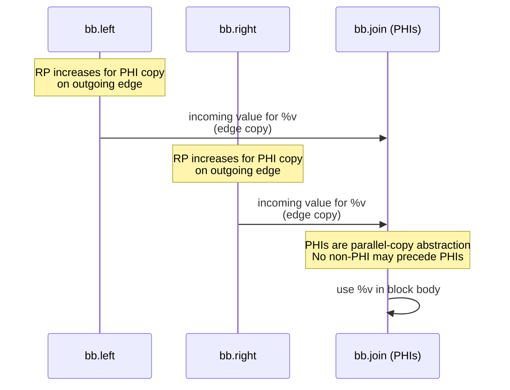
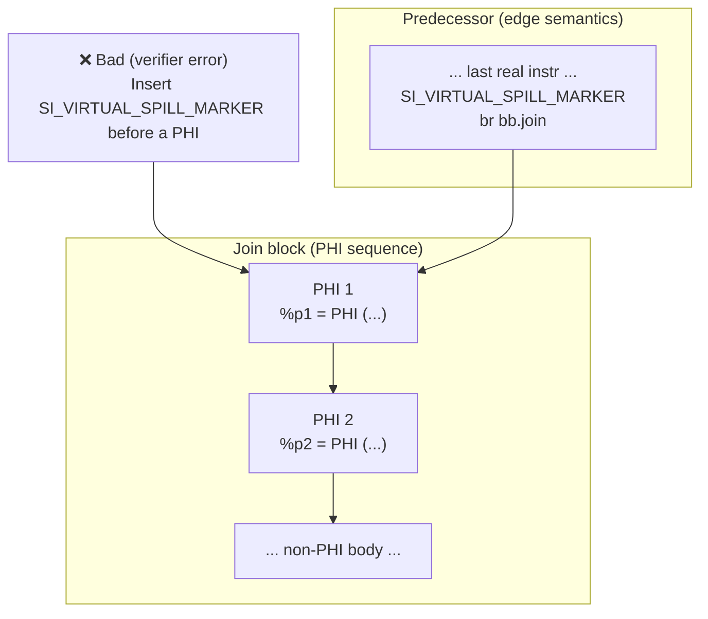

# Issue: Spill markers and PHI nodes at join blocks

## Context

In SSA-based register allocation, **PHI nodes are an abstraction representing value merge on control-flow joins**.

Key SSA properties:

- All PHIs at a block header represent **parallel copies**
- These copies conceptually happen **simultaneously**
- **Lexical order of PHIs is irrelevant**
- The merge semantically belongs to **incoming CFG edges**, not to the join block body

After SSA destruction, PHIs are lowered into COPY operations placed at the **end of predecessor blocks**.

[Register Allocation for Programs in SSA-Form](ssara.pdf.md) <!-- TODO: file not found -->  by Sebastian Hack, Daniel Grund, and Gerhard Goos discusses techniques for *zero-copy SSA deconstruction*.  
In our implementation we deliberately take a **conservative model**.

---

## Current SSA Spiller Model

During the SSA spiller run:

- Each PHI is treated as **one logical copy per incoming edge**
- PHI operands are already defined and available along the edge
- The **register pressure (RP) increase caused by a PHI belongs to the predecessor block**
- We expect that values may be **coalesced across edges**, but in the worst case there is **one copy per edge**

Therefore:

- PHIs are treated as **register-defining instructions**
- RP accounting and spilling decisions consider PHIs
- RP impact is attributed to predecessors, not the join block



---

## Debug Spill Markers

For LIT test validation and debugging, the SSA spiller supports:

```
-amdgpu-ssa-spill-markers=1
```

When enabled:

- A pseudo-instruction `SI_VIRTUAL_SPILL_MARKER` is inserted
- It marks the point where a spilled register becomes dead
- The marker is placed **immediately before the instruction that triggered spilling**

This mechanism is **debug-only** and does not affect codegen [SSA_SPILLER_DESIGN - Virtual spill point and SI_VIRTUAL_SPILL_MARKER](SSA_SPILLER_DESIGN#Virtual_spill_point_and_SI_VIRTUAL_SPILL_MARKER.md) <!-- TODO: ambiguous link -->.

---

## The Problem

When spilling is triggered by a **PHI instruction**, inserting a spill marker before it causes a verifier failure.
### Root cause

- PHI nodes must appear **first in a basic block**
- No non-PHI instruction may precede a PHI
- Inserting `SI_VIRTUAL_SPILL_MARKER` before a PHI violates Machine IR invariants
- This reliably triggers a **MachineVerifier error**

---

## Example

[CFG with PHIs and spill markers](Pasted_image_20251222213607.png.md) <!-- TODO: file not found -->

In the example above, spilling is triggered at a join block containing PHIs.  
Placing a spill marker in the PHI sequence is illegal.

---

## Current Workaround

If the spill-triggering instruction is a PHI:

➡ **Insert `SI_VIRTUAL_SPILL_MARKER` at the end of the corresponding predecessor block**

instead of inside the join block.



### Rationale

- Matches SSA semantics: PHI effects belong to incoming edges
- Preserves MachineVerifier correctness
- Keeps RP accounting logically consistent

---

## Limitations

- Join blocks may contain **many PHIs**
- Spill markers moved to predecessors lose precision
- It becomes harder to identify **which PHI caused RP overflow**
- Debug readability degrades for complex CFGs

Despite this, the workaround is:

- Correct
- Conservative
- Suitable as a temporary solution

---

## Status

- Implemented as a **debug-only workaround**
- Affects only spill marker placement
- Does **not** affect correctness of generated code
- Intended to be replaced by a more precise mechanism

---

## Open Questions

- Edge-specific or PHI-aware debug markers
- Better RP visualization around joins
- Metadata-based debug tracing instead of pseudo-instructions
