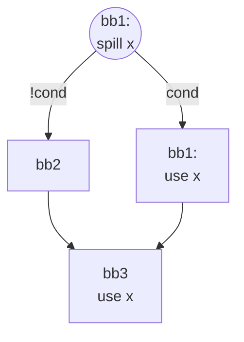
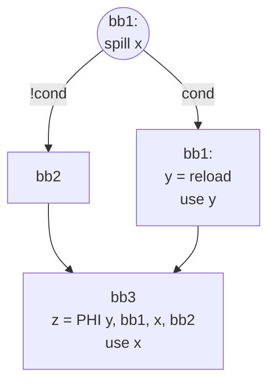

# The issue:

We process all dominated uses in a single loop calling MachineLaneSSAUpdater
to repair right away. 
```cpp
for (auto &G : Groups) {
    // Emit reload before the group head
    // reloadBefore() will call MachineLaneSSAUpdater::repairSSAForNewDef()
    // which handles all SSA repair automatically
    Register NewVReg = reloadBefore(Head->getIterator(), SpilledVMP);
}

Register AMDGPUSSARegisterSpiller::reloadBefore(
    MachineBasicBlock::iterator InsertBefore, VRegMaskPair VMP) {
  // Convenience wrapper: emit reload + repair SSA immediately
  MachineInstr *ReloadMI = emitReload(InsertBefore, VMP);
  return repairSSAForReload(ReloadMI, VMP);
}
```

The issue appears if we have 2 dominated uses in a diamond CFG.
If a spill point is in the NCD and we have uses along one of the paths and in the join block,
all they are dominated by the spill point.
if use in the DF processed first - PHI is inserted for the use in the join block with reloaded value from the DF with reload and  initial register being spilled from the clean path or DF w/o reload. This is incorrect because the initial value is spilled in the dominator block.

on diagram above both uses in bb1 and bb3 dominated by the spill point. If we process use in bb1 first, SSA updater inserts PHI in the bb3.



**which is wrong because x was spilled in bb0!**
> ⚠️ Image omitted in public version: `shrink spilled LI.png` (too large: 319.9 KB)


# Fixed:[Fix for SSA Repairing failure](SSA_Spiller/04-Design/Decisions.md#design-change-prevent-ssa-repair-disorder-by-killing-spilled-liveintervals-in-dominated-region)