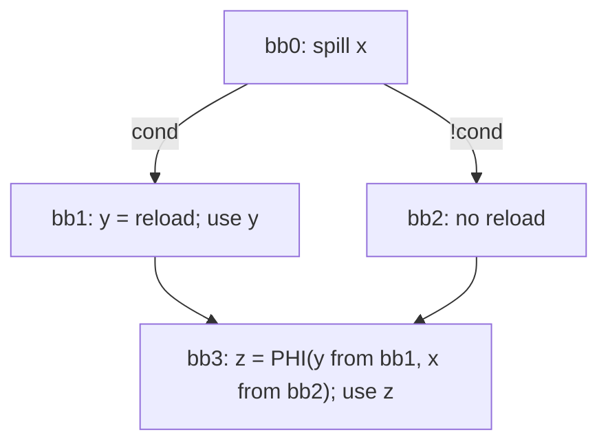

## SSA-repair failure mode (what goes wrong)

If dominated-use `U1` is processed first, the spiller inserts a reload and repairs SSA for the new definition (`y = reload(x)`), producing something like:

This PHI is **illegal** because `x` was spilled in `bb0`, so taking the “clean path” input as `x` is incorrect.

## What the MIR test should enforce

1. `x` is defined in/above `bb0` and is spilled in `bb0`.
    
2. The branch block `bb1` uses `x` (forcing reload on that path).
    
3. The join block `bb3` uses `x` again (forcing SSA consistency across both paths).
    
4. The spiller processes dominated uses in a single pass and performs SSA repair immediately, so we reproduce the ordering-dependent bug.
    

## Expected outcome

The test should **fail** without the design change (or should produce a specific incorrect PHI / reload pattern we can `FileCheck` for), and should **pass** once the design change is implemented (see [Fix for SSA Repairing failure](SSA_Spiller/04-Design/Decisions.md#design-change-prevent-ssa-repair-disorder-by-killing-spilled-liveintervals-in-dominated-region)).